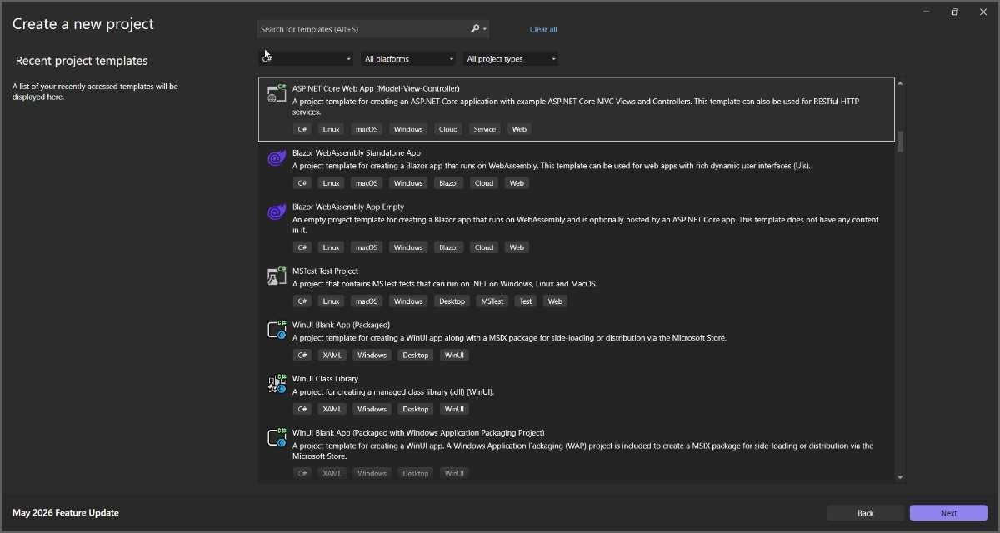
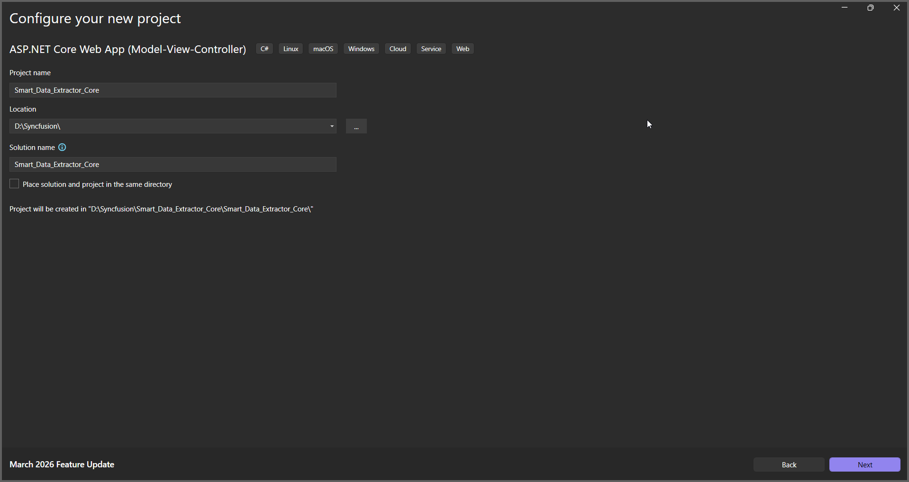

# Extract Data in ASP.NET Core

The Syncfusion<sup>&reg;</sup> Smart Data Extractor is a .NET library used to extract structured data and document elements from PDF and image files in ASP.NET Core applications.

To quickly get started with extracting structured data from PDF and image files in ASP.NET Core using the Smart Data Extractor library, refer to this video tutorial:


To include the Smart Data Extractor library in your ASP.NET Core application, please refer to the  [NuGet Packages Required](https://help.syncfusion.com/document-processing/data-extraction/net/nuget-packages-required#smart-data-extractor) or [Assemblies Required](https://help.syncfusion.com/document-processing/data-extraction/net/assemblies-required#smart-data-extractor) documentation.


## Steps to Extract Data from PDF in ASP.NET Core application




**Prerequisites**:

* Install .NET SDK: Ensure that you have the .NET SDK installed on your system. You can download it from the [.NET Downloads page](https://dotnet.microsoft.com/en-us/download).
* Install Visual Studio: Download and install Visual Studio from the [official website](https://visualstudio.microsoft.com/downloads/).

Step 1: Create a new C# ASP.NET Core Web Application project.
   

Step 2: In the configuration window, name your project and click Next.
   
   


Step 3: Install the [Syncfusion.SmartDataExtractor.Net.Core](https://www.nuget.org/packages/Syncfusion.SmartDataExtractor.Net.Core/) package as a reference for your ASP.NET Core application from [NuGet.org](https://www.nuget.org/).
   

Add the input PDF file named **Input.pdf** to the project root directory before running the sample.

Step 4: A default controller named HomeController.cs is added on creation of ASP.NET Core project. Include the following namespaces in that HomeController.cs file.



using System.IO;
using System.Text;
using System.Diagnostics;
using Syncfusion.SmartDataExtractor;



Step 5: Add a new button in the Index.cshtml as shown below.



@{
    Html.BeginForm("ExtractData", "Home", FormMethod.Get);
    {
        <div>
            <input type="submit" value="Extract Data from PDF" style="width:200px;height:27px" />
        </div>
    }
    Html.EndForm();
}



Step 6: Add a new action method named `ExtractData` in HomeController.cs and include the following code example to extract data as JSON using the [DataExtractor](https://help.syncfusion.com/cr/document-processing/Syncfusion.SmartDataExtractor.DataExtractor.html) class. Then use the [ExtractDataAsJson](https://help.syncfusion.com/cr/document-processing/Syncfusion.SmartDataExtractor.DataExtractor.html#Syncfusion_SmartDataExtractor_DataExtractor_ExtractDataAsJson_System_IO_Stream_) method of the DataExtractor object to process the input and export the results in JSON format.



// Open the input PDF file as a stream.
using (FileStream stream = new FileStream(Path.GetFullPath("Input.pdf"), FileMode.Open, FileAccess.Read))
{
   // Initialize the Data Extractor.
   DataExtractor extractor = new DataExtractor();
   // Extract form data as JSON.
   string data = extractor.ExtractDataAsJson(stream);
   // Convert JSON string into a MemoryStream for download.
   MemoryStream outputStream = new MemoryStream(Encoding.UTF8.GetBytes(data));
   // Reset stream position.
   outputStream.Position = 0;
   // Return JSON file as download in browser.
   FileStreamResult fileStreamResult = new FileStreamResult(outputStream, "application/json");
   fileStreamResult.FileDownloadName = "Output.json";
   return fileStreamResult;
}



Step 7: Build the project.

Click on **Build** → **Build Solution** or press <kbd>Ctrl</kbd>+<kbd>Shift</kbd>+<kbd>B</kbd> to build the project.

Step 8: Run the project.

Click the Start button (green arrow) or press <kbd>F5</kbd> to run the application.


 


**Prerequisites**:

* Install .NET SDK: Ensure that you have the .NET SDK installed on your system. You can download it from the [.NET Downloads page](https://dotnet.microsoft.com/en-us/download).
* Install Visual Studio Code: Download and install Visual Studio Code from the [official website](https://code.visualstudio.com/download?_exp_download=fb315fc982).
* Install C# Extension for VS Code: Open Visual Studio Code, go to the Extensions view (Ctrl+Shift+X), and search for 'C#'. Install the official [C# extension provided by Microsoft](https://marketplace.visualstudio.com/items?itemName=ms-dotnettools.csharp).

Step 1: Open the terminal (Ctrl+` ) and run the following command to create a C# ASP.NET Core Web Application project.

```
dotnet new mvc -n ExtractDataASPNETCoreAPP
```
Step 2: Replace **ExtractDataASPNETCoreAPP** with your desired project name.

Step 3: Navigate to the project directory using the following command

```
cd ExtractDataASPNETCoreAPP
```
Step 4: Use the following command in the terminal to add the [Syncfusion.SmartDataExtractor.Net.Core ](https://www.nuget.org/packages/Syncfusion.SmartDataExtractor.Net.Core) package to your project.

```
dotnet add package Syncfusion.SmartDataExtractor.Net.Core
```

Step 5: A default controller named HomeController.cs gets added on creation of ASP.NET Core project. Include the following namespaces in that HomeController.cs file.



using Syncfusion.SmartDataExtractor;
using System.Diagnostics;
using System.Text;



Step 6: A default action method named Index will be present in HomeController.cs. Right-click on Index method and select Go To View where you will be directed to its associated view page Index.cshtml. Add a new button in the Index.cshtml as shown below.



@{
    Html.BeginForm("ExtractData", "Home", FormMethod.Get);
    {
        <div>
            <input type="submit" value="Extract Data from PDF" style="width:200px;height:27px" />
        </div>
    }
    Html.EndForm();
}



Step 7: Add a new action method named `ExtractData` in HomeController.cs and include the following code example to extract data as JSON using the [DataExtractor](https://help.syncfusion.com/cr/document-processing/Syncfusion.SmartDataExtractor.DataExtractor.html) class. Then use the [ExtractDataAsJson](https://help.syncfusion.com/cr/document-processing/Syncfusion.SmartDataExtractor.DataExtractor.html#Syncfusion_SmartDataExtractor_DataExtractor_ExtractDataAsJson_System_IO_Stream_) method of the DataExtractor object to process the input and export the results in JSON format.



// Open the input PDF file as a stream.
using (FileStream stream = new FileStream(Path.GetFullPath("Input.pdf"), FileMode.Open, FileAccess.Read))
{
   // Initialize the Data Extractor.
   DataExtractor extractor = new DataExtractor();
   // Extract form data as JSON.
   string data = extractor.ExtractDataAsJson(stream);
   // Convert JSON string into a MemoryStream for download.
   MemoryStream outputStream = new MemoryStream(Encoding.UTF8.GetBytes(data));
   // Reset stream position.
   outputStream.Position = 0;
   // Return JSON file as download in browser.
   FileStreamResult fileStreamResult = new FileStreamResult(outputStream, "application/json");
   fileStreamResult.FileDownloadName = "Output.json";
   return fileStreamResult;
}



Step 8: Build the project.

Run the following command in terminal to build the project.

```
dotnet build
```

Step 9: Run the project.

Run the following command in terminal to run the project.

```
dotnet run
```




You can download a complete working sample from [GitHub](https://github.com/SyncfusionExamples/PDF-Examples/tree/master/Data-Extraction/Getting-Started/ASP.NETCore/Extract_Data_as_JSON).

By executing the program, you will get the JSON file as follows.

