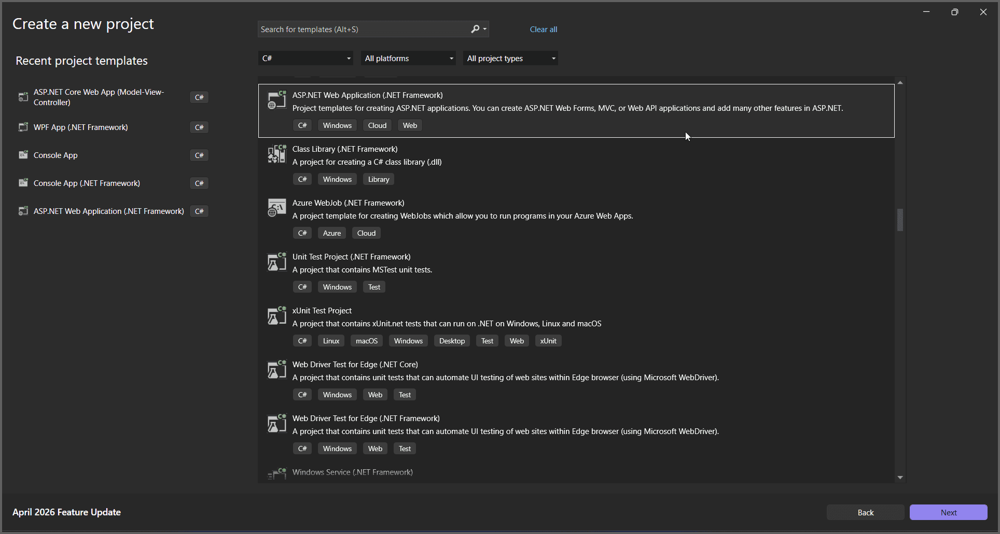
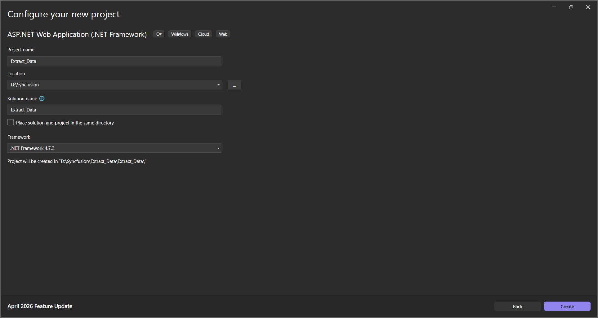
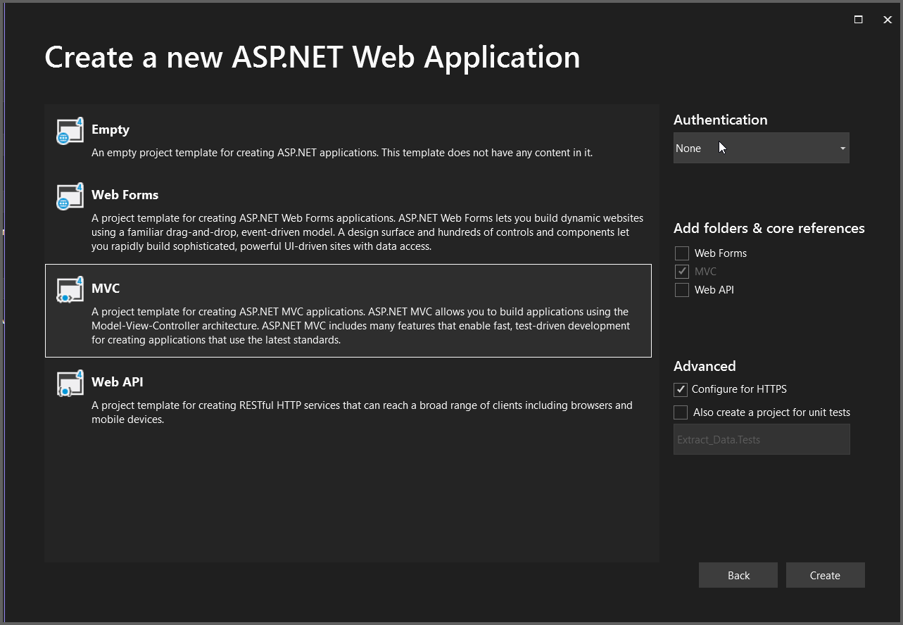
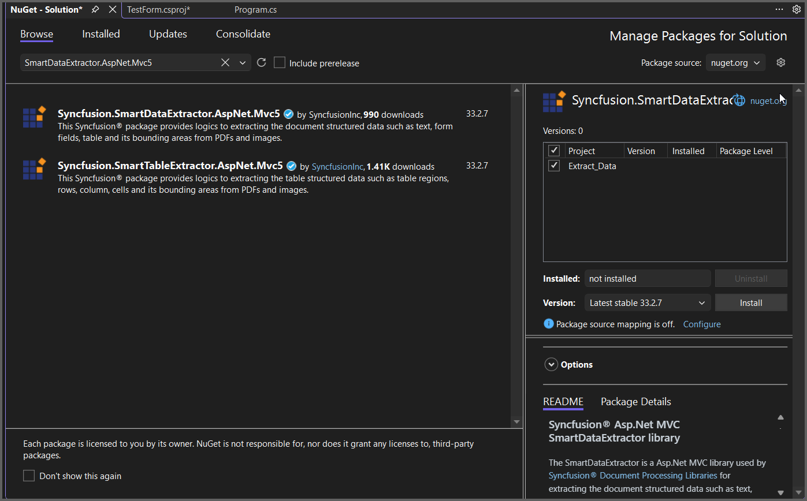

# Extract Data in ASP.NET MVC

The Syncfusion&reg; Smart Data Extractor is a .NET library used to extract structured data and document elements from PDFs and images in ASP.NET MVC applications.

## Steps to Extract data from PDF document in ASP.NET MVC

Step 1: Create a new C# ASP.NET Web Application (.NET Framework) project.
   

Step 2: In the project configuration window, name your project and select Create.
   
   

Step 3: Install [Syncfusion.SmartDataExtractor.AspNet.Mvc5](https://www.nuget.org/packages/Syncfusion.SmartDataExtractor.AspNet.Mvc5) NuGet package as a reference for your ASP.NET MVC application from [NuGet.org](https://www.nuget.org/).
  

Add the input PDF file named **Input.pdf** to the App_Data folder before running the sample.

Step 4: Include the following namespaces in the HomeController.cs file.



using System.IO;
using System.Text;
using Syncfusion.SmartDataExtractor;



Step 5: Add a new button in the Index.cshtml as shown below.



@{
   ViewBag.Title = "Home Page";
}

    @using (Html.BeginForm("ExtractData", "Home", FormMethod.Get))
    {
        <input type="submit" value="Extract Data from PDF" style="width:220px;height:30px" />
    }



Step 6: Add a new action method named `ExtractData` in HomeController.cs and include the following code example to extract data from a PDF document using the [ExtractDataAsJson](https://help.syncfusion.com/cr/document-processing/Syncfusion.SmartDataExtractor.DataExtractor.html#Syncfusion_SmartDataExtractor_DataExtractor_ExtractDataAsJson_System_IO_Stream_) method in the [DataExtractor](https://help.syncfusion.com/cr/document-processing/Syncfusion.SmartDataExtractor.DataExtractor.html) class. 



// Resolve the path to the input PDF file inside the App_Data folder.
string inputPath = Server.MapPath("~/App_Data/Input.pdf");

// Open the input PDF file as a stream.
using (FileStream stream = new FileStream(inputPath, FileMode.Open, FileAccess.ReadWrite))
{
    // Initialize the Data Extractor.
    DataExtractor extractor = new DataExtractor();
    // Extract form data as JSON.
    string data = extractor.ExtractDataAsJson(stream);
    // Convert JSON string into a MemoryStream for download.
    MemoryStream outputStream = new MemoryStream(Encoding.UTF8.GetBytes(data));
    // Reset stream position.
    outputStream.Position = 0;
    // Return JSON file as download in browser.
    return File(outputStream, "application/json", "Output.json");
}



A complete working sample can be downloaded from [GitHub](https://github.com/SyncfusionExamples/PDF-Examples/tree/master/Data-Extraction/Getting-Started/ASP.NETMVC/Extract_Data).

By executing the program, you will get the JSON file as follows.
  

Click [here](https://www.syncfusion.com/document-sdk/net-pdf-data-extraction) to explore the rich set of Syncfusion&reg; Data Extraction library features. 
 