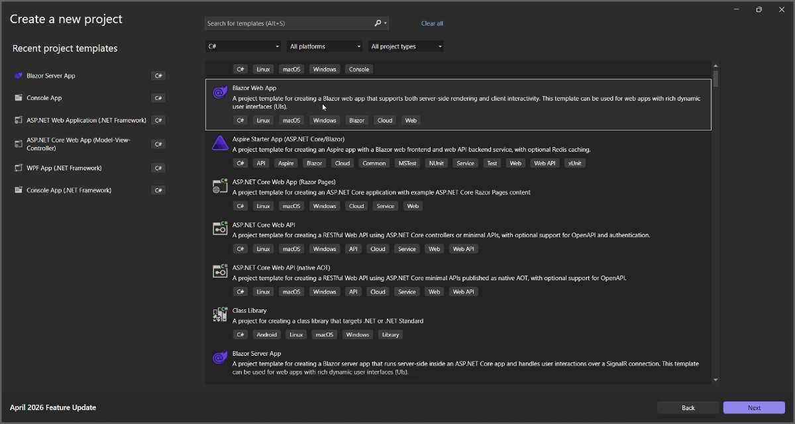
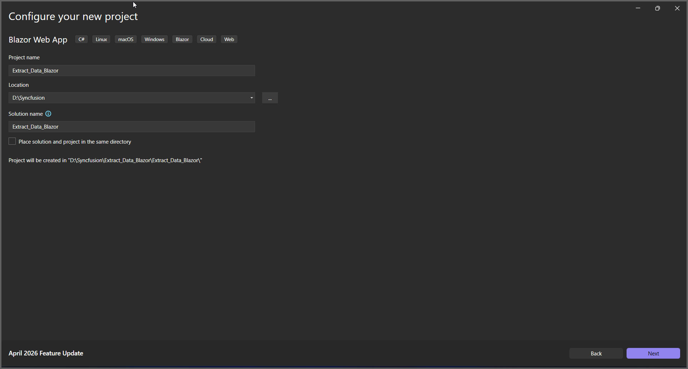
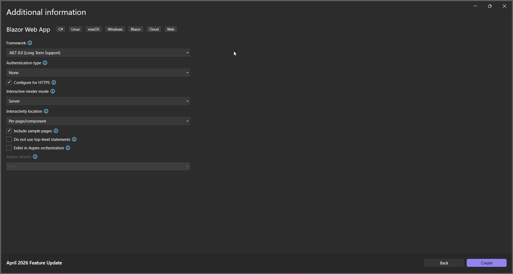
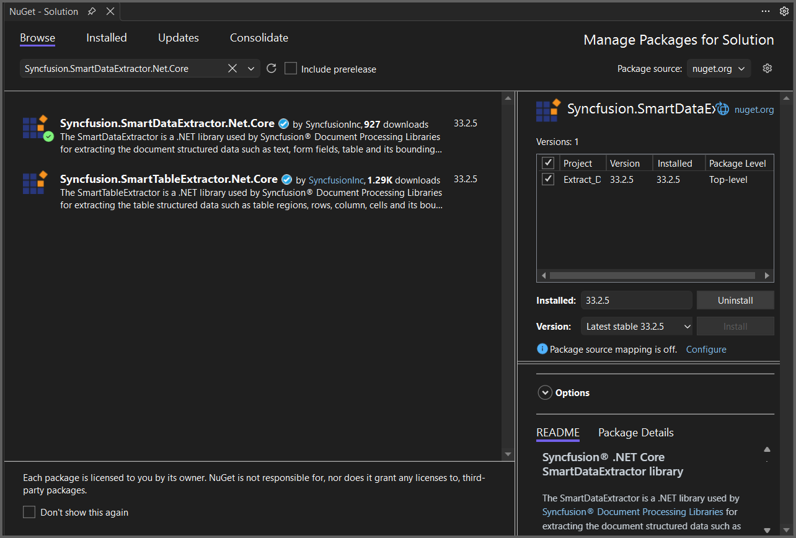
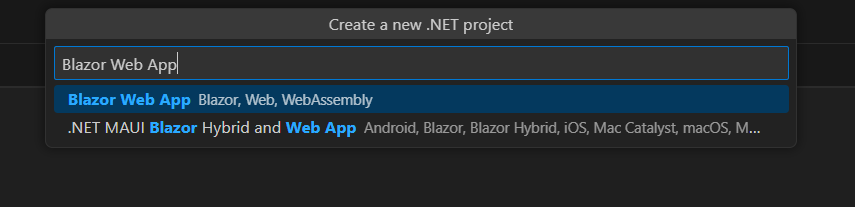

# Extract Data from PDF in Blazor

The Syncfusion<sup>&reg;</sup> Smart Data Extractor is a .NET library used to extract structured data and document elements from PDFs and images in Blazor applications.

## Steps to Extract Data from PDF in Blazor application





**Prerequisites**:

* Install .NET SDK: Ensure that you have the .NET SDK installed on your system. You can download it from the [.NET Downloads page](https://dotnet.microsoft.com/en-us/download).
* Install Visual Studio: Download and install Visual Studio from the [official website](https://code.visualstudio.com/download).


Step 1: Create a new C# Blazor Web App project.
*   Select "Blazor Web App" from the template and click **Next**.



*   Name the project and click **Next**.



*   Select the framework and click **Create** button.



Step 2: Install the `Syncfusion.SmartDataExtractor.Net.Core` NuGet package.

To **Extract Data from PDF in a Blazor Web App Server**, install [Syncfusion.SmartDataExtractor.Net.Core](https://www.nuget.org/packages/Syncfusion.SmartDataExtractor.Net.Core) into the Blazor project.



Add the input PDF file named **Input.pdf** to the wwwroot folder before running the sample.

Step 3: Create a Razor file named `Home.razor` in the `Pages` folder, which is located inside the `Components` folder.

Add the following directives and service injections in the file




@page "/"
@rendermode InteractiveServer
@using  Extract_Data_Blazor.Services
@using Microsoft.JSInterop
@inject ExtractionService extractor
@inject IJSRuntime JS




Step 4: Add a button to `Home.razor`.

Include the following code snippet to add a button in your Blazor application that triggers the “Extract Data as JSON” conversion:



<h1>Run Extraction</h1>
<button @onclick="RunExtraction" class="btn btn-primary">
    Run Extractor
</button>
<p>@message</p>




Step 5: Implement the method in `Home.razor`.

Add the following code snippet to extract data from a PDF and download the file in your Blazor application.



@code {
    string message = "Waiting...";
    async Task RunExtraction()
    {
        message = "Processing...";
        StateHasChanged(); // force UI update immediately
        message = await extractor.RunExtraction();
    }
}



Step 6: Create a new cs file `ExtractionService.cs` in the `Services` folder.

Include the following namespaces in the file:




using Syncfusion.Pdf.Parsing;
using Syncfusion.SmartDataExtractor;




Step 7: Implement the method in `ExtractionService.cs`.

Create a new method in the ExtractionService class, and add the following code snippet to extract data as JSON from a PDF in a Blazor Web App Server.




public class ExtractionService
{
    public string RunExtraction()
    {
        using (FileStream stream = new FileStream(@"wwwroot/Input.pdf", FileMode.Open, FileAccess.Read, FileShare.ReadWrite))
        {
            // Initialize the Data Extractor
            DataExtractor extractor = new DataExtractor();
            // Extract data as JSON string
            string data = extractor.ExtractDataAsJson(stream);
            // Return the JSON string
            return data;
        }
    }
}





Step 8: Add the service in Program.cs.

Include the following namespaces in the Program.cs file:




using Extract_Data_Blazor.Components;
using Extract_Data_Blazor.Services;




Add the following line to the `Program.cs` file to register `ExtractionService` as a scoped service in the Blazor application.




builder.Services.AddScoped<ExtractionService>();




Step 9: Create `FileUtils.cs` for JavaScript interoperability.

Create a new class file named `FileUtils` in the project and add the following code to invoke the JavaScript action for file download in the browser.





using System;
using System.Threading.Tasks;
using Microsoft.JSInterop;

public static class FileUtils
{
    public static ValueTask<object> SaveAs(this IJSRuntime js, string filename, byte[] data)
        => js.InvokeAsync<object>(
                "saveAsFile",
                filename,
                Convert.ToBase64String(data));
}





Step 10: Add JavaScript function to `App.razor`.

Add the following JavaScript function in the `App.razor` file located in the root of the project.





<script type="text/javascript">
    function saveAsFile(filename, bytesBase64) {
        if (navigator.msSaveBlob) {
            // Download document in Edge browser
            var data = window.atob(bytesBase64);
            var bytes = new Uint8Array(data.length);
            for (var i = 0; i < data.length; i++) {
                bytes[i] = data.charCodeAt(i);
            }
            var blob = new Blob([bytes.buffer], { type: "application/octet-stream" });
            navigator.msSaveBlob(blob, filename);
        }
        else {
            var link = document.createElement('a');
            link.download = filename;
            link.href = "data:application/octet-stream;base64," + bytesBase64;
            document.body.appendChild(link); // Needed for Firefox
            link.click();
            document.body.removeChild(link);
        }
    }
</script>





Step 11: Add navigation link.

Add the following code snippet to the `NavMenu.razor` file in the `Layout` folder.





<div class="nav-item px-3">
    <NavLink class="nav-link" href="extraction">
        <span class="oi oi-list-rich" aria-hidden="true"></span> Data Extraction
    </NavLink>
</div>





Step 12: Build the project.

Click on **Build** → **Build Solution** or press <kbd>Ctrl</kbd>+<kbd>Shift</kbd>+<kbd>B</kbd> to build the project.

Step 13: Run the project.

Click the Start button (green arrow) or press <kbd>F5</kbd> to run the application.

Upon executing the program, the JSON file will be generated as follows.






**Prerequisites:**

* Visual Studio Code.
* Install [.NET 8 SDK](https://dotnet.microsoft.com/en-us/download/dotnet/8.0) or later.
* Open Visual Studio Code and install the [C# for Visual Studio Code extension](https://marketplace.visualstudio.com/items?itemName=ms-dotnettools.csharp) from the Extensions Marketplace.


Step 1: Create a new C# Blazor Web App project.
* Open the command palette by pressing <kbd>Ctrl</kbd>+<kbd>Shift</kbd>+<kbd>P</kbd> and type **.NET:New Project** and enter.
* Choose the **Blazor Web App** template.



* Select the project location, type the project name and press enter.
* Then choose **Create project**.

Step 2: To **Extract Data from PDF in Web app**, install [Syncfusion.SmartDataExtractor.Net.Core](https://www.nuget.org/packages/Syncfusion.SmartDataExtractor.Net.Core) to the Blazor project.
* Press <kbd>Ctrl</kbd> + <kbd>`</kbd> (backtick) to open the integrated terminal in Visual Studio Code.
* Ensure you're in the project root directory where your .csproj file is located.
* Run the command `dotnet add package Syncfusion.SmartDataExtractor.Net.Core` to install the NuGet package.

```
dotnet add package Syncfusion.SmartDataExtractor.Net.Core

```

Add the input PDF file named **Input.pdf** to the wwwroot folder before running the sample.

Step 3: Create a Razor file named `Home.razor` in the `Pages` folder, which is located inside the `Components` folder.

Add the following directives and service injections in the file




@page "/"
@rendermode InteractiveServer
@using  Extract_Data_Blazor.Services
@using Microsoft.JSInterop
@inject ExtractionService extractor
@inject IJSRuntime JS




Step 4: Add a button to `Home.razor`.

Include the following code snippet to add a button in your Blazor application that triggers the “Extract Data as JSON” conversion:



<h1>Run Extraction</h1>

<button @onclick="RunExtraction" class="btn btn-primary">
    Run Extractor
</button>

<p>@message</p>





Step 5: Implement the method in `Home.razor`.

Add the following code snippet to extract data from a PDF and download the file in your Blazor application.



@code {
    string message = "Waiting...";
    async Task RunExtraction()
    {
        message = "Processing... ";
        StateHasChanged(); // force UI update immediately
        // Run extractor to get JSON string
        var json = await extractor.RunExtraction();
        // Convert JSON to UTF8 bytes and trigger browser download via JS interop
        var bytes = System.Text.Encoding.UTF8.GetBytes(json ?? string.Empty);
        await JS.SaveAs("extracted.json", bytes);
        message = "Download started";
    }
}



Step 6: Create a new cs file `ExtractionService.cs` in the `Services` folder.

Include the following namespaces in the file:





using Syncfusion.Pdf.Parsing;
using Syncfusion.SmartDataExtractor;





Step 7: Implement the method in `ExtractionService.cs`.

Create a new method in the ExtractionService class, and add the following code snippet to extract data as JSON from a PDF in a Blazor Web App Server.





using (FileStream stream = new FileStream(@"wwwroot/Input.pdf", FileMode.Open, FileAccess.Read, FileShare.ReadWrite))
{
	// Initialize the Data Extractor
	DataExtractor extractor = new DataExtractor();

	// Extract data as JSON string
	string data = extractor.ExtractDataAsJson(stream);

	// Return the JSON string
	return data;
}





Step 8: Add the service in Program.cs.

Include the following namespaces in the Program.cs file:




using Extract_Data_Blazor.Components;
using Extract_Data_Blazor.Services;




Add the following line to the `Program.cs` file to register `ExtractionService` as a scoped service in the Blazor application.




builder.Services.AddScoped<ExtractionService>();




Step 9: Create `FileUtils.cs` for JavaScript interoperability.

Create a new class file named `FileUtils` in the project and add the following code to invoke the JavaScript action for file download in the browser.





public static class FileUtils
{
    public static ValueTask<object> SaveAs(this IJSRuntime js, string filename, byte[] data)
        => js.InvokeAsync<object>(
                "saveAsFile",
                filename,
                Convert.ToBase64String(data));
}





Step 10: Add JavaScript function to `App.razor`.

Add the following JavaScript function in the `App.razor` file located in the root of the project.





<script type="text/javascript">
    function saveAsFile(filename, bytesBase64) {
        if (navigator.msSaveBlob) {
            // Download document in Edge browser
            var data = window.atob(bytesBase64);
            var bytes = new Uint8Array(data.length);
            for (var i = 0; i < data.length; i++) {
                bytes[i] = data.charCodeAt(i);
            }
            var blob = new Blob([bytes.buffer], { type: "application/octet-stream" });
            navigator.msSaveBlob(blob, filename);
        }
        else {
            var link = document.createElement('a');
            link.download = filename;
            link.href = "data:application/octet-stream;base64," + bytesBase64;
            document.body.appendChild(link); // Needed for Firefox
            link.click();
            document.body.removeChild(link);
        }
    }
</script>





Step 11: Add navigation link.

Add the following code snippet to the Navigation menu's Razor file in the `Layout` folder.





<div class="nav-item px-3">
    <NavLink class="nav-link" href="extraction">
        <span class="oi oi-list-rich" aria-hidden="true"></span> Data Extraction
    </NavLink>
</div>





Step 12: Build the project.

Run the following command in terminal to build the project.

```
dotnet build
```

Step 13: Run the project.

Run the following command in terminal to run the project.

```
dotnet run
```

Upon executing the program, the JSON file will be generated as follows.






