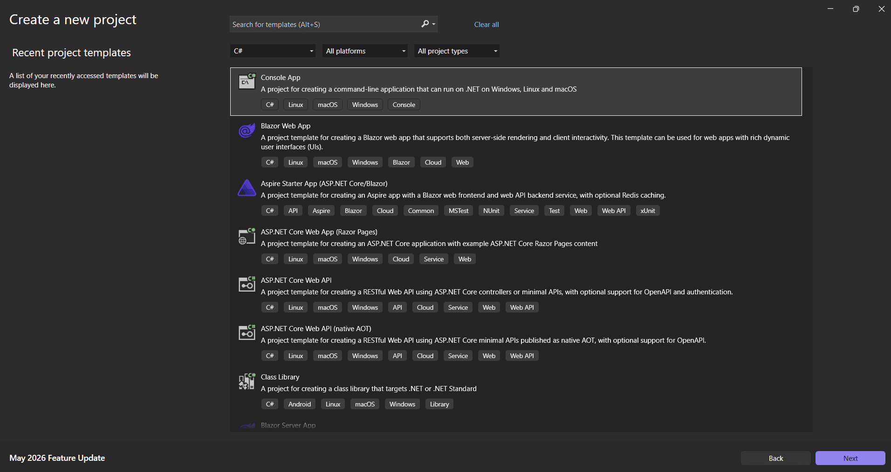
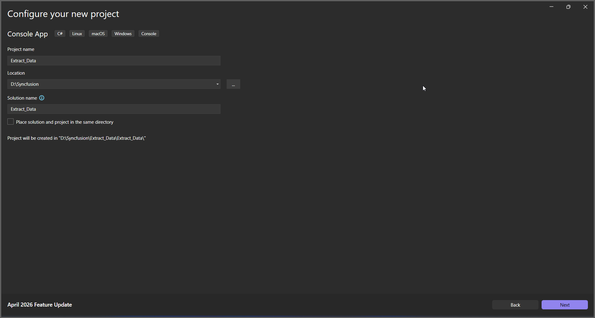
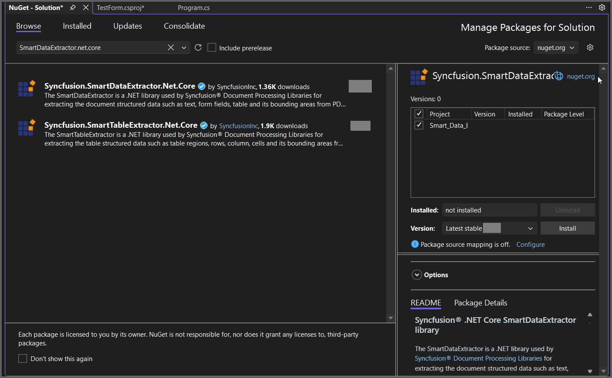
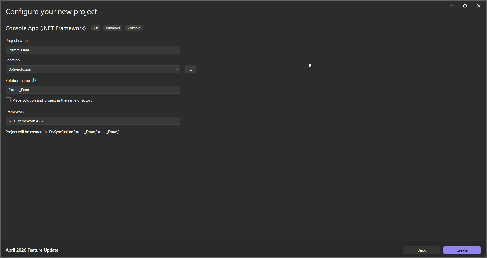

---
title: Extract Data in Console Application | Syncfusion
description: Learn how to extract data in a Console Application by using the .NET Smart Data Extractor Library efficiently.
platform: document-processing
control: SmartDataExtractor
documentation: UG
--- 

# Extract Data from PDF in Console Application

The Syncfusion<sup>&reg;</sup> Smart Data Extractor is a .NET library used to extract structured data and document elements from PDFs and images in Console applications.

## Steps to Extract Data from PDF in Console App




**Prerequisites**:

* Install .NET SDK: Ensure that you have the .NET SDK installed on your system. You can download it from the [.NET Downloads page](https://dotnet.microsoft.com/en-us/download).
* Install Visual Studio: Download and install Visual Studio from the [official website](https://code.visualstudio.com/download?_exp_download=fb315fc982).

Step 1: Create a new C# Console Application project.


Step 2: Name the project.


Step 3: Install the [Syncfusion.SmartDataExtractor.Net.Core](https://www.nuget.org/packages/Syncfusion.SmartDataExtractor.Net.Core) NuGet package as a reference for your console application from [NuGet.org](https://www.nuget.org).


Add the input PDF file named **Input.pdf** to the project root directory before running the sample.

Step 4: Include the following namespaces in the *Program.cs* file.



using System.Text;
using System.IO;
using Syncfusion.Pdf.Parsing;
using Syncfusion.SmartDataExtractor;



Step 5: Include the following code snippet in *Program.cs* to extract data from a PDF file.




 
//Open the input PDF file as a stream.
using (FileStream stream = new FileStream("Input.pdf", FileMode.Open, FileAccess.Read))
{
    //Initialize the Data Extractor.
    DataExtractor extractor = new DataExtractor();
    //Extract data as JSON.
    string data = extractor.ExtractDataAsJson(stream);
    //Save the extracted JSON data into an output file.
    File.WriteAllText("Output.json", data, Encoding.UTF8);
}





Step 6: Build the project.

Click on Build > Build Solution or press Ctrl + Shift + B to build the project.

Step 7: Run the project.

Click the Start button (green arrow) or press F5 to run the app.


 

**Prerequisites**:

* Install .NET SDK: Ensure that you have the .NET SDK installed on your system. You can download it from the [.NET Downloads page](https://dotnet.microsoft.com/en-us/download).
* Install Visual Studio Code: Download and install Visual Studio Code from the [official website](https://code.visualstudio.com/download?_exp_download=fb315fc982).
* Install C# Extension for VS Code: Open Visual Studio Code, go to the Extensions view (Ctrl+Shift+X), and search for 'C#'. Install the official [C# extension provided by Microsoft](https://marketplace.visualstudio.com/items?itemName=ms-dotnettools.csharp).


Step 1: Open the terminal (Ctrl+` ) and run the following command to create a new .NET Core console application project.

```
dotnet new console -n ExtractDataConsoleApp
```
Step 2: Replace **ExtractDataConsoleApp** with your desired project name.

Step 3: Navigate to the project directory using the following command

```
cd ExtractDataConsoleApp
```
Step 4: Use the following command in the terminal to add the [Syncfusion.SmartDataExtractor.Net.Core](https://www.nuget.org/packages/Syncfusion.SmartDataExtractor.Net.Core) package to your project.

```
dotnet add package Syncfusion.SmartDataExtractor.Net.Core
```

Step 5: Include the following namespaces in the *Program.cs* file.



using System.IO;
using Syncfusion.Pdf.Parsing;
using Syncfusion.SmartDataExtractor;



Step 6: Include the following code snippet in *Program.cs* to Extract data from an PDF file.


 
//Open the input PDF file as a stream.
using (FileStream stream = new FileStream("Input.pdf", FileMode.Open, FileAccess.Read))
{
    //Initialize the Data Extractor.
    DataExtractor extractor = new DataExtractor();
    //Extract data as JSON.
    string data = extractor.ExtractDataAsJson(stream);
    //Save the extracted JSON data into an output file.
    File.WriteAllText("Output.json", data, Encoding.UTF8);
}



Step 7: Build the project.

Run the following command in terminal to build the project.

```
dotnet build
```

Step 8: Run the project.

Run the following command in terminal to run the project.

```
dotnet run
```





You can download a complete working sample from [GitHub](https://github.com/SyncfusionExamples/PDF-Examples/tree/master/Data-Extraction/Getting-Started/Console/.NET/Extract_Data_as_JSON).

By executing the program, you will get the JSON file as follows.


## Extract Data from PDF using .NET Framework

The following steps illustrates Extracting Data from PDF document in console application using .NET Framework.

**Prerequisites**:

* Install .NET SDK: Ensure that you have the .NET SDK installed on your system. You can download it from the [.NET Downloads page](https://dotnet.microsoft.com/en-us/download).
* Install Visual Studio: Download and install Visual Studio from the [official website](https://code.visualstudio.com/download?_exp_download=fb315fc982).

**Steps to Extract Data from PDF using .NET Framework**

Step 1: Create a new C# Console Application (.NET Framework) project.


Step 2: Name the project.


Step 3: Install the [Syncfusion.SmartDataExtractor.WinForms](https://www.nuget.org/packages/Syncfusion.SmartDataExtractor.WinForms/) NuGet package as a reference for your .NET Framework console application from [NuGet.org](https://www.nuget.org).


Add the input PDF file named **Input.pdf** to the project root directory before running the sample.

Step 4: Include the following namespaces in the *Program.cs*.



using System.Text;
using System.IO;
using Syncfusion.Pdf.Parsing;
using Syncfusion.SmartDataExtractor;



Step 5: Include the following code sample in *Program.cs* to Extract data from an PDF file.



//Open the input PDF file as a stream.
using (FileStream stream = new FileStream("Input.pdf", FileMode.Open, FileAccess.Read))
{
    //Initialize the Data Extractor.
    DataExtractor extractor = new DataExtractor();
    //Extract data as JSON.
    string data = extractor.ExtractDataAsJson(stream);
    //Save the extracted JSON data into an output file.
    File.WriteAllText("Output.json", data, Encoding.UTF8);
}



Step 6: Build the project.

Click on Build > Build Solution or press Ctrl + Shift + B to build the project.

Step 7: Run the project.

Click the Start button (green arrow) or press F5 to run the app.

You can download a complete working sample from [GitHub](https://github.com/SyncfusionExamples/PDF-Examples/tree/master/Data-Extraction/Getting-Started/Console/.NETFramework/Extract_Data).

By executing the program, you will get the JSON file as follows.


