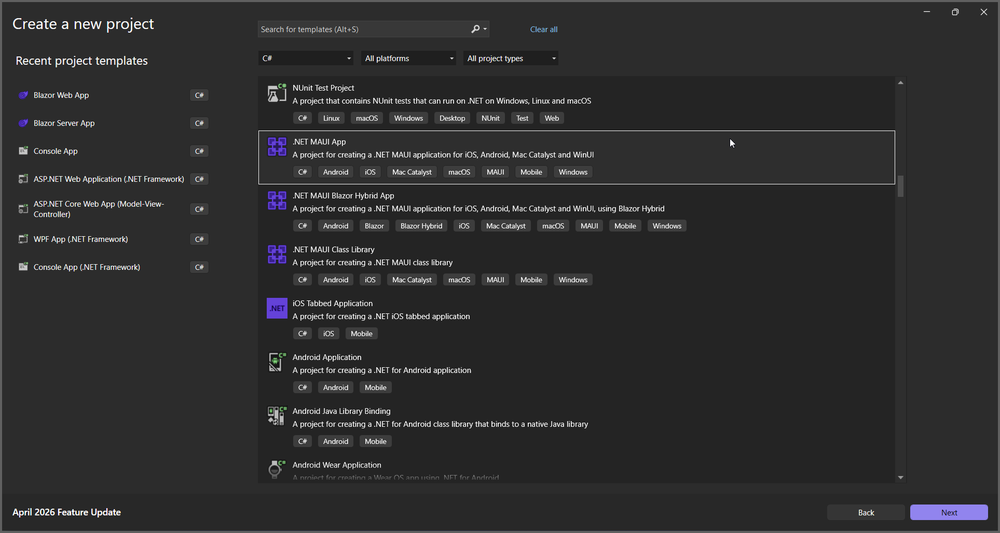
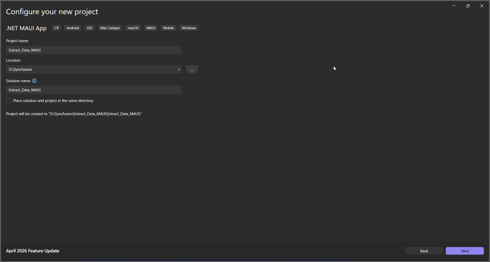
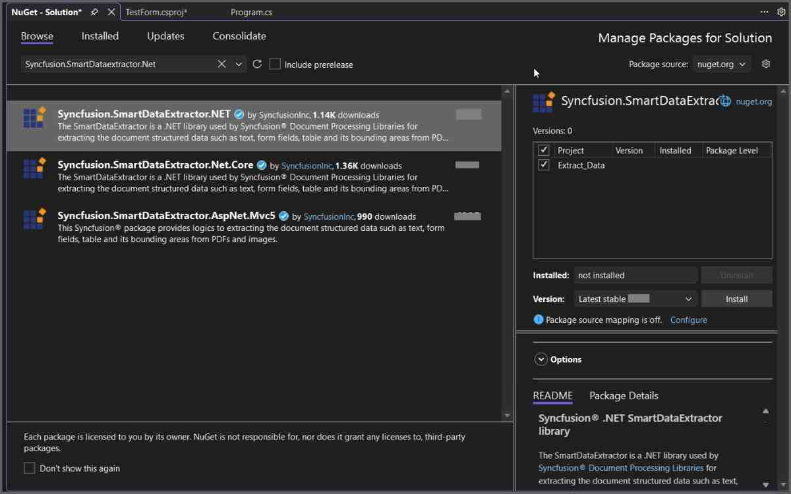
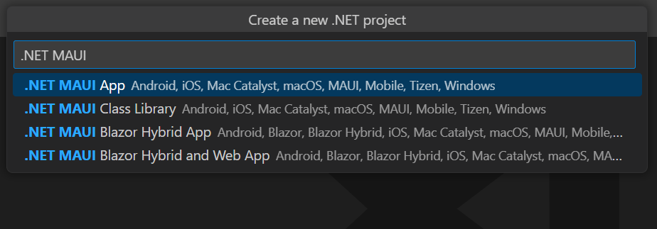

# Extract Data from PDF in .NET MAUI

The Syncfusion<sup>&reg;</sup> Smart Data Extractor is a .NET library used to extract structured data and document elements from PDFs and images in .NET MAUI applications.

## Steps to Extract Data from PDF in .NET MAUI





**Prerequisites:**

* Visual Studio 2022.
* Install [.NET 8 SDK](https://dotnet.microsoft.com/en-us/download/dotnet/8.0) or later.
* For more details about installation, refer [here](https://learn.microsoft.com/en-us/dotnet/maui/get-started/installation?view=net-maui-7.0&tabs=vswin).

Step 1: Create a new C# .NET MAUI app. Select **.NET MAUI App** from the template and click the **Next** button.



Step 2: Enter the project name and click **Create**.



Step 3: Install the [Syncfusion.SmartDataExtractor.NET](https://www.nuget.org/packages/Syncfusion.SmartDataExtractor.NET) NuGet package as a reference to your project from [NuGet.org](https://www.nuget.org/).



Add the input PDF file named **Input.pdf** to the project as a MauiAsset before running the sample.

Step 4: Add a new button to the **MainPage.xaml** as shown below.





<ContentPage xmlns="http://schemas.microsoft.com/dotnet/2021/maui"
             xmlns:x="http://schemas.microsoft.com/winfx/2009/xaml"
             x:Class="Extract_Data_MAUI.MainPage">

    <ScrollView>
        <VerticalStackLayout
            Padding="30,0"
            Spacing="25">

            <Label
                Text="Smart Data Extractor Demo"
                Style="{StaticResource Headline}"
                SemanticProperties.HeadingLevel="Level1" />

            <Button
                Text="Extract Data from PDF"
                SemanticProperties.Hint="Extract structured data from PDF"
                Clicked="OnExtractDataClicked"
                HorizontalOptions="Fill" /> 

        </VerticalStackLayout>
    </ScrollView>
</ContentPage>





Step 5: Include the following namespaces in the **MainPage.xaml.cs** file.





using System.IO;
using System.Text;
using Syncfusion.SmartDataExtractor;





Step 6: Add a new action method **OnExtractDataClicked** in MainPage.xaml.cs and include the following code snippet to **Extract Data from PDF**.





// Load the input PDF from the app package (include it in the project as a MauiAsset)
using Stream inputStream = await FileSystem.OpenAppPackageFileAsync(Path.Combine("Data", "Input.pdf"));
// Initialize the Data Extractor
DataExtractor extractor = new DataExtractor();
// Extract data as JSON string
string data = extractor.ExtractDataAsJson(inputStream);
// Save the extracted JSON data into an output file inside the application directory
string outputDirectory = Path.Combine(FileSystem.AppDataDirectory, "Output");
Directory.CreateDirectory(outputDirectory);
string outputPath = Path.Combine(outputDirectory, "Output.json");
File.WriteAllText(outputPath, data, Encoding.UTF8);
// Show success message
await DisplayAlert("Success", $"Extracted data saved to {outputPath}", "OK");





Step 7: Run the Application.

1. Select the target framework, device or emulator.
2. Press <kbd>F5</kbd> to run the application.

By executing the program, you will get the JSON file as follows.


Click [here](https://www.syncfusion.com/document-sdk/net-pdf-data-extraction) to explore the rich set of Syncfusion<sup>&reg;</sup> Data Extraction library features. 






**Prerequisites:**

* Install the latest .NET SDK and Visual Studio Code.
* Open Visual Studio Code and install the [.NET MAUI for Visual Studio Code extension](https://marketplace.visualstudio.com/items?itemName=ms-dotnettools.dotnet-maui) from the Extensions Marketplace.
* Follow the step-by-step setup guide:
  - [Set up .NET MAUI with Visual Studio Code](https://learn.microsoft.com/en-us/dotnet/maui/get-started/installation?view=net-maui-9.0&tabs=visual-studio-code)
  - [Steps for each platform](https://learn.microsoft.com/en-us/dotnet/maui/get-started/first-app?pivots=devices-windows&view=net-maui-9.0&tabs=visual-studio-code) 

Step 1: Create a new C# .NET MAUI app project.
* Open the command palette by pressing <kbd>Ctrl</kbd>+<kbd>Shift</kbd>+<kbd>P</kbd> and type **.NET:New Project** and enter.
* Choose the **.NET MAUI App** template.



* Select the project location, type the project name and press enter.
* Then choose **Create project**.

Step 2: To **Extract Data from PDF Document in .NET MAUI app**, install [Syncfusion.SmartDataExtractor.NET](https://www.nuget.org/packages/Syncfusion.SmartDataExtractor.NET) to the MAUI project.
* Press <kbd>Ctrl</kbd> + <kbd>`</kbd> (backtick) to open the integrated terminal in Visual Studio Code.
* Ensure you're in the project root directory where your .csproj file is located.
* Run the command `dotnet add package Syncfusion.SmartDataExtractor.NET` to install the NuGet package.

```
dotnet add package Syncfusion.SmartDataExtractor.NET
```

Step 3: Add a new button to the **MainPage.xaml** as shown below.




<ContentPage xmlns="http://schemas.microsoft.com/dotnet/2021/maui"
             xmlns:x="http://schemas.microsoft.com/winfx/2009/xaml"
             x:Class="Extract_Data_MAUI.MainPage">

	<ScrollView>
		<VerticalStackLayout
            Padding="30,0"
            Spacing="25">

			<Label
                Text="Smart Data Extractor Demo"
                Style="{StaticResource Headline}"
                SemanticProperties.HeadingLevel="Level1" />

			<Button
                Text="Extract Data from PDF"
                SemanticProperties.Hint="Extract structured data from PDF"
                Clicked="OnExtractDataClicked"
                HorizontalOptions="Fill" /> 

		</VerticalStackLayout>
	</ScrollView>
</ContentPage>




Step 4: Include the following namespaces in the **MainPage.xaml.cs** file.





using System.IO;
using System.Text;
using Syncfusion.SmartDataExtractor;





Step 5: Add a new action method **OnExtractDataClicked** in MainPage.xaml.cs and include the following code snippet to **Extract Data from PDF**.





// Load the input PDF from the app package (include it in the project as a MauiAsset)
using Stream inputStream = await FileSystem.OpenAppPackageFileAsync(Path.Combine("Data", "Input.pdf"));
// Initialize the Data Extractor
DataExtractor extractor = new DataExtractor();
// Extract data as JSON string
string data = extractor.ExtractDataAsJson(inputStream);
// Save the extracted JSON data into an output file inside the application directory
string outputDirectory = Path.Combine(FileSystem.AppDataDirectory, "Output");
Directory.CreateDirectory(outputDirectory);
string outputPath = Path.Combine(outputDirectory, "Output.json");
File.WriteAllText(outputPath, data, Encoding.UTF8);
// Show success message
await DisplayAlert("Success", $"Extracted data saved to {outputPath}", "OK");






Step 6: Run the Application.

1. Select the target framework, device or emulator.
2. Press <kbd>F5</kbd> to run the application.

By executing the program, you will get the JSON file as follows.




