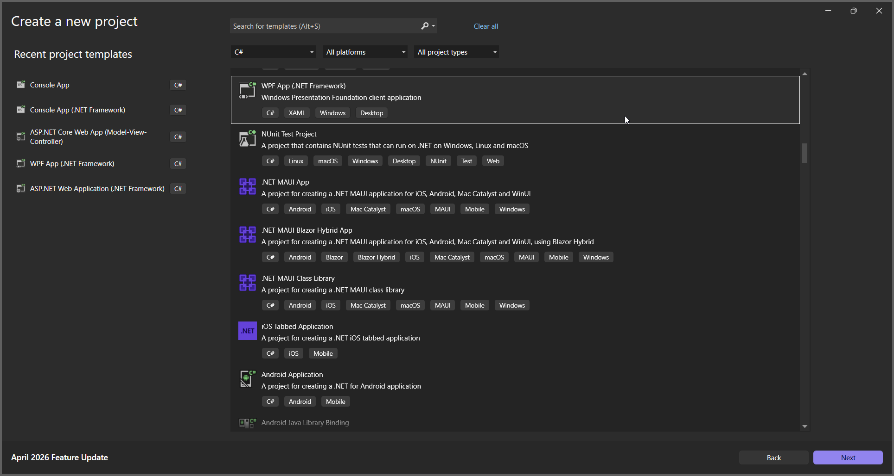
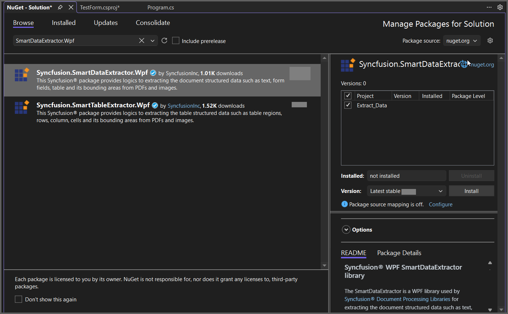
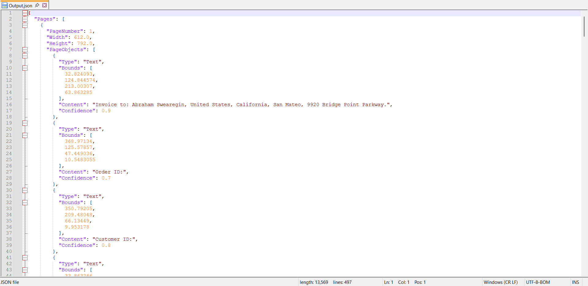

# Extract Data from PDF in WPF

The Syncfusion&reg; Smart Data Extractor is a .NET library used to extract structured data and document elements from PDFs and images in WPF applications.

## Steps to Extract Data from PDF document in WPF

Step 1: Create a new WPF application project.
  

In the project configuration window, name your project and select Create.

Step 2: Install the [Syncfusion.SmartDataExtractor.WPF](https://www.nuget.org/packages/Syncfusion.SmartDataExtractor.WPF) NuGet package as a reference to your WPF application [NuGet.org](https://www.nuget.org/).

Add the input PDF file named **Input.pdf** to the project folder before running the sample.

Step 3: Include the following namespaces in the MainWindow.xaml.cs file.



using System;
using System.IO;
using System.Text;
using System.Windows;
using Syncfusion.SmartDataExtractor;



Step 4: Add a new button in MainWindow.xaml to extract data from a PDF document as follows.



<Grid>
    <Button Content="Extract Data"
            Width="150" Height="40"
            HorizontalAlignment="Center"
            VerticalAlignment="Center"
            Click="ExtractButton_Click"/>
</Grid>



Step 5: Add the following code in `ExtractButton_Click` to extract data from a PDF document using the [ExtractDataAsJson](https://help.syncfusion.com/cr/document-processing/Syncfusion.SmartDataExtractor.DataExtractor.html#Syncfusion_SmartDataExtractor_DataExtractor_ExtractDataAsJson_System_IO_Stream_) method in the [DataExtractor](https://help.syncfusion.com/cr/document-processing/Syncfusion.SmartDataExtractor.DataExtractor.html) class. The extracted content will be saved as a JSON file.



// Open the input PDF file as a stream.
using (FileStream stream = new FileStream("Input.pdf", FileMode.Open, FileAccess.Read))
{
    // Initialize the Data Extractor.
    DataExtractor extractor = new DataExtractor();
    // Extract form data as JSON.
    string data = extractor.ExtractDataAsJson(stream);
    // Save the extracted JSON data into an output file (inline path).
    File.WriteAllText("Output.json", data, Encoding.UTF8);
}



A complete working sample can be downloaded from [GitHub](https://github.com/SyncfusionExamples/PDF-Examples/tree/master/Data-Extraction/Getting-Started/WPF/Extract_Data).

By executing the program, you will get the JSON file as follows.
 
 
Click [here](https://www.syncfusion.com/document-sdk/net-pdf-data-extraction) to explore the rich set of Syncfusion&reg; Data Extraction library features.