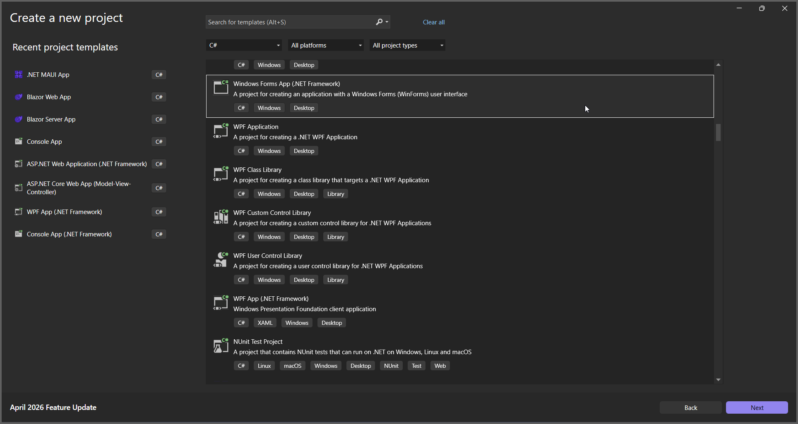
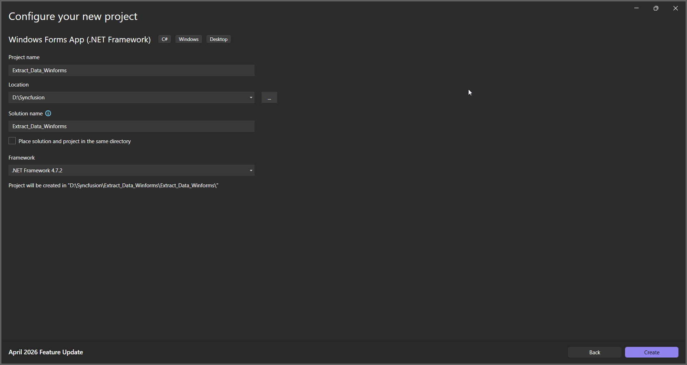
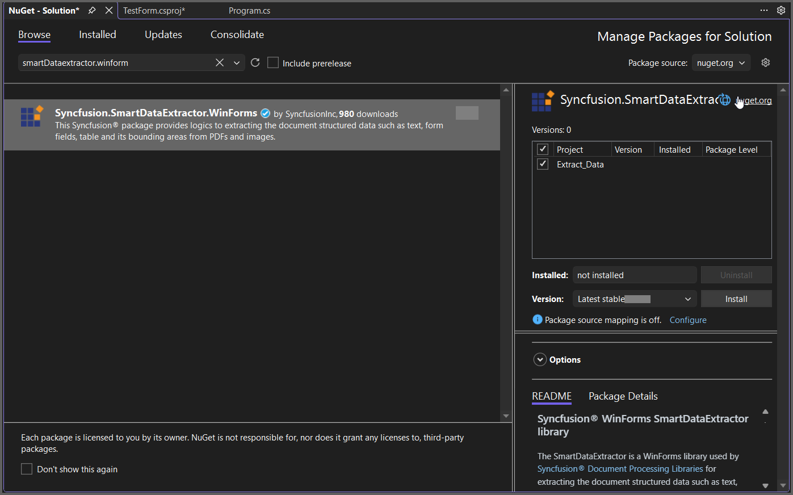

# Extract Data in Windows Forms

The Syncfusion&reg; Smart Data Extractor is a .NET library used to extract structured data and document elements from PDFs and images in Windows Forms applications.

## Steps to Extract Data in Windows Forms





**Prerequisites:**

* Visual Studio 2022.
* Install **.NET desktop development** workload with necessary .NET Framework SDK.

Step 1: Create a new Windows Forms application project.

Step 2: Name the project.

Step 3: Install [Syncfusion.SmartDataExtractor.WinForms](https://www.nuget.org/packages/Syncfusion.SmartDataExtractor.WinForms) NuGet package as a reference to your Windows Forms application from the [NuGet.org](https://www.nuget.org/).

Add the input PDF file named **Input.pdf** to the Data folder before running the sample.

Step 4: Include the following namespaces in the **Form1.cs** file.





using System;
using System.IO;
using System.Text;
using System.Windows.Forms;
using Syncfusion.SmartDataExtractor;





Step 5: Add a new button in **Form1.Designer.cs** to extract data from PDF as follows.





private Button btnExtract;
private Label label;

private void InitializeComponent()
{
label = new Label();
btnExtract = new Button();

// Label
label.Location = new System.Drawing.Point(0, 40);
label.Size = new System.Drawing.Size(426, 35);
label.Text = "Click the button to extract data from PDF using Smart Data Extractor.";
label.TextAlign = System.Drawing.ContentAlignment.MiddleCenter;

// Button
btnExtract.Location = new System.Drawing.Point(160, 110);
btnExtract.Size = new System.Drawing.Size(120, 36);
btnExtract.Text = "Extract Data from PDF";
btnExtract.Click += new EventHandler(btnExtract_Click);

// Form
ClientSize = new System.Drawing.Size(450, 150);
Controls.Add(label);
Controls.Add(btnExtract);
Text = "Extract Data from PDF";
}




Step 6: Add the following code in **btnExtract_Click** to extract data from PDF.





// Load the existing PDF document
using (FileStream stream = new FileStream(Path.GetFullPath(@"../../Data/Input.pdf"), FileMode.Open, FileAccess.Read))
{
    // Initialize the Data Extractor
    DataExtractor extractor = new DataExtractor();
    // Extract data as JSON string
    string data = extractor.ExtractDataAsJson(stream);
    // Save the extracted JSON data into an output file
    File.WriteAllText(Path.GetFullPath(@"../../Output.json"), data, Encoding.UTF8);
}





Step 7: Build the project.

Click on Build → Build Solution or press <kbd>Ctrl</kbd>+<kbd>Shift</kbd>+<kbd>B</kbd> to build the project.

Step 8: Run the project.

Click the Start button (green arrow) or press <kbd>F5</kbd> to run the app.

By executing the program, you will get the JSON file as follows.





