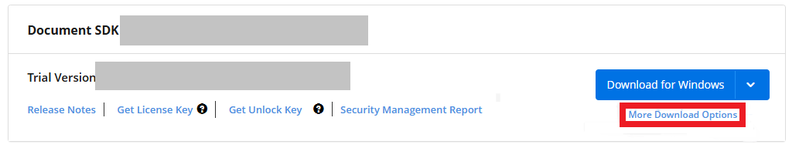
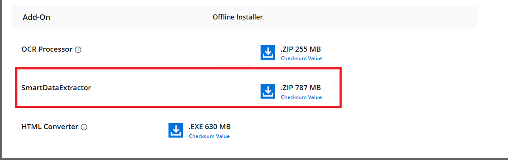

# Download Syncfusion&reg; Data Extraction Add-On

The Syncfusion&reg; Data Extraction Add-On can be downloaded from the [Syncfusion download page](https://www.syncfusion.com/downloads). 

### Download Data Extraction Add-On Setup

1. You can download the Data Extraction Add-On at any time from your registered account's [Trials & Downloads](https://www.syncfusion.com/account/manage-trials/downloads) page by clicking **More Download Options** (as shown in the screenshot below).
   
2. The Syncfusion Data Extraction Add-On is provided in ZIP format. After downloading, extract the file to access the assemblies and demos for PDF and image data extraction.
   

N> The Syncfusion Data Extraction Add‑On is available in ZIP format for Windows, Linux, and Mac. Extract the file to access the assemblies and demos for PDF or image data extraction.