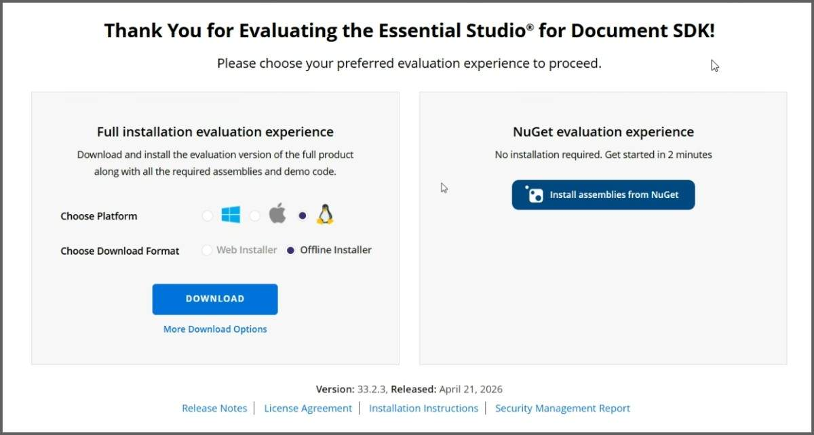
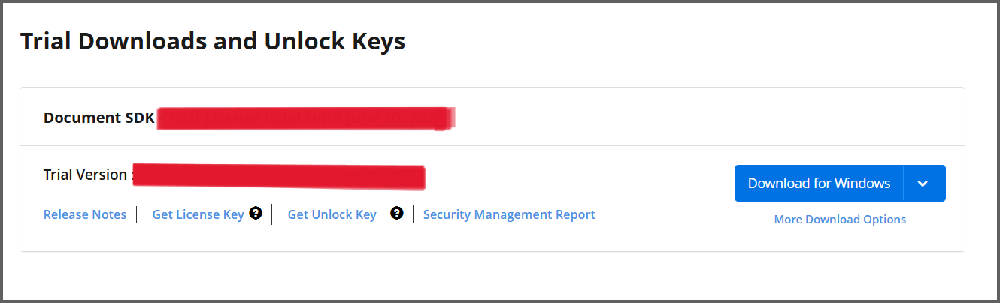
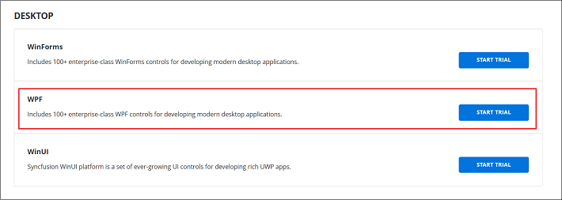
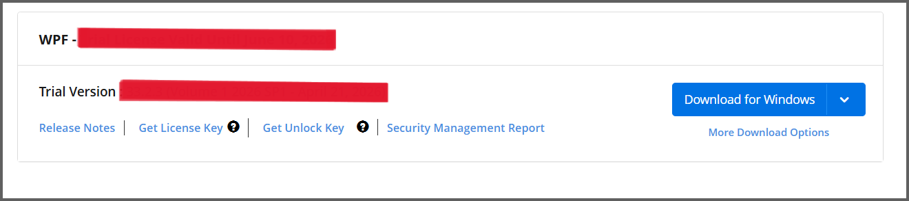
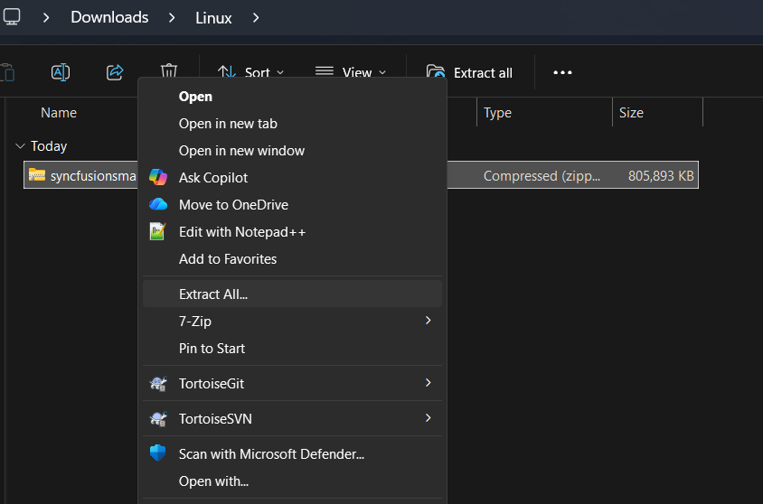
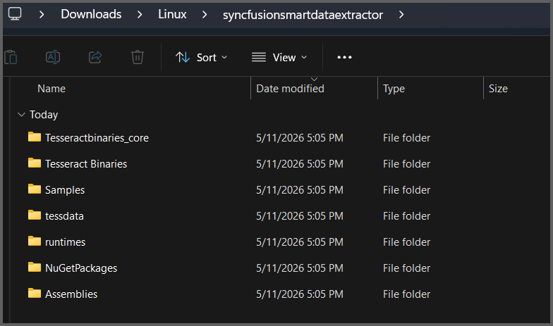

# Download Syncfusion&reg; Data Extraction Installer

The Syncfusion&reg; installer can be downloaded from the [Syncfusion](https://www.syncfusion.com/) website. You can either download the licensed installer or try our trial installer depending on your license.

   -	Trial Installer
   -	Licensed Installer

You can download the Syncfusion&reg; installer from [Syncfusion.com](https://www.syncfusion.com/) website 

## Download the Trial Version

Our 30-day trial can be downloaded in two ways.

* Download Free Trial Setup
* Start Trials if using components through [NuGet.org](https://www.nuget.org/packages?q=syncfusion)

### Download Free Trial Setup

1. You can evaluate our 30-day free trial by visiting the [Download Free Trial](https://www.syncfusion.com/downloads) page and select the product
2. After completing the required form or logging in with your registered Syncfusion&reg; account, you can download the trial installer from the confirmation page. (as shown in below screenshot.)

   
3. With a trial license, only the latest version’s trial installer can be downloaded.
4. Unlock key is not required to install the Syncfusion&reg; Data Extraction trial installer.
5. Before the trial expires, you can download the trial installer at any time from your registered account’s [Trials & Downloads](https://www.syncfusion.com/account/manage-trials/downloads) page (as shown in below screenshot.)
 
   

6. Click the More Download Options (element 2 in the above screenshot) button to get the Data Extraction Product Offline trial installer which is available in ZIP format.

   

### Start Trials if using components through [NuGet.org](https://www.nuget.org/packages?q=syncfusion)

You should initiate an evaluation if you have already obtained our components through [NuGet.org](https://www.nuget.org/packages?q=syncfusion)

1. You can start your 30-day free trial from the [Start Trial](https://www.syncfusion.com/account/manage-trials/start-trials) page from your account.

   N> You can generate the license key for your active trial products from [Trials & Downloads](https://www.syncfusion.com/account/manage-trials/downloads) page. This license key will be mandatory to use our trial products in your application. To know more about License key, refer this [help topic](https://help.syncfusion.com/common/essential-studio/licensing/overview).
	
    
   
2. To access this page, you must sign up\log in with your Syncfusion&reg; account.
3. Begin your trial by selecting the Syncfusion&reg; product. 

   N> If you've already used the trial products and they haven't expired, you won't be able to start the trial for the same product again.

4. After you've started the trial, go to the [Trials & Downloads](https://www.syncfusion.com/account/manage-trials/downloads) page to get the latest version trial installer. You can generate the [unlock key](https://www.syncfusion.com/kb/8069/how-to-generate-unlock-key-for-essentials-studio-products) and [license key](https://help.syncfusion.com/common/essential-studio/licensing/how-to-generate) here at any time before the trial period expires. (as shown in below screenshot.)

   

5. You can find your current active trial products on the [Trials & Downloads](https://www.syncfusion.com/account/manage-trials/downloads) page.
   

## Download the License Version

1. Syncfusion&reg; licensed products will be available in the [License & Downloads](https://www.syncfusion.com/account/downloads) page under your registered Syncfusion&reg; account.
2. You can view all the licenses (both active and expired) associated with your account.
3. You can download SmartDataExtractor licensed installer by going to More Downloads Options (element 3 in the screenshot below).

   
   
4. Unlock key is not required to install the Syncfusion&reg; SmartDataExtractor trial installer.   
5. For OS, ZIP formats is available for download.
   
   

N> The Smart Data Extractor installer is provided in **ZIP format**.  
This is common for **Windows, Linux, and Mac OS** platforms.  
After downloading, you must **extract the ZIP file** before proceeding with installation.

## Installing Syncfusion&reg; SmartDataExtractor installer

The steps below show how to install the Syncfusion&reg; Smart Data Extractor installer.

1. Extract the Syncfusion&reg; Smart Data Extractor installer (.zip) file. The files will be extracted on your machine.

   

2. The ZIP file contains the following folders.

      

   N> The Unlock key is not required to install the Smart Data Extractor installer.

3. You can launch the demo source and use the NuGet packages included in the installer.

4. Run the following command in your machine to deploy the ASP.NET Core samples:

   **dotnet restore projectname -s \nuget** in order to restore.

## License key registration in samples

After the installation, the license key is required to register the demo source that is included in the Linux installer. To learn about the steps for license registration for the ASP.NET Core - EJ2 samples in the Essential Studio&reg; SmartDataExtractor linux installer, please refer to this.

* Register the license key in the [Program.cs](https://ej2.syncfusion.com/aspnetcore/documentation/licensing/how-to-register-in-an-application#for-aspnet-core-application-using-net-60) file if you created the ASP.NET Core web application with Visual Studio 2022 and .NET 6.0.
* Register the license key in Configure method of [Startup.cs](https://ej2.syncfusion.com/aspnetcore/documentation/licensing/how-to-register-in-an-application#for-aspnet-core-application-using-net-50-or-net-31)