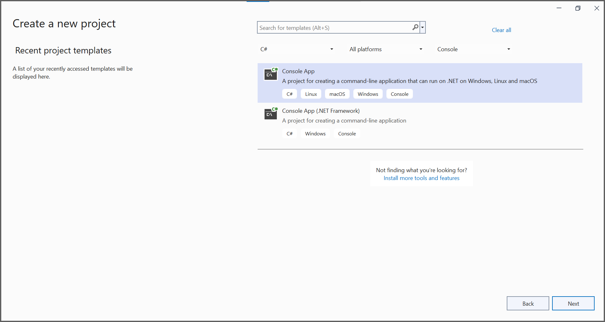
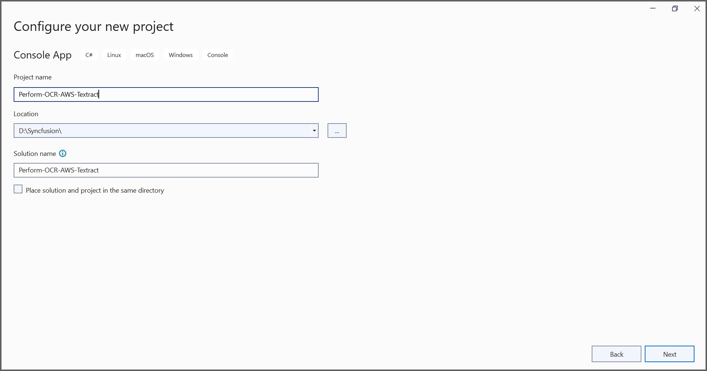
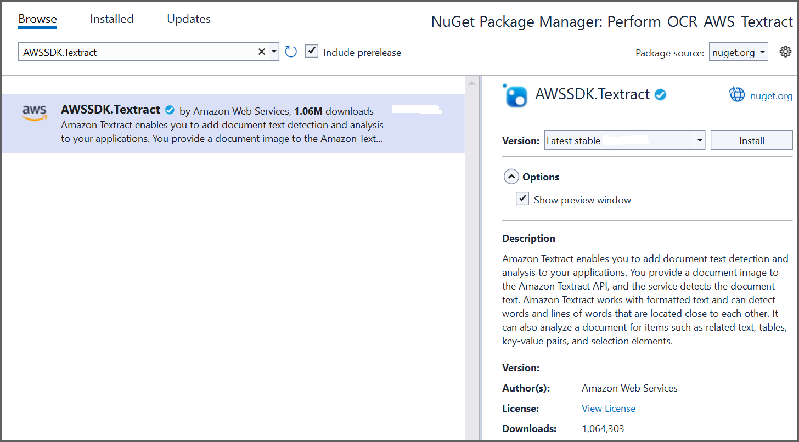

---
title: Perform OCR on PDF and image files in AWS Textract | Syncfusion
description: Learn how to perform OCR on scanned PDF documents and images in AWS Textract using Syncfusion .NET OCR library. 
platform: document-processing
control: PDF
documentation: UG
keywords: Assemblies
--- 

# Perform OCR with AWS Textract

The [.NET OCR library](https://www.syncfusion.com/document-sdk/net-pdf-library/ocr-process) supports external OCR engines such as AWS Textract to process OCR on images and PDF documents.

## Prerequisites

**Version Compatibility**

- Syncfusion.PDF.OCR.Net.Core supports .NET 8.0 and later versions.

**Supported Inputs**

The OCR processor supports the following input formats:

- Single-page and multi-page PDF documents
- Scanned images in common formats (JPEG, PNG, TIFF)
- Recommended DPI: 200 DPI or higher for optimal OCR accuracy

**Required Software**

- .NET 8 SDK or later
- AWS subscription with Textract API access

**Register the License Key**

N> Starting with v16.2.0.x, if you reference Syncfusion® assemblies from trial setup or from the NuGet feed, you must add the Syncfusion.Licensing assembly reference and register a license key in your application. For more information, see the licensing documentation.

Include the following code in the **Program.cs** file to register the license key:



using Syncfusion.Licensing;

// Register Syncfusion license at application startup
SyncfusionLicenseProvider.RegisterLicense("YOUR LICENSE KEY");




N> 1. Beginning from version 21.1.x, the TesseractBinaries and Tesseract language data folders are now included by default; you no longer have to set these paths explicitly.
N> 2. The current NuGet package includes Tesseract 5.0, which provides support for 100+ languages.

## Steps to perform OCR with AWS Textract

Step 1: Create a new .NET Console application project targeting **.NET Framework 4.6.2** or **.NET 8 or later**:

Step 2: In the project configuration window, name your project and select **Next**:

Step 3: Install the [Syncfusion.PDF.OCR.Net.Core](https://www.nuget.org/packages/Syncfusion.PDF.OCR.Net.Core) and [AWSSDK.Textract](https://www.nuget.org/packages/AWSSDK.Textract) NuGet packages into your .NET application from [nuget.org](https://www.nuget.org/):  

Step 4: Include the following namespaces in **Program.cs**:




using Syncfusion.OCRProcessor;
using Syncfusion.Pdf.Parsing;




Step 5: Use the following code sample to perform OCR on a PDF document using the [PerformOCR](https://help.syncfusion.com/cr/document-processing/Syncfusion.OCRProcessor.OCRProcessor.html#Syncfusion_OCRProcessor_OCRProcessor_PerformOCR_Syncfusion_Pdf_Parsing_PdfLoadedDocument_System_String_) method of the [OCRProcessor](https://help.syncfusion.com/cr/document-processing/Syncfusion.OCRProcessor.OCRProcessor.html) class with AWS Textract:




// Initialize the OCR processor
using (OCRProcessor processor = new OCRProcessor())
{
    // Load an existing PDF document
    FileStream stream = new FileStream("Region.pdf", FileMode.Open);
    PdfLoadedDocument lDoc = new PdfLoadedDocument(stream);
    // Set the OCR language
    processor.Settings.Language = Languages.English;
    // Initialize the AWS Textract external OCR engine
    IOcrEngine awsOcrEngine = new AWSExternalOcrEngine();
    processor.ExternalEngine = awsOcrEngine;
    // Perform OCR on the document
    string text = processor.PerformOCR(lDoc);
    // Create file stream for output
    FileStream fileStream = new FileStream("Output.pdf", FileMode.CreateNew);
    // Save the processed document
    lDoc.Save(fileStream);
    // Close the document and dispose streams
    lDoc.Close();
    stream.Dispose();
    fileStream.Dispose();
}




Step 6: Create a new class named **AWSExternalOcrEngine** that implements the **IOcrEngine** interface. Get the image stream from the PerformOCR method and process it with AWS Textract. This will return the **OCRLayoutResult** for the image:

N> Provide valid AWS Access Key ID and Secret Access Key to work with AWS Textract. 




class AWSExternalOcrEngine : IOcrEngine
{
    private string awsAccessKeyId = "AccessKey";
    private string awsSecretAccessKey = "SecretAccessKey";
    private float imageHeight;
    private float imageWidth;
    
    public OCRLayoutResult PerformOCR(Stream stream)
    {
        // Authenticate with AWS Textract API
        AmazonTextractClient clientText = Authenticate();
        // Get OCR results from AWS Textract
        DetectDocumentTextResponse textResponse = GetAWSTextractResult(clientText, stream).Result;         
        // Convert AWS Textract result to OCRLayoutResult format
        OCRLayoutResult oCRLayoutResult = ConvertAWSTextractResultToOcrLayoutResult(textResponse);
        return oCRLayoutResult;
    }

    public AmazonTextractClient Authenticate()
    {
        // Create AWS Textract client with credentials
        AmazonTextractClient client = new AmazonTextractClient(awsAccessKeyId, awsSecretAccessKey, RegionEndpoint.USEast1);
        return client;
    }
    
    public async Task<DetectDocumentTextResponse> GetAWSTextractResult(AmazonTextractClient client, Stream stream)
    {
        stream.Position = 0;
        MemoryStream memoryStream = new MemoryStream();
        // Copy stream to memory stream
        stream.CopyTo(memoryStream);
        // Get image dimensions
        PdfTiffImage bitmap = new PdfTiffImage(memoryStream);
        imageHeight = bitmap.Height;
        imageWidth = bitmap.Width;

        // Call AWS Textract API to detect text
        DetectDocumentTextResponse response = await client.DetectDocumentTextAsync(new DetectDocumentTextRequest
        {
            Document = new Document
            {
                Bytes = memoryStream
            }
        });
        return response;
    }
    
    public OCRLayoutResult ConvertAWSTextractResultToOcrLayoutResult(DetectDocumentTextResponse textResponse)
    {
        OCRLayoutResult layoutResult = new OCRLayoutResult();
        Syncfusion.OCRProcessor.Page ocrPage = new Page();
        Syncfusion.OCRProcessor.Line ocrLine;
        Syncfusion.OCRProcessor.Word ocrWord;
        layoutResult.ImageHeight = imageHeight;
        layoutResult.ImageWidth = imageWidth;
        // Process each block from AWS Textract response
        foreach (var page in textResponse.Blocks)
        {                   
            ocrLine = new Line();
            // Process only WORD blocks
            if (page.BlockType == "WORD")
            {
                ocrWord = new Word();
                ocrWord.Text = page.Text;
                
                // Get bounding box coordinates from AWS Textract
                float left = page.Geometry.BoundingBox.Left;
                float top = page.Geometry.BoundingBox.Top;
                float width = page.Geometry.BoundingBox.Width;
                float height = page.Geometry.BoundingBox.Height;
                // Convert to rectangle bounds
                Rectangle rect = GetBoundingBox(left, top, width, height);
                ocrWord.Rectangle = rect;
                ocrLine.Add(ocrWord);
                ocrPage.Add(ocrLine);
            }               
        }
        layoutResult.Add(ocrPage);
        return layoutResult;
    }
    
    public Rectangle GetBoundingBox(float left, float top, float width, float height)
    {
        // Convert relative coordinates to absolute pixel coordinates
        int x = Convert.ToInt32(left * imageWidth);
        int y = Convert.ToInt32(top * imageHeight);
        int bboxWidth = Convert.ToInt32((width * imageWidth) + x);
        int bboxHeight = Convert.ToInt32((height * imageHeight) + y);
        Rectangle rect = new Rectangle(x, y, bboxWidth, bboxHeight);
        return rect;
    }
}




By executing the program, you will obtain a PDF document with extracted text as follows:

A complete working sample can be downloaded from [GitHub](https://github.com/SyncfusionExamples/OCR-csharp-examples/tree/master/AWS%20Textract).