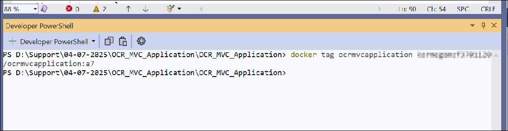
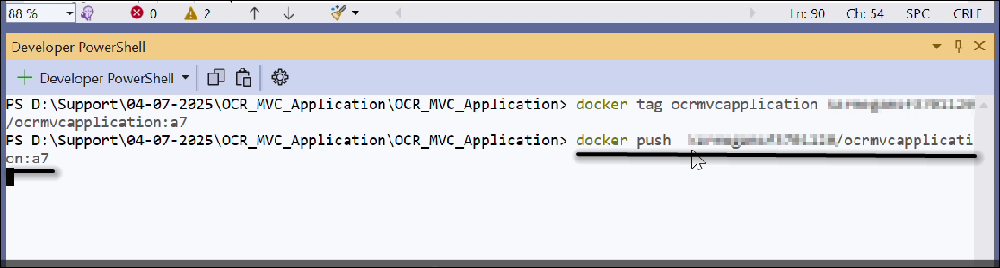
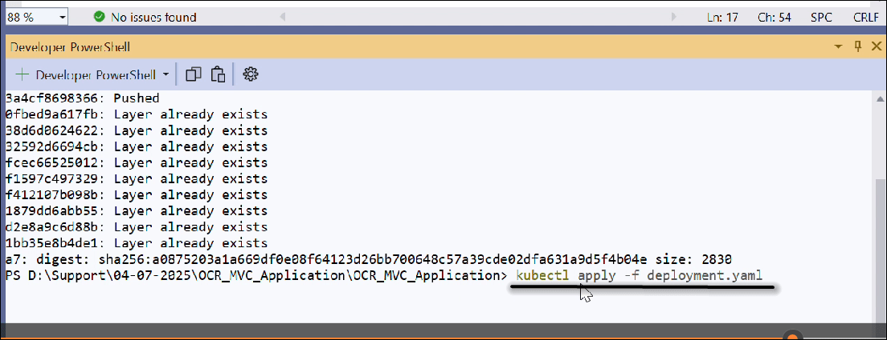
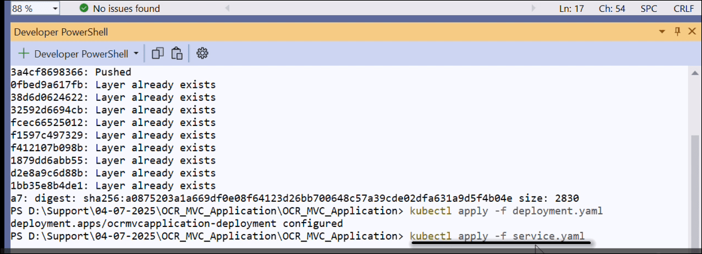
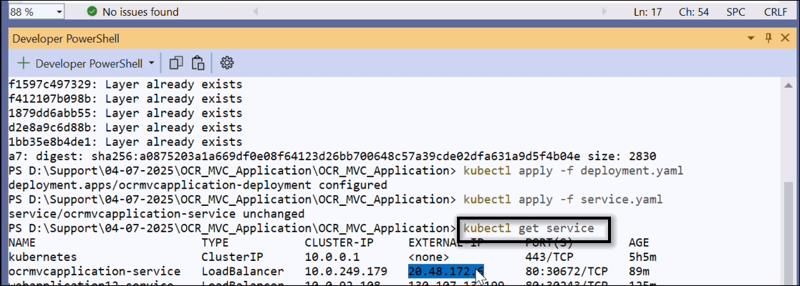
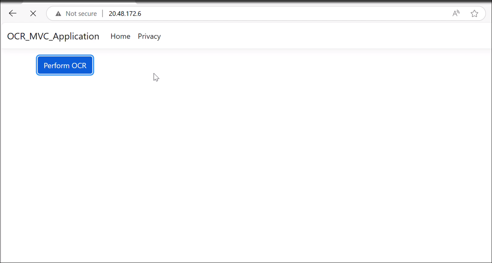

# Perform OCR with Azure Kubernetes Service

The [.NET OCR library](https://www.syncfusion.com/document-sdk/net-pdf-library/ocr-process) can be integrated with external OCR engines like Azure Computer Vision and deployed on Azure Kubernetes Service (AKS) to efficiently process OCR tasks on images and PDF documents at scale.

## Prerequisites

**Version Compatibility**

- Syncfusion.PDF.OCR.Net.Core supports .NET 8.0 and later versions.

**Supported Inputs**

The OCR processor supports the following input formats:

- Single-page and multi-page PDF documents
- Scanned images in common formats (JPEG, PNG, TIFF)
- Recommended DPI: 200 DPI or higher for optimal OCR accuracy

**Required Software**

- .NET 8 SDK or later
- Docker installed on your system
- Azure Kubernetes Service (AKS) cluster access
- kubectl (Kubernetes CLI) installed

**Register the License Key**

N> Starting with v16.2.0.x, if you reference Syncfusion® assemblies from trial setup or from the NuGet feed, you must add the Syncfusion.Licensing assembly reference and register a license key in your application. For more information, see the licensing documentation.

Include the following code in the **Program.cs** file to register the license key:



using Syncfusion.Licensing;

// Register Syncfusion license at application startup
SyncfusionLicenseProvider.RegisterLicense("YOUR LICENSE KEY");




N> 1. Beginning from version 21.1.x, the TesseractBinaries and Tesseract language data folders are now included by default; you no longer have to set these paths explicitly.
N> 2. The current NuGet package includes Tesseract 5.0, which provides support for 100+ languages.

## Steps to perform OCR with Azure Kubernetes Service

Step 1: Create a new ASP.NET Core application project targeting **.NET 8 or later**:

Step 2: In the project configuration window, name your project and select **Next**:

Step 3: Enable Docker support with **Linux** as the target OS:

Step 4: Install the [Syncfusion.PDF.OCR.Net.Core](https://www.nuget.org/packages/Syncfusion.PDF.OCR.Net.Core) NuGet package into your ASP.NET Core application from [nuget.org](https://www.nuget.org/):  

Step 5: Include the following commands in the **Dockerfile** to install the required system packages in the Docker container:




RUN apt-get update && \
apt-get install -yq --no-install-recommends libgdiplus libc6-dev libleptonica-dev libjpeg62 && \
ln -s /usr/lib/x86_64-linux-gnu/libtiff.so.6 /usr/lib/x86_64-linux-gnu/libtiff.so.5 && \
ln -s /lib/x86_64-linux-gnu/libdl.so.2 /usr/lib/x86_64-linux-gnu/libdl.so




Step 6: A default action method named **Index** will be present in **HomeController.cs**. Right-click on the **Index** method and select **Go to View**, which will take you to the associated **Index.cshtml** view page:

Step 7: Add a new button in **Index.cshtml** to trigger the OCR process:




@{Html.BeginForm("PerformOCR", "Home", FormMethod.Get);
    {
        

            <input type="submit" value="Perform OCR on entire PDF" style="width:200px;height:27px" />
        

    }
    Html.EndForm();
}




Step 8: A default controller named **HomeController.cs** is added when you create the ASP.NET Core project. Include the following namespaces in **HomeController.cs**:




using Syncfusion.OCRProcessor;
using Syncfusion.Pdf.Parsing;




Step 9: Add a new action method named **PerformOCR** in **HomeController.cs** to perform OCR on the entire PDF document using the [PerformOCR](https://help.syncfusion.com/cr/document-processing/Syncfusion.OCRProcessor.OCRProcessor.html#Syncfusion_OCRProcessor_OCRProcessor_PerformOCR_Syncfusion_Pdf_Parsing_PdfLoadedDocument_System_String_) method of the [OCRProcessor](https://help.syncfusion.com/cr/document-processing/Syncfusion.OCRProcessor.OCRProcessor.html) class:




public ActionResult PerformOCR()
{
    string docPath = _hostingEnvironment.WebRootPath + "/Data/Input.pdf";
    // Initialize the OCR processor
    using (OCRProcessor processor = new OCRProcessor())
    {
        FileStream fileStream = new FileStream(docPath, FileMode.Open, FileAccess.Read);
        // Load a PDF document
        PdfLoadedDocument lDoc = new PdfLoadedDocument(fileStream);
        // Set OCR language
        processor.Settings.Language = Languages.English;
        // Set Tesseract version (5.0 is bundled with v21.1.x+)
        processor.Settings.TesseractVersion = TesseractVersion.Version5_0;
        // Perform OCR on the document
        processor.PerformOCR(lDoc);
        // Create memory stream
        MemoryStream stream = new MemoryStream();
        // Save the processed document to memory stream
        lDoc.Save(stream);
        lDoc.Close();
        // Reset stream position to ensure the file is not empty
        stream.Position = 0;
        // Download the PDF document in the browser
        FileStreamResult fileStreamResult = new FileStreamResult(stream, "application/pdf");
        fileStreamResult.FileDownloadName = "Sample.pdf";
        return fileStreamResult;
    }
}




## Deploying an Application to Kubernetes

### Overview
This guide provides step-by-step instructions to deploy an application using Docker and Kubernetes. We'll tag a Docker image, push it to a repository, and apply Kubernetes configurations.

### Detailed Explanation of Docker Image Tagging

**Step 1: Tag the Docker image**

Tagging a Docker image is an essential step in Docker container management. It allows you to create an alias for a Docker image, making it easier to identify and manage. Tags are often used to denote different versions or environments (e.g., development, staging, production).

1. Open your terminal and ensure Docker is running on your system.

2. Run the tag command using the following syntax:




docker tag <source-image> <repository>:<tag>




**Step 2: Push the Docker Image**

Pushing uploads your tagged image into a Docker repository, making it accessible for deployment:




docker push <repository>:<tag>




**Step 3: Apply the deployment configuration**

This step creates or updates your application's deployment configuration in your Kubernetes cluster:




kubectl apply -f deployment.yaml




**Step 4: Apply the service configuration**

Creating a service configuration exposes your application to the network, allowing external access:




kubectl apply -f service.yaml




**Step 5: View service details**

Using **kubectl get service** allows you to check the services running in your Kubernetes cluster, ensuring they are correctly configured and accessible. You can copy the external IP and paste it into a browser like Chrome to view your application:




kubectl get service




Now you can use this to browse the web application running on AKS:

Click **Perform OCR on entire PDF** to create a PDF document with OCR text extraction. You will obtain the output PDF document as follows:

You can download a complete working sample from [GitHub](https://github.com/SyncfusionExamples/OCR-csharp-examples/tree/master/Docker).

Click [here](https://www.syncfusion.com/document-sdk/net-pdf-library) to explore the rich set of Syncfusion® PDF library features.