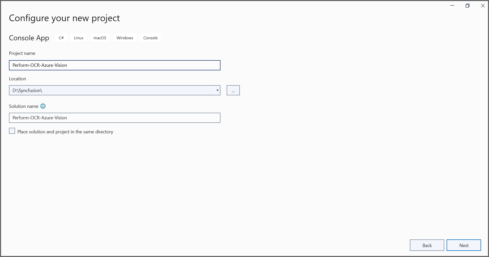
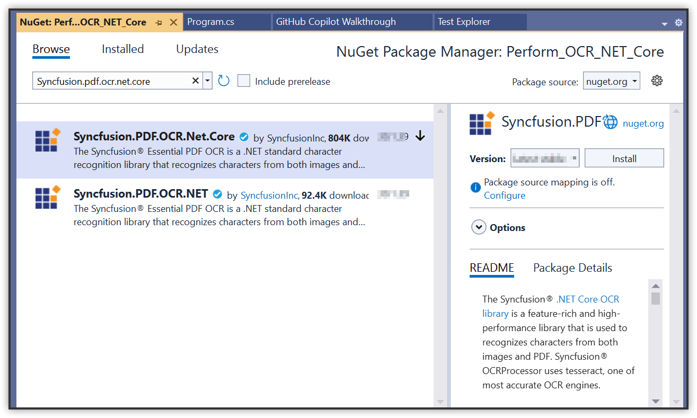
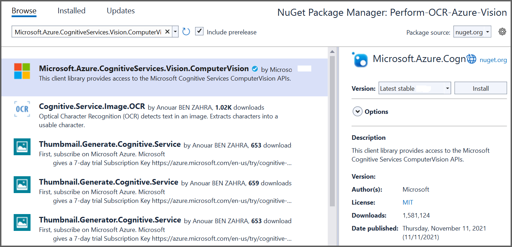
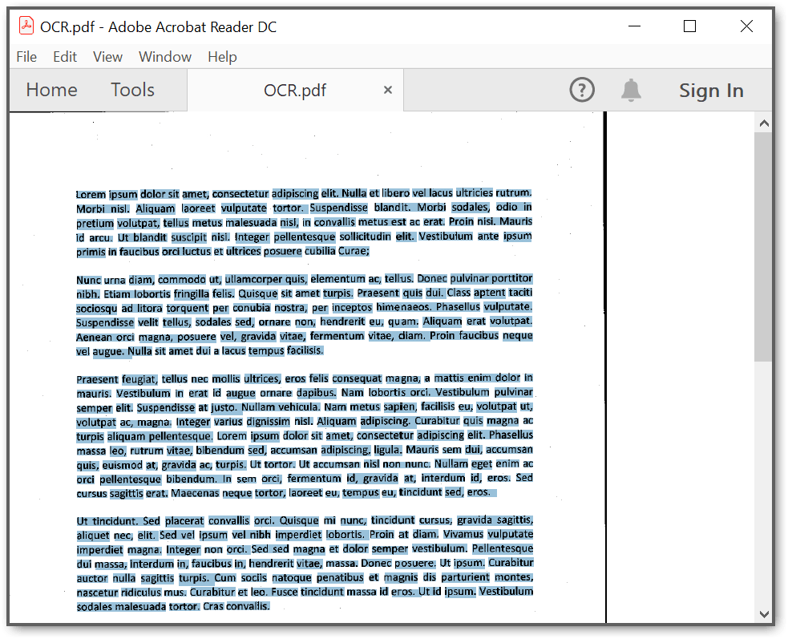

---
title: Perform OCR on PDF and image files in Azure Vision | Syncfusion
description: Learn how to perform OCR on scanned PDF documents and images in Azure Vision using Syncfusion .NET OCR library. 
platform: document-processing
control: PDF
documentation: UG
keywords: Assemblies
--- 

# Perform OCR with Azure Vision

The [.NET OCR library](https://www.syncfusion.com/document-sdk/net-pdf-library/ocr-process) supports external OCR engines such as Azure Computer Vision to process OCR on images and PDF documents.

## Prerequisites

**Version Compatibility**

- Syncfusion.PDF.OCR.Net.Core supports .NET 8.0 and later versions.

**Supported Inputs**

The OCR processor supports the following input formats:

- Single-page and multi-page PDF documents
- Scanned images in common formats (JPEG, PNG, TIFF)
- Recommended DPI: 200 DPI or higher for optimal OCR accuracy

**Required Software**

- .NET 8 SDK or later
- Azure subscription with Computer Vision API access
- Azure subscription key and endpoint

**Register the License Key**

N> Starting with v16.2.0.x, if you reference Syncfusion® assemblies from trial setup or from the NuGet feed, you must add the Syncfusion.Licensing assembly reference and register a license key in your application. For more information, see the licensing documentation.

Include the following code in the **Program.cs** file to register the license key:



using Syncfusion.Licensing;

// Register Syncfusion license at application startup
SyncfusionLicenseProvider.RegisterLicense("YOUR LICENSE KEY");




N> 1. Beginning from version 21.1.x, the TesseractBinaries and Tesseract language data folders are now included by default; you no longer have to set these paths explicitly.
N> 2. The current NuGet package includes Tesseract 5.0, which provides support for 100+ languages.

## Steps to perform OCR with Azure Computer Vision

Step 1: Create a new .NET Console application project targeting **.NET Framework 4.6.2** or **.NET 8 or later**:

Step 2: In the project configuration window, name your project and select **Next**:

Step 3: Install the [Syncfusion.PDF.OCR.Net.Core](https://www.nuget.org/packages/Syncfusion.PDF.OCR.Net.Core) and [Microsoft.Azure.CognitiveServices.Vision.ComputerVision](https://www.nuget.org/packages/Microsoft.Azure.CognitiveServices.Vision.ComputerVision) NuGet packages into your application from [nuget.org](https://www.nuget.org/):  

Step 4: Include the following namespaces in the **Program.cs** file:




using Syncfusion.OCRProcessor;
using Syncfusion.Pdf.Parsing;




Step 5: Use the following code sample to perform OCR on a PDF document using the [PerformOCR](https://help.syncfusion.com/cr/document-processing/Syncfusion.OCRProcessor.OCRProcessor.html#Syncfusion_OCRProcessor_OCRProcessor_PerformOCR_Syncfusion_Pdf_Parsing_PdfLoadedDocument_System_String_) method of the [OCRProcessor](https://help.syncfusion.com/cr/document-processing/Syncfusion.OCRProcessor.OCRProcessor.html) class with Azure Vision:




// Initialize the OCR processor
using (OCRProcessor processor = new OCRProcessor())
{
    // Load an existing PDF document
    FileStream stream = new FileStream("Input.pdf", FileMode.Open);
    PdfLoadedDocument lDoc = new PdfLoadedDocument(stream);
    // Set OCR language
    processor.Settings.Language = Languages.English;
    // Initialize the Azure Vision OCR external engine
    IOcrEngine azureOcrEngine = new AzureExternalOcrEngine();
    processor.ExternalEngine = azureOcrEngine;
    // Perform OCR using Azure Vision
    processor.PerformOCR(lDoc);
    // Create file stream for the output
    FileStream outputStream = new FileStream("OCR.pdf", FileMode.CreateNew);
    // Save the document to the output stream
    lDoc.Save(outputStream);
    // Reset stream position to ensure the file is not empty
    outputStream.Position = 0;
    // Close the document
    lDoc.Close(true);
    outputStream.Close();
}




Step 6: Create a new class named **AzureExternalOcrEngine** to handle the image stream from the PerformOCR method and process it with Azure Computer Vision. It returns the **OCRLayoutResult** for the image:

N> Provide a valid Azure subscription key and endpoint to work with Azure Computer Vision API.




class AzureExternalOcrEngine : IOcrEngine
{
    private string subscriptionKey = "SubscriptionKey";
    private string endpoint = "Endpoint link";
    
    public OCRLayoutResult PerformOCR(Stream imgStream)
    {
        // Authenticate with Azure Computer Vision API
        ComputerVisionClient client = Authenticate();
        // Read the image stream and get OCR results
        ReadResult azureOcrResult = ReadFileUrl(client, imgStream).Result;               
        // Convert Azure OCR result to the OCRLayoutResult format
        OCRLayoutResult result = ConvertAzureVisionOcrToOcrLayoutResult(azureOcrResult);
        return result;
    }

    public ComputerVisionClient Authenticate()
    {
        ComputerVisionClient client = new ComputerVisionClient(new ApiKeyServiceClientCredentials(subscriptionKey))
        {
            Endpoint = endpoint
        };
        return client;
    }

    public async Task<ReadResult> ReadFileUrl(ComputerVisionClient client, Stream stream)
    {
        stream.Position = 0;
        var textHeaders = await client.ReadInStreamAsync(stream);
        string operationLocation = textHeaders.OperationLocation;
        const int numberOfCharsInOperationId = 36;
        string operationId = operationLocation.Substring(operationLocation.Length - numberOfCharsInOperationId);        
        // Extract the text from Azure Vision results
        ReadOperationResult results;
        do
        {
            results = await client.GetReadResultAsync(Guid.Parse(operationId));
        }
        while ((results.Status == OperationStatusCodes.Running || results.Status == OperationStatusCodes.NotStarted));
        ReadResult azureOcrResult = results.AnalyzeResult.ReadResults[0];
        return azureOcrResult;
    }
    
    private OCRLayoutResult ConvertAzureVisionOcrToOcrLayoutResult(ReadResult azureVisionOcr)
    {
        Syncfusion.OCRProcessor.Line ocrLine;
        Syncfusion.OCRProcessor.Word ocrWord;        
        OCRLayoutResult ocrlayoutResult = new OCRLayoutResult();         
        ocrlayoutResult.ImageWidth = (float)azureVisionOcr.Width;
        ocrlayoutResult.ImageHeight = (float)azureVisionOcr.Height;
        // Create page from Azure OCR result
        Syncfusion.OCRProcessor.Page normalPage = new Syncfusion.OCRProcessor.Page();
        // Process lines from Azure OCR result
        foreach (var line in azureVisionOcr.Lines)
        {
            ocrLine = new Syncfusion.OCRProcessor.Line();
            // Process words in each line
            foreach (var word in line.Words)
            {
                ocrWord = new Syncfusion.OCRProcessor.Word();
                Rectangle rect = GetAzureVisionBounds(word.BoundingBox);
                ocrWord.Text = word.Text;
                ocrWord.Rectangle = rect;
                ocrLine.Add(ocrWord);
            }
            normalPage.Add(ocrLine);
        }
        ocrlayoutResult.Add(normalPage);
        return ocrlayoutResult;
    }

    private Rectangle GetAzureVisionBounds(IList<double?> bbox)
    {
        Rectangle rect = Rectangle.Empty;
        PointF[] pointCollection = new PointF[bbox.Count / 2];
        int count = 0;
        // Convert Azure bounding box points to PointF array
        for (int i = 0; i < bbox.Count; i = i + 2)
        {
            pointCollection[count] = new PointF((float)bbox[i], (float)bbox[i + 1]);
            count++;
        }
        float xMin = 0;
        float yMin = 0;
        float xMax = 0;
        float yMax = 0;
        bool first = true;

        foreach (PointF point in pointCollection)
        {
            if (first)
            {
                xMin = point.X;
                yMin = point.Y;
                first = false;
            }
            else
            {
                if (point.X < xMin)
                    xMin = point.X;
                else if (point.X > xMax)
                    xMax = point.X;
                if (point.Y < yMin)
                    yMin = point.Y;
                else if (point.Y > yMax)
                    yMax = point.Y;
            }
        }
        int x = Convert.ToInt32(xMin);
        int y = Convert.ToInt32(yMin);
        int w = Convert.ToInt32(xMax);
        int h = Convert.ToInt32(yMax);
        return new Rectangle(x, y, w, h);
    }
}




By executing the program, you will obtain a PDF document with extracted text as follows:

A complete working sample can be downloaded from [GitHub](https://github.com/SyncfusionExamples/OCR-csharp-examples/tree/master/Azure%20Vision).

Click [here](https://www.syncfusion.com/document-sdk/net-pdf-library) to explore the rich set of Syncfusion® PDF library features.