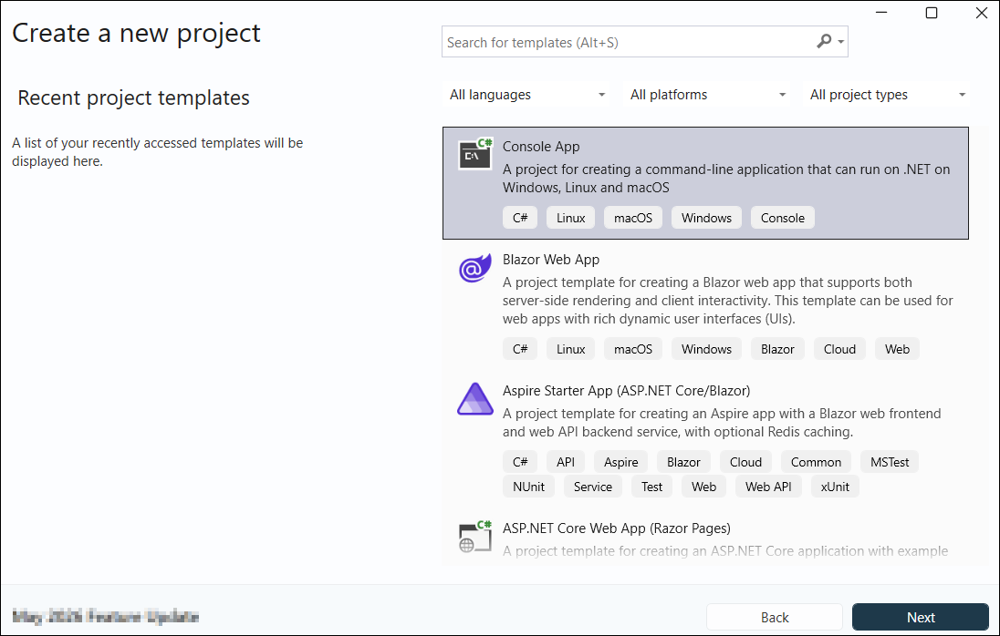
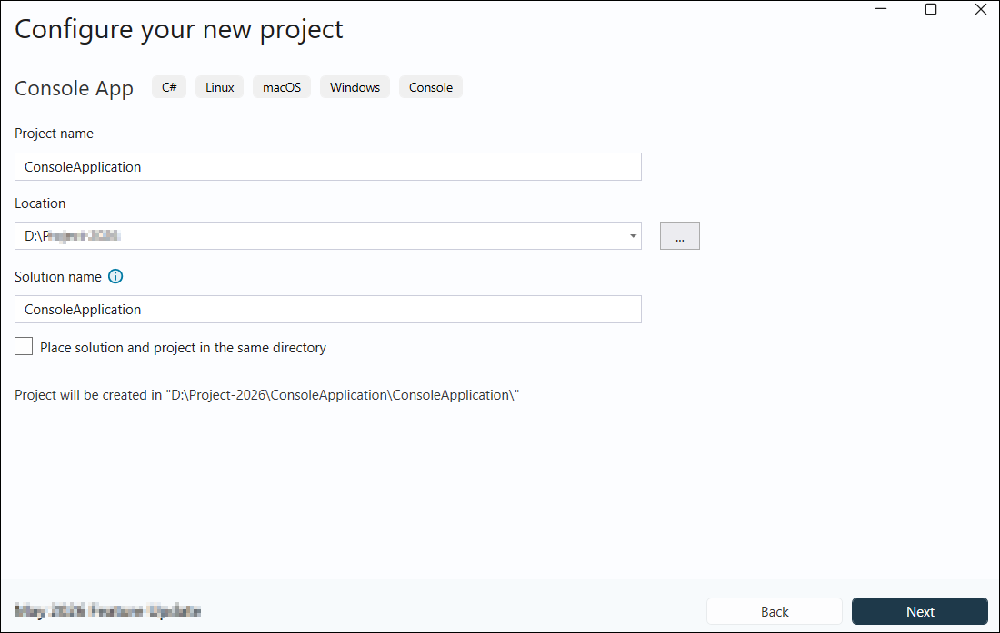
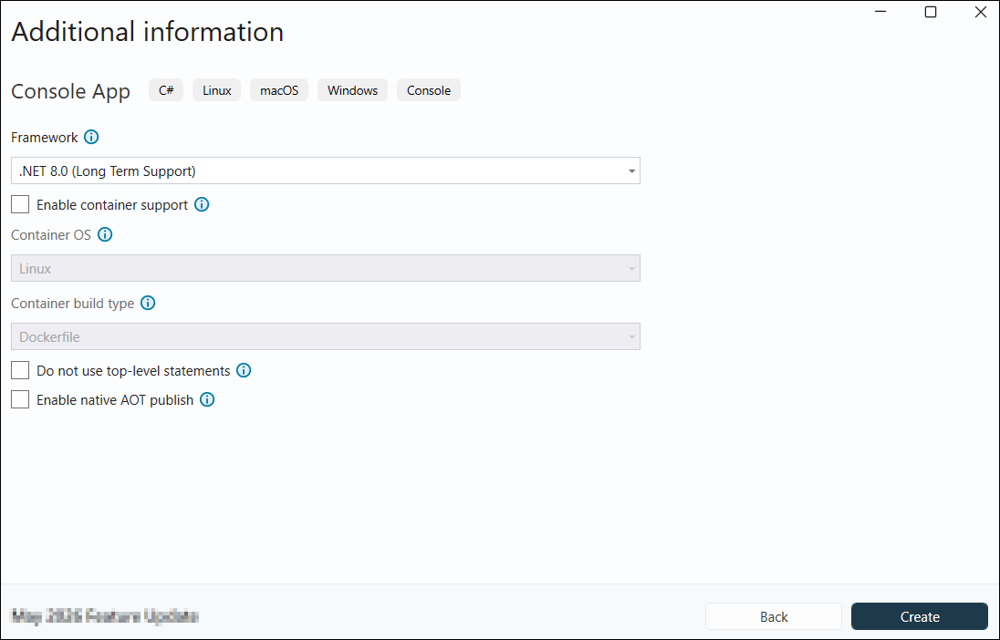

---
title: Perform OCR on PDF and image files in Console | Syncfusion
description: Learn how to perform OCR on scanned PDF documents and images with different tesseract versions in a Console App by using the Syncfusion PDF library efficiently
platform: document-processing
control: PDF
documentation: UG
--- 

# Perform OCR in Console Application

The [.NET OCR library](https://www.syncfusion.com/document-sdk/net-pdf-library/ocr-process) is used to extract text from scanned PDFs and images in console applications with the help of Google's [Tesseract](https://github.com/tesseract-ocr/tesseract) Optical Character Recognition engine.

## Prerequisites

**Version Compatibility**

- Syncfusion.PDF.OCR.Net.Core supports .NET 8.0 and later versions.

**Supported Inputs**

The OCR processor supports the following input formats:

- Single-page and multi-page PDF documents
- Scanned images in common formats (JPEG, PNG, TIFF)
- Recommended DPI: 200 DPI or higher for optimal OCR accuracy

**Required Software**

- .NET 8 SDK or later
- Visual Studio, Visual Studio Code, or JetBrains Rider

**Register the License Key**

N> Starting with v16.2.0.x, if you reference Syncfusion® assemblies from trial setup or from the NuGet feed, you must add the Syncfusion.Licensing assembly reference and register a license key in your application. For more information, see the licensing documentation.

Include the following code in the **Program.cs** file to register the license key:



using Syncfusion.Licensing;

// Register Syncfusion license at application startup
SyncfusionLicenseProvider.RegisterLicense("YOUR LICENSE KEY");




N> 1. Beginning from version 21.1.x, the TesseractBinaries and Tesseract language data folders are now included by default; you no longer have to set these paths explicitly.
N> 2. The current NuGet package includes Tesseract 5.0, which provides support for 100+ languages.

## Steps to perform OCR on an entire PDF document in Console application





Step 1: Create a new .NET console application project targeting **.NET 8.0**.


Step 2: In the project configuration window, name your project and select **Next**, then select the target framework (.NET 6 or later) and click **Create**.



Step 3: Install the [Syncfusion.PDF.OCR.Net.Core](https://www.nuget.org/packages/Syncfusion.PDF.OCR.Net.Core) NuGet package into your console application from [NuGet.org](https://www.nuget.org/).   


N> 1. Beginning from version 21.1.x, the TesseractBinaries and Tesseract language data folders are now included by default; you no longer have to set these paths explicitly.
N> 2. The current NuGet package includes Tesseract 5.0, which provides support for 100+ languages.

Step 4: Include the following namespaces in **Program.cs**:




using Syncfusion.OCRProcessor;
using Syncfusion.Pdf.Parsing;




Step 5: Include the following code sample in **Program.cs** using the [PerformOCR](https://help.syncfusion.com/cr/document-processing/Syncfusion.OCRProcessor.OCRProcessor.html#Syncfusion_OCRProcessor_OCRProcessor_PerformOCR_Syncfusion_Pdf_Parsing_PdfLoadedDocument_System_String_) method of the [OCRProcessor](https://help.syncfusion.com/cr/document-processing/Syncfusion.OCRProcessor.OCRProcessor.html) class:




// Initialize the OCR processor
using (OCRProcessor processor = new OCRProcessor())
{
    // Load an existing PDF document
    PdfLoadedDocument document = new PdfLoadedDocument(Path.GetFullPath(@"Data/Input.pdf"));
    // Set the Tesseract version
    processor.Settings.TesseractVersion = TesseractVersion.Version5_0;
    // Set OCR language
    processor.Settings.Language = Languages.English;
    // Perform OCR on the document
    processor.PerformOCR(document);
    // Save the processed PDF to disk
    document.Save(Path.GetFullPath(@"Output/Output.pdf"));
    // Close the document
    document.Close(true);
}




Step 6: Build the project.

Click the **Build** button in the toolbar or press <kbd>Ctrl</kbd>+<kbd>Shift</kbd>+<kbd>B</kbd> to build the project.

Step 7: Run the project.

Click the **Run** button (green arrow) in the toolbar or press <kbd>F5</kbd> to run the application.





Step 1: Open the terminal (<kbd>Ctrl</kbd>+<kbd>`</kbd>) and run the following command to create a new console application project targeting **.NET 8 or later**:

```
dotnet new console -n ConsoleApplication --framework net8.0
```

Step 2: Replace **ConsoleApplication** with your desired project name.

Step 3: Navigate to the project directory:

```
cd ConsoleApplication
```

Step 4: Use the following command in the terminal to add the [Syncfusion.PDF.OCR.Net.Core](https://www.nuget.org/packages/Syncfusion.PDF.OCR.Net.Core) package:

```
dotnet add package Syncfusion.PDF.OCR.Net.Core
```

Step 5: Include the following namespaces in **Program.cs**:




using Syncfusion.OCRProcessor;
using Syncfusion.Pdf.Parsing;




Step 6: Include the following code sample in **Program.cs** using the [PerformOCR](https://help.syncfusion.com/cr/document-processing/Syncfusion.OCRProcessor.OCRProcessor.html#Syncfusion_OCRProcessor_OCRProcessor_PerformOCR_Syncfusion_Pdf_Parsing_PdfLoadedDocument_System_String_) method of the [OCRProcessor](https://help.syncfusion.com/cr/document-processing/Syncfusion.OCRProcessor.OCRProcessor.html) class:




// Initialize the OCR processor
using (OCRProcessor processor = new OCRProcessor())
{
    // Load an existing PDF document
    PdfLoadedDocument document = new PdfLoadedDocument(Path.GetFullPath(@"Data/Input.pdf"));
    // Set the Tesseract version
    processor.Settings.TesseractVersion = TesseractVersion.Version5_0;
    // Set OCR language
    processor.Settings.Language = Languages.English;
    // Perform OCR on the document
    processor.PerformOCR(document);
    // Save the processed PDF to disk
    document.Save(Path.GetFullPath(@"Output/Output.pdf"));
    // Close the document
    document.Close(true);
}




Step 7: Build the project.

Run the following command in terminal to build the project:

```
dotnet build
```

Step 8: Run the project.

Run the following command in terminal to run the application:

```
dotnet run
```





Step 1: Open JetBrains Rider and create a new .NET console application project:
- Launch JetBrains Rider
- Click **New Solution** on the welcome screen


- In the new Solution dialog, select **Console** as the Project Type
- Enter a project name and specify the location
- Select the target framework(e.g., .NET 8.0, .NET 9.0 and .NET 10).
- Click **Create**


Step 2: Install the NuGet package from [NuGet.org](https://www.nuget.org/):
- Click the **NuGet** icon in the Rider toolbar and search for [Syncfusion.PDF.OCR.Net.Core](https://www.nuget.org/packages/Syncfusion.PDF.OCR.Net.Core)
- Ensure **NuGet.org** is selected as the package source
- Select the latest Syncfusion.PDF.OCR.Net.Core package from the list
- Click the **+** (Add) button to add the package


Step 3: Include the following namespaces in **Program.cs**:




using Syncfusion.OCRProcessor;
using Syncfusion.Pdf.Parsing;




Step 4: Include the following code sample in **Program.cs** using the [PerformOCR](https://help.syncfusion.com/cr/document-processing/Syncfusion.OCRProcessor.OCRProcessor.html#Syncfusion_OCRProcessor_OCRProcessor_PerformOCR_Syncfusion_Pdf_Parsing_PdfLoadedDocument_System_String_) method of the [OCRProcessor](https://help.syncfusion.com/cr/document-processing/Syncfusion.OCRProcessor.OCRProcessor.html) class:




// Initialize the OCR processor
using (OCRProcessor processor = new OCRProcessor())
{
    // Load an existing PDF document
    PdfLoadedDocument document = new PdfLoadedDocument(Path.GetFullPath(@"Data/Input.pdf"));
    // Set the Tesseract version
    processor.Settings.TesseractVersion = TesseractVersion.Version5_0;
    // Set OCR language
    processor.Settings.Language = Languages.English;
    // Perform OCR on the document
    processor.PerformOCR(document);
    // Save the processed PDF to disk
    document.Save(Path.GetFullPath(@"Output/Output.pdf"));
    // Close the document
    document.Close(true);
}




Step 5: Build the project.

Click the **Build** button in the toolbar or press <kbd>Ctrl</kbd>+<kbd>Shift</kbd>+<kbd>B</kbd> to build the project.

Step 6: Run the project.

Click the **Run** button (green arrow) in the toolbar or press <kbd>F5</kbd> to run the application.





By executing the program, you will get a PDF document with extracted text as shown below:

    
A complete working sample can be downloaded from [GitHub](https://github.com/SyncfusionExamples/OCR-csharp-examples/tree/master/Console).

Click [here](https://www.syncfusion.com/document-sdk/net-pdf-library) to explore the rich set of Syncfusion<sup>&reg;</sup> PDF library features.