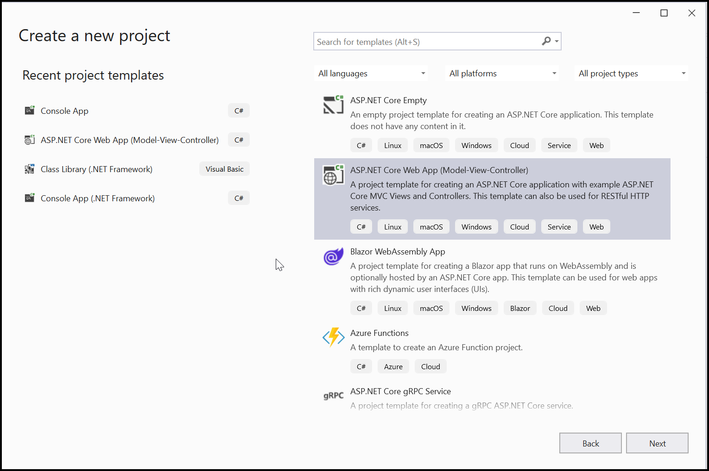
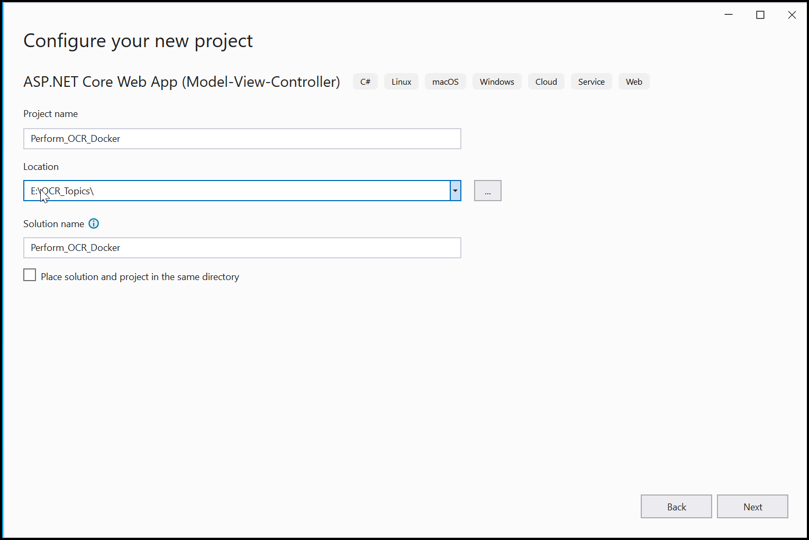
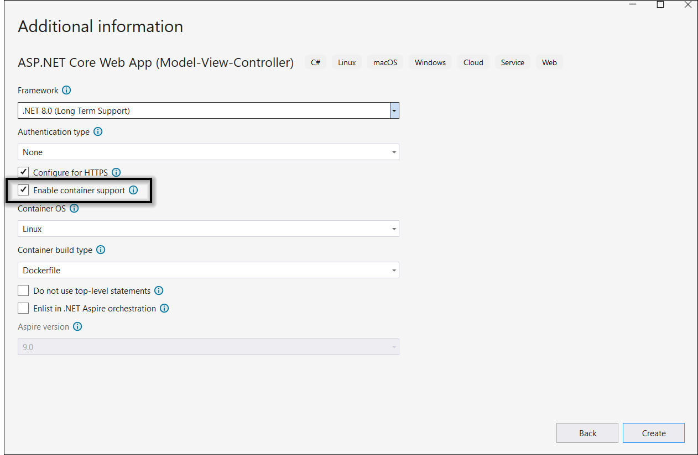
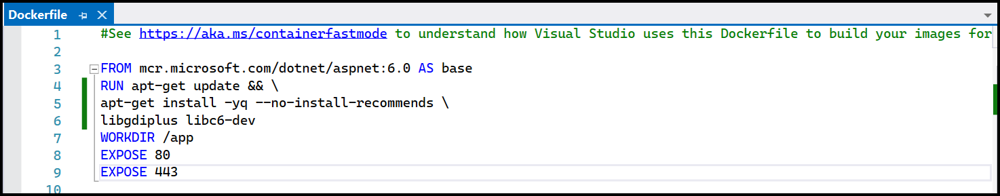
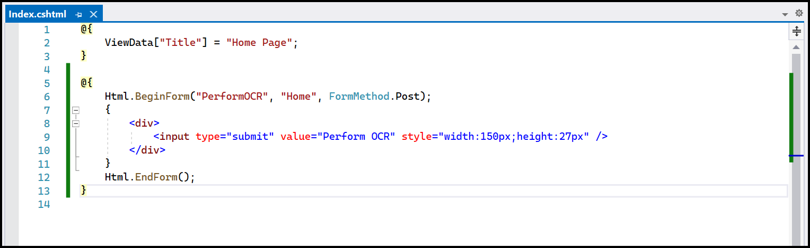

# Perform OCR in Docker

The [.NET OCR library](https://www.syncfusion.com/document-sdk/net-pdf-library/ocr-process) is used to extract text from scanned PDFs and images in Docker applications with the help of Google's [Tesseract](https://github.com/tesseract-ocr/tesseract) Optical Character Recognition engine.

## Prerequisites

**Version Compatibility**

- Syncfusion.PDF.OCR.Net.Core supports .NET 8.0 and later versions.

**Supported Inputs**

The OCR processor supports the following input formats:

- Single-page and multi-page PDF documents
- Scanned images in common formats (JPEG, PNG, TIFF)
- Recommended DPI: 200 DPI or higher for optimal OCR accuracy

**Required Software**

- .NET 8 SDK or later
- Docker installed and running
- Linux container image (typically Ubuntu)

**Register the License Key**

N> Starting with v16.2.0.x, if you reference Syncfusion® assemblies from trial setup or from the NuGet feed, you must add the Syncfusion.Licensing assembly reference and register a license key in your application. For more information, see the licensing documentation.

Include the following code in the **Program.cs** file to register the license key:



using Syncfusion.Licensing;

// Register Syncfusion license at application startup
SyncfusionLicenseProvider.RegisterLicense("YOUR LICENSE KEY");




N> 1. Beginning from version 21.1.x, the TesseractBinaries and Tesseract language data folders are now included by default; you no longer have to set these paths explicitly.
N> 2. The current NuGet package includes Tesseract 5.0, which provides support for 100+ languages.

## Steps to perform OCR on entire PDF document in Docker
Step 1: Create a new ASP.NET Core application project targeting **.NET 8.0 or later**.

Step 2: In the project configuration window, name your project and select **Next**.

Step 3: Enable Docker support with **Linux** as the target OS.

Step 4: Install the [Syncfusion.PDF.OCR.Net.Core](https://www.nuget.org/packages/Syncfusion.PDF.OCR.Net.Core) NuGet package into your .NET applications from [NuGet.org](https://www.nuget.org/).   

Step 5: Include the following commands in the **Dockerfile** to install the required system packages:




RUN apt-get update && \
apt-get install -yq --no-install-recommends \
libgdiplus libc6-dev libleptonica-dev libjpeg62
RUN ln -s /usr/lib/x86_64-linux-gnu/libtiff.so.6 /usr/lib/x86_64-linux-gnu/libtiff.so.5
RUN ln -s /lib/x86_64-linux-gnu/libdl.so.2 /usr/lib/x86_64-linux-gnu/libdl.so




 

Step 6: A default action method named **Index** is present in **HomeController.cs**. Right-click on the **Index** method and select **Go to View** to navigate to its associated view page **Index.cshtml**.

Step 7: Add a new button in **Index.cshtml** as follows:




@{Html.BeginForm("PerformOCR", "Home", FormMethod.Get);
    {
        

            <input type="submit" value="Perform OCR on entire PDF" style="width:200px;height:27px" />
        

    }
    Html.EndForm();
}




 

Step 8: A default controller named **HomeController.cs** is added when you create an ASP.NET Core project. Include the following namespaces in **HomeController.cs**:




using Syncfusion.OCRProcessor;
using Syncfusion.Pdf.Parsing;




Step 9: Add a new action method **PerformOCR** in **HomeController.cs** to perform OCR on the entire PDF document using the [PerformOCR](https://help.syncfusion.com/cr/document-processing/Syncfusion.OCRProcessor.OCRProcessor.html#Syncfusion_OCRProcessor_OCRProcessor_PerformOCR_Syncfusion_Pdf_Parsing_PdfLoadedDocument_System_String_) method of the [OCRProcessor](https://help.syncfusion.com/cr/document-processing/Syncfusion.OCRProcessor.OCRProcessor.html) class:




public ActionResult PerformOCR()
{
    string docPath = _hostingEnvironment.WebRootPath + "/Data/Input.pdf";
    // Initialize the OCR processor
    using (OCRProcessor processor = new OCRProcessor())
    {
        FileStream fileStream = new FileStream(docPath, FileMode.Open, FileAccess.Read);
        // Load a PDF document
        PdfLoadedDocument lDoc = new PdfLoadedDocument(fileStream);
        // Set the OCR language
        processor.Settings.Language = Languages.English;
        // Set Tesseract version
        processor.Settings.TesseractVersion = TesseractVersion.Version5_0;
        // Process OCR on the PDF document
        processor.PerformOCR(lDoc);
        // Create memory stream and save the processed document
        MemoryStream stream = new MemoryStream();
        lDoc.Save(stream);
        lDoc.Close();
        // Set the position to 0 and return as file download
        stream.Position = 0;
        FileStreamResult fileStreamResult = new FileStreamResult(stream, "application/pdf");
        fileStreamResult.FileDownloadName = "Output.pdf";
        return fileStreamResult;
    }
}




Step 10: Build and run the application in Docker. It will pull the Linux Docker image and run the project. The webpage will open in your browser. Click the button to perform OCR on the PDF document.

By executing the program, you will get a PDF document with extracted text as shown below:

 

A complete working sample for performing OCR in a Docker container can be downloaded from [GitHub](https://github.com/SyncfusionExamples/OCR-csharp-examples/tree/master/Docker).

Click [here](https://www.syncfusion.com/document-sdk/net-pdf-library) to explore the rich set of Syncfusion&reg; PDF library features.