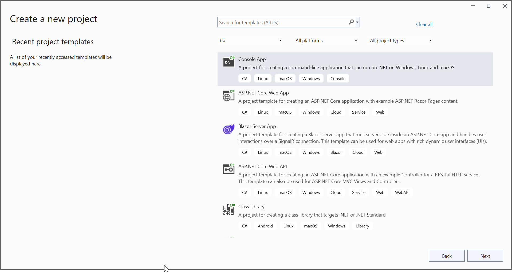
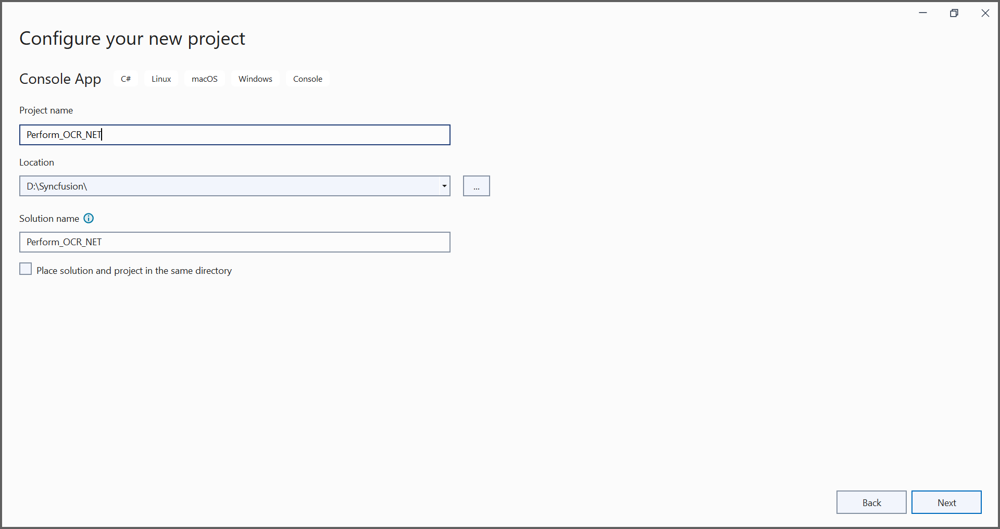

# Getting started with OCR processor

To quickly get started with extracting text from scanned PDF documents in .NET using the .NET OCR processor library, refer to this video tutorial:


## Prerequisites

The Syncfusion&reg; OCR processor internally uses Tesseract libraries to perform OCR, so please copy the necessary Tessdata and TesseractBinaries folders from the NuGet package folder to the project folder to use the OCR feature.

### Prerequisites for Windows

Please refer to the following code sample for windows.




OCRProcessor processor = new OCRProcessor();







processor.PerformOCR(lDoc);




Download the language packages from the following link.
[https://github.com/tesseract-ocr/tessdata](https://github.com/tesseract-ocr/tessdata)

N> From 16.1.0.24 OCR is not a part of Essential Studio&reg; and is available as a separate package (OCR Processor) under the Add-On section in the following link.
[https://www.syncfusion.com/downloads/latest-version](https://www.syncfusion.com/downloads/latest-version)

### Prerequisites for Linux 

Install the "libgdiplus" and "libc6-dev" packages. Please refer to the following commands to install the packages.




sudo apt-get update
sudo apt-get install libgdiplus
sudo apt-get install libc6-dev




Please refer to the following code snippet for Linux.




OCRProcessor processor = new OCRProcessor();







processor.PerformOCR(lDoc);




Download the language packages from the following link.    
[https://github.com/tesseract-ocr/tessdata](https://github.com/tesseract-ocr/tessdata)

### Prerequisites for Mac

Install the "libgdiplus" and "tesseract" packages in the Mac machine where the OCR operations occur. Please refer to the following commands to install this package.




brew install mono-libgdiplus
brew install tesseract



Please refer to the following code sample for Mac.




OCRProcessor processor = new OCRProcessor();







processor.PerformOCR(lDoc);




### Perform OCR using C# 

Integrating the OCR processor library in any .NET application is simple. Please refer to the following steps to perform OCR in your .NET application. 

#### Steps to perform OCR on a entire PDF document in .NET application 

Step 1: Create a new .NET console application. 

In project configuration window, name your project and select Next.

Step 2:  Install the [Syncfusion.PDF.OCR.Net.Core](https://www.nuget.org/packages/Syncfusion.PDF.OCR.Net.Core) NuGet package as a reference to your .NET Standard applications from [NuGet.org](https://www.nuget.org/).   

Step 3:Please use the OCR language data for other languages using the following link.

[Tesseract language data](https://github.com/tesseract-ocr/tessdata)

Step 4: Include the following namespace in your class file. 




using Syncfusion.OCRProcessor;
using Syncfusion.Pdf.Parsing;




Step 5: Use the following code sample to perform OCR on the entire PDF document using PerformOCR method of the [OCRProcessor](https://help.syncfusion.com/cr/document-processing/Syncfusion.OCRProcessor.OCRProcessor.html) class in Program.cs file. 




//Initialize the OCR processor.
using (OCRProcessor processor = new OCRProcessor())
{
    //Load an existing PDF document.
    PdfLoadedDocument pdfLoadedDocument = new PdfLoadedDocument("Input.pdf");
    //Set OCR language to process.
    processor.Settings.Language = Languages.English;
    //Process OCR by providing the PDF document.
    processor.PerformOCR(pdfLoadedDocument);
    //Save the PDF document
    pdfLoadedDocument.Save("Output.pdf");
    //Close the document.
    pdfLoadedDocument.Close(true);
}




By executing the program, you will get the PDF document as follows.

A complete working sample can be downloaded from [GitHub](https://github.com/SyncfusionExamples/OCR-csharp-examples/tree/master/.NET).

### Perform OCR in Linux 

The .NET OCR library supports performing OCR in Linux. Refer to [this](https://help.syncfusion.com/document-processing/data-extraction/ocr/net/linux) section for more information about performing OCR on an entire PDF document in Linux.  

### Perform OCR in Docker 

The .NET OCR library supports performing OCR in Docker. Refer to [this](https://help.syncfusion.com/document-processing/data-extraction/ocr/net/docker) section for more information about performing OCR on an entire PDF document in Docker.  

### Perform OCR in Mac

The .NET OCR library supports performing OCR on Mac. Refer to [this](https://help.syncfusion.com/document-processing/data-extraction/ocr/net/mac) section for more information about performing OCR on an entire PDF document on Mac.

### Perform OCR in ASP.NET Core 

The .NET OCR library supports performing OCR in ASP.NET Core. Refer to [this](https://help.syncfusion.com/document-processing/data-extraction/ocr/net/net-core) section for more information about performing OCR on an entire PDF document in ASP.NET Core.  

### Perform OCR in ASP.NET MVC

The .NET OCR library supports performing OCR in ASP.NET MVC. Refer to [this](https://help.syncfusion.com/document-processing/data-extraction/ocr/net/aspnet-mvc) section for more information about performing OCR on an entire PDF document in ASP.NET MVC. 

### Perform OCR in Blazor

The .NET OCR library supports performing OCR in Blazor. Refer to [this](https://help.syncfusion.com/document-processing/data-extraction/ocr/net/blazor) section for more information about performing OCR on an entire PDF document in Blazor.  

### Perform OCR in Azure

The .NET OCR library supports performing OCR in Azure. Refer to [this](https://help.syncfusion.com/document-processing/data-extraction/ocr/net/azure) section for more information about performing OCR on an entire PDF document in Azure.  

### Perform OCR in Azure Vision

The .NET OCR library supports performing OCR with Azure Vision (external engine). Refer to [this](https://help.syncfusion.com/document-processing/data-extraction/ocr/net/azure-vision) section for more information about performing OCR on an entire PDF document.

## Perform OCR in Azure Kubernetes Service

The .NET OCR library supports performing OCR with Azure Kubernetes Service. Refer to [this](https://help.syncfusion.com/document-processing/data-extraction/ocr/net/azure-kubernetes-service) section for more information about performing OCR on an entire PDF document.

### Perform OCR in AWS Textract

The .NET OCR library supports performing OCR with AWS Textract. Refer to [this](https://help.syncfusion.com/document-processing/data-extraction/ocr/net/aws-textract) section for more information about performing OCR on an entire PDF document in AWS.  

## Features 

Refer to [this](https://help.syncfusion.com/document-processing/data-extraction/ocr/net/features) section for more information about features in PDF OCR. Get the details, code examples and demo from this section. 

## Troubleshooting 

Refer to [this](https://help.syncfusion.com/document-processing/data-extraction/ocr/net/troubleshooting) section for troubleshooting PDF OCR failures. 