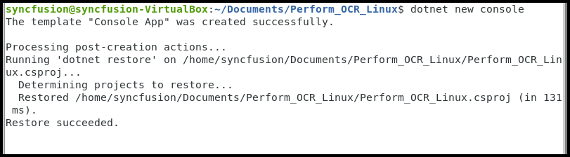
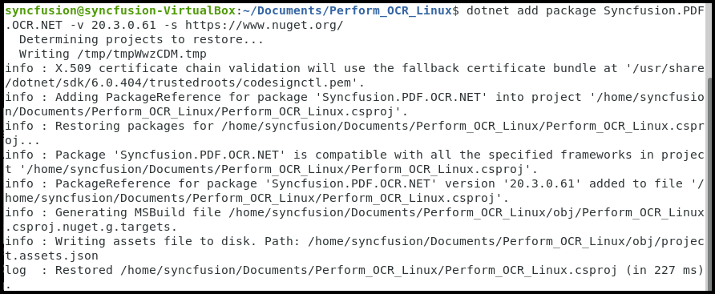
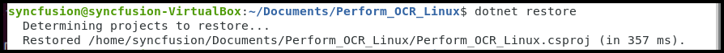

# Perform OCR in Linux

The [.NET OCR library](https://www.syncfusion.com/document-sdk/net-pdf-library/ocr-process) is used to extract text from scanned PDFs and images in .NET console applications on Linux with the help of Google's [Tesseract](https://github.com/tesseract-ocr/tesseract) Optical Character Recognition engine.

## Prerequisites

**Version Compatibility**

- Syncfusion.PDF.OCR.Net.Core supports .NET 8.0 and later versions.

**Supported Inputs**

The OCR processor supports the following input formats:

- Single-page and multi-page PDF documents
- Scanned images in common formats (JPEG, PNG, TIFF)
- Recommended DPI: 200 DPI or higher for optimal OCR accuracy

**Required Software**

- .NET 8.0 or later version
- Linux x86_64 architecture

**Register the License Key**

N> Starting with v16.2.0.x, if you reference Syncfusion® assemblies from trial setup or from the NuGet feed, you must add the Syncfusion.Licensing assembly reference and register a license key in your application. For more information, see the licensing documentation.

Include the following code in the **Program.cs** file to register the license key:



using Syncfusion.Licensing;

// Register Syncfusion license at application startup
SyncfusionLicenseProvider.RegisterLicense("YOUR LICENSE KEY");




N> 1. Beginning from version 21.1.x, the TesseractBinaries and Tesseract language data folders are now included by default; you no longer have to set these paths explicitly.
N> 2. The current NuGet package includes Tesseract 5.0, which provides support for 100+ languages.

**Linux Dependencies**

The following Linux system dependencies should be installed where the OCR processing takes place: 




sudo apt-get update
sudo apt-get install libgdiplus
sudo apt-get install libc6-dev
sudo apt-get install libleptonica-dev libjpeg62
ln -s /usr/lib/x86_64-linux-gnu/libtiff.so.6 /usr/lib/x86_64-linux-gnu/libtiff.so.5
ln -s /lib/x86_64-linux-gnu/libdl.so.2 /usr/lib/x86_64-linux-gnu/libdl.so




## Steps to perform OCR on an entire PDF document on Linux

Step 1: Execute the following command in the Linux terminal to create a new .NET Core Console application:




dotnet new console




Step 2: Install the [Syncfusion.PDF.OCR.Net.Core](https://www.nuget.org/packages/Syncfusion.PDF.OCR.Net.Core) NuGet package into your .NET Core application from [NuGet.org](https://www.nuget.org/):




dotnet add package Syncfusion.PDF.OCR.Net.Core




Step 3: Include the following namespaces in **Program.cs** file.




using Syncfusion.OCRProcessor;
using Syncfusion.Pdf;
using Syncfusion.Pdf.Parsing;




Step 4: Add the following code sample to perform OCR on an entire PDF document using the [PerformOCR](https://help.syncfusion.com/cr/document-processing/Syncfusion.OCRProcessor.OCRProcessor.html#Syncfusion_OCRProcessor_OCRProcessor_PerformOCR_Syncfusion_Pdf_Parsing_PdfLoadedDocument_System_String_) method of the [OCRProcessor](https://help.syncfusion.com/cr/document-processing/Syncfusion.OCRProcessor.OCRProcessor.html) class.



 
string docPath = "Input.pdf";

//Initialize the OCR processor
using (OCRProcessor processor = new OCRProcessor())
{
    //Load the PDF document 
    FileStream stream = new FileStream(docPath, FileMode.Open, FileAccess.Read);
    PdfLoadedDocument lDoc = new PdfLoadedDocument(stream);
    //Set the Tesseract version.
    processor.Settings.TesseractVersion = TesseractVersion.Version5_0;
    //Set OCR language to process.
    processor.Settings.Language = Languages.English;
    //Process OCR by providing the PDF document.
    processor.PerformOCR(lDoc);
    //Save the OCR processed PDF document to disk.
    lDoc.Save("Output.pdf");
    lDoc.Close(true);
    stream.Dispose();
    Console.WriteLine("OCR processing completed successfully!");
}




Step 5: Execute the following command to build the application:




dotnet build




Step 6: Execute the following command in the terminal to run the application:




dotnet run




By executing the program, you will get a PDF document with extracted text. The output will be saved in the same directory as the executable:

A complete working sample can be downloaded from [Github](https://github.com/SyncfusionExamples/OCR-csharp-examples/tree/master/Linux).