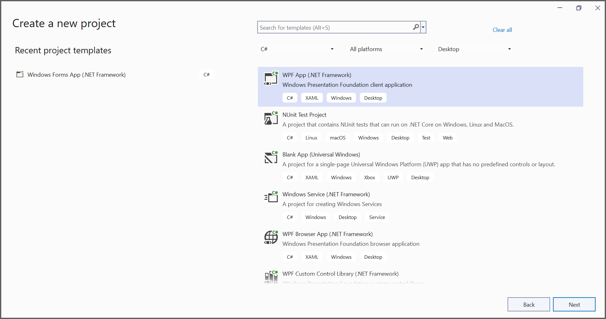
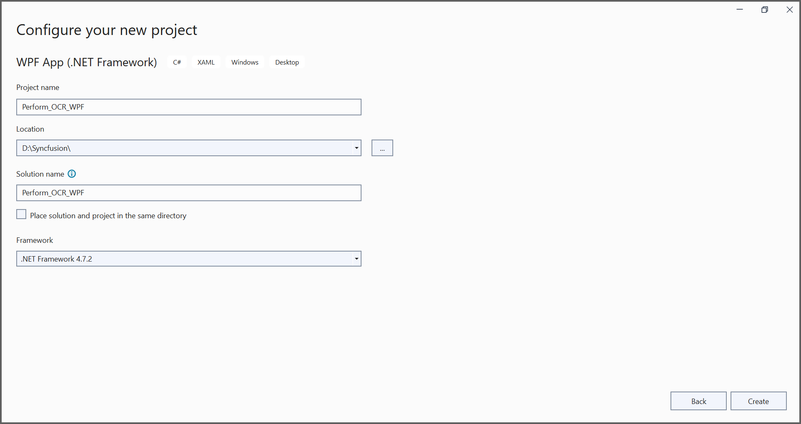
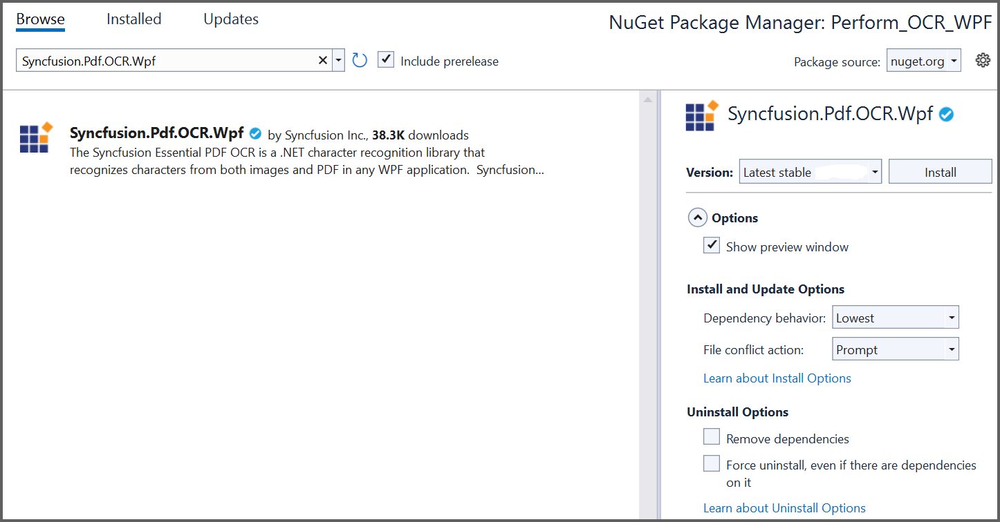

---
title: Perform OCR on PDF and image files in WPF | Syncfusion
description: Learn how to perform OCR on scanned PDF documents and images in WPF with different tesseract version using Syncfusion .NET OCR library. 
platform: document-processing
control: PDF
documentation: UG
keywords: Assemblies
--- 

# Perform OCR in WPF (Windows Presentation Foundation)

The [.NET OCR library](https://www.syncfusion.com/document-sdk/net-pdf-library/ocr-process) is used to extract text from scanned PDFs and images in WPF applications with the help of Google's [Tesseract](https://github.com/tesseract-ocr/tesseract) Optical Character Recognition engine.

## Prerequisites

**Version Compatibility**

- Syncfusion.Pdf.OCR.WPF supports WPF applications targeting .NET Framework 4.6.2 and later, as well as .NET 8.0 for Windows and later versions

**Supported Inputs**

The OCR processor supports the following input formats:

- Single-page and multi-page PDF documents
- Scanned images in common formats (JPEG, PNG, TIFF)
- Recommended DPI: 200 DPI or higher for optimal OCR accuracy

**Register the License Key**

N> Starting with v16.2.0.x, if you reference Syncfusion&reg; assemblies from trial setup or from the NuGet feed, you must add the "Syncfusion.Licensing" assembly reference and register a license key in your application. Please refer to this [link](https://help.syncfusion.com/common/essential-studio/licensing/overview) for details on registering a Syncfusion&reg; license key.

To register the license key, add the following code to your **App.xaml.cs** file at the beginning of the `App` constructor:




using Syncfusion.Licensing;

public partial class App : Application
{
    public App()
    {
        SyncfusionLicenseProvider.RegisterLicense("YOUR_LICENSE_KEY");
    }
}




## Steps to perform OCR on an entire PDF document in WPF

Step 1: Create a new WPF application project. 

In the project configuration window, select your target framework (.NET Framework 4.6.2 or later), name your project, and select **Create**.

Step 2: Install the [Syncfusion.Pdf.OCR.Wpf](https://www.nuget.org/packages/Syncfusion.Pdf.OCR.Wpf) NuGet package into your WPF application from [nuget.org](https://www.nuget.org/).

Step 3: Add a new button in **MainWindow.xaml** to perform OCR as follows.




<Grid>
    <Button Content="Perform OCR" HorizontalAlignment="Left" Margin="279,178,0,0" VerticalAlignment="Top" Height="68" Width="203" Click="Button_Click"/>
</Grid>




Step 4: Build the project to ensure the XAML compiles and generates the code-behind properly. Press **Ctrl+Shift+B** or go to **Build > Build Solution**.

Step 5: Include the following namespaces in the **MainWindow.xaml.cs** file.




using System.Windows;
using Syncfusion.OCRProcessor;
using Syncfusion.Pdf.Parsing;




Step 6: Add the following code to the `Button_Click` event handler to perform OCR on the entire PDF document using the [PerformOCR](https://help.syncfusion.com/cr/document-processing/Syncfusion.OCRProcessor.OCRProcessor.html#Syncfusion_OCRProcessor_OCRProcessor_PerformOCR_Syncfusion_Pdf_Parsing_PdfLoadedDocument_System_String_) method of the [OCRProcessor](https://help.syncfusion.com/cr/document-processing/Syncfusion.OCRProcessor.OCRProcessor.html) class. 



private void Button_Click(object sender, RoutedEventArgs e)
{
    //Initialize the OCR processor.
    using (OCRProcessor processor = new OCRProcessor())
    {
        //Load an existing PDF document.
        PdfLoadedDocument loadedDocument = new PdfLoadedDocument("Input.pdf");
        //Set the Tesseract version
        processor.Settings.TesseractVersion = TesseractVersion.Version5_0;
        //Set OCR language to process.
        processor.Settings.Language = Languages.English;
        //Process OCR by providing the PDF document.
        processor.PerformOCR(loadedDocument);  
        //Save the OCR processed PDF document to disk.
        loadedDocument.Save("OCR.pdf");
        loadedDocument.Close(true);
    }
}



By executing the program, you will get a PDF document as follows. 

A complete working sample can be downloaded from [GitHub](https://github.com/SyncfusionExamples/OCR-csharp-examples/tree/master/WPF).

Click [here](https://www.syncfusion.com/document-sdk/net-pdf-library) to explore the rich set of Syncfusion&reg; PDF library features.