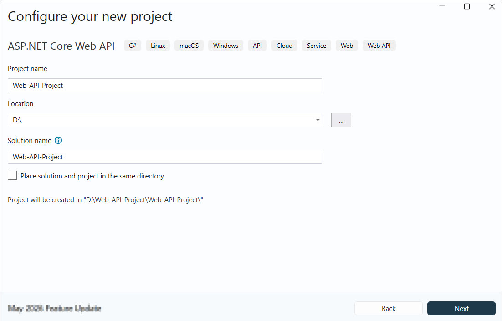
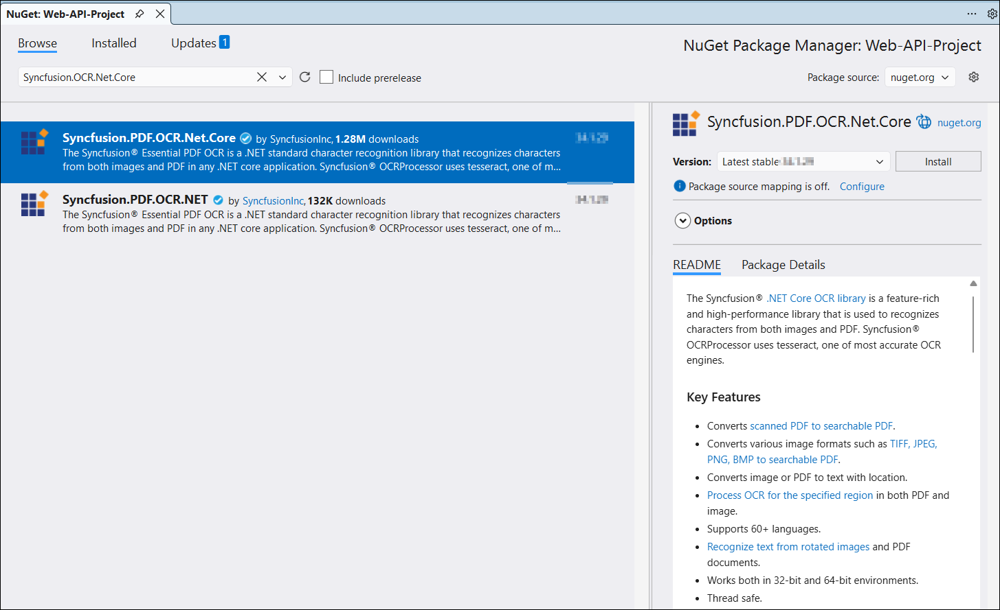

# Perform OCR in ASP.NET Core Web API

The [.NET OCR library](https://www.syncfusion.com/document-sdk/net-pdf-library/ocr-process) is used to extract text from scanned PDFs and images in ASP.NET Core Web API applications with the help of Google's [Tesseract](https://github.com/tesseract-ocr/tesseract) Optical Character Recognition engine.

To include the .NET OCR library in your ASP.NET Core Web API, please refer to the [NuGet Packages Required](https://help.syncfusion.com/document-processing/data-extraction/net/ocr-processor/nuget-packages-required) or [Assemblies Required](https://help.syncfusion.com/document-processing/data-extraction/net/ocr-processor/assemblies-required) documentation.

## Prerequisites

**Version Compatibility**

- Syncfusion.PDF.OCR.Net.Core supports .NET 8.0 and later versions.

**Supported Inputs**

The OCR processor supports the following input formats:

- Single-page and multi-page PDF documents
- Scanned images in common formats (JPEG, PNG, TIFF)
- Recommended DPI: 200 DPI or higher for optimal OCR accuracy

**Register the License Key**

N> Starting with v16.2.0.x, if you reference Syncfusion® assemblies from trial setup or from the NuGet feed, you must add the Syncfusion.Licensing assembly reference and register a license key in your application. For more information, see the licensing documentation.

Include the following code in the **Program.cs** file to register the license key:



using Syncfusion.Licensing;

// Register Syncfusion license at application startup
SyncfusionLicenseProvider.RegisterLicense("YOUR LICENSE KEY");




N> 1. Beginning from version 21.1.x, the TesseractBinaries and Tesseract language data folders are now included by default; you no longer have to set these paths explicitly.
N> 2. The current NuGet package includes Tesseract 5.0, which provides support for 100+ languages.

## Steps to perform OCR on an entire PDF document in ASP.NET Core Web API

Step 1: Create a new C# ASP.NET Core Web API project.

 
Step 2: In the project configuration window, select your target framework (.NET 8.0 or later), name your project, and click **Create**.

Step 3: Install the [Syncfusion.PDF.OCR.Net.Core](https://www.nuget.org/packages/Syncfusion.PDF.OCR.Net.Core) NuGet package into your ASP.NET Core Web API project from [NuGet.org](https://www.nuget.org/).

Step 4: Build the project to ensure all NuGet packages are properly restored. Press **Ctrl+Shift+B** or go to **Build > Build Solution**.

Step 5: Add a new API controller empty file in the project.

Step 6: Include the following namespaces in the *PdfController.cs*.




using Syncfusion.OCRProcessor;
using Syncfusion.Pdf.Parsing;




Step 7: Include the following code sample in *PdfController.cs* using the [PerformOCR](https://help.syncfusion.com/cr/document-processing/Syncfusion.OCRProcessor.OCRProcessor.html#Syncfusion_OCRProcessor_OCRProcessor_PerformOCR_Syncfusion_Pdf_Parsing_PdfLoadedDocument_System_String_) method of the [OCRProcessor](https://help.syncfusion.com/cr/document-processing/Syncfusion.OCRProcessor.OCRProcessor.html) class.




[HttpGet("/api/Pdf")]
public IActionResult ConvertOCR()
{
    //Initialize the OCR processor.
    using (OCRProcessor processor = new OCRProcessor())
    {
        FileStream fileStream = new FileStream("Input.pdf", FileMode.Open, FileAccess.Read);
        //Load an existing PDF document.
        PdfLoadedDocument document = new PdfLoadedDocument(fileStream);
        //Set the Tesseract version.
        processor.Settings.TesseractVersion = TesseractVersion.Version5_0;
        //Set OCR language.
        processor.Settings.Language = Languages.English;
        //Perform OCR with input document and tessdata (Language packs).
        processor.PerformOCR(document);
        //Create memory stream.
        MemoryStream stream = new MemoryStream();
        //Save the document to memory stream.
        document.Save(stream);
        stream.Position = 0;
        fileStream.Dispose();
        document.Dispose();
        return File(stream, "application/pdf", "Output.pdf");
    }
}




Step 8: Navigate to the `Swagger UI`, expand the `GET /api/Pdf` API, click **Execute**, and then download the response output.

By executing the program, you will get a PDF document with extracted text as follows.

A complete working sample can be downloaded from [Github](https://github.com/SyncfusionExamples/OCR-csharp-examples/tree/master/Web%20API).

Click [here](https://www.syncfusion.com/document-sdk/net-pdf-library) to explore the rich set of Syncfusion&reg; PDF library features.