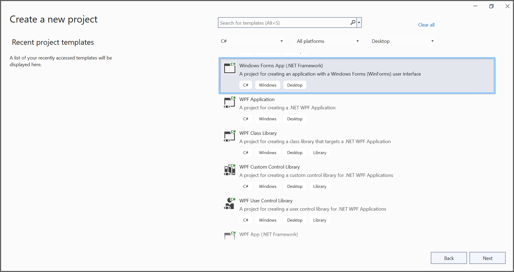
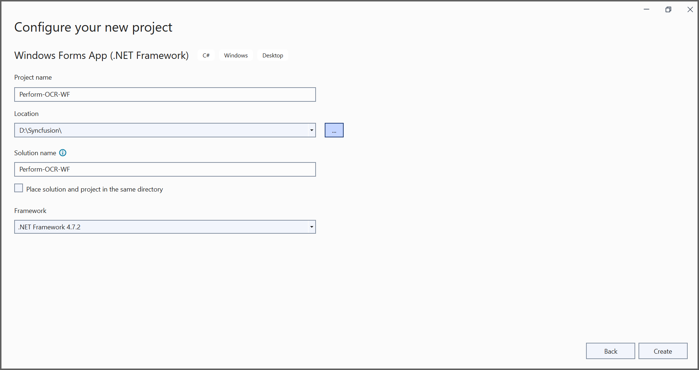
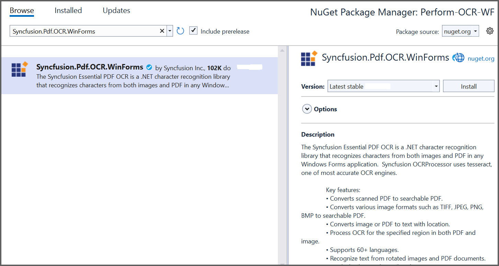

---
title: Perform OCR on PDF and image files in Windows Forms | Syncfusion
description: Learn how to perform OCR on scanned PDF documents and images in Windows Forms with different tesseract versions using Syncfusion .NET OCR library. 
platform: document-processing
documentation: UG
keywords: Assemblies
--- 

# Perform OCR in Windows Forms
The [.NET OCR library](https://www.syncfusion.com/document-sdk/net-pdf-library/ocr-process) is used to extract text from scanned PDFs and images in Windows Forms applications with the help of Google's [Tesseract](https://github.com/tesseract-ocr/tesseract) Optical Character Recognition engine.

## Prerequisites

**Version Compatibility**

- Syncfusion.Pdf.OCR.WinForms supports .NET Framework 4.6.2 and later, as well as .NET 8.0 for Windows and later

**Supported Inputs**

The OCR processor supports the following input formats:

- Single-page and multi-page PDF documents
- Scanned images in common formats (JPEG, PNG, TIFF)
- Recommended DPI: 200 DPI or higher for optimal OCR accuracy

**Register the License Key**

N> Starting with v16.2.0.x, if you reference Syncfusion&reg; assemblies from trial setup or from the NuGet feed, you must add the "Syncfusion.Licensing" assembly reference and register a license key in your application. Please refer to this [link](https://help.syncfusion.com/common/essential-studio/licensing/overview) for details on registering a Syncfusion&reg; license key.

To register the license key, add the following code to your **Form1.cs** file at the beginning of the form's constructor or the Main method:




using Syncfusion.Licensing;

public Form1()
{
    InitializeComponent();
    SyncfusionLicenseProvider.RegisterLicense("YOUR_LICENSE_KEY");
}




N> 1. Beginning from version 21.1.x, the TesseractBinaries and Tesseract language data folders are now included by default; you no longer have to set these paths explicitly.
N> 2. The current NuGet package includes Tesseract 5.0, which provides support for 100+ languages.

## Steps to perform OCR on an entire PDF document in Windows Forms 

Step 1: Create a new Windows Forms application project. 

In the project configuration window, select your target framework (.NET Framework 4.6.2 or later), name your project, and select **Create**. 

Step 2: Install the [Syncfusion.Pdf.OCR.WinForms](https://www.nuget.org/packages/Syncfusion.Pdf.OCR.WinForms) NuGet package into your WinForms application from [nuget.org](https://www.nuget.org/).

Step 3: Add a new button in Form1.Designer.cs file. 




private System.Windows.Forms.Button button1;

private void InitializeComponent()
{
    this.button1 = new System.Windows.Forms.Button();
    this.SuspendLayout();
    // button1
    this.button1.Location = new System.Drawing.Point(284, 162);
    this.button1.Name = "button1";
    this.button1.Size = new System.Drawing.Size(190, 65);
    this.button1.TabIndex = 0;
    this.button1.Text = "Perform OCR on entire PDF document";
    this.button1.UseVisualStyleBackColor = true;
    this.button1.Click += new System.EventHandler(this.btnCreate_Click);
    // Form1
    this.AutoScaleDimensions = new System.Drawing.SizeF(9F, 20F);
    this.AutoScaleMode = System.Windows.Forms.AutoScaleMode.Font;
    this.ClientSize = new System.Drawing.Size(800, 450);
    this.Controls.Add(this.button1);
    this.Name = "Form1";
    this.Text = "Form1";
    this.ResumeLayout(false);
}




Step 4: Include the following namespaces in the Form1.cs file.




using Syncfusion.OCRProcessor;
using Syncfusion.Pdf.Parsing;




Step 5: Create the btnCreate_Click event and add the following code to perform OCR on the entire PDF document using [PerformOCR](https://help.syncfusion.com/cr/document-processing/Syncfusion.OCRProcessor.OCRProcessor.html#Syncfusion_OCRProcessor_OCRProcessor_PerformOCR_Syncfusion_Pdf_Parsing_PdfLoadedDocument_System_String_) method of the [OCRProcessor](https://help.syncfusion.com/cr/document-processing/Syncfusion.OCRProcessor.OCRProcessor.html) class. 




private void btnCreate_Click(object sender, EventArgs e)
{
    //Initialize the OCR processor.
    using (OCRProcessor processor = new OCRProcessor())
    {
        //Load an existing PDF document.
        PdfLoadedDocument loadedDocument = new PdfLoadedDocument("Input.pdf");
        //Set the Tesseract version
        processor.Settings.TesseractVersion = TesseractVersion.Version5_0;
        //Set OCR language to process.
        processor.Settings.Language = Languages.English;
        //Process OCR by providing the PDF document.
        processor.PerformOCR(loadedDocument);  
        //Save the OCR processed PDF document to disk.
        loadedDocument.Save("OCR.pdf");
        loadedDocument.Close(true);
    }
}



By executing the program, you will get a PDF document as follows.

A complete working sample can be downloaded from [GitHub](https://github.com/SyncfusionExamples/OCR-csharp-examples/tree/master/Windows%20Forms).

Click [here](https://www.syncfusion.com/document-sdk/net-pdf-library) to explore the rich set of Syncfusion&reg; PDF library features.