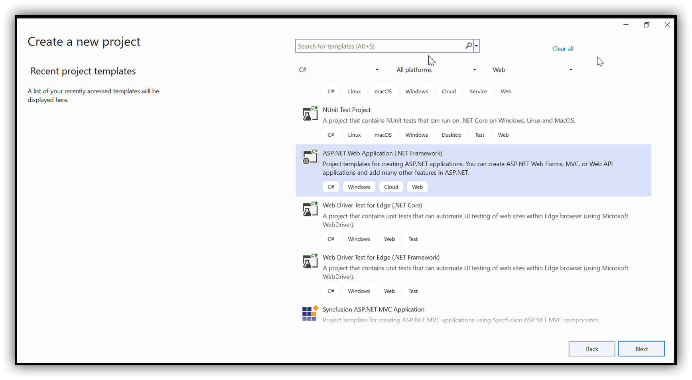
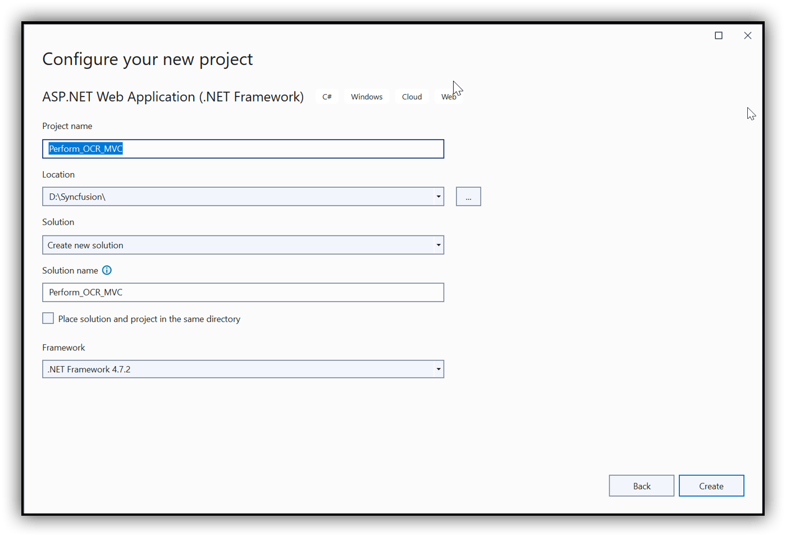
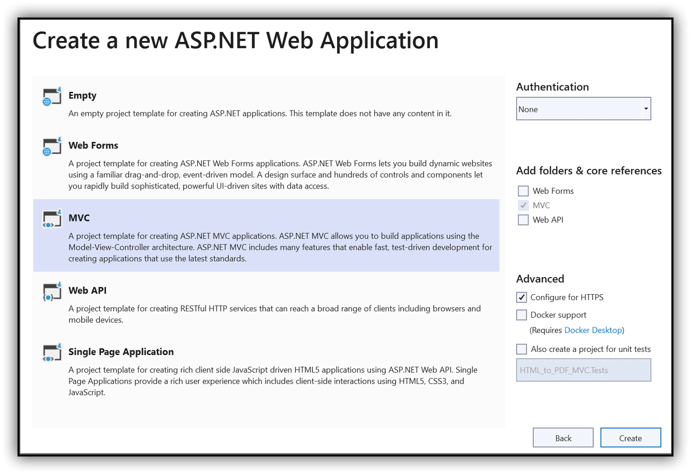
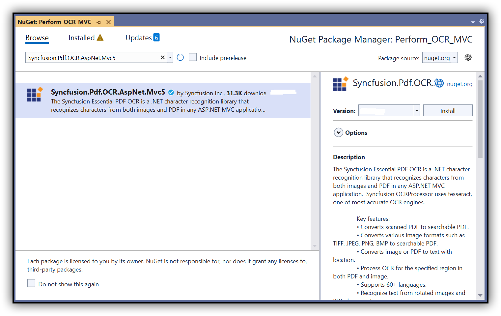

# Perform OCR in ASP.NET MVC

The [.NET OCR library](https://www.syncfusion.com/document-sdk/net-pdf-library/ocr-process) is used to extract text from scanned PDFs and images in ASP.NET MVC applications with the help of Google's [Tesseract](https://github.com/tesseract-ocr/tesseract) Optical Character Recognition engine.

## Prerequisites

**Version Compatibility**

- Syncfusion.Pdf.OCR.AspNet.Mvc5 supports Web applications targeting .NET Framework 4.6.2 and later.

**Supported Inputs**

The OCR processor supports the following input formats:

- Single-page and multi-page PDF documents
- Scanned images in common formats (JPEG, PNG, TIFF)
- Recommended DPI: 200 DPI or higher for optimal OCR accuracy

**Register the License Key**

Include a license key in the **Global.asax.cs** file before creating an **OCRProcessor** instance. Refer to the [Syncfusion License](https://help.syncfusion.com/common/essential-studio/licensing/overview) documentation to learn about registering the Syncfusion license key in your application.




using Syncfusion.Licensing;

protected void Application_Start()
{
    // Register the Syncfusion license
    SyncfusionLicenseProvider.RegisterLicense("YOUR LICENSE KEY");
}




N> 1. Beginning from version 21.1.x, the TesseractBinaries and Tesseract language data folders are now included by default; you no longer have to set these paths explicitly.
N> 2. The current NuGet package includes Tesseract 5.0, which provides support for 100+ languages.

## Steps to perform OCR on entire PDF document in ASP.NET MVC

Step 1: Create a new C# ASP.NET Web Application (.NET Framework) project targeting **.NET Framework 4.6.2** or **later**:

Step 2: In the project configuration window, name your project and click **Create**:

Step 3: Install the [Syncfusion.Pdf.OCR.AspNet.Mvc5](https://www.nuget.org/packages/Syncfusion.Pdf.OCR.AspNet.Mvc5) NuGet package into your .NET application from [NuGet.org](https://www.nuget.org/):

Step 4: Include the following namespaces in the **HomeController.cs** file:




using Syncfusion.OCRProcessor;
using Syncfusion.Pdf.Parsing;




Step 5: Add a new button in the **Index.cshtml** as follows:




@{Html.BeginForm("PerformOCR", "Home", FormMethod.Post);
   {
      

         <input type="submit" value="Perform OCR" style="width:150px;height:27px" />
      

   }
   Html.EndForm();
}




Step 6: Add a new action method named **PerformOCR** in the **HomeController.cs** file and use the following code sample to perform OCR on the entire PDF document using the [PerformOCR](https://help.syncfusion.com/cr/document-processing/Syncfusion.OCRProcessor.OCRProcessor.html#Syncfusion_OCRProcessor_OCRProcessor_PerformOCR_Syncfusion_Pdf_Parsing_PdfLoadedDocument_System_String_) method of the [OCRProcessor](https://help.syncfusion.com/cr/document-processing/Syncfusion.OCRProcessor.OCRProcessor.html) class: 




public ActionResult PerformOCR()
{
    // Initialize the OCR processor
    using (OCRProcessor processor = new OCRProcessor())
    {
        // Open the input PDF document
        FileStream fileStream = new FileStream("Input.pdf", FileMode.Open, FileAccess.Read);
        // Load the PDF document
        PdfLoadedDocument lDoc = new PdfLoadedDocument(fileStream);
        // Set the OCR language
        processor.Settings.Language = Languages.English;
        // Set the Tesseract version
        processor.Settings.TesseractVersion = TesseractVersion.Version5_0;
        // Perform OCR on the document
        processor.PerformOCR(lDoc);
        // Save and download the processed document to the browser
        lDoc.Save("Output.pdf", HttpContext.ApplicationInstance.Response, Syncfusion.Pdf.HttpReadType.Save);
        // Close and dispose the document
        lDoc.Close(true);
    }
    return View();
}




By executing the program, you will obtain a PDF document with extracted text as follows:

A complete working sample can be downloaded from [GitHub](https://github.com/SyncfusionExamples/OCR-csharp-examples/tree/master/ASP.NET%20MVC).

Click [here](https://www.syncfusion.com/document-sdk/net-pdf-library) to explore the rich set of Syncfusion&reg; PDF library features.