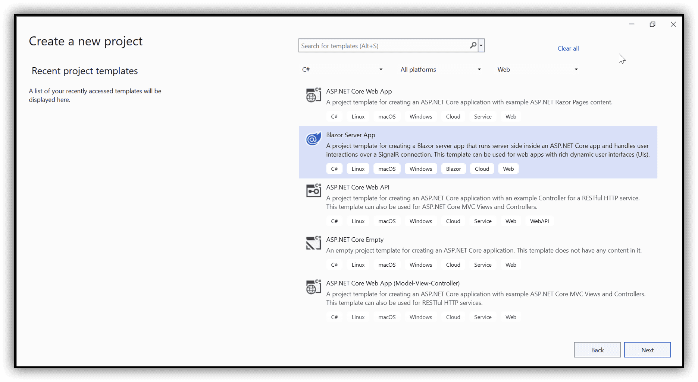
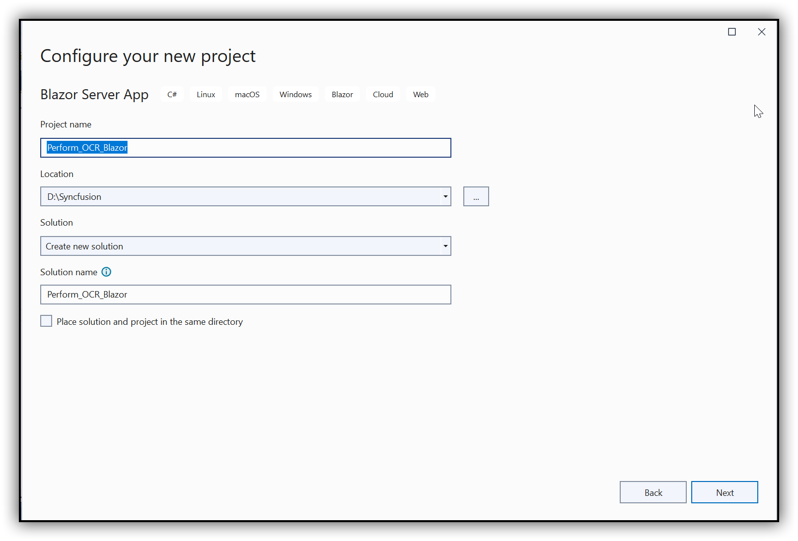
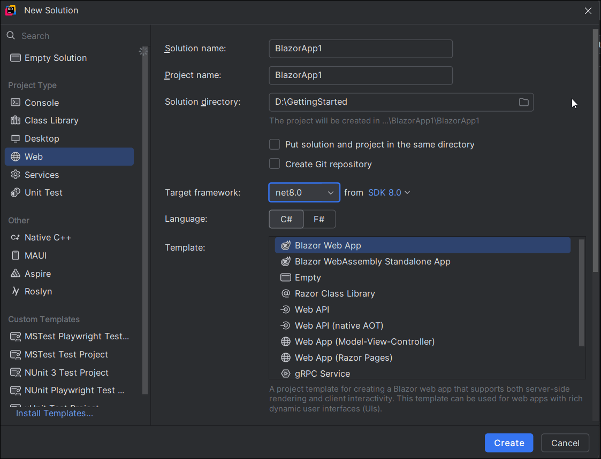
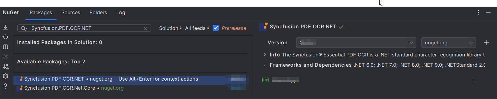
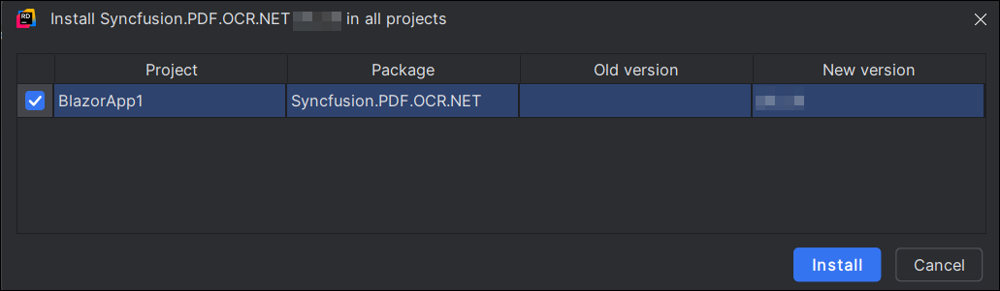
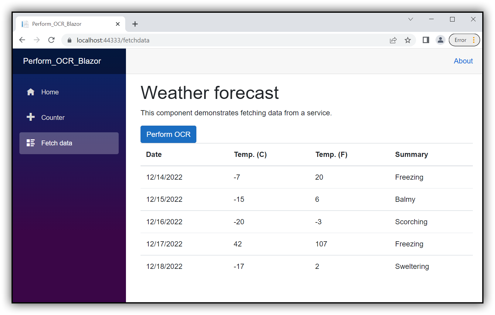

# Perform OCR in Blazor

The [.NET OCR library](https://www.syncfusion.com/document-sdk/net-pdf-library/ocr-process) is used to extract text from scanned PDFs and images in Blazor applications with the help of Google's [Tesseract](https://github.com/tesseract-ocr/tesseract) Optical Character Recognition engine.

## Prerequisites

**Version Compatibility**

- Syncfusion.PDF.OCR.Net.Core supports .NET 8.0 and later versions.

**Supported Inputs**

The OCR processor supports the following input formats:

- Single-page and multi-page PDF documents
- Scanned images in common formats (JPEG, PNG, TIFF)
- Recommended DPI: 200 DPI or higher for optimal OCR accuracy

**Required Software**

- .NET 8 SDK or later
- Visual Studio, Visual Studio Code, or JetBrains Rider

**Register the License Key**

N> Starting with v16.2.0.x, if you reference Syncfusion® assemblies from trial setup or from the NuGet feed, you must add the Syncfusion.Licensing assembly reference and register a license key in your application. For more information, see the licensing documentation.

Include the following code in the **Program.cs** file to register the license key:



using Syncfusion.Licensing;

// Register Syncfusion license at application startup
SyncfusionLicenseProvider.RegisterLicense("YOUR LICENSE KEY");




N> 1. Beginning from version 21.1.x, the TesseractBinaries and Tesseract language data folders are now included by default; you no longer have to set these paths explicitly.
N> 2. The current NuGet package includes Tesseract 5.0, which provides support for 100+ languages.

## Steps to perform OCR on an entire PDF document in Blazor





Step 1: Create a new C# Blazor Server application project targeting **.NET 6 or later**. Select **Blazor App** from the template and click **Next**:


Step 2: In the project configuration window, name your project and click **Create**.


Step 3: Install the [Syncfusion.PDF.OCR.Net.Core](https://www.nuget.org/packages/Syncfusion.PDF.OCR.Net.Core) NuGet package into your Blazor application from [NuGet.org](https://www.nuget.org/).   


Step 4: Create a new class file named **ExportService** under the Data folder and include the following namespaces:




using Syncfusion.OCRProcessor;
using Syncfusion.Pdf.Parsing;




Step 5: Use the following code sample to perform OCR on the entire PDF document using the [PerformOCR](https://help.syncfusion.com/cr/document-processing/Syncfusion.OCRProcessor.OCRProcessor.html#Syncfusion_OCRProcessor_OCRProcessor_PerformOCR_Syncfusion_Pdf_Parsing_PdfLoadedDocument_System_String_) method of the [OCRProcessor](https://help.syncfusion.com/cr/document-processing/Syncfusion.OCRProcessor.OCRProcessor.html) class in the **ExportService** file:




public MemoryStream CreatePdf()
{   
    // Initialize the OCR processor
    using (OCRProcessor processor = new OCRProcessor("Tesseractbinaries/Windows"))
    {
        FileStream fileStream = new FileStream("Input.pdf", FileMode.Open, FileAccess.Read);
        // Load a PDF document
        PdfLoadedDocument lDoc = new PdfLoadedDocument(fileStream);
        // Set OCR language
        processor.Settings.Language = Languages.English;
        // Set Tesseract version
        processor.Settings.TesseractVersion = TesseractVersion.Version5_0;
        // Perform OCR on the document
        processor.PerformOCR(lDoc, "tessdata/");
        // Create memory stream and save the processed document
        MemoryStream stream = new MemoryStream();
        lDoc.Save(stream);
        return stream;
    }
}




Step 6: Register your service in the **ConfigureServices** method available in **Startup.cs**:




public void ConfigureServices(IServiceCollection services)
{
    services.AddRazorPages();
    services.AddServerSideBlazor();
    services.AddSingleton<WeatherForecastService>();
    services.AddSingleton<ExportService>();
}




Step 7: Inject **ExportService** into **FetchData.razor** using the following code:




@inject ExportService exportService
@inject Microsoft.JSInterop.IJSRuntime JS
@using System.IO




Step 8: Create a button in **FetchData.razor** using the following code:




<button class="btn btn-primary" @onclick="@PerformOCR">Perform OCR</button>




Step 9: Add the **PerformOCR** method in **FetchData.razor** to call the export service:




@functions
{
   protected async Task PerformOCR()
   {
       ExportService exportService = new ExportService();
       using (MemoryStream pdfStream = exportService.CreatePdf())
       {
           await JS.SaveAs("Output.pdf", pdfStream.ToArray());
       }
   }
}




Step 10: Create a class file named **FileUtil** and add the following code to invoke the JavaScript action to download the file in the browser:




public static class FileUtil
{
    public static ValueTask<object> SaveAs(this IJSRuntime js, string filename, byte[] data)
     => js.InvokeAsync<object>(
         "saveAsFile",
         filename,
         Convert.ToBase64String(data));
}




Step 11: Add the following JavaScript function in **_Host.cshtml** (available under the Pages folder):




<script type="text/javascript">
    function saveAsFile(filename, bytesBase64) {
        if (navigator.msSaveBlob) {
            // Download document in Edge browser
            var data = window.atob(bytesBase64);
            var bytes = new Uint8Array(data.length);
            for (var i = 0; i < data.length; i++) {
                bytes[i] = data.charCodeAt(i);
            }
            var blob = new Blob([bytes.buffer], { type: "application/octet-stream" });
            navigator.msSaveBlob(blob, filename);
        }
        else {
            var link = document.createElement('a');
            link.download = filename;
            link.href = "data:application/octet-stream;base64," + bytesBase64;
            document.body.appendChild(link); // Needed for Firefox
            link.click();
            document.body.removeChild(link);
        }
    }
</script>




Step 12: Build the project.

Click **Build > Build Solution** or press <kbd>Ctrl</kbd>+<kbd>Shift</kbd>+<kbd>B</kbd> to build the project.

Step 13: Run the project.

Click the **Start** button (green arrow) or press <kbd>F5</kbd> to run the application.





Step 1: Open the terminal in Visual Studio Code using <kbd>Ctrl</kbd>+<kbd>`</kbd> and run the following command to create a new Blazor Server application:

```
dotnet new blazorserver -n CreatePdfBlazorServerApp
```

Step 2: Replace `CreatePdfBlazorServerApp` with your desired project name.

Step 3: Navigate to the project directory using the following command:

```
cd CreatePdfBlazorServerApp
```

Step 4: Use the following command to add the [Syncfusion.PDF.OCR.Net.Core](https://www.nuget.org/packages/Syncfusion.PDF.OCR.Net.Core) package to your project:

```
dotnet add package Syncfusion.PDF.OCR.Net.Core
```

Step 5: Create a new class file named **ExportService** under the Data folder and include the following namespaces:




using Syncfusion.OCRProcessor;
using Syncfusion.Pdf.Parsing;
using System.IO;




Step 6: Use the following code sample to perform OCR on the entire PDF document using the [PerformOCR](https://help.syncfusion.com/cr/document-processing/Syncfusion.OCRProcessor.OCRProcessor.html#Syncfusion_OCRProcessor_OCRProcessor_PerformOCR_Syncfusion_Pdf_Parsing_PdfLoadedDocument_System_String_) method of the [OCRProcessor](https://help.syncfusion.com/cr/document-processing/Syncfusion.OCRProcessor.OCRProcessor.html) class in the **ExportService** file:




public MemoryStream CreatePdf()
{   
    // Initialize the OCR processor
    using (OCRProcessor processor = new OCRProcessor("Tesseractbinaries/Windows"))
    {
        FileStream fileStream = new FileStream("Input.pdf", FileMode.Open, FileAccess.Read);
        // Load a PDF document
        PdfLoadedDocument lDoc = new PdfLoadedDocument(fileStream);
        // Set OCR language
        processor.Settings.Language = Languages.English;
        // Set Tesseract version
        processor.Settings.TesseractVersion = TesseractVersion.Version5_0;
        // Perform OCR on the document
        processor.PerformOCR(lDoc, "tessdata/");
        // Create memory stream and save the processed document
        MemoryStream stream = new MemoryStream();
        lDoc.Save(stream);
        return stream;
    }
}




Step 7: Register your service in the **ConfigureServices** method available in **Startup.cs**:




public void ConfigureServices(IServiceCollection services)
{
    services.AddRazorPages();
    services.AddServerSideBlazor();
    services.AddSingleton<WeatherForecastService>();
    services.AddSingleton<ExportService>();
}




Step 8: Inject **ExportService** into **FetchData.razor** using the following code:




@inject ExportService exportService
@inject Microsoft.JSInterop.IJSRuntime JS
@using System.IO




Step 9: Create a button in **FetchData.razor** using the following code:




<button class="btn btn-primary" @onclick="@PerformOCR">Perform OCR</button>




Step 10: Add the **PerformOCR** method in **FetchData.razor** to call the export service:




@functions
{
   protected async Task PerformOCR()
   {
       ExportService exportService = new ExportService();
       using (MemoryStream pdfStream = exportService.CreatePdf())
       {
           await JS.SaveAs("Output.pdf", pdfStream.ToArray());
       }
   }
}




Step 11: Create a class file named **FileUtil** and add the following code to invoke the JavaScript action to download the file in the browser:




public static class FileUtil
{
    public static ValueTask<object> SaveAs(this IJSRuntime js, string filename, byte[] data)
     => js.InvokeAsync<object>(
         "saveAsFile",
         filename,
         Convert.ToBase64String(data));
}




Step 12: Add the following JavaScript function in **_Host.cshtml** (available under the Pages folder):




<script type="text/javascript">
    function saveAsFile(filename, bytesBase64) {
        if (navigator.msSaveBlob) {
            // Download document in Edge browser
            var data = window.atob(bytesBase64);
            var bytes = new Uint8Array(data.length);
            for (var i = 0; i < data.length; i++) {
                bytes[i] = data.charCodeAt(i);
            }
            var blob = new Blob([bytes.buffer], { type: "application/octet-stream" });
            navigator.msSaveBlob(blob, filename);
        }
        else {
            var link = document.createElement('a');
            link.download = filename;
            link.href = "data:application/octet-stream;base64," + bytesBase64;
            document.body.appendChild(link); // Needed for Firefox
            link.click();
            document.body.removeChild(link);
        }
    }
</script>




Step 13: Build the project.

Run the following command in the terminal to build the project:

```
dotnet build
```

Step 14: Run the project.

Run the following command in terminal to build the project.

```
dotnet run
```




Step 1. Open JetBrains Rider and create a new Blazor server-side app project.
* Launch JetBrains Rider.
* Click new solution on the welcome screen.


* In the new Solution dialog, select Project Type as Web.
* Enter a project name and specify the location.
* Choose template as **Blazor Server App**.
* Select the target framework (e.g., .NET 8.0, .NET 9.0 and .NET 10).
* Click create.



Step 2: Install the NuGet package from [NuGet.org](https://www.nuget.org/).
* Click the NuGet icon in the Rider toolbar and type [Syncfusion.PDF.OCR.Net.Core](https://www.nuget.org/packages/Syncfusion.PDF.OCR.Net.Core) in the search bar.
* Ensure that "nuget.org" is selected as the package source.
* Select the latest Syncfusion.PDF.OCR.Net.Core NuGet package from the list.
* Click the + (Add) button to add the package.



* Click the Install button to complete the installation.



Step 4: Create a new class file named *ExportService* under the Data folder and include the following namespaces in the file.




using Syncfusion.OCRProcessor;
using Syncfusion.Pdf.Parsing;
using System.IO;




Step 5: Use the following code sample to perform OCR on the entire PDF document using [PerformOCR](https://help.syncfusion.com/cr/document-processing/Syncfusion.OCRProcessor.OCRProcessor.html#Syncfusion_OCRProcessor_OCRProcessor_PerformOCR_Syncfusion_Pdf_Parsing_PdfLoadedDocument_System_String_) method of the [OCRProcessor](https://help.syncfusion.com/cr/document-processing/Syncfusion.OCRProcessor.OCRProcessor.html) class in the **ExportService** file.  




public MemoryStream CreatePdf()
{   
    //Initialize the OCR processor.
    using (OCRProcessor processor = new OCRProcessor("Tesseractbinaries/Windows"))
    {
        FileStream fileStream = new FileStream("Input.pdf", FileMode.Open, FileAccess.Read);
        //Load a PDF document.
        PdfLoadedDocument lDoc = new PdfLoadedDocument(fileStream);
        //Set OCR language to process.
        processor.Settings.Language = Languages.English;
        //Process OCR by providing the PDF document.
        processor.PerformOCR(lDoc, "tessdata/");
        //Create memory stream.
        MemoryStream stream = new MemoryStream();
        //Save the document to memory stream.
        lDoc.Save(stream);
        return stream;
    }
}




Step 6: Register your service in the ConfigureServices method available in the *Startup.cs* class as follows.




public void ConfigureServices(IServiceCollection services)
{
    services.AddRazorPages();
    services.AddServerSideBlazor();
    services.AddSingleton<WeatherForecastService>();
    services.AddSingleton<ExportService>();
}




Step 7: Inject ExportService into *FetchData.razor* using the following code.




@inject ExportService exportService
@inject Microsoft.JSInterop.IJSRuntime JS
@using  System.IO;




Step 8: Create a button in the *FetchData.razor* using the following code.




<button class="btn btn-primary" @onclick="@PerformOCR">Perform OCR</button>




Step 9: Add the PerformOCR method in *FetchData.razor* page to call the export service.




@functions
{
   protected async Task PerformOCR()
   {
       ExportService exportService = new ExportService();
       using (MemoryStream excelStream = exportService.CreatePdf())
       {
           await JS.SaveAs("Output.pdf", excelStream.ToArray());
       }
   }
}




Step 10: Create a class file with the FileUtil name and add the following code to invoke the JavaScript action to download the file in the browser.




public static class FileUtil
{
    public static ValueTask<object> SaveAs(this IJSRuntime js, string filename, byte[] data)
     => js.InvokeAsync<object>(
         "saveAsFile",
         filename,
         Convert.ToBase64String(data));
}




Step 11: Add the following JavaScript function in the *_Host.cshtml* available under the Pages folder.




<script type="text/javascript">
    function saveAsFile(filename, bytesBase64) {
        if (navigator.msSaveBlob) {
            //Download document in Edge browser
            var data = window.atob(bytesBase64);
            var bytes = new Uint8Array(data.length);
            for (var i = 0; i < data.length; i++) {
                bytes[i] = data.charCodeAt(i);
            }
            var blob = new Blob([bytes.buffer], { type: "application/octet-stream" });
            navigator.msSaveBlob(blob, filename);
        }
        else {
            var link = document.createElement('a');
            link.download = filename;
            link.href = "data:application/octet-stream;base64," + bytesBase64;
            document.body.appendChild(link); // Needed for Firefox
            link.click();
            document.body.removeChild(link);
        }
    }
</script>




Step 12: Build the project.

Click the **Build** button in the toolbar or press <kbd>Ctrl</kbd>+<kbd>Shift</kbd>+<kbd>B</kbd> to build the project.

Step 13: Run the project.

Click the **Run** button (green arrow) in the toolbar or press <kbd>F5</kbd> to run the app.





You will get the following output in the browser by executing the program.


Click the button and get a PDF document with the following output.

    
A complete working sample can be downloaded from [Github](https://github.com/SyncfusionExamples/OCR-csharp-examples/tree/master/Blazor).

Click [here](https://www.syncfusion.com/document-sdk/net-pdf-library) to explore the rich set of Syncfusion<sup>&reg;</sup> PDF library features.