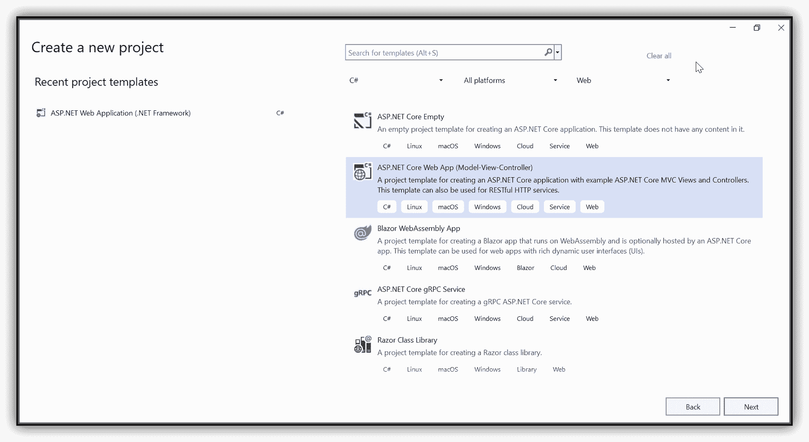
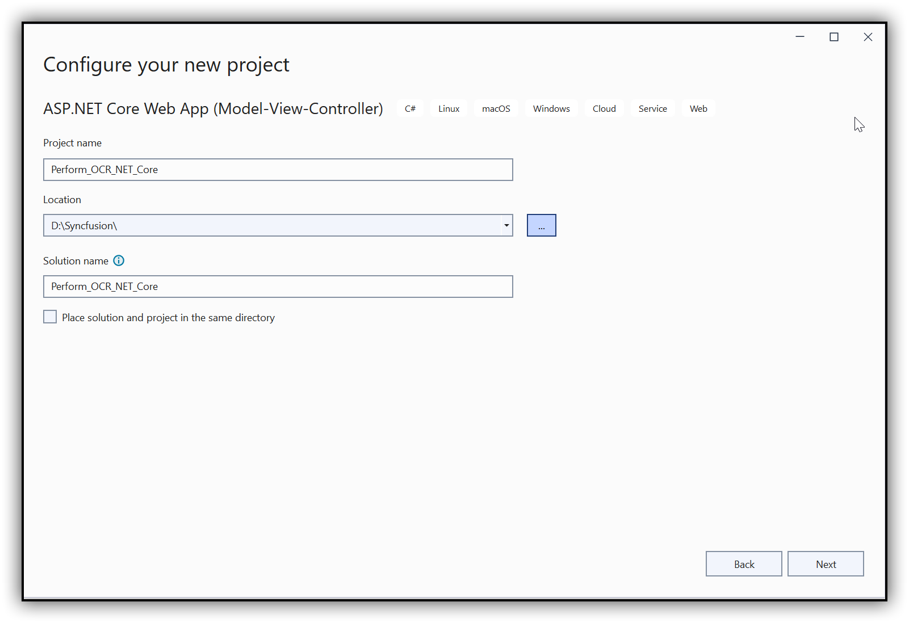
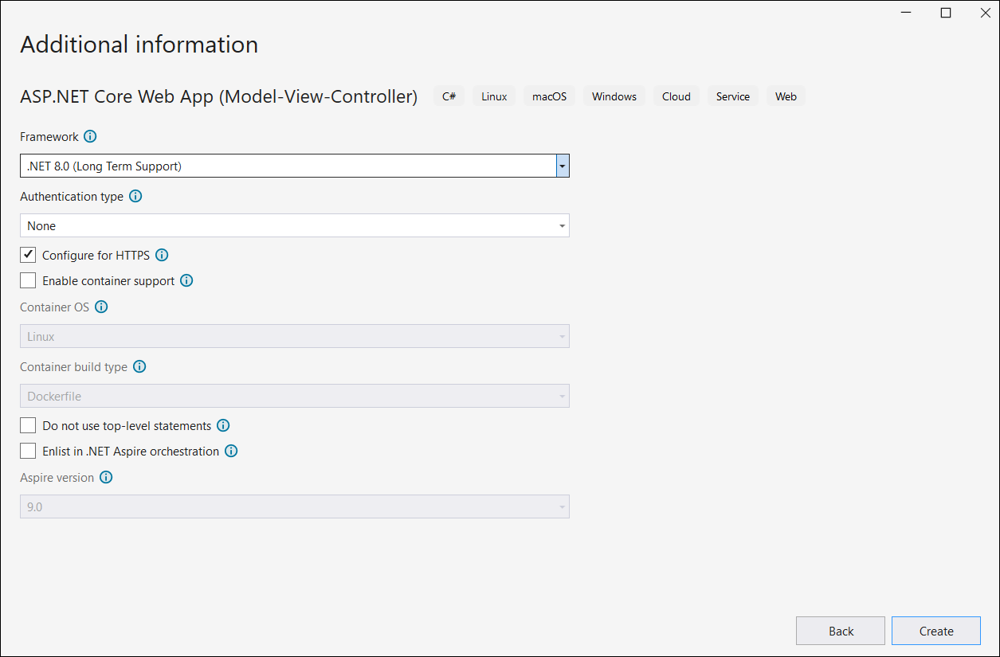
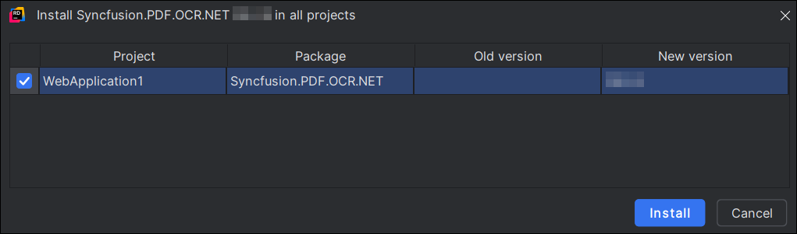

# Perform OCR in ASP.NET Core

The [.NET OCR library](https://www.syncfusion.com/document-sdk/net-pdf-library/ocr-process) is used to extract text from scanned PDFs and images in ASP.NET Core applications with the help of Google's [Tesseract](https://github.com/tesseract-ocr/tesseract) Optical Character Recognition engine.

## Prerequisites

**Version Compatibility**

- Syncfusion.PDF.OCR.Net.Core supports .NET 8.0 and later versions.

**Supported Inputs**

The OCR processor supports the following input formats:

- Single-page and multi-page PDF documents
- Scanned images in common formats (JPEG, PNG, TIFF)
- Recommended DPI: 200 DPI or higher for optimal OCR accuracy

**Required Software**

- .NET 8 SDK or later
- Visual Studio, Visual Studio Code, or JetBrains Rider

**Register the License Key**

N> Starting with v16.2.0.x, if you reference Syncfusion® assemblies from trial setup or from the NuGet feed, you must add the Syncfusion.Licensing assembly reference and register a license key in your application. For more information, see the licensing documentation.

Include the following code in the **Program.cs** file to register the license key:



using Syncfusion.Licensing;

// Register Syncfusion license at application startup
SyncfusionLicenseProvider.RegisterLicense("YOUR LICENSE KEY");




N> 1. Beginning from version 21.1.x, the TesseractBinaries and Tesseract language data folders are now included by default; you no longer have to set these paths explicitly.
N> 2. The current NuGet package includes Tesseract 5.0, which provides support for 100+ languages.

## Steps to perform OCR on an entire PDF document in ASP.NET Core application





Step 1: Create a new C# ASP.NET Core Web Application project.
   

Step 2: In the configuration window, select your target framework (.NET 8.0 or later), name your project, and click **Next**.




Step 3: Install the [Syncfusion.PDF.OCR.Net.Core](https://www.nuget.org/packages/Syncfusion.PDF.OCR.Net.Core) NuGet package into your ASP.NET Core application from [NuGet.org](https://www.nuget.org/).


Step 4: A default controller with the name HomeController.cs is added to the ASP.NET Core MVC project. Include the following namespaces in that HomeController.cs file.




using Syncfusion.OCRProcessor;
using Syncfusion.Pdf.Parsing;




Step 5: Add a new button in index.cshtml as follows.




@{Html.BeginForm("PerformOCR", "Home", FormMethod.Post);
   {
      <div>
         <input type="submit" value="Perform OCR" style="width:150px;height:27px" />
      </div>
   }
   Html.EndForm();
}




Step 6: Add a new action method named PerformOCR in the HomeController.cs and use the following code sample to perform OCR on the entire PDF document using [PerformOCR](https://help.syncfusion.com/cr/document-processing/Syncfusion.OCRProcessor.OCRProcessor.html#Syncfusion_OCRProcessor_OCRProcessor_PerformOCR_Syncfusion_Pdf_Parsing_PdfLoadedDocument_System_String_) method of the [OCRProcessor](https://help.syncfusion.com/cr/document-processing/Syncfusion.OCRProcessor.OCRProcessor.html) class. 




public IActionResult PerformOCR()
{
   //Initialize the OCR processor.
   using (OCRProcessor processor = new OCRProcessor())
   {
      FileStream fileStream = new FileStream("Input.pdf", FileMode.Open, FileAccess.Read);
      //Load a PDF document.
      PdfLoadedDocument lDoc = new PdfLoadedDocument(fileStream);
      //Set OCR language to process.
      processor.Settings.Language = Languages.English;
      //Process OCR by providing the PDF document.
      processor.PerformOCR(lDoc);
      //Create memory stream.
      MemoryStream stream = new MemoryStream();
      //Save the document to memory stream.
      lDoc.Save(stream);
      lDoc.Close();
      //Set the position as '0'.
      stream.Position = 0;
      //Download the PDF document in the browser.
      FileStreamResult fileStreamResult = new FileStreamResult(stream, "application/pdf");
      fileStreamResult.FileDownloadName = "Sample.pdf";
      return fileStreamResult;
   }
}




Step 7: Build the project.

Click the **Build** button in the toolbar or press <kbd>Ctrl</kbd>+<kbd>Shift</kbd>+<kbd>B</kbd> to build the project.

Step 8: Run the project.

Click the **Run** button (green arrow) in the toolbar or press <kbd>F5</kbd> to run the app.





Step 1: Open the terminal (Ctrl+`) and run the following command to create a new C# ASP.NET Core Web Application project:

```
dotnet new mvc -n CreatePdfASPNETCoreAPP
```

Step 2: Replace `CreatePdfASPNETCoreAPP` with your desired project name.

Step 3: Navigate to the project directory using the following command:

```
cd CreatePdfASPNETCoreAPP
```

Step 4: Use the following command in the terminal to add the [Syncfusion.PDF.OCR.Net.Core](https://www.nuget.org/packages/Syncfusion.PDF.OCR.Net.Core) package to your project:

```
dotnet add package Syncfusion.PDF.OCR.NET
```

Step 5: A default controller with the name HomeController.cs is added to the ASP.NET Core MVC project. Include the following namespaces in that HomeController.cs file.




using Syncfusion.OCRProcessor;
using Syncfusion.Pdf.Parsing;




Step 6: Add a new button in index.cshtml as follows.




@{Html.BeginForm("PerformOCR", "Home", FormMethod.Post);
   {
      <div>
         <input type="submit" value="Perform OCR" style="width:150px;height:27px" />
      </div>
   }
   Html.EndForm();
}




Step 7: Add a new action method named PerformOCR in the HomeController.cs and use the following code sample to perform OCR on the entire PDF document using the [PerformOCR](https://help.syncfusion.com/cr/document-processing/Syncfusion.OCRProcessor.OCRProcessor.html#Syncfusion_OCRProcessor_OCRProcessor_PerformOCR_Syncfusion_Pdf_Parsing_PdfLoadedDocument_System_String_) method of the [OCRProcessor](https://help.syncfusion.com/cr/document-processing/Syncfusion.OCRProcessor.OCRProcessor.html) class.




public IActionResult PerformOCR()
{
   //Initialize the OCR processor.
   using (OCRProcessor processor = new OCRProcessor())
   {
      FileStream fileStream = new FileStream("Input.pdf", FileMode.Open, FileAccess.Read);
      //Load a PDF document.
      PdfLoadedDocument lDoc = new PdfLoadedDocument(fileStream);
      //Set the Tesseract version (Version5_0 is included in the current NuGet package).
      processor.Settings.TesseractVersion = TesseractVersion.Version5_0;
      //Set OCR language to process.
      processor.Settings.Language = Languages.English;
      //Process OCR by providing the PDF document.
      processor.PerformOCR(lDoc);
      //Create memory stream.
      MemoryStream stream = new MemoryStream();
      //Save the document to memory stream.
      lDoc.Save(stream);
      lDoc.Close();
      fileStream.Dispose();
      //Set the position as '0'.
      stream.Position = 0;
      //Download the PDF document in the browser.
      FileStreamResult fileStreamResult = new FileStreamResult(stream, "application/pdf");
      fileStreamResult.FileDownloadName = "Sample.pdf";
      return fileStreamResult;
   }
}




Step 8: Build the project.

Run the following command in the terminal to build the project:

```
dotnet build
```

Step 9: Run the project.

Run the following command in the terminal to run the project:

```
dotnet run
```




Step 1: Open JetBrains Rider and create a new ASP.NET Core Web application project.
* Launch JetBrains Rider.
* Click **New Solution** on the welcome screen.


* In the new Solution dialog, select **Project Type** as **Web**.
* Select the target framework (.NET 8.0 or later) and template as **Web App (Model-View-Controller)**.
* Enter a project name and specify the location.
* Click **Create**.


Step 2: Install the NuGet package from [NuGet.org](https://www.nuget.org/).
* Click the NuGet icon in the Rider toolbar and type [Syncfusion.PDF.OCR.Net.Core](https://www.nuget.org/packages/Syncfusion.PDF.OCR.Net.Core) in the search bar.
* Ensure that "nuget.org" is selected as the package source.
* Select the latest Syncfusion.PDF.OCR.NET NuGet package from the list.
* Click the **+** (Add) button to add the package.


* Click the **Install** button to complete the installation.



Step 3: A default controller with the name HomeController.cs is added to the ASP.NET Core MVC project. Include the following namespaces in that HomeController.cs file.




using Syncfusion.OCRProcessor;
using Syncfusion.Pdf.Parsing;




Step 4: Add a new button in index.cshtml as follows.




@{Html.BeginForm("PerformOCR", "Home", FormMethod.Post);
   {
      <div>
         <input type="submit" value="Perform OCR" style="width:150px;height:27px" />
      </div>
   }
   Html.EndForm();
}




Step 5: Add a new action method named PerformOCR in the HomeController.cs and use the following code sample to perform OCR on the entire PDF document using the [PerformOCR](https://help.syncfusion.com/cr/document-processing/Syncfusion.OCRProcessor.OCRProcessor.html#Syncfusion_OCRProcessor_OCRProcessor_PerformOCR_Syncfusion_Pdf_Parsing_PdfLoadedDocument_System_String_) method of the [OCRProcessor](https://help.syncfusion.com/cr/document-processing/Syncfusion.OCRProcessor.OCRProcessor.html) class.




public IActionResult PerformOCR()
{
   //Initialize the OCR processor.
   using (OCRProcessor processor = new OCRProcessor())
   {
      FileStream fileStream = new FileStream("Input.pdf", FileMode.Open, FileAccess.Read);
      //Load a PDF document.
      PdfLoadedDocument lDoc = new PdfLoadedDocument(fileStream);
      //Set the Tesseract version (Version5_0 is included in the current NuGet package).
      processor.Settings.TesseractVersion = TesseractVersion.Version5_0;
      //Set OCR language to process.
      processor.Settings.Language = Languages.English;
      //Process OCR by providing the PDF document.
      processor.PerformOCR(lDoc);
      //Create memory stream.
      MemoryStream stream = new MemoryStream();
      //Save the document to memory stream.
      lDoc.Save(stream);
      lDoc.Close();
      fileStream.Dispose();
      //Set the position as '0'.
      stream.Position = 0;
      //Download the PDF document in the browser.
      FileStreamResult fileStreamResult = new FileStreamResult(stream, "application/pdf");
      fileStreamResult.FileDownloadName = "Sample.pdf";
      return fileStreamResult;
   }
}




Step 6: Build the project.

Click the **Build** button in the toolbar or press <kbd>Ctrl</kbd>+<kbd>Shift</kbd>+<kbd>B</kbd> to build the project.

Step 7: Run the project.

Click the **Run** button (green arrow) in the toolbar or press <kbd>F5</kbd> to run the app.





By executing the program, you will get a PDF document as follows.

 
A complete working sample can be downloaded from the [Github](https://github.com/SyncfusionExamples/OCR-csharp-examples/tree/master/ASP.NET%20Core).

Click [here](https://www.syncfusion.com/document-sdk/net-pdf-library) to explore the rich set of Syncfusion<sup>&reg;</sup> PDF library features.