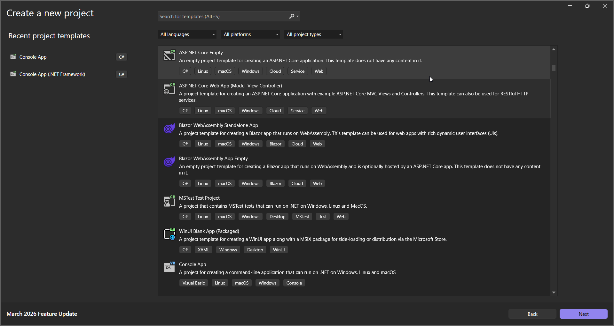
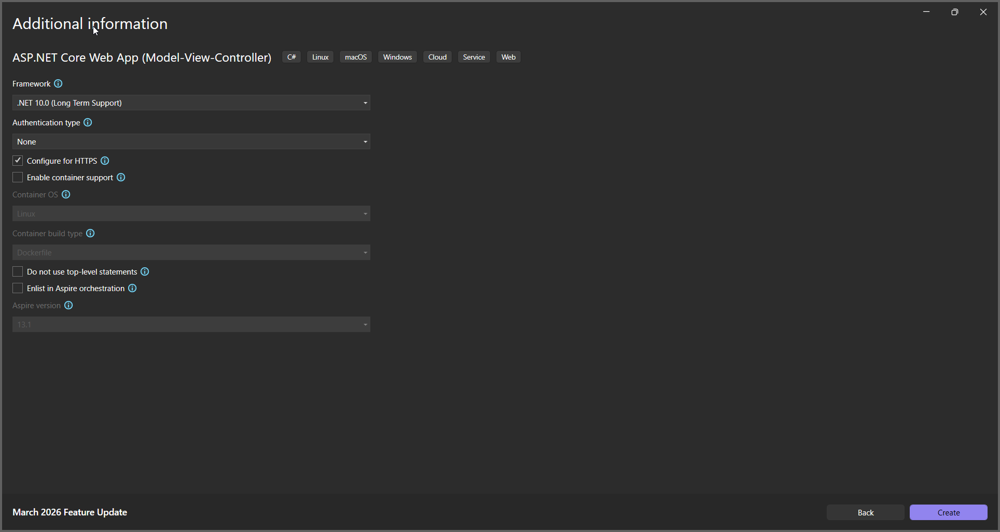
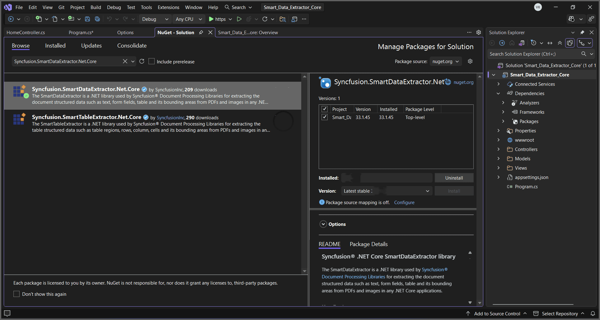

**Prerequisites**:

* Install .NET SDK: Ensure that you have the .NET SDK installed on your system. You can download it from the [.NET Downloads page](https://dotnet.microsoft.com/en-us/download).
* Install Visual Studio: Download and install Visual Studio from the [official website](https://visualstudio.microsoft.com/downloads/).

Step 1: Create a new C# ASP.NET Core Web Application project.
   

Step 2: In configuration windows, name your project and click Next.
   
   

Step 3: Install the [Syncfusion.SmartDataExtractor.Net.Core](https://www.nuget.org/packages/Syncfusion.SmartDataExtractor.Net.Core/) package as reference to your ASP.NET Core applications from [NuGet.org](https://www.nuget.org/).
   

Step 4: A default controller with name HomeController.cs gets added on creation of ASP.NET Core project. Include the following namespaces in that HomeController.cs file.



   using Syncfusion.SmartDataExtractor;
   using System.Diagnostics;
   using System.Text;



Step 5: A default action method named Index will be present in HomeController.cs. Right click on Index method and select Go To View where you will be directed to its associated view page Index.cshtml. Add a new button in the Index.cshtml as shown below.


@{
    Html.BeginForm("ExtractData", "Home", FormMethod.Get);
    {
        

            <input type="submit" value="Extract Data from PDF" style="width:200px;height:27px" />
        

    }
    Html.EndForm();
}



Step 6: Add a new action method named ``ExportToJson`` in HomeController.cs and include the below code example to extract data as JSON using the DataExtractor (help.syncfusion.com in Bing) class. Then use the Extract (help.syncfusion.com in Bing) method of the DataExtractor object to process the input and export the results in JSON format.



// Open the input PDF file as a stream.
using (FileStream stream = new FileStream(Path.GetFullPath("Input.pdf"), FileMode.Open, FileAccess.Read))
{
   // Initialize the Smart Data Extractor.
   DataExtractor extractor = new DataExtractor();
   // Extract form data as JSON.
   string data = extractor.ExtractDataAsJson(stream);
   // Convert JSON string into a MemoryStream for download.
   MemoryStream outputStream = new MemoryStream(Encoding.UTF8.GetBytes(data));
   // Reset stream position.
   outputStream.Position = 0;
   // Return JSON file as download in browser.
   FileStreamResult fileStreamResult = new FileStreamResult(outputStream, "application/json");
   fileStreamResult.FileDownloadName = "Output.json";
   return fileStreamResult;
}



Step 7: Build the project.
   Click on Build > Build Solution or press Ctrl + Shift + B to build the project.

Step 8: Run the project.
   Click the Start button (green arrow) or press F5 to run the app.
