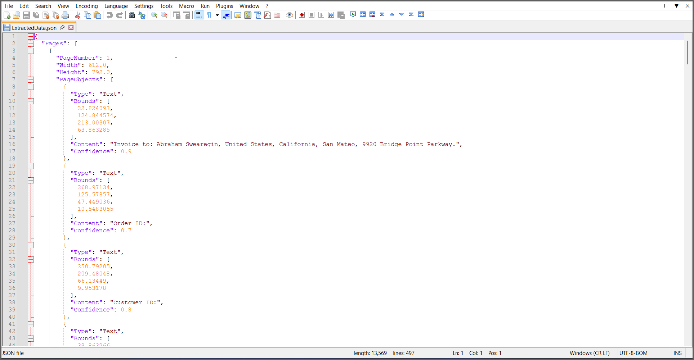
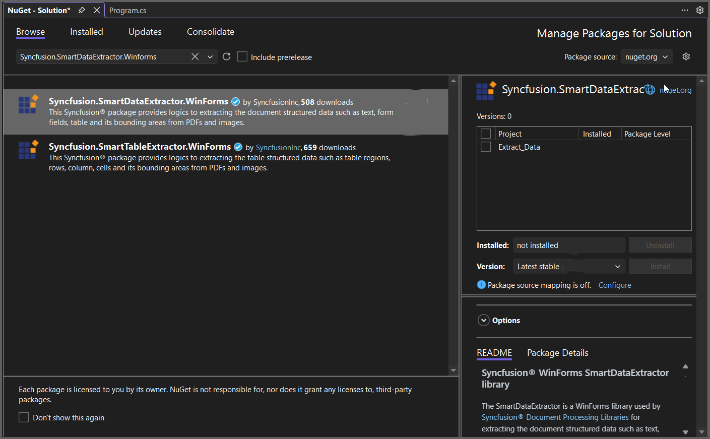

---
title: Extract Data in Console Application | Syncfusion
description: Learn how to extract data in a Console Application by using the Syncfusion Smart Data Extractor efficiently.
platform: document-processing
control: SmartDataExtractor
documentation: UG
--- 

# Extract Data from PDF in Console Application

The Syncfusion&reg; Smart Data Extractor is a .NET library used to extract structured data and document elements from PDFs and images in ASP.NET Core applications.

## Steps to Extract Data from PDF in Console App





 






You can download a complete working sample from [GitHub](https://github.com/SyncfusionExamples/PDF-Examples/tree/master/Data-Extraction/Getting-Started/Console/.NET/Extract_Data_as_JSON).

By executing the program, you will get the PDF document as follows.

## Extract Data from PDF using .NET Framework

The following steps illustrates Extracting Data from PDF document in console application using .NET Framework.

**Prerequisites**:

* Install .NET SDK: Ensure that you have the .NET SDK installed on your system. You can download it from the [.NET Downloads page](https://dotnet.microsoft.com/en-us/download).
* Install Visual Studio: Download and install Visual Studio Code from the [official website](https://code.visualstudio.com/download).

**Steps to Extract Data from PDF using .NET Framework**

Step 1: Create a new C# Console Application (.NET Framework) project.

Step 2: Name the project.

Step 3: Install the [Syncfusion.SmartDataExtractor.WinForms](https://www.nuget.org/packages/Syncfusion.SmartDataExtractor.WinForms/) NuGet package as reference to your .NET Standard applications from [NuGet.org](https://www.nuget.org).

Step 4: Include the following namespaces in the *Program.cs*.



using System.IO;
using Syncfusion.Pdf.Parsing;
using Syncfusion.SmartDataExtractor;



Step 5: Include the following code sample in *Program.cs* to Extract data from an PDF file.



//Open the input PDF file as a stream.
using (FileStream stream = new FileStream("Input.pdf", FileMode.Open, FileAccess.Read))
{
    //Initialize the Smart Data Extractor.
    DataExtractor extractor = new DataExtractor();
    //Extract data as JSON.
    string data = extractor.ExtractDataAsJson(stream);
    //Save the extracted JSON data into an output file.
    File.WriteAllText("Output.json", data, Encoding.UTF8);
}



Step 6: Build the project.

Click on Build > Build Solution or press Ctrl + Shift + B to build the project.

Step 7: Run the project.

Click the Start button (green arrow) or press F5 to run the app.

You can download a complete working sample from [GitHub](https://github.com/SyncfusionExamples/PDF-Examples/tree/master/Data-Extraction/Getting-Started/Console/.NETFramework/Extract_Data).

By executing the program, you will get the PDF document as follows.

