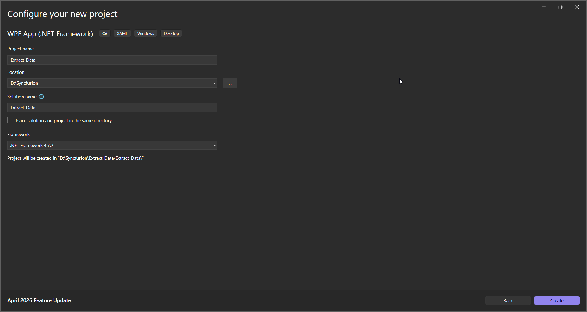
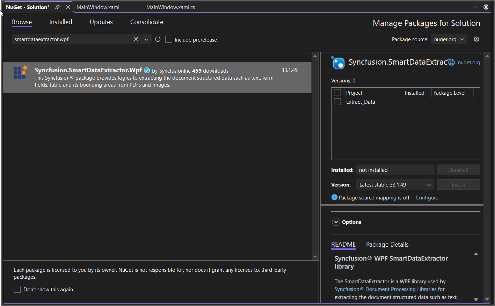

# Extract Data from PDF in WPF Application

The Syncfusion&reg; Smart Data Extractor is a .NET library used to extract structured data and document elements from PDFs and images in ASP.NET Core applications.

## Steps to Extract Data from PDF document in WPF

Step 1: Create a new WPF application project.
  

In project configuration window, name your project and select Create.

Step 2: Install the [Syncfusion.SmartDataExtractor.WPF](https://www.nuget.org/packages/Syncfusion.SmartDataExtractor.WPF) NuGet package as a reference to your WPF application [NuGet.org](https://www.nuget.org/).

Step 3: Include the following namespaces in the MainWindow.xaml.cs file.



using Syncfusion.SmartDataExtractor;
using System;
using System.IO;
using System.Text;
using System.Windows;



Step 4: Add a new button in MainWindow.xaml to Extract data from PDF document as follows.



	<Grid>
		<Button Content="Extract Data"
                Width="150" Height="40"
                HorizontalAlignment="Center"
                VerticalAlignment="Center"
                Click="ExtractButton_Click"/>
	</Grid>



Step 5: Add the following code in `btnCreate_Click` to extract data from a PDF document using the **ExtractDataAsJson**  method in the **DataExtractor** class. The extracted content will be saved as a JSON file 



// Open the input PDF file as a stream.
using (FileStream stream = new FileStream("Input.pdf", FileMode.Open, FileAccess.Read))
{
    // Initialize the Smart Data Extractor.
    DataExtractor extractor = new DataExtractor();
    // Extract form data as JSON.
    string data = extractor.ExtractDataAsJson(stream);
    // Save the extracted JSON data into an output file (inline path).
    File.WriteAllText("Output.json", data, Encoding.UTF8);
}



By executing the program, you will get the PDF document as follows.
 

A complete working sample can be downloaded from [Github](https://github.com/SyncfusionExamples/PDF-Examples/tree/master/Data-Extraction/Getting-Started/WPF/Extract_Data).
   
 Click [here](https://www.syncfusion.com/document-sdk/net-pdf-data-extraction) to explore the rich set of Syncfusion&reg;Data Extraction library features.