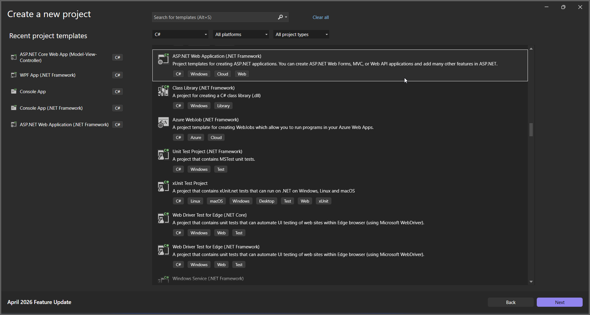
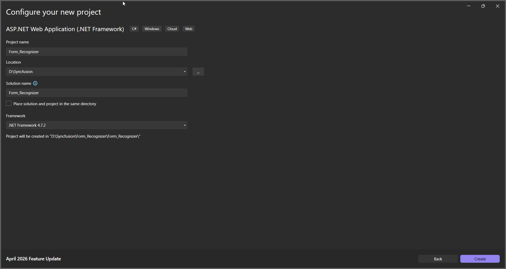
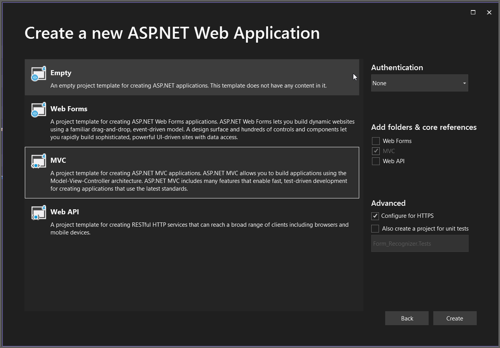
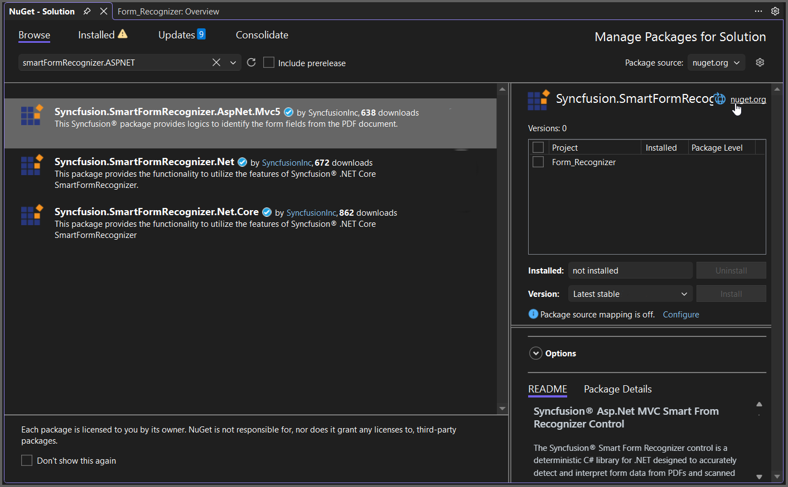

# Recognizing Form Data in ASP.NET MVC

The Syncfusion&reg; Smart Form Recognizer is a deterministic, on‑premise C# library for .NET that extracts form data from PDFs and scanned images. It uses visual layout heuristics like lines, boxes, and markers to consistently identify form structures. The library supports text fields, checkboxes, radio buttons, and signature regions, producing structured JSON for workflow integration.

## Steps to Recognize Form Data PDF document in ASP.NET MVC

Step 1: Create a new C# ASP.NET Web Application (.NET Framework) project.
   

Step 2: In the project configuration windows, name your project and select Create.
   
   

Step 3: Install [Syncfusion.SmartFormRecognizer.AspNet.Mvc5](https://www.nuget.org/packages/Syncfusion.SmartFormRecognizer.AspNet.Mvc5)  NuGet package as reference to your .NET applications from [NuGet.org](https://www.nuget.org/).
  

Step 4: Include the following namespaces in the HomeController.cs file.



using Syncfusion.SmartFormRecognizer;
using System.IO;
using System.Text;



Step 5: Add a new button in the Index.cshtml as shown below.

@{
	ViewBag.Title = "Home Page";
}

	@using (Html.BeginForm("RecognizeForm", "Home", FormMethod.Get))
	{
		<input type="submit" value="Recognize Form from PDF" style="width:250px;height:30px" />
	}



Step 6: Add a new action method named RecognizeForm in `HomeController.cs` and include the below code example to recognize form data from a PDF document using the **RecognizeFormAsJson** method in the **FormRecognizer** class. 



// Resolve the path to the input PDF file inside the App_Data folder.
string inputPath = Server.MapPath("~/App_Data/Input.pdf");
// Open the input PDF file as a stream.
using (FileStream inputStream = new FileStream(inputPath, FileMode.Open, FileAccess.ReadWrite))
{
    // Initialize the Smart Form Recognizer.
    FormRecognizer smartFormRecognizer = new FormRecognizer();
    // Recognize the form and get the output as JSON string.
    string outputJson = smartFormRecognizer.RecognizeFormAsJson(inputStream);
    // Convert JSON string into a MemoryStream for download.
    MemoryStream outputStream = new MemoryStream(Encoding.UTF8.GetBytes(outputJson));
    outputStream.Position = 0;
    // Return JSON file as download in browser.
    return File(outputStream, "application/json", "Output.json");
}



By executing the program, you will get the PDF document as follows.
  

A complete working sample can be downloaded from [Github](https://github.com/SyncfusionExamples/PDF-Examples/tree/master/Data-Extraction/Getting-Started/ASP.NETMVC/Recognize_Forms).

Click [here](https://www.syncfusion.com/document-sdk/net-pdf-data-extraction) to explore the rich set of Syncfusion&reg; Data Extraction library features. 
 