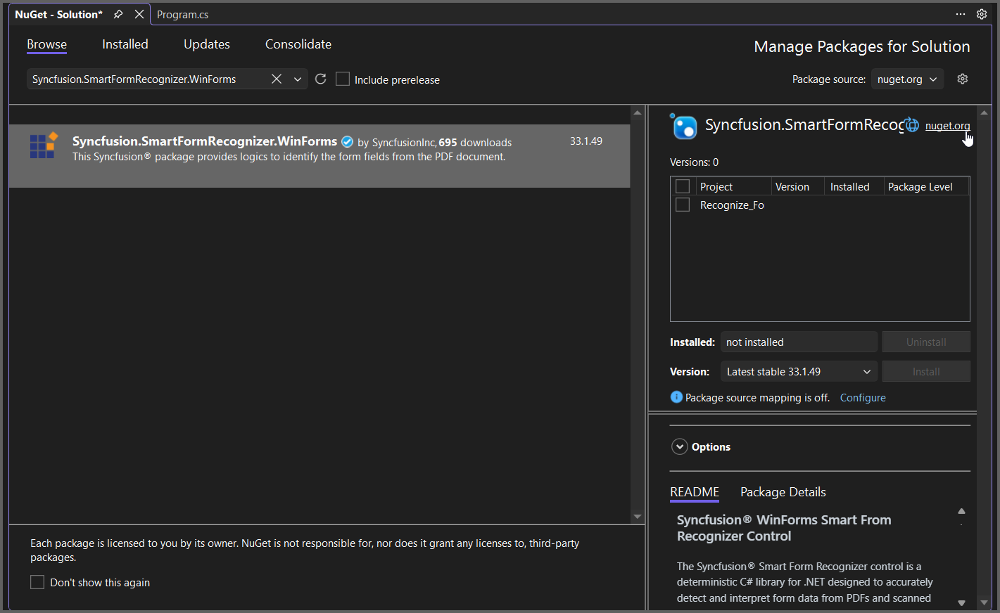

---
title: Extract Form Data in Console Application | Syncfusion
description: Learn how to extract form data in a Console Application by using the Syncfusion Smart Form Recognizer efficiently.
platform: document-processing
control: SmartFormRecognizer
documentation: UG
--- 

# Recognize Form Data from PDF in Console Application

The Syncfusion&reg; **Smart Form Recognizer** is a deterministic, on‑premise C# library for .NET that extracts form data from PDFs and scanned images. It uses visual layout heuristics like lines, boxes, and markers to consistently identify form structures. The library supports text fields, checkboxes, radio buttons, and signature regions, producing structured JSON for workflow integration.

## Steps to Recognize Form Data from PDF in Console App





 






You can download a complete working sample from [GitHub](https://github.com/SyncfusionExamples/PDF-Examples/tree/master/Data-Extraction/Getting-Started/Console/.NET/Recognize_Forms).

By executing the program, you will get the PDF document as follows.

## Recognize Form Data from PDF using .NET Framework

The following steps illustrates ecognize Form Data from PDF document in console application using .NET Framework.

**Prerequisites**:

* Install .NET SDK: Ensure that you have the .NET SDK installed on your system. You can download it from the [.NET Downloads page](https://dotnet.microsoft.com/en-us/download).
* Install Visual Studio: Download and install Visual Studio Code from the [official website](https://code.visualstudio.com/download).

**Steps to Extract Table Data from PDF using .NET Framework**

Step 1: Create a new C# Console Application (.NET Framework) project.

Step 2: Name the project.

Step 3: Install the [Syncfusion.SmartFormRecognizer.WinForms](https://www.nuget.org/packages/Syncfusion.SmartFormRecognizer.WinForms/) NuGet package as reference to your .NET Standard applications from [NuGet.org](https://www.nuget.org).

Step 4: Include the following namespaces in the *Program.cs*.



using Syncfusion.SmartFormRecognizer;
using System.IO;



Step 5: Include the following code sample in *Program.cs* to Extract table data from an PDF file.



    // Read the input PDF file as stream.
    using (FileStream inputStream = new FileStream(Path.GetFullPath("Input.pdf"), FileMode.Open, FileAccess.ReadWrite))
    {
        // Initialize the Form Recognizer.
        FormRecognizer smartFormRecognizer = new FormRecognizer();
        // Recognize the form and get the output as JSON string.
        string outputJson = smartFormRecognizer.RecognizeFormAsJson(inputStream);
        // Save the output JSON to file.
        File.WriteAllText(Path.GetFullPath("Output.json"), outputJson);
    }



Step 6: Build the project.

Click on Build > Build Solution or press Ctrl + Shift + B to build the project.

Step 7: Run the project.

Click the Start button (green arrow) or press F5 to run the app.

You can download a complete working sample from [GitHub](https://github.com/SyncfusionExamples/PDF-Examples/tree/master/Data-Extraction/Getting-Started/Console/.NETFramework/Recognize_Forms).

By executing the program, you will get the PDF document as follows.

