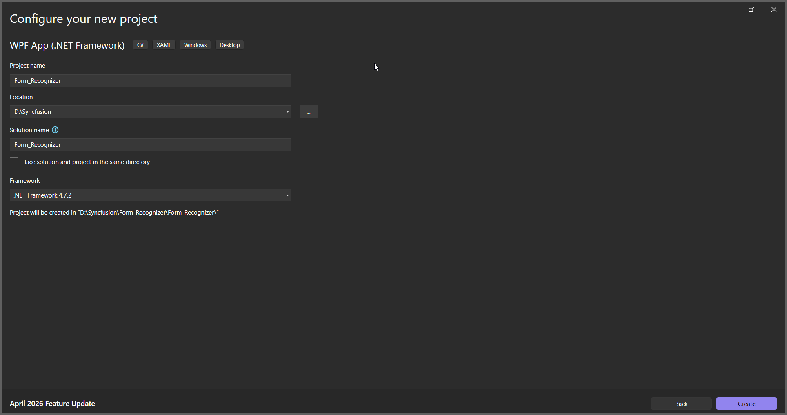
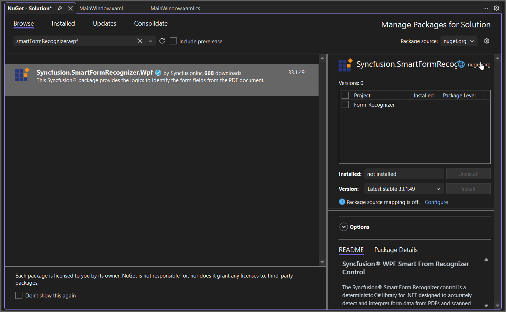

# Recognize Form Data from PDF in WPF Application

The Syncfusion&reg; Smart Form Recognizer is a deterministic, on‑premise C# library for .NET that extracts form data from PDFs and scanned images. It uses visual layout heuristics like lines, boxes, and markers to consistently identify form structures. The library supports text fields, checkboxes, radio buttons, and signature regions, producing structured JSON for workflow integration.

## Steps to Recognize Form Data from PDF document in WPF

Step 1: Create a new WPF application project.
  

In project configuration window, name your project and select Create.

Step 2: Install the [Syncfusion.SmartFormRecognizer.WPF](https://www.nuget.org/packages/Syncfusion.SmartFormRecognizer.WPF) NuGet package as a reference to your WPF application [NuGet.org](https://www.nuget.org/).

Step 3: Include the following namespaces in the MainWindow.xaml.cs file.



using Syncfusion.SmartFormRecognizer;
using System;
using System.IO;
using System.Text;
using System.Windows;



Step 4: Add a new button in MainWindow.xaml to Extract data from PDF document as follows.



	<Grid>
		<Button Content="Recognize Form from PDF"
                Width="220" Height="40"
                HorizontalAlignment="Center"
                VerticalAlignment="Center"
                Click="ExtractButton_Click"/>
	</Grid>



Step 5: Add the following code in `btnCreate_Click` to extract table data from a PDF document using the **RecognizeFormAsJson**  method in the **FormRecognizer** class. The extracted content will be saved as a JSON file 



// Read the input PDF file as stream.
using (FileStream inputStream = new FileStream(System.IO.Path.GetFullPath(@"Input.pdf"), FileMode.Open, FileAccess.ReadWrite))
{
    // Initialize the Form Recognizer.
    FormRecognizer smartFormRecognizer = new FormRecognizer();
    // Recognize the form and get the output as JSON string.
    string outputJson = smartFormRecognizer.RecognizeFormAsJson(inputStream);
    // Save the output JSON to file.
    File.WriteAllText(System.IO.Path.GetFullPath("Output.json"), outputJson, Encoding.UTF8);
}



By executing the program, you will get the PDF document as follows.
 

A complete working sample can be downloaded from [Github](https://github.com/SyncfusionExamples/PDF-Examples/tree/master/Data-Extraction/Getting-Started/WPF/Recognize_Forms).

 Click [here](https://www.syncfusion.com/document-sdk/net-pdf-data-extraction) to explore the rich set of Syncfusion&reg;Data Extraction library features.  
 