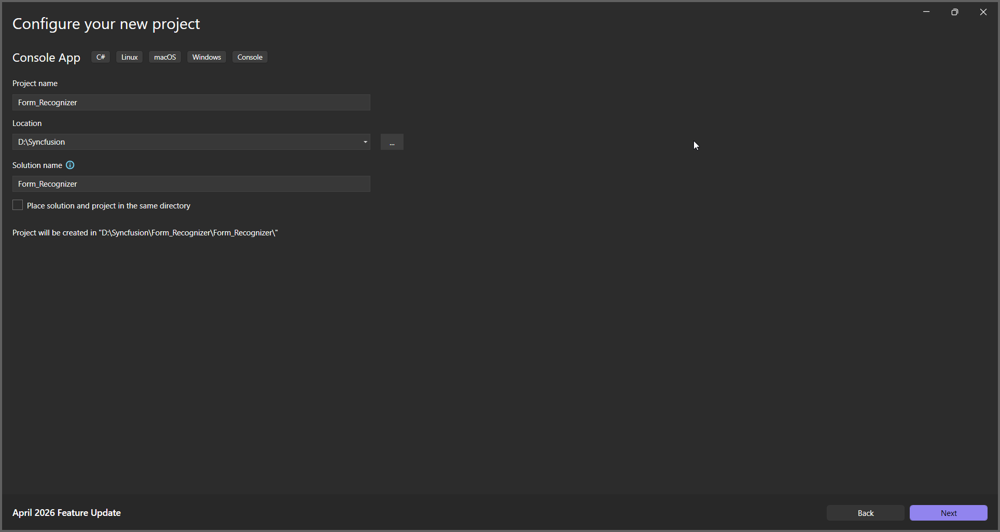
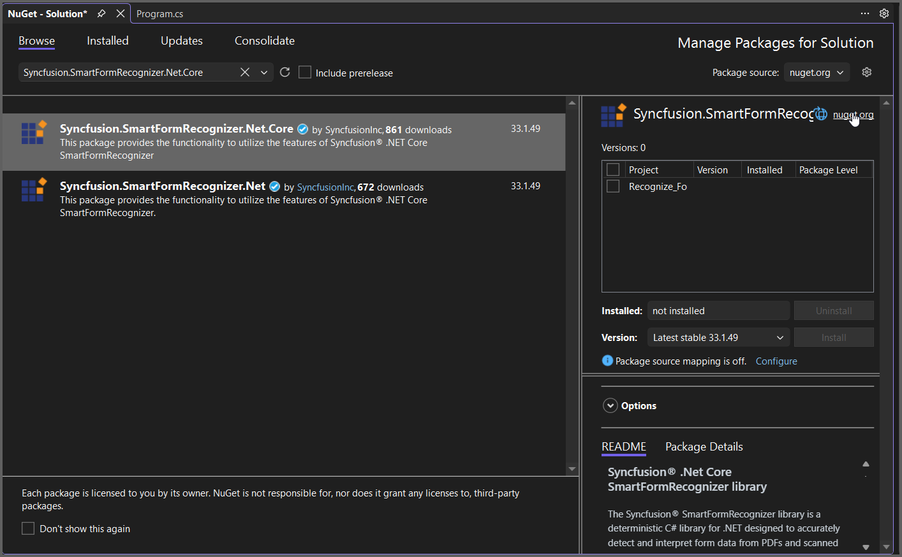

**Prerequisites**:

* Install .NET SDK: Ensure that you have the .NET SDK installed on your system. You can download it from the [.NET Downloads page](https://dotnet.microsoft.com/en-us/download).
* Install Visual Studio: Download and install Visual Studio Code from the [official website](https://code.visualstudio.com/download).

Step 1: Create a new C# Console Application project.

Step 2: Name the project.

Step 3: Install the [Syncfusion.SmartFormRecognizer.Net.Core](https://www.nuget.org/packages/Syncfusion.SmartFormRecognizer.Net.Core) NuGet package as reference to your .NET Standard applications from [NuGet.org](https://www.nuget.org).

Step 4: Include the following namespaces in the *Program.cs* file.



using Syncfusion.SmartFormRecognizer;
using System.IO;



Step 5: Include the below code snippet in *Program.cs* to Recognize form data from an PDF file.




 
// Read the input PDF file as stream.
using (FileStream inputStream = new FileStream(Path.GetFullPath("Input.pdf"), FileMode.Open, FileAccess.ReadWrite))
{
    // Initialize the Form Recognizer.
    FormRecognizer smartFormRecognizer = new FormRecognizer();
    // Recognize the form and get the output as JSON string.
    string outputJson = smartFormRecognizer.RecognizeFormAsJson(inputStream);
    // Save the output JSON to file.
    File.WriteAllText(Path.GetFullPath("Output.json"), outputJson);
}





Step 6: Build the project.

Click on Build > Build Solution or press Ctrl + Shift + B to build the project.

Step 7: Run the project.

Click the Start button (green arrow) or press F5 to run the app.