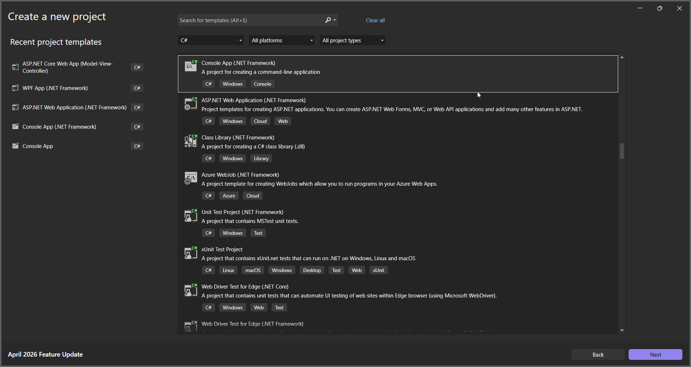
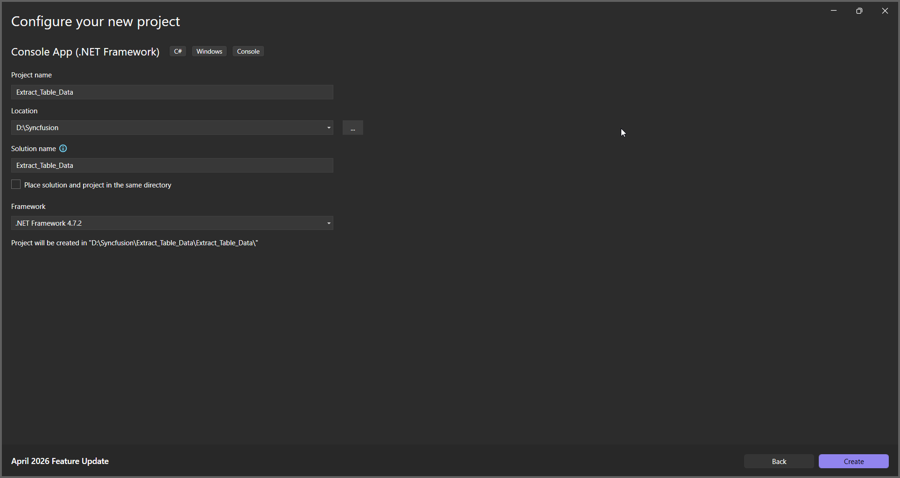
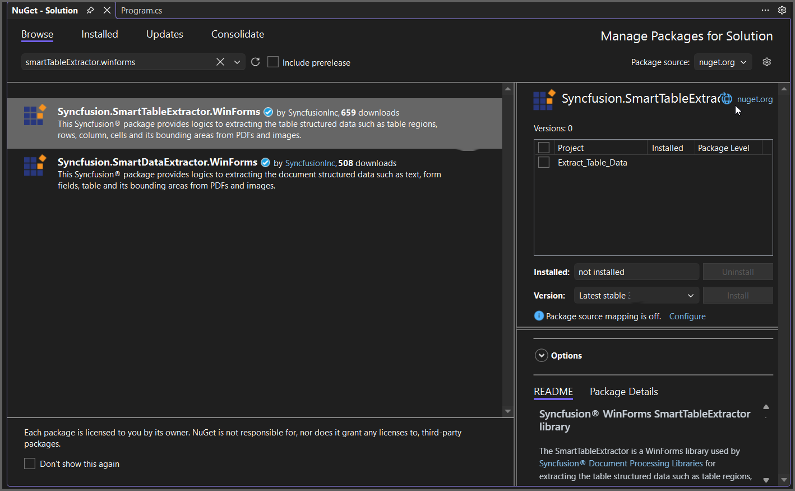

---
title: Extract Table Data in Console Application | Syncfusion
description: Learn how to extract table data in a Console Application by using the Syncfusion Smart Table Extractor efficiently.
platform: document-processing
control: SmartTableExtractor
documentation: UG
--- 

# Extract Table Data from PDF in Console Application

The Syncfusion&reg; Smart Table Extractor is a .NET library used to detect and extract tabular data from PDFs and scanned images in ASP.NET Core applications. It provides structured outputs with confidence scores for downstream processing.

## Steps to Extract Table Data from PDF in Console App





 






You can download a complete working sample from [GitHub](https://github.com/SyncfusionExamples/PDF-Examples/tree/master/Data-Extraction/Getting-Started/Console/.NET/Extract_Table_Data).

By executing the program, you will get the PDF document as follows.

## Extract Table Data from PDF using .NET Framework

The following steps illustrates Extracting Table Data from PDF document in console application using .NET Framework.

**Prerequisites**:

* Install .NET SDK: Ensure that you have the .NET SDK installed on your system. You can download it from the [.NET Downloads page](https://dotnet.microsoft.com/en-us/download).
* Install Visual Studio: Download and install Visual Studio Code from the [official website](https://code.visualstudio.com/download).

**Steps to Extract Table Data from PDF using .NET Framework**

Step 1: Create a new C# Console Application (.NET Framework) project.

Step 2: Name the project.

Step 3: Install the [Syncfusion.SmartTableExtractor.WinForms](https://www.nuget.org/packages/Syncfusion.SmartTableExtractor.WinForms/) NuGet package as reference to your .NET Standard applications from [NuGet.org](https://www.nuget.org).

Step 4: Include the following namespaces in the *Program.cs*.



using System.IO;
using System.Text;
using Syncfusion.SmartTableExtractor;



Step 5: Include the following code sample in *Program.cs* to Extract table data from an PDF file.



//Open the input PDF file as a stream.
using (FileStream stream = new FileStream("Input.pdf", FileMode.Open, FileAccess.Read))
{
    // Initialize the Smart Table Extractor
    TableExtractor extractor = new TableExtractor();
    //Extract table data from the PDF document as JSON string.
    string data = extractor.ExtractTableAsJson(stream);
    //Save the extracted JSON data into an output file.
    File.WriteAllText("Output.json", data, Encoding.UTF8);
}



Step 6: Build the project.

Click on Build > Build Solution or press Ctrl + Shift + B to build the project.

Step 7: Run the project.

Click the Start button (green arrow) or press F5 to run the app.

You can download a complete working sample from [GitHub](https://github.com/SyncfusionExamples/PDF-Examples/tree/master/Data-Extraction/Getting-Started/Console/.NETFramework/Extract_Table_Data).

By executing the program, you will get the PDF document as follows.

