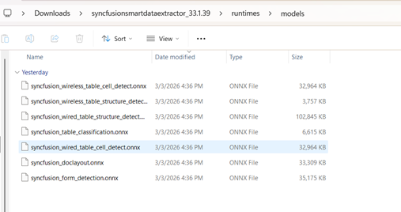
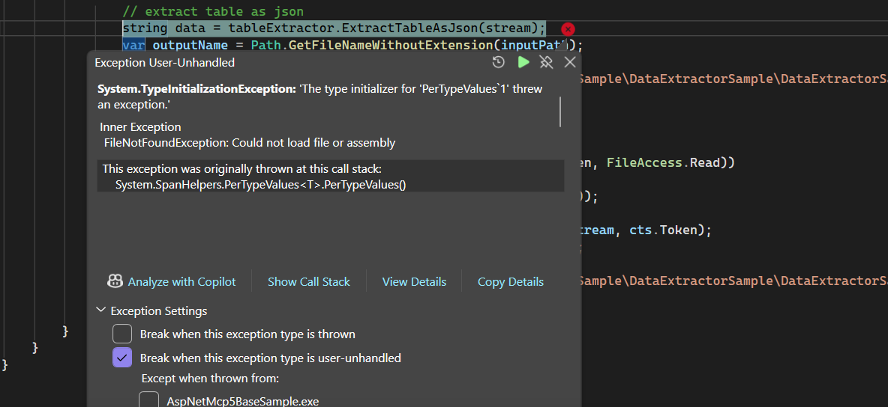
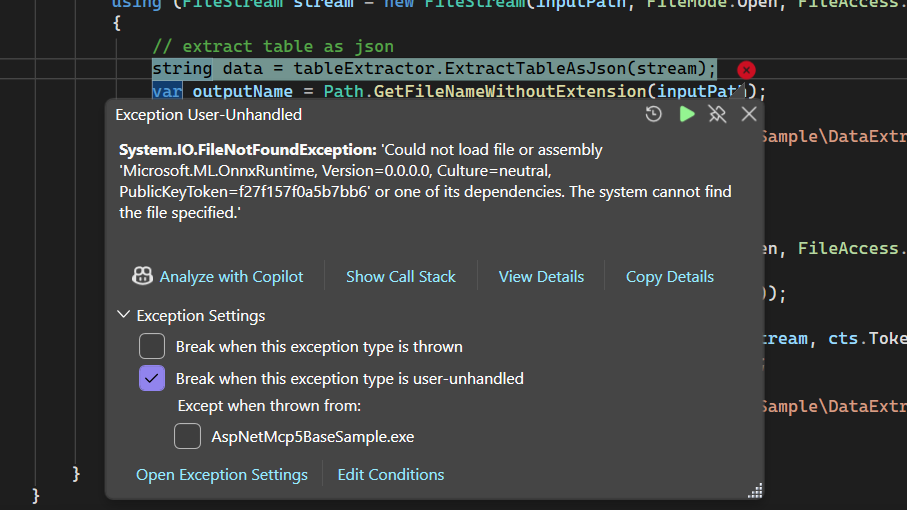

# Troubleshooting and FAQ

## ONNX file missing

<table>
<th style="font-size:14px" width="100px">Exception</th>
<th style="font-size:14px">Blink files are missing</th>
<tr>
<th style="font-size:14px" width="100px">Reason
</th>
<td>The required ONNX model files are not copied into the application’s build output.
</td>
</tr>
<tr>
<th style="font-size:14px" width="100px">Solution</th>
<td>
1. Run a build so the application output is generated under `bin\Debug\netX.X\runtimes` (or your configured build configuration and target framework). 
2. Locate the project's build output `bin` path (for example: `bin\Debug\net10.0\runtimes`). 
3. Place all required ONNX model files into a `runtimes\models` folder inside that bin path. 
4. In Visual Studio, for each ONNX file set **Properties → Copy to Output Directory → Copy always** so the model is included on every build. 
5. Rebuild and run your project. The extractor should now find the ONNX models and operate correctly.
  
Please refer to the below screenshot,
  

  
Notes:

- If you publish your application, ensure the `runtimes\models` folder and ONNX files are included in the publish output (you may need to mark files as content in the project file or use a <Content> entry).
- If you prefer an automated approach, add the ONNX files to your project with `CopyToOutputDirectory` set, or create a post-build step to copy the models into the runtime folder.

If the problem persists after adding the model files, verify file permissions and the correctness of the model file names.
</td>
</tr>
</table>

## System.TypeInitializationException

<table>
<th style="font-size:14px" width="100px">Exception
</th>
<th style="font-size:14px">System.TypeInitializationException. 
</th>

<tr>
<th style="font-size:14px" width="100px">Reason
</th>
<td>The application cannot load *System.Runtime.CompilerServices.Unsafe* or one of its dependencies.  
**Inner Exception**: *FileNotFoundException* — Could not load file or assembly 'System.Runtime.CompilerServices.Unsafe, Version=4.0.4.1, Culture=neutral, PublicKeyToken=b03f5f7f11d50a3a' or one of its dependencies.
</td>
</tr>

<tr>
<th style="font-size:14px" width="100px">Solution
</th>
<td>Install the NuGet package **Microsoft.ML.OnnxRuntime (Version 1.18.0)** manually in your sample/project.  
This package is required for **SmartTableExtractor** across **WPF** and **WinForms**. 

  
Please refer to the below screenshot,
  

  
</td>
</tr>
</table>

## FileNotFoundException (Microsoft.ML.OnnxRuntime)

<table>

<th style="font-size:14px" width="100px">Exception
</th>
<th style="font-size:14px">FileNotFoundException (Microsoft.ML.OnnxRuntime)
</th>

<tr>
<th style="font-size:14px" width="100px">Reason
</th>
<td>The application cannot load the *Microsoft.ML.OnnxRuntime* assembly or one of its dependencies. 
</td>
</tr>

<tr>
<th style="font-size:14px" width="100px">Solution
</th>
<td>Install the NuGet package **Microsoft.ML.OnnxRuntime (Version 1.18.0)** manually in your sample/project.  
This package is required for **SmartTableExtractor** across **WPF** and **WinForms**.
  
Please refer to the below screenshot,
  

   
</td>
</tr>
</table>

