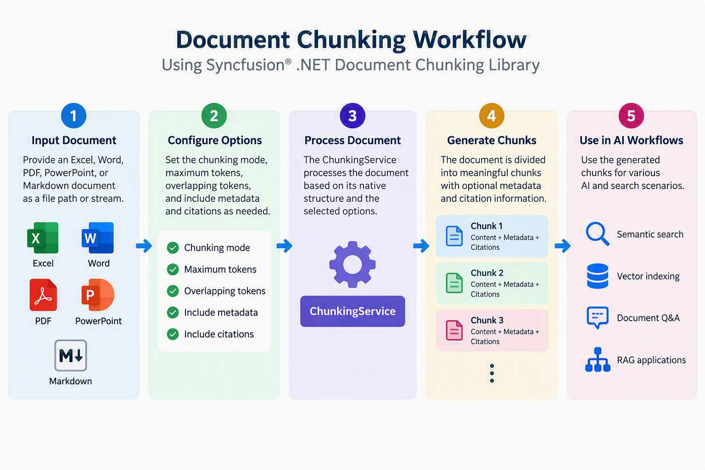

# About Syncfusion .NET Document Chunking Library

The Syncfusion® .NET Document Chunking Library divides Excel, Word, PDF, PowerPoint, and Markdown documents into meaningful chunks for Retrieval-Augmented Generation (RAG) workflows. The generated chunks are suitable for embedding generation, semantic search, vector indexing, hybrid search, document Q&A, grounded AI responses, citation-based retrieval, and enterprise RAG ingestion pipelines.

The library processes documents based on their native structure to retain relevant elements such as worksheets, paragraphs, tables, pages, slides, sections, and headings. Using the unified `ChunkingService` API, you can select an appropriate chunking mode, configure the chunk size and overlap, and optionally include metadata and citation details in the generated chunks.

## Document Chunking Workflow

The Document Chunking Library processes a source document and generates structured chunks that can be used in search, retrieval, and AI workflows.

The document chunking workflow consists of the following stages:

1. **Provide the source document**
Provide an Excel, Word, PDF, PowerPoint, or Markdown document as a file path or stream.

2. **Configure the chunking options**
Configure the maximum token count, token overlap, metadata, citations, and document-specific chunking mode by using the `ChunkingOptions` class.

3. **Process the document**
The `ChunkingService` processes the document based on its native structure and the selected chunking mode.

4. **Generate structured chunks**
The service divides the document content into chunks. Each generated chunk contains the extracted content and can optionally include metadata and citation information.

5. **Use the generated chunks**
Use the generated chunks for embedding generation, semantic search, vector indexing, hybrid search, document Q&A, grounded AI responses, citation-based retrieval, and RAG applications.

The following diagram illustrates the Document Chunking Library workflow:

## Chunking Result

The `ChunkingService` returns an `IChunkingResult` containing the generated chunks. Each `IChunk` can provide the following information:
- A unique chunk identifier
- The position of the chunk in the result
- The content extracted from the source document
- The source document and chunk metadata
- Citation text and source-location details

The metadata and citation information can vary depending on the source document format, selected chunking mode, and source content type.

## Key Features

- Supports structural chunking of Excel, Word, PDF, PowerPoint, and Markdown documents.
- Provides Auto, Table, Paragraph, Worksheet, Section, Page, Slide, Notes, and Heading modes based on the selected document format.
- Supports configuring chunk size and overlap using `MaxTokens` and `OverlapTokens`.
- Supports including metadata and source citations in the generated chunks.
- Preserves relevant document structures and location details during chunking.

## Supported File Formats

<table>
  <tr>
    <th>Format</th>
    <th>Extensions</th>
  </tr>
  <tr>
    <td>Excel</td>
    <td><code>.xlsx</code>, <code>.xls</code>, <code>.xlsm</code>, <code>.xlsb</code></td>
  </tr>
  <tr>
    <td>Word</td>
    <td><code>.docx</code>, <code>.doc</code></td>
  </tr>
  <tr>
    <td>PDF</td>
    <td><code>.pdf</code></td>
  </tr>
  <tr>
    <td>PowerPoint</td>
    <td><code>.ppt</code>,<code>.pptx</code>, <code>.pptm</code>, <code>.potx</code></td>
  </tr>
  <tr>
    <td>Markdown</td>
    <td><code>.md</code></td>
  </tr>
</table>