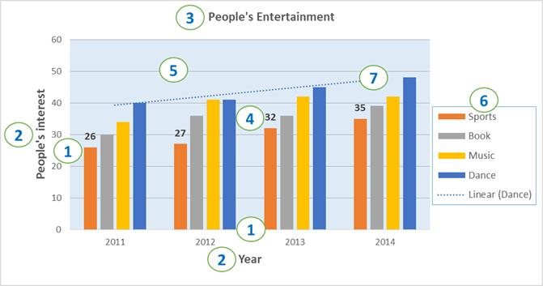

# Chart to Image Conversion in .NET Excel Library

XlsIO exposes two API surfaces for converting an Excel chart to an image:

* **`XlsIORenderer`** — the cross-platform / .NET Standard API. Use this for ASP.NET Core, Blazor, WinUI, and .NET MAUI apps.
* **`ChartToImageConverter`** — the Windows-specific / .NET Framework API. Provides additional chart-quality settings through `ScalingMode`.

Refer to the following links for the assemblies and NuGet packages required to convert a chart to an image, per platform:

* [Assemblies Information](https://help.syncfusion.com/document-processing/excel/excel-library/net/assemblies-required#converting-excel-chart-to-image)
* [NuGet Information](https://help.syncfusion.com/document-processing/excel/excel-library/net/nuget-packages-required#converting-charts-in-xlsio)

N> IMPORTANT: Before running the samples on this page, install the required NuGet package for your target platform and register your Syncfusion license key. For more information, see the [Licensing overview](https://help.syncfusion.com/document-processing/licensing/overview).

The following code snippets show how to convert an Excel chart to an image using `XlsIORenderer` (cross-platform) or [`ChartToImageConverter`](https://help.syncfusion.com/cr/document-processing/Syncfusion.ExcelChartToImageConverter.ChartToImageConverter.html) (Windows-specific).


{% highlight c# tabtitle="C# [Cross-platform]" playgroundButtonLink="https://raw.githubusercontent.com/SyncfusionExamples/XlsIO-Examples/master/Chart%20to%20Image/Chart%20to%20Image/.NET/Chart%20to%20Image/Chart%20to%20Image/Program.cs,180" %}
using (ExcelEngine excelEngine = new ExcelEngine())
{
  //Initialize application
  IApplication application = excelEngine.Excel;

  //Set the default version as Xlsx
  application.DefaultVersion = ExcelVersion.Xlsx;

  //Initialize XlsIORenderer
  application.XlsIORenderer = new XlsIORenderer();

  //Set converter chart image format to PNG or JPEG
  application.XlsIORenderer.ChartRenderingOptions.ImageFormat = ExportImageFormat.Png;

  //Set the chart image quality to best
  application.XlsIORenderer.ChartRenderingOptions.ScalingMode = ScalingMode.Best;

  //Open existing workbook with chart
  using (FileStream inputStream = new FileStream(Path.GetFullPath(@"Data/InputTemplate.xlsx"), FileMode.Open, FileAccess.Read))
  {
    IWorkbook workbook = application.Workbooks.Open(inputStream);
    IWorksheet worksheet = workbook.Worksheets[0];

    //Access the chart from the worksheet
    IChart chart = worksheet.Charts[0];

    #region Save
    //Exporting the chart as image
    using (FileStream outputStream = new FileStream(Path.GetFullPath("Output/Image.png"), FileMode.Create, FileAccess.Write))
    {
      chart.SaveAsImage(outputStream);
    }
    #endregion
  }
}



using (ExcelEngine excelEngine = new ExcelEngine())
{
  IApplication application = excelEngine.Excel;
  application.DefaultVersion = ExcelVersion.Xlsx;

  application.ChartToImageConverter = new ChartToImageConverter();
  application.ChartToImageConverter.ScalingMode = ScalingMode.Best;

  IWorkbook workbook = application.Workbooks.Open("Sample.xlsx");
  IWorksheet worksheet = workbook.Worksheets[0];
  IChart chart = worksheet.Charts[0];

  // Create the memory stream for the chart image.
  using (MemoryStream stream = new MemoryStream())
  {
    chart.SaveAsImage(stream);
    using (Image image = Image.FromStream(stream))
    {
      // Persist the rendered chart to disk.
      image.Save("Output.png");
    }
  }

  // Alternatively, write directly to disk:
  // chart.SaveAsImage("Output.png");
}



Using excelEngine As ExcelEngine = New ExcelEngine()
  Dim application As IApplication = excelEngine.Excel
  application.DefaultVersion = ExcelVersion.Xlsx

  Dim chartConverter As New ChartToImageConverter()
  application.ChartToImageConverter = chartConverter
  application.ChartToImageConverter.ScalingMode = ScalingMode.Best

  Dim workbook As IWorkbook = application.Workbooks.Open("Sample.xlsx")
  Dim worksheet As IWorksheet = workbook.Worksheets(0)
  Dim chart As IChart = worksheet.Charts(0)

  ' Create the memory stream for the chart image.
  Using stream As New MemoryStream()
    chart.SaveAsImage(stream)
    Using image As Image = Image.FromStream(stream)
      ' Persist the rendered chart to disk.
      image.Save("Output.png")
    End Using
  End Using

  ' Alternatively, write directly to disk:
  ' chart.SaveAsImage("Output.png")
End Using



A complete working example to convert an Excel chart to an image in C# is present on [this GitHub page](https://github.com/SyncfusionExamples/XlsIO-Examples/tree/master/Chart%20to%20Image/Chart%20to%20Image/.NET/Chart%20to%20Image).

N> 1. Instance of [XlsIORenderer](https://help.syncfusion.com/cr/aspnetcore-js2/Syncfusion.XlsIORenderer.XlsIORenderer.html) class is mandatory to convert the chart to image using .NET Standard 2.0 assemblies.
N> 2. In .NET Standard, the Image format and quality can be specified using the [ChartRenderingOptions](https://help.syncfusion.com/cr/aspnetcore-js2/Syncfusion.XlsIORenderer.XlsIORenderer.html#Syncfusion_XlsIORenderer_XlsIORenderer_ChartRenderingOptions) property of XlsIORenderer class. By default the [ImageFormat](https://help.syncfusion.com/cr/document-processing/Syncfusion.Drawing.ImageFormat.html) for chart is set to JPEG and [ScalingMode](https://help.syncfusion.com/cr/document-processing/Syncfusion.XlsIO.ScalingMode.html) is set to Best.
N> 3. Chart conversion to image and PDF are supported from .NET Framework 4.0 and .NET Standard 2.0 onwards 
N> 4. Chart to Image conversion also works proper in both Blazor server-side and client-side.

## Supported chart types
XlsIO supports the following chart types in image conversion.
<table>
<tr>
<td>
{{'**Chart Type**'| markdownify }}
</td>
<td>
{{'**Chart Subtypes**'| markdownify }}
</td>
</tr>
<tr>
<td>
Area
</td>
<td>
* Area 
* Area_Stacked 
* Area_Stacked_100 
* Area_3D
</td>
</tr>
<tr>
<td>
Bar
</td>
<td>
* Bar_Clustered 
* Bar_Stacked 
* Bar_Stacked_100 
* Bar_Clustered_3D 
* Bar_Stacked_3D 
* Bar_Stacked_100_3D
</td>
</tr>
<tr>
<td>
Bubble
</td>
<td>
Bubble
</td>
</tr>
<tr>
<td>
Column
</td>
<td>
* Column_Clustered 
* Column_Stacked 
* Column_Stacked_100 
* Column_3D 
* Column_Clustered_3D 
* Column_Stacked_3D 
* Column_Stacked_100_3D
</td>
</tr>
<tr>
<td>
Doughnut
</td>
<td>
* Doughnut 
* Doughnut_Exploded
</td>
</tr>
<tr>
<td>
Line
</td>
<td>
* Line 
* Line_Markers 
* Line_3D 
* Stacked_Line 
* Stacked_Line_Markers
</td>
</tr>
<tr>
<td>
Pie
</td>
<td>
* Pie 
* Pie_Exploded 
* Pie_3D 
* Pie_Exploded_3D 
* PieOfPie
</td>
</tr>
<tr>
<td>
Radar
</td>
<td>
* Radar 
* Radar_Filled 
* Radar_Markers
</td>
</tr>
<tr>
<td>
Scatter
</td>
<td>
* Scatter_Line 
* Scatter_Line_Markers 
* Scatter_Markers 
* Scatter_SmoothedLine 
* Scatter_SmoothedLine_Markers
</td>
</tr>
<tr>
<td>
Stock
</td>
<td>
* Stock_HighLowClose 
* Stock_OpenHighLowClose 
* Stock_VolumeOpenHighLowClose 
* Stock_VolumeHighLowClose
</td>
</tr>
<tr>
<td>
Excel 2016 Charts
</td>
<td>
* Funnel 
* Waterfall 
* Histogram 
* Pareto 
* Sunburst 
* Box and Whisker 
* Treemap
</td>
</tr>
</table>

N> From the above supported chart types table, Line_3D charts are not supported in chart to image conversion in .NET Core platforms.

N> Only embedded charts are supported in chart to image conversion. The Chart sheets are not supported.

N> Pie of Pie, Sunburst, Box and Whisker, and Treemap charts are supported only in .NET Core platforms for chart to image conversion.

## Supported chart elements
XlsIO supports the following chart elements in image conversion:

**Chart Elements:**
1. Axis
2. Axis titles
3. Chart title
4. Data labels
5. Grid lines
6. Legend
7. Trend line

N> NOTE: Rendering of charts from Excel documents to images (and to PDF) uses Syncfusion's own chart rendering engine. As a result, the output may not exactly match the chart in Microsoft Excel; minor differences in spacing, colors, and font metrics may occur.

## See also

* [Excel to PDF conversion guide](../..//Excel-to-PDF/NET/excel-to-pdf-conversion) — chart-to-PDF rendering uses the same `ChartToImageConverter` internally.
* [Worksheet to Image conversion](../..//Excel-to-Image/NET/worksheet-to-image-conversion) — full worksheet rendering as PNG and other formats.
* [Licensing overview](https://help.syncfusion.com/document-processing/licensing/overview) — register your license key.
