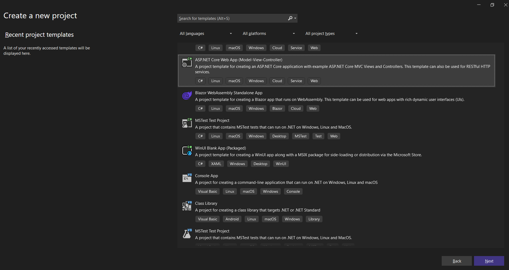
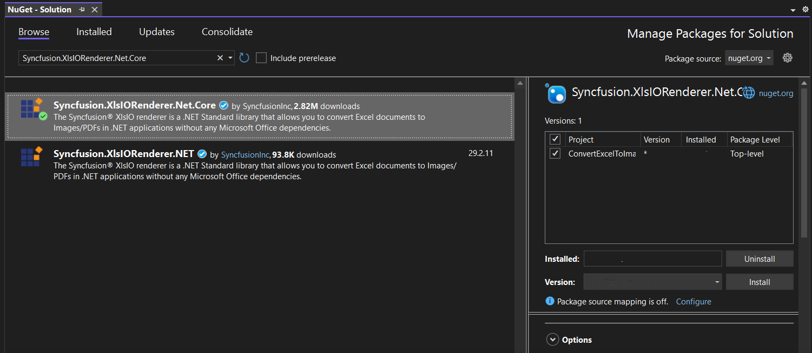
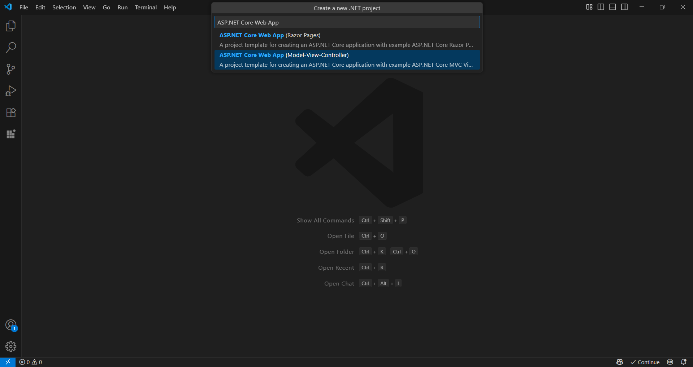
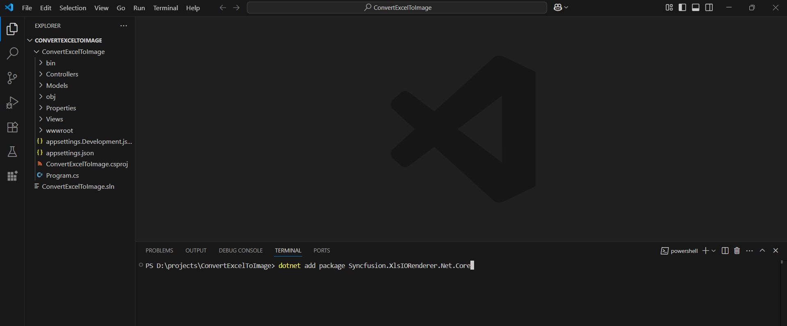

# Convert Excel document to Image in ASP.NET Core

Syncfusion&reg; XlsIO is a [.NET Core Excel library](https://www.syncfusion.com/document-processing/excel-framework/net) used to create, read, edit and **convert Excel documents** programmatically without **Microsoft Excel** or interop dependencies. Using this library, you can **convert an Excel document to Image in ASP.NET Core**.

## Steps to convert Excel document to Image in ASP.NET Core





Step 1: Create a new ASP.NET Core Web application (Model-View-Controller) project.

Step 2: Install the [Syncfusion.XlsIORenderer.Net.Core](https://www.nuget.org/packages/Syncfusion.XlsIORenderer.Net.Core) NuGet package as a reference to your project from [NuGet.org](https://www.nuget.org/).

N> Starting with v16.2.0.x, if you reference Syncfusion&reg; assemblies from trial setup or from the NuGet feed, you also have to add "Syncfusion.Licensing" assembly reference and include a license key in your projects. Please refer to this [link](https://help.syncfusion.com/common/essential-studio/licensing/overview) to know about registering Syncfusion&reg; license key in your application to use our components.

Step 3: Include the following namespaces in the HomeController.cs file.





using Syncfusion.XlsIO;
using Syncfusion.XlsIORenderer;





Step 5: A default action method named Index will be present in HomeController.cs. Right click on Index method and select **Go To View** where you will be directed to its associated view page **Index.cshtml**.

Step 6: Add a new button in the Index.cshtml as shown below.





@{
    Html.BeginForm("ConvertExceltoImage", "Home", FormMethod.Get);
    {
        

            <input type="submit" value="Convert Excel to Image" style="width:200px;height:27px" />
        

    }
    Html.EndForm();
}





Step 7: Add a new action method **ConvertExceltoImage** in HomeController.cs and include the below code snippet to **convert the Excel document to image**.





using (ExcelEngine excelEngine = new ExcelEngine())
{
  IApplication application = excelEngine.Excel;
  application.DefaultVersion = ExcelVersion.Xlsx;
  IWorkbook workbook = application.Workbooks.Open("InputTemplate.xlsx");
  IWorksheet worksheet = workbook.Worksheets[0];

  //Initialize XlsIO renderer.
  application.XlsIORenderer = new XlsIORenderer();

  //Create the MemoryStream to save the image.      
  MemoryStream imageStream = new MemoryStream();

  //Save the converted image to MemoryStream.
  worksheet.ConvertToImage(worksheet.UsedRange, imageStream);
  imageStream.Position = 0;

  //Download image in the browser.
  return File(imageStream, "application/jpeg", "Sample.jpeg");
}






 


Step 1: Create a new ASP.NET Core Web application project.
* Open the command palette by pressing <kbd>Ctrl</kbd>+<kbd>Shift</kbd>+<kbd>P</kbd> and type **.NET:New Project** and enter.
* Choose the **ASP.NET Core Web App( Model-View-Controller) MVC** template.

* Select the project location, type the project name and press enter.
* Then choose **Create project**.

Step 2: To **convert a Excel document to image in ASP.NET Core Web app**, install [Syncfusion.XlsIORenderer.Net.Core](https://www.nuget.org/packages/Syncfusion.XlsIORenderer.Net.Core) to the ASP.NET Core project.
* Press <kbd>Ctrl</kbd> + <kbd>`</kbd> (backtick) to open the integrated terminal in Visual Studio Code.
* Ensure you're in the project root directory where your .csproj file is located.
* Run the command `dotnet add package Syncfusion.XlsIORenderer.Net.Core` to install the NuGet package.

N> Starting with v16.2.0.x, if you reference Syncfusion&reg; assemblies from trial setup or from the NuGet feed, you also have to add "Syncfusion.Licensing" assembly reference and include a license key in your projects. Please refer to this [link](https://help.syncfusion.com/common/essential-studio/licensing/overview) to know about registering Syncfusion&reg; license key in your application to use our components.

Step 3: Include the following namespaces in the HomeController.cs file.





using Syncfusion.XlsIO;
using Syncfusion.XlsIORenderer;





Step 4: A default action method named Index will be present in HomeController.cs. Right click on Index method and select **Go To View** where you will be directed to its associated view page **Index.cshtml**.

Step 5: Add a new button in the Index.cshtml as shown below.





@{
    Html.BeginForm("ConvertExceltoImage", "Home", FormMethod.Get);
    {
        

            <input type="submit" value="Convert Excel to Image" style="width:200px;height:27px" />
        

    }
    Html.EndForm();
}





Step 6: Add a new action method **ConvertExceltoImage** in HomeController.cs and include the below code snippet to **convert the Excel document to image**.





using (ExcelEngine excelEngine = new ExcelEngine())
{
  IApplication application = excelEngine.Excel;
  application.DefaultVersion = ExcelVersion.Xlsx;
  IWorkbook workbook = application.Workbooks.Open("InputTemplate.xlsx");
  IWorksheet worksheet = workbook.Worksheets[0];

  //Initialize XlsIO renderer.
  application.XlsIORenderer = new XlsIORenderer();

  //Create the MemoryStream to save the image.      
  MemoryStream imageStream = new MemoryStream();

  //Save the converted image to MemoryStream.
  worksheet.ConvertToImage(worksheet.UsedRange, imageStream);
  imageStream.Position = 0;

  //Download image in the browser.
  return File(imageStream, "application/jpeg", "Sample.jpeg");
}






 


You can download a complete working sample from <a href="https://github.com/SyncfusionExamples/XlsIO-Examples/tree/master/Getting%20Started/ASP.NET%20Core/ConvertExcelToImage">GitHub</a>.

By executing the program, you will get the **image** as follows.

    

Click [here](https://www.syncfusion.com/document-processing/excel-framework/net-core) to explore the rich set of Syncfusion&reg; Excel library (XlsIO) features.

An online sample link to [convert an Excel document to Image](https://ej2.syncfusion.com/aspnetcore/Excel/WorksheetToImage#/material3) in ASP.NET Core.