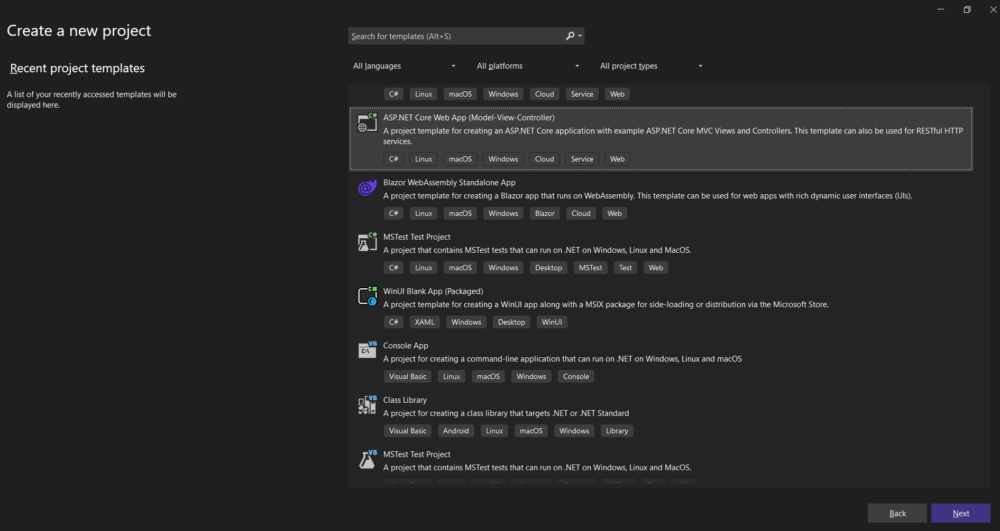
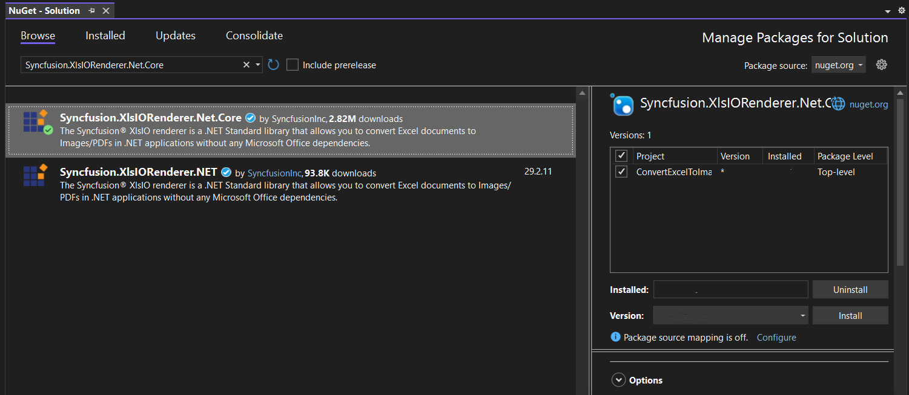
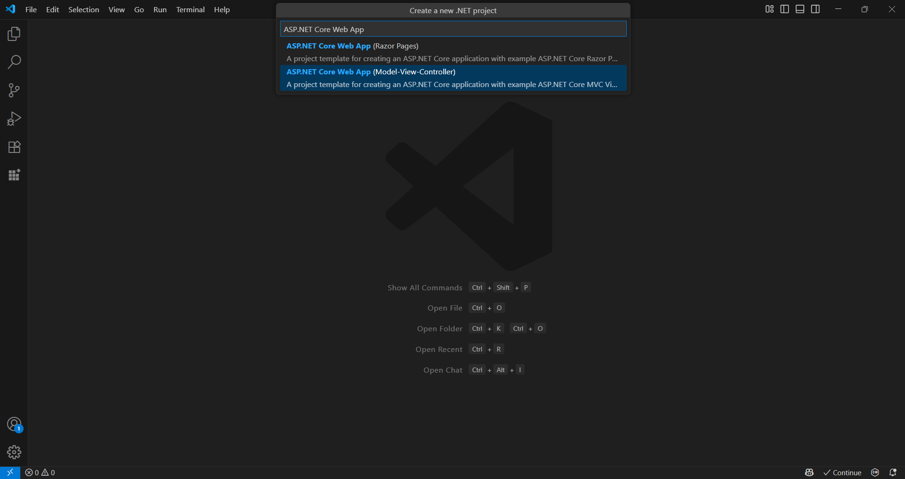
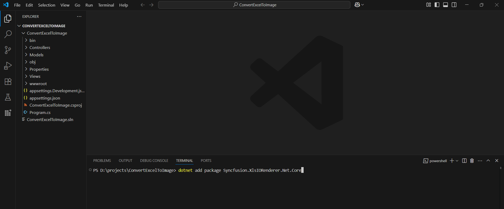

# Convert Excel document to Image in ASP.NET Core

Syncfusion<sup>&reg;</sup> XlsIO is a [.NET Core Excel library](https://www.syncfusion.com/document-sdk/net-excel-library) used to create, read, edit and **convert Excel documents** programmatically without **Microsoft Excel** or interop dependencies. Using this library, you can **convert an Excel document to Image in ASP.NET Core**.

## Steps to convert Excel document to Image in ASP.NET Core





Step 1: Create a new **ASP.NET Core Web App (Model-View-Controller)** project (Visual Studio → **File** → **New** → **Project** → **ASP.NET Core Web App (Model-View-Controller)**). Target **.NET 8.0** (or .NET 6 / 7) and set **Authentication** to **No Authentication** to keep the sample minimal.



Step 2: Install the [Syncfusion.XlsIORenderer.Net.Core](https://www.nuget.org/packages/Syncfusion.XlsIORenderer.Net.Core) NuGet package as a reference to your project from [NuGet.org](https://www.nuget.org/). This package transitively pulls in the required `Syncfusion.XlsIO.Net.Core` and `Syncfusion.Pdf.Net.Core` assemblies.



N> Starting with v16.2.0.x, if you reference Syncfusion<sup>&reg;</sup> assemblies from the trial setup or from the NuGet feed, you must also add the `Syncfusion.Licensing` reference and register a license key. Refer to this [link](https://help.syncfusion.com/common/essential-studio/licensing/overview) to learn how to register the Syncfusion<sup>&reg;</sup> license key. The simplest approach is to add the following call in `Program.cs` before `app.Run()`:
> ```csharp
> Syncfusion.Licensing.SyncfusionLicenseProvider.RegisterLicense("YOUR_LICENSE_KEY");
> ```

Step 3: Add the following namespaces in **HomeController.cs**.





using Syncfusion.XlsIO;
using Syncfusion.XlsIORenderer;





Step 4: Add a new submit button to **Index.cshtml** (inside the existing `<div class="text-center">` block) as shown below.





@{
    Html.BeginForm("ConvertExceltoImage", "Home", FormMethod.Get);
    {
        <div>
            <input type="submit" value="Convert Excel to Image" style="width:200px;height:27px" />
        </div>
    }
    Html.EndForm();
}





Step 5: Add a new action method named `ConvertExceltoImage` in **HomeController.cs** and include the following code to convert the Excel document to an image. Place a `InputTemplate.xlsx` file in the project's `wwwroot` folder so the relative path resolves at runtime.




public IActionResult ConvertExceltoImage()
{
    using (ExcelEngine excelEngine = new ExcelEngine())
    {
        IApplication application = excelEngine.Excel;
        application.DefaultVersion = ExcelVersion.Xlsx;

        //Open the existing Excel workbook from wwwroot.
        IWorkbook workbook = application.Workbooks.Open("InputTemplate.xlsx");
        IWorksheet worksheet = workbook.Worksheets[0];

        //Initialize the XlsIO renderer.
        application.XlsIORenderer = new XlsIORenderer();

        //Create a MemoryStream to save the converted image.
        MemoryStream imageStream = new MemoryStream();

        //Save the converted image to the MemoryStream.
        worksheet.ConvertToImage(worksheet.UsedRange, imageStream);
        imageStream.Position = 0;

        //Close the workbook to release resources.
        workbook.Close();

        //Return the image for download in the browser.
        return File(imageStream, "application/jpeg", "Sample.jpeg");
    }
}






 


Step 1: Create a new ASP.NET Core Web application project.
* Open the command palette by pressing <kbd>Ctrl</kbd>+<kbd>Shift</kbd>+<kbd>P</kbd> and type **.NET: New Project** and press Enter.
* Choose the **ASP.NET Core Web App (Model-View-Controller)** template.



* Select the project location, type the project name, and press Enter.
* Then choose **Create project**.

Step 2: To convert an Excel document to an image in an ASP.NET Core Web app, install [Syncfusion.XlsIORenderer.Net.Core](https://www.nuget.org/packages/Syncfusion.XlsIORenderer.Net.Core) to the ASP.NET Core project.
* Press <kbd>Ctrl</kbd> + <kbd>`</kbd> (backtick) to open the integrated terminal in Visual Studio Code.
* Ensure you're in the project root directory where your .csproj file is located.
* Run the command `dotnet add package Syncfusion.XlsIORenderer.Net.Core` to install the NuGet package.



N> Starting with v16.2.0.x, if you reference Syncfusion<sup>&reg;</sup> assemblies from the trial setup or from the NuGet feed, you must also add the `Syncfusion.Licensing` reference and register a license key. Refer to this [link](https://help.syncfusion.com/common/essential-studio/licensing/overview) to learn how to register the Syncfusion<sup>&reg;</sup> license key. The simplest approach is to add the following call in `Program.cs` before `app.Run()`:
> ```csharp
> Syncfusion.Licensing.SyncfusionLicenseProvider.RegisterLicense("YOUR_LICENSE_KEY");
> ```

Step 3: Add the following namespaces in **HomeController.cs**.





using Syncfusion.XlsIO;
using Syncfusion.XlsIORenderer;





Step 4: Add a new submit button to **Index.cshtml** (inside the existing `<div class="text-center">` block) as shown below.





@{
    Html.BeginForm("ConvertExceltoImage", "Home", FormMethod.Get);
    {
        <div>
            <input type="submit" value="Convert Excel to Image" style="width:200px;height:27px" />
        </div>
    }
    Html.EndForm();
}





Step 5: Add a new action method named `ConvertExceltoImage` in **HomeController.cs** and include the following code to convert the Excel document to an image. Place a `InputTemplate.xlsx` file in the project's `wwwroot` folder so the relative path resolves at runtime.




public IActionResult ConvertExceltoImage()
{
    using (ExcelEngine excelEngine = new ExcelEngine())
    {
        IApplication application = excelEngine.Excel;
        application.DefaultVersion = ExcelVersion.Xlsx;

        //Open the existing Excel workbook from wwwroot.
        IWorkbook workbook = application.Workbooks.Open("InputTemplate.xlsx");
        IWorksheet worksheet = workbook.Worksheets[0];

        //Initialize the XlsIO renderer.
        application.XlsIORenderer = new XlsIORenderer();

        //Create a MemoryStream to save the converted image.
        MemoryStream imageStream = new MemoryStream();

        //Save the converted image to the MemoryStream.
        worksheet.ConvertToImage(worksheet.UsedRange, imageStream);
        imageStream.Position = 0;

        //Close the workbook to release resources.
        workbook.Close();

        //Return the image for download in the browser.
        return File(imageStream, "application/jpeg", "Sample.jpeg");
    }
}






 


You can download a complete working sample from [GitHub](https://github.com/SyncfusionExamples/XlsIO-Examples/tree/master/Getting%20Started/ASP.NET%20Core/ConvertExcelToImage).

By executing the program, you will get the **image** as shown below.

    

Click [here](https://www.syncfusion.com/document-sdk/net-excel-library) to explore the rich set of Syncfusion<sup>&reg;</sup> Excel library (XlsIO) features.

An online sample link to [convert an Excel document to Image](https://ej2.syncfusion.com/aspnetcore/Excel/WorksheetToImage#/material3) in ASP.NET Core.