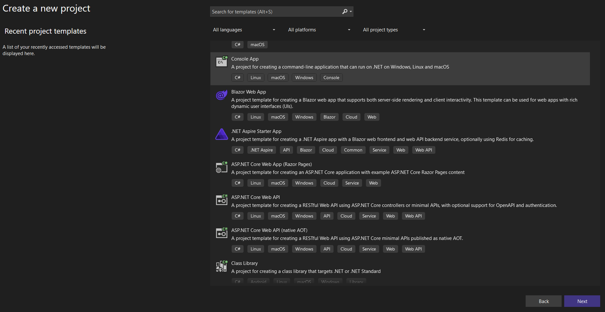
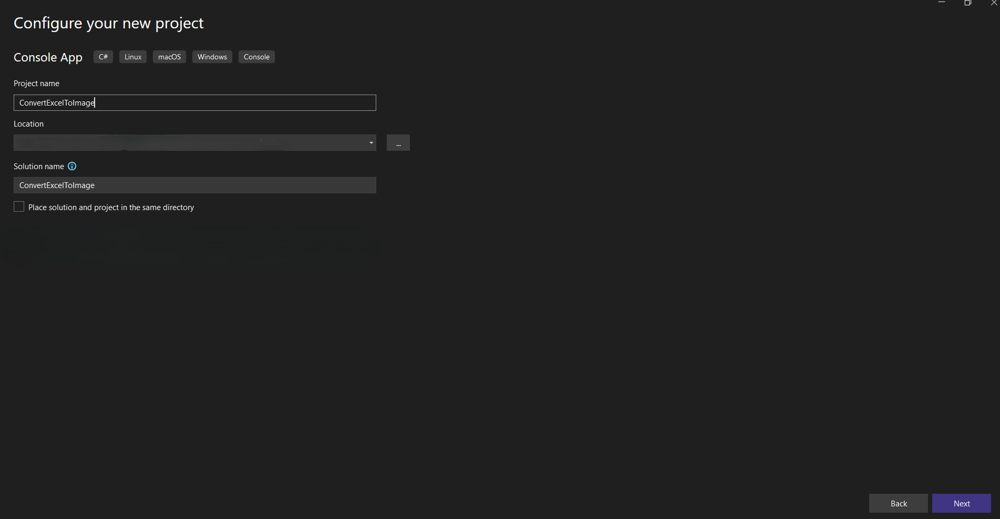
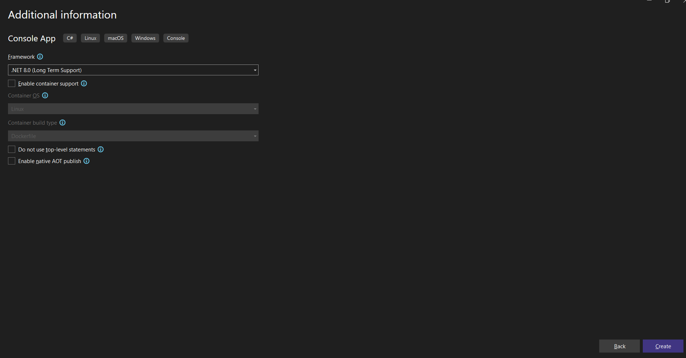
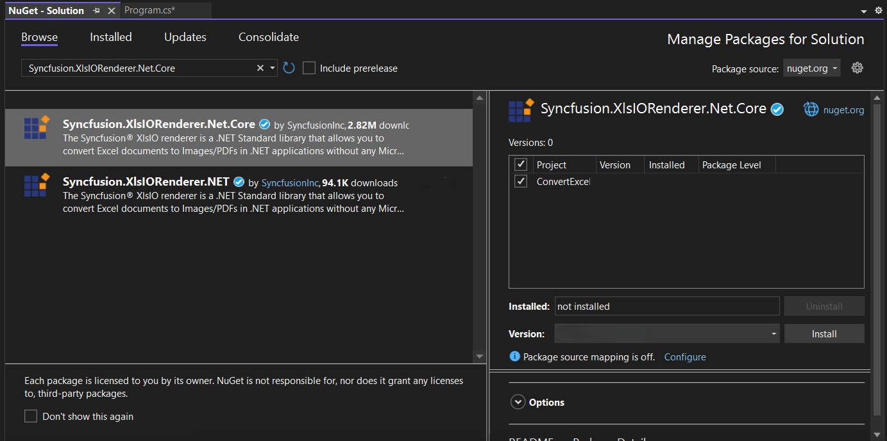
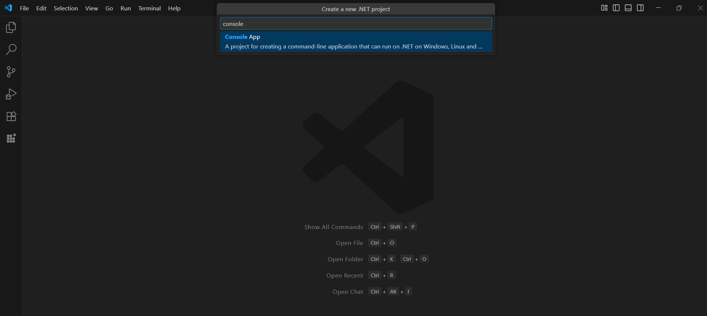
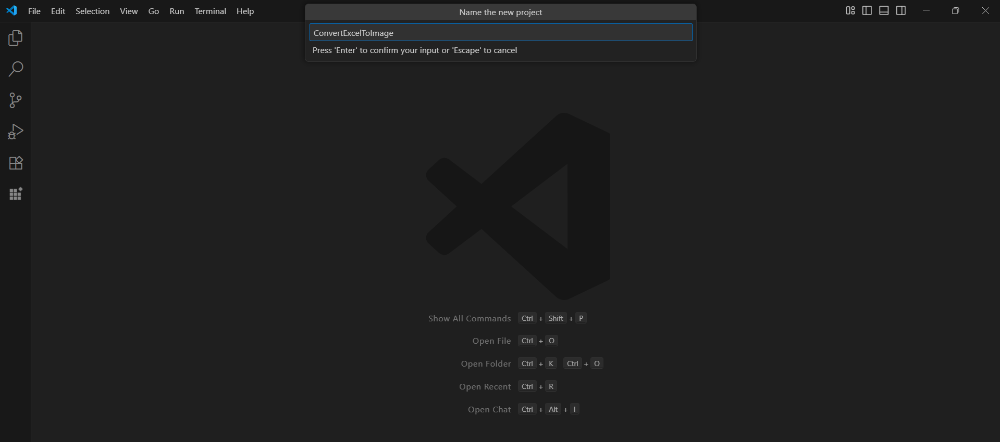
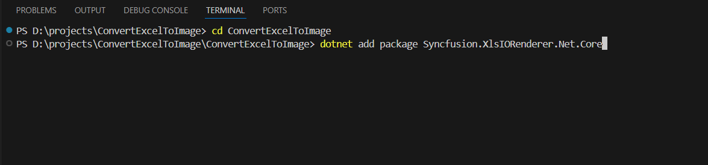

---
title: Convert an Excel document to Image on Mac | Syncfusion
description: Convert an Excel document to an image on Mac using the Syncfusion .NET Core Excel library (XlsIO), without Microsoft Office.
platform: document-processing
control: XlsIO
documentation: UG
---
# Convert an Excel document to Image on Mac

Syncfusion<sup>&reg;</sup> XlsIO is a [.NET Core Excel library](https://www.syncfusion.com/document-processing/excel-framework/net-core/excel-library) used to create, read, edit, and **convert Excel documents** programmatically without **Microsoft Excel** or interop dependencies. Using this library, you can **convert an Excel document to an image on Mac**.

## Prerequisites

Install the following before proceeding:

* **.NET SDK 6.0 or later** (verify with `dotnet --version`).
* **Supported macOS versions**: macOS 11 (Big Sur) or later, on both Intel and Apple Silicon (M1/M2/M3) Macs.
* A valid **Syncfusion license key** registered in the project (see the licensing note after Step 4 / Step 3).

## Steps to convert an Excel document to Image on Mac





Step 1: Create a new C# .NET Core console application.


Step 2: Name the project.



Step 3: Select the framework and click **Create** button.



Step 4: Install the [Syncfusion.XlsIORenderer.Net.Core](https://www.nuget.org/packages/Syncfusion.XlsIORenderer.Net.Core) NuGet package as a reference to your project from [NuGet.org](https://www.nuget.org/).



N> Starting with v16.2.0.x, if you reference Syncfusion<sup>&reg;</sup> assemblies from trial setup or from the NuGet feed, you also have to add "Syncfusion.Licensing" assembly reference and include a license key in your projects. Please refer to this [link](https://help.syncfusion.com/common/essential-studio/licensing/overview) to know about registering Syncfusion<sup>&reg;</sup> license key in your applications to use our components. 

Step 5: Include the following Namespaces in the Program.cs file.


using Syncfusion.XlsIO;
using Syncfusion.XlsIORenderer;



Step 6: Add the following code snippet in Program.cs file.

N> The `worksheet.ConvertToImage(IRange, Stream)` overload used below requires the ``XlsIORenderer`` to be assigned to ``application.XlsIORenderer`` (already shown in the code) and writes the image to the supplied ``MemoryStream`` in **PNG** format. The file is saved with a `.jpeg` extension for compatibility; if you need a true JPEG, convert the PNG bytes or use the `IImageOrPrintOptions` overload. Ensure that a valid Syncfusion license key is registered before running.



using (ExcelEngine excelEngine = new ExcelEngine())
{
    IApplication application = excelEngine.Excel;
    application.DefaultVersion = ExcelVersion.Xlsx;
    IWorkbook workbook = application.Workbooks.Open("Sample.xlsx");
    IWorksheet worksheet = workbook.Worksheets[0];

    //Initialize XlsIORenderer (required by ConvertToImage(IRange, Stream))
    application.XlsIORenderer = new XlsIORenderer();

    //Create the MemoryStream to save the image  
    MemoryStream imageStream = new MemoryStream();

    //Save the converted image to MemoryStream
    worksheet.ConvertToImage(worksheet.UsedRange, imageStream);
    imageStream.Position = 0;

    #region Save
    FileStream outputStream = new FileStream(Path.GetFullPath("Output/Sample.jpeg"), FileMode.Create, FileAccess.Write);
    imageStream.CopyTo(outputStream);
    #endregion

    //Dispose streams
    outputStream.Dispose();
}







Step 1: Create a new C# .NET Core console application.


Step 2: Name the project and create the project.



Alternatively, create a .NET Core console application using the following command in the terminal (<kbd>Ctrl</kbd>+<kbd>`</kbd>).

```
dotnet new console -o ConvertExcelToImage
cd ConvertExcelToImage
```

Step 3: To convert an Excel document to an image in a .NET Core app, run the following command to install the [Syncfusion.XlsIORenderer.NET.Core](https://www.nuget.org/packages/Syncfusion.XlsIORenderer.NET.Core) NuGet package.


```
dotnet add package Syncfusion.XlsIORenderer.Net.Core
```

N> Starting with v16.2.0.x, if you reference Syncfusion<sup>&reg;</sup> assemblies from trial setup or from the NuGet feed, you also have to add "Syncfusion.Licensing" assembly reference and include a license key in your projects. Please refer to this [link](https://help.syncfusion.com/common/essential-studio/licensing/overview) to know about registering Syncfusion<sup>&reg;</sup> license key in your applications to use our components. 

Step 4: Include the following Namespaces in the Program.cs file.


using Syncfusion.XlsIO;
using Syncfusion.XlsIORenderer;



Step 5: Add the following code snippet in Program.cs file.

N> The `worksheet.ConvertToImage(IRange, Stream)` overload used below requires the ``XlsIORenderer`` to be assigned to ``application.XlsIORenderer`` (already shown in the code) and writes the image to the supplied ``MemoryStream`` in **PNG** format. The file is saved with a `.jpeg` extension for compatibility; if you need a true JPEG, convert the PNG bytes or use the `IImageOrPrintOptions` overload. Ensure that a valid Syncfusion license key is registered before running.



using (ExcelEngine excelEngine = new ExcelEngine())
{
    IApplication application = excelEngine.Excel;
    application.DefaultVersion = ExcelVersion.Xlsx;
    IWorkbook workbook = application.Workbooks.Open("Sample.xlsx");
    IWorksheet worksheet = workbook.Worksheets[0];

    //Initialize XlsIORenderer (required by ConvertToImage(IRange, Stream))
    application.XlsIORenderer = new XlsIORenderer();

    //Create the MemoryStream to save the image  
    MemoryStream imageStream = new MemoryStream();

    //Save the converted image to MemoryStream
    worksheet.ConvertToImage(worksheet.UsedRange, imageStream);
    imageStream.Position = 0;

    #region Save
    FileStream outputStream = new FileStream(Path.GetFullPath("Output/Sample.jpeg"), FileMode.Create, FileAccess.Write);
    imageStream.CopyTo(outputStream);
    #endregion

    //Dispose streams
    outputStream.Dispose();
}





    

You can download a complete working sample from <a href="https://github.com/SyncfusionExamples/XlsIO-Examples/tree/master/Getting%20Started/Mac/Convert%20Excel%20to%20Image">this GitHub page</a>.

By executing the program, you will get the **Image** as follows.


Click [here](https://www.syncfusion.com/document-processing/excel-framework/net) to explore the rich set of Syncfusion<sup>&reg;</sup> Excel library (XlsIO) features.

An online sample link to [convert an Excel document to Image](https://document.syncfusion.com/demos/excel/worksheettoimage#/tailwind) in ASP.NET Core.