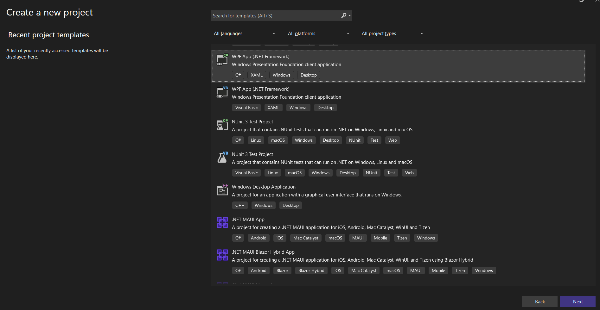
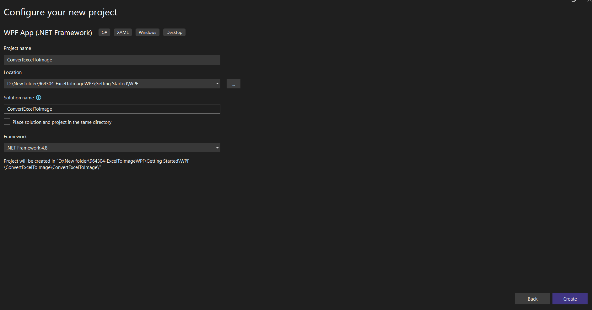
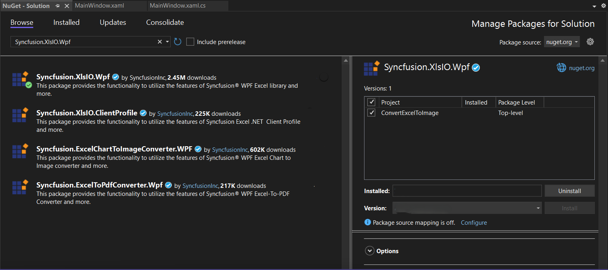

# Convert an Excel document to Image in WPF

Syncfusion&reg; XlsIO is a [.NET Excel library](https://www.syncfusion.com/document-processing/excel-framework/net/excel-library) used to create, read, edit and **convert Excel documents** programmatically without **Microsoft Excel** or interop dependencies. Using this library, you can **convert an Excel document to Image in WPF**.

## Steps to convert an Excel document to Image in WPF

Step 1: Create a new WPF application project.

Step 2: Name the project, choose the framework and click **Create** button.

Step 3: Install the <a href="https://www.nuget.org/packages/Syncfusion.XlsIO.Wpf">Syncfusion.XlsIO.Wpf</a> NuGet package as a reference to your project from [NuGet.org](https://www.nuget.org/).  

N> Starting with v16.2.0.x, if you reference Syncfusion&reg; assemblies from trial setup or from the NuGet feed, you also have to add "Syncfusion.Licensing" assembly reference and include a license key in your projects. Please refer to this [link](https://help.syncfusion.com/common/essential-studio/licensing/overview) to know about registering Syncfusion&reg; license key in your applications to use our components. 

Step 4: Add a new button in **MainWindow.xaml** as shown below.


<Button Click="btnConvert_Click" VerticalAlignment="Center" Height="30" BorderBrush="LightBlue" HorizontalAlignment="Center" Width="150">
    <Button.Background>
        <LinearGradientBrush EndPoint="0.5,-0.04" StartPoint="0.5,1.04">
            <GradientStop Color="#FFD9E9F7" Offset="0"/>
            <GradientStop Color="#FFEFF8FF" Offset="1"/>
        </LinearGradientBrush>
    </Button.Background>
    <StackPanel Orientation="Horizontal" Height="23" Margin="0,0,0,-2.52" VerticalAlignment="Bottom" HorizontalAlignment="Right" Width="100" RenderTransformOrigin="0.5,0.5">
        <StackPanel.RenderTransform>
            <TransformGroup>
                <ScaleTransform/>
                <SkewTransform/>
                <RotateTransform Angle="-0.226"/>
                <TranslateTransform/>
            </TransformGroup>
        </StackPanel.RenderTransform>
        <Image Name="image2" Margin="2" HorizontalAlignment="Center" VerticalAlignment="Center" />
        <TextBlock Text="Excel to Image" Height="38" Width="187" Margin="0,4,0,3" TextWrapping="WrapWithOverflow" />
    </StackPanel>
</Button>



Step 5: Include the following namespaces in the **MainWindow.xaml.cs**.


using Syncfusion.XlsIO;



Step 6: Include the below code snippet in **btnConvert_Click** to **convert an Excel document to Image**.


using (ExcelEngine excelEngine = new ExcelEngine())
{
    IApplication application = excelEngine.Excel;
    application.DefaultVersion = ExcelVersion.Xlsx;
	IWorkbook workbook = application.Workbooks.Open("Sample.xlsx");
    IWorksheet worksheet = workbook.Worksheets[0];

    //Convert the Excel to image
    System.Drawing.Image image = worksheet.ConvertToImage(1, 1, 20, 4);

    //Save the image as jpeg
    image.Save("Sample.Jpeg", ImageFormat.Jpeg);
}

      

You can download a complete working sample from <a href="https://github.com/SyncfusionExamples/XlsIO-Examples/tree/master/Getting%20Started/WPF/Convert%20Excel%20to%20Image">GitHub</a>.

By executing the program, you will get the **image** as follows.

Click [here](https://www.syncfusion.com/document-processing/excel-framework/net) to explore the rich set of Syncfusion&reg; Excel library (XlsIO) features.

An online sample link to [convert an Excel document to Image](https://ej2.syncfusion.com/aspnetcore/Excel/WorksheetToImage#/material3) in ASP.NET Core.