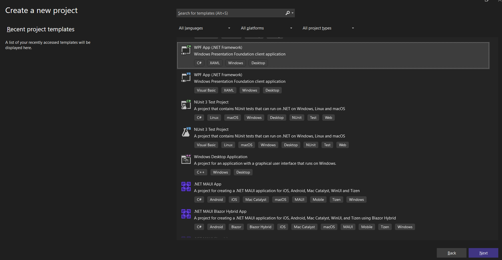
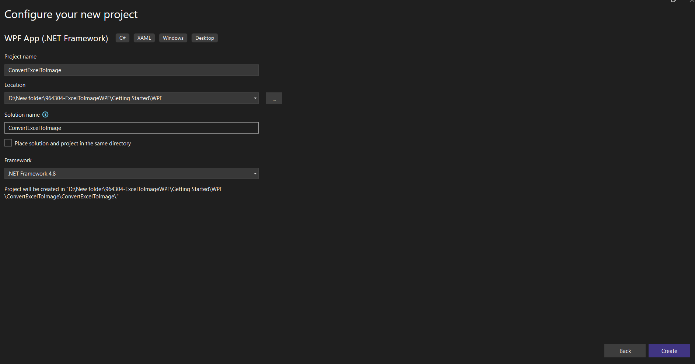
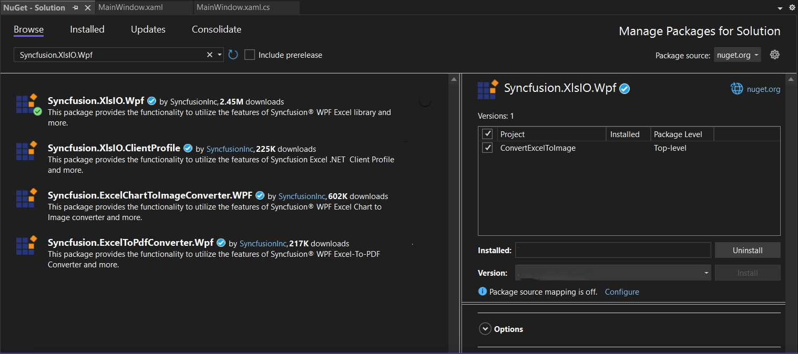

# Convert an Excel document to Image in WPF

Syncfusion<sup>&reg;</sup> XlsIO is a [.NET Excel Library](https://www.syncfusion.com/document-processing/excel-framework/net/excel-library) used to create, read, edit, and convert Excel documents programmatically, without Microsoft Excel or interop dependencies.

## Steps to convert an Excel document to Image in WPF

Step 1: Create a new WPF App (.NET Framework) project (Visual Studio → **File** → **New** → **Project** → **WPF App (.NET Framework)**). Target **.NET Framework 4.5** or later.



Step 2: Name the project, choose the framework, and click **Create**.



Step 3: Install the <a href="https://www.nuget.org/packages/Syncfusion.XlsIO.Wpf">Syncfusion.XlsIO.Wpf</a> NuGet package as a reference to your project from [NuGet.org](https://www.nuget.org/). This package transitively pulls in the required `Syncfusion.XlsIO.Base` assembly.



N> Starting with v16.2.0.x, if you reference Syncfusion<sup>&reg;</sup> assemblies from the trial setup or from the NuGet feed, you must also add the `Syncfusion.Licensing` reference and register a license key. Refer to this [link](https://help.syncfusion.com/common/essential-studio/licensing/overview) to learn how to register the Syncfusion<sup>&reg;</sup> license key. The simplest approach is to add the following call in `App.xaml.cs` (or in `Main` before `app.Run()`) before constructing the `ExcelEngine`:
> ```csharp
> Syncfusion.Licensing.SyncfusionLicenseProvider.RegisterLicense("YOUR_LICENSE_KEY");
> ```

Step 4: Add a new button to **MainWindow.xaml** (inside the existing `<Grid>`) as shown below.


<Button Click="btnConvert_Click" VerticalAlignment="Center" Height="30" BorderBrush="LightBlue" HorizontalAlignment="Center" Width="150">
    <Button.Background>
        <LinearGradientBrush EndPoint="0.5,-0.04" StartPoint="0.5,1.04">
            <GradientStop Color="#FFD9E9F7" Offset="0"/>
            <GradientStop Color="#FFEFF8FF" Offset="1"/>
        </LinearGradientBrush>
    </Button.Background>
    <StackPanel Orientation="Horizontal" Height="23" Margin="0,0,0,-2.52" VerticalAlignment="Bottom" HorizontalAlignment="Right" Width="100" RenderTransformOrigin="0.5,0.5">
        <StackPanel.RenderTransform>
            <TransformGroup>
                <ScaleTransform/>
                <SkewTransform/>
                <RotateTransform Angle="-0.226"/>
                <TranslateTransform/>
            </TransformGroup>
        </StackPanel.RenderTransform>
        <Image Name="image2" Margin="2" HorizontalAlignment="Center" VerticalAlignment="Center" />
        <TextBlock Text="Excel to Image" Height="38" Width="187" Margin="0,4,0,3" TextWrapping="WrapWithOverflow" />
    </StackPanel>
</Button>



Step 5: Add the following namespaces in **MainWindow.xaml.cs**.


using Syncfusion.XlsIO;



Step 6: Add the following code in the **btnConvert_Click** handler in **MainWindow.xaml.cs** to convert an Excel document to an image. Place a `Sample.xlsx` file in the project's `bin\Debug` folder (or set its **Copy to Output Directory** property to **Copy if newer**) so the relative path resolves.


private void btnConvert_Click(object sender, RoutedEventArgs e)
{
    using (ExcelEngine excelEngine = new ExcelEngine())
    {
        IApplication application = excelEngine.Excel;
        application.DefaultVersion = ExcelVersion.Xlsx;

        // Open the existing Excel workbook.
        IWorkbook workbook = application.Workbooks.Open("Sample.xlsx");
        IWorksheet worksheet = workbook.Worksheets[0];

        // Convert the Excel worksheet (cells 1,1 to 20,4) to an image.
        // For the entire used range, use worksheet.ConvertToImage(worksheet.UsedRange).
        System.Drawing.Image image = worksheet.ConvertToImage(1, 1, 20, 4);

        // Save the image as a JPEG. The image is also returned as a System.Drawing.Image,
        // so you can convert it to a BitmapSource and display it in a WPF Image control.
        image.Save("Sample.Jpeg", ImageFormat.Jpeg);

        // Close the workbook to release resources.
        workbook.Close();

        // Notify the user that the image was generated.
        MessageBox.Show("Sample.Jpeg has been saved to " + System.AppDomain.CurrentDomain.BaseDirectory);
    }
}



You can download a complete working sample from [GitHub](https://github.com/SyncfusionExamples/XlsIO-Examples/tree/master/Getting%20Started/WPF/Convert%20Excel%20to%20Image).

By executing the program, you will get the **image** as shown below.


Click [here](https://www.syncfusion.com/document-processing/excel-framework/net) to explore the rich set of Syncfusion<sup>&reg;</sup> Excel library (XlsIO) features.

An online sample link to [convert an Excel document to Image](https://document.syncfusion.com/demos/excel/worksheettoimage#/tailwind) in ASP.NET Core.