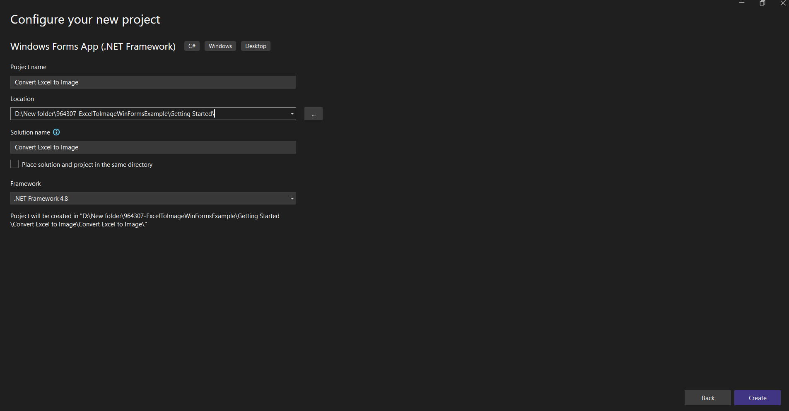

# Convert an Excel document to Image in Windows Forms

Syncfusion&reg; XlsIO is a [.NET Excel library](https://www.syncfusion.com/document-processing/excel-framework/net/excel-library) used to create, read, edit and **convert Excel documents** programmatically without **Microsoft Excel** or interop dependencies. Using this library, you can **convert an Excel document to Image in Windows Forms**.

## Steps to convert an Excel document to Image in Windows Forms

Step 1: Create a new Windows Forms application project.

Step 2: Name the project, choose the framework and click **Create** button.

Step 3: Install [Syncfusion.XlsIO.WinForms](https://www.nuget.org/packages/Syncfusion.XlsIO.WinForms) NuGet package as a reference to your Windows Forms application from the [NuGet.org](https://www.nuget.org/).

N> Starting with v16.2.0.x, if you reference Syncfusion&reg; assemblies from trial setup or from the NuGet feed, you also have to add "Syncfusion.Licensing" assembly reference and include a license key in your projects. Please refer to this [link](https://help.syncfusion.com/common/essential-studio/licensing/overview) to know about registering Syncfusion&reg; license key in your application to use our components.

Step 4: Include the following namespaces in the **Form1.Designer.cs** file.





using Syncfusion.XlsIO;





Step 5: Add a new button in **Form1.Designer.cs**.





private Button btnCreate;
private Label label;

private void InitializeComponent()
{
    this.label = new System.Windows.Forms.Label();
    this.btnCreate = new System.Windows.Forms.Button();
    this.SuspendLayout();
    // 
    // label
    // 
    this.label.Location = new System.Drawing.Point(0, 40);
    this.label.Name = "label";
    this.label.Size = new System.Drawing.Size(426, 35);
    this.label.TabIndex = 0;
    this.label.Text = "Click the button to Convert Excel document to Image generated by Essential XlsIO";
    this.label.TextAlign = System.Drawing.ContentAlignment.MiddleCenter;
    // 
    // btnCreate
    // 
    this.btnCreate.Location = new System.Drawing.Point(90, 110);
    this.btnCreate.Name = "btnCreate";
    this.btnCreate.Size = new System.Drawing.Size(223, 36);
    this.btnCreate.TabIndex = 1;
    this.btnCreate.Text = "Convert Excel to Image";
    this.btnCreate.Click += new System.EventHandler(this.btnConvert_Click);
    // 
    // Form1
    // 
    this.ClientSize = new System.Drawing.Size(450, 150);
    this.Controls.Add(this.label);
    this.Controls.Add(this.btnCreate);
    this.Name = "Form1";
    this.Text = "Convert Excel document to Image";
    this.ResumeLayout(false);
}





Step 6: Add the following code in **btnConvert_Click** to **convert Excel document to image**.





using (ExcelEngine excelEngine = new ExcelEngine())
{
    IApplication application = excelEngine.Excel;
    application.DefaultVersion = ExcelVersion.Xlsx;
	IWorkbook workbook = application.Workbooks.Open("Sample.xlsx");
    IWorksheet worksheet = workbook.Worksheets[0];

    //Convert the Excel to Image
    Image image = worksheet.ConvertToImage(1, 1, 20, 4);

    //Save the image as jpeg
    image.Save("Sample.Jpeg", ImageFormat.Jpeg);
}



        

You can download a complete working sample from <a href="https://github.com/SyncfusionExamples/XlsIO-Examples/tree/master/Getting%20Started/Windows%20Forms/Convert%20Excel%20to%20Image">GitHub</a>.    

By executing the program, you will get the **image** as follows.

Click [here](https://www.syncfusion.com/document-processing/excel-framework/net) to explore the rich set of Syncfusion&reg; Excel library (XlsIO) features.

An online sample link to [convert an Excel document to Image](https://ej2.syncfusion.com/aspnetcore/Excel/WorksheetToImage#/material3) in ASP.NET Core.