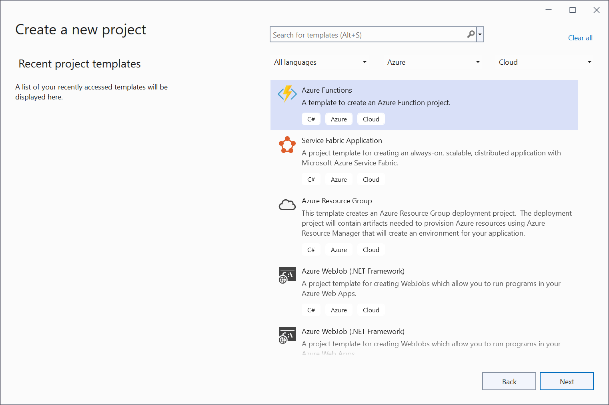
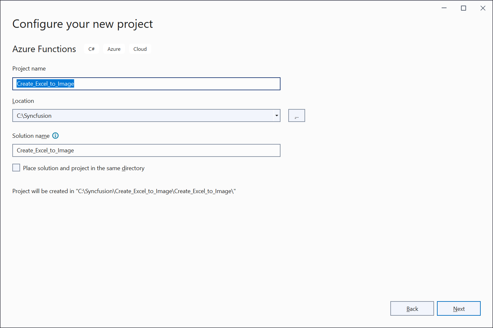
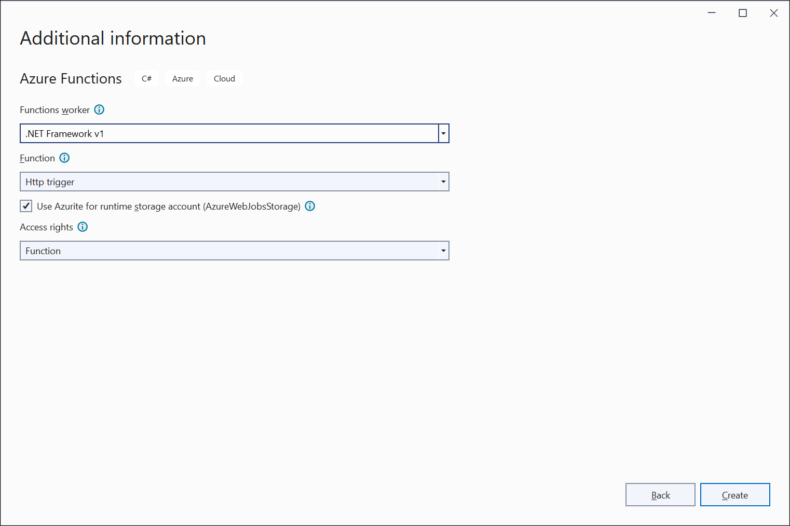
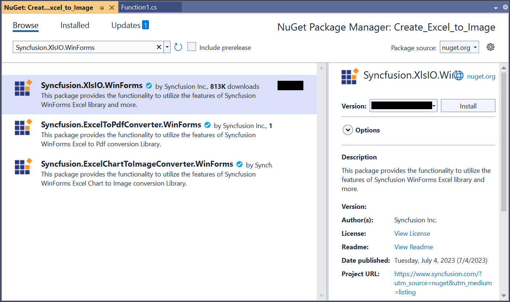
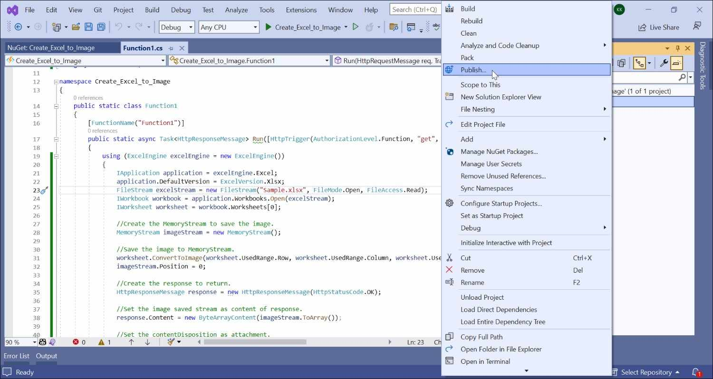
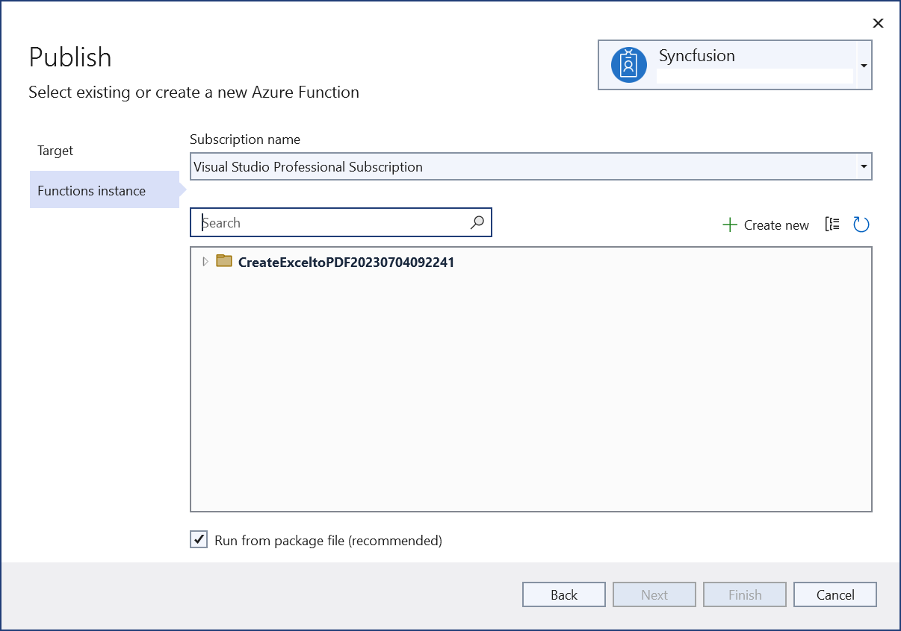
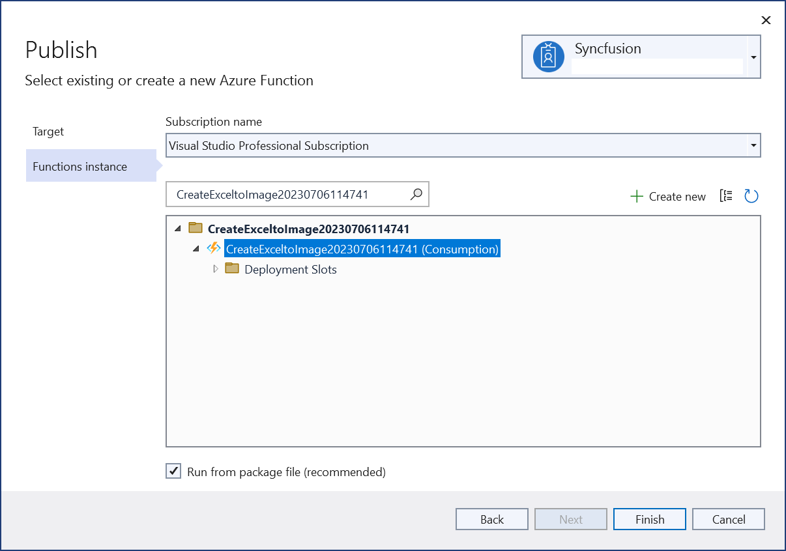
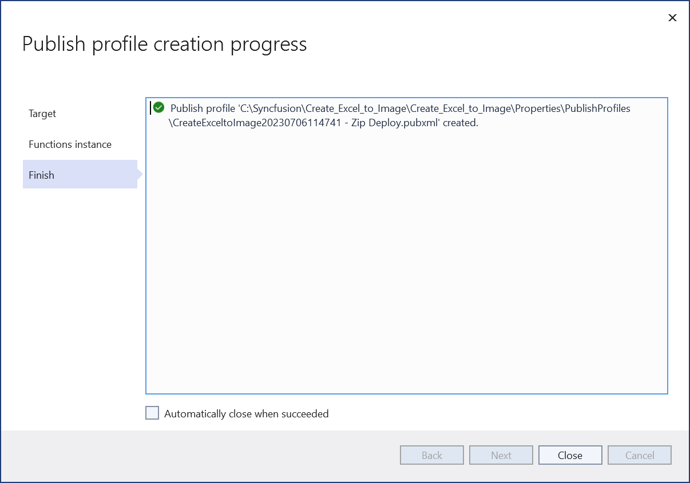
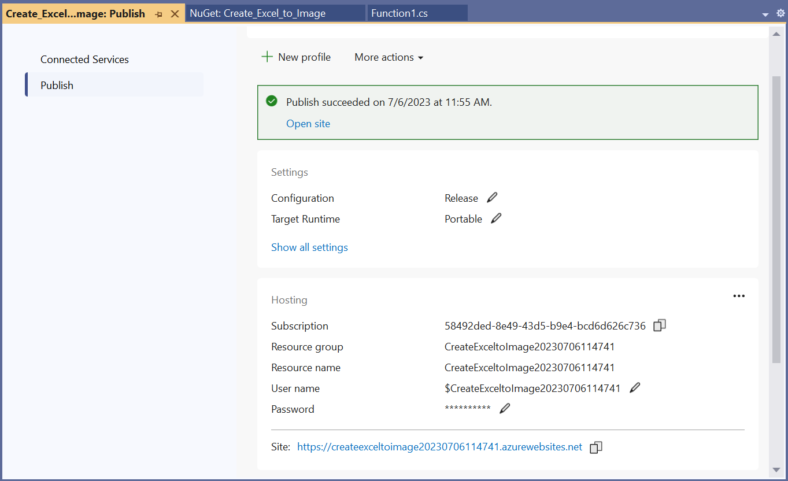
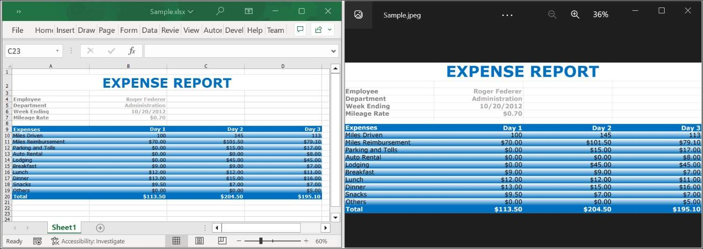

# Convert Excel document to Image in Azure Functions v1

Syncfusion&reg; XlsIO is a [.NET Excel library](https://www.syncfusion.com/document-processing/excel-framework/net) used to create, read, edit and **convert Excel documents** programmatically without **Microsoft Excel** or interop dependencies. Using this library, you can **convert an Excel document to Image in Azure Functions v1**.

## Steps to convert an Excel document to Image in Azure Functions v1

Step 1: Create a new Azure Functions project.

Step 2: Name the project.

Step 3: Select functions worker as **.NET Framework v1**.

Step 4: Install the [Syncfusion.XlsIO.WinForms](https://www.nuget.org/packages/Syncfusion.XlsIO.WinForms) NuGet package as a reference to your project from [NuGet.org](https://www.nuget.org/).

N> Starting with v16.2.0.x, if you reference Syncfusion&reg; assemblies from trial setup or from the NuGet feed, you also have to add "Syncfusion.Licensing" assembly reference and include a license key in your projects. Please refer to this [link](https://help.syncfusion.com/common/essential-studio/licensing/overview) to know about registering Syncfusion&reg; license key in your applications to use our components. 

Step 5: Include the following namespaces in the **Function1.cs** file.


using Syncfusion.XlsIO;



Step 6: Add the following code snippet in **Run** method of **Function1** class to perform **Excel to Image conversion** in Azure Functions and return the resultant **Image** to client end.


using (ExcelEngine excelEngine = new ExcelEngine())
{
  IApplication application = excelEngine.Excel;
  application.DefaultVersion = ExcelVersion.Xlsx;

  //Gets the input Excel document as stream from request.
  Stream excelStream = req.Content.ReadAsStreamAsync().Result;

  //Load the stream into IWorkbook.
  IWorkbook workbook = application.Workbooks.Open(excelStream);

  IWorksheet worksheet = workbook.Worksheets[0];

  //Create the MemoryStream to save the image.      
  MemoryStream imageStream = new MemoryStream();

  //Save the image to MemoryStream.
  worksheet.ConvertToImage(worksheet.UsedRange.Row, worksheet.UsedRange.Column, worksheet.UsedRange.LastRow, worksheet.UsedRange.LastColumn, ImageType.Bitmap, imageStream);
  imageStream.Position = 0;

  //Create the response to return.
  HttpResponseMessage response = new HttpResponseMessage(HttpStatusCode.OK);

  //Set the image saved stream as content of response.
  response.Content = new ByteArrayContent(imageStream.ToArray());

  //Set the contentDisposition as attachment.
  response.Content.Headers.ContentDisposition = new ContentDispositionHeaderValue("attachment")
  {
    FileName = "Sample.jpeg"
  };

  //Set the content type as image mime type.
  response.Content.Headers.ContentType = new MediaTypeHeaderValue("application/jpeg");

  //Return the response with output image stream.
  return response;
}



Step 6: Right-click the project and select **Publish** option.

Step 7: Select the publish target as **Azure**.

Step 8: Select the **Create new** button.

Step 9: Click the **Create** button to proceed with creation. 

Step 10: Click the **Finish** button to finalize the **Azure Function** creation. 

Step 11: Click **Close** button.

Step 12: Click the **Publish** button.

Step 13: Publish has been succeeded.

Step 14: Now, go to Azure portal and select the App Services. After running the service, click **Get function URL by copying it**. Then, paste it in the below client sample (which will request the Azure Functions, to perform **Excel to Image conversion** using the template Excel document). You will get the output image as follows.

## Steps to post the request to Azure Functions

Step 1: Create a console application to request the Azure Functions API.

Step 2: Add the following code snippet into **Main** method to post the request to Azure Functions with template Excel document and get the resultant image.


//Reads the template Excel document.
FileStream excelStream = new FileStream("../../../Sample.xlsx", FileMode.Open, FileAccess.Read);
excelStream.Position = 0;

//Saves the Excel document in memory stream.
MemoryStream inputStream = new MemoryStream();
excelStream.CopyTo(inputStream);
inputStream.Position = 0;

try
{
  Console.WriteLine("Please enter your Azure Functions URL :");
  string functionURL = Console.ReadLine();

  //Create HttpWebRequest with hosted azure functions URL.                
  HttpWebRequest req = (HttpWebRequest)WebRequest.Create(functionURL);

  //Set request method as POST
  req.Method = "POST";

  //Get the request stream to save the Excel document stream
  Stream stream = req.GetRequestStream();

  //Write the Excel document stream into request stream
  stream.Write(inputStream.ToArray(), 0, inputStream.ToArray().Length);

  //Gets the responce from the Azure Functions.
  HttpWebResponse res = (HttpWebResponse)req.GetResponse();

  //Saves the image stream.
  FileStream outStream = File.Create("Sample.jpeg");
  res.GetResponseStream().CopyTo(outStream);

  //Dispose the streams
  inputStream.Dispose();
  outStream.Dispose();
}
catch (Exception ex)
{
    throw;
}



You can download a complete working sample from [GitHub](https://github.com/SyncfusionExamples/XlsIO-Examples/tree/master/Getting%20Started/Azure%20V1%20Function/Convert%20Excel%20to%20Image). 

Click [here](https://www.syncfusion.com/document-processing/excel-framework/net-core) to explore the rich set of Syncfusion&reg; Excel library (XlsIO) features.

An online sample link to [convert an Excel document to Image](https://ej2.syncfusion.com/aspnetcore/Excel/WorksheetToImage#/material3) in ASP.NET Core.
