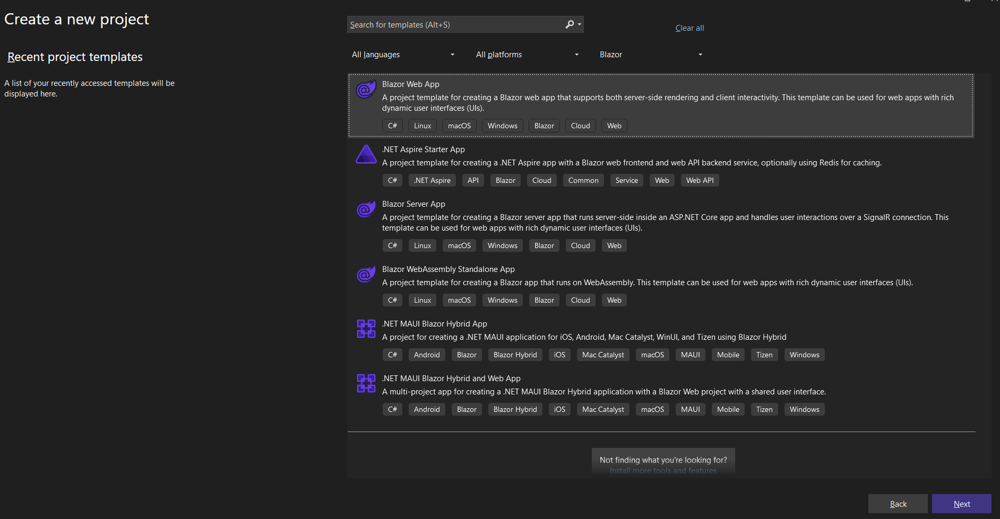
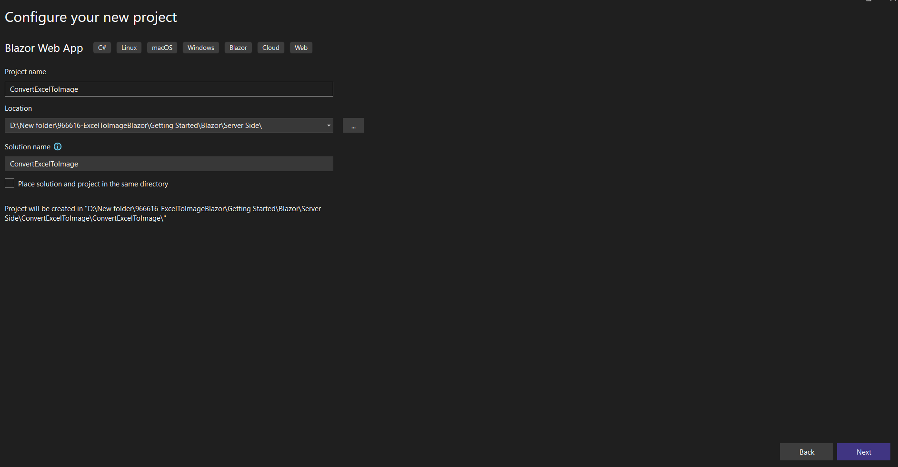
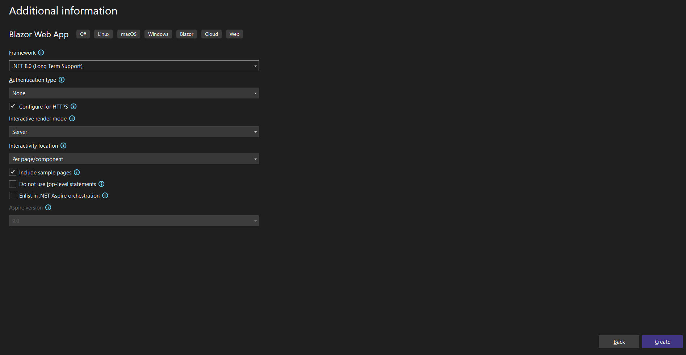
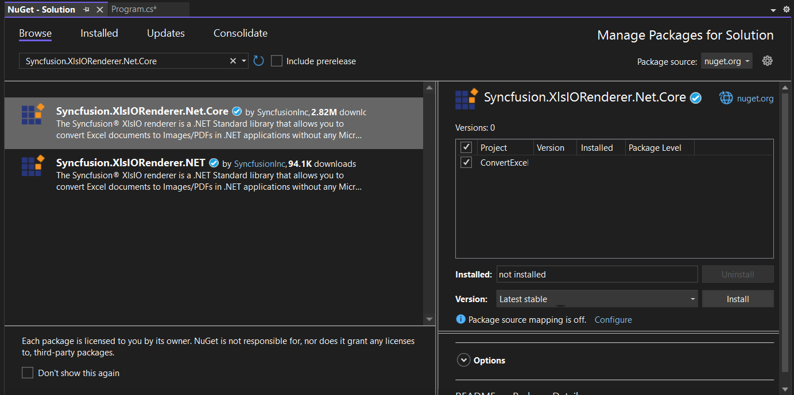

# Convert Excel document to Image in Blazor Server Web application

Syncfusion<sup>&reg;</sup> XlsIO is a [.NET Core Excel library](https://www.syncfusion.com/document-processing/excel-framework/net) used to create, read, edit and **convert Excel documents** programmatically without **Microsoft Excel** or interop dependencies. Using this library, you can **convert an Excel document to Image in Blazor Server Web application**.

## Steps to convert Excel document to Image in Blazor Server Web application

Step 1: Create a new C# Blazor Web application project.



Step 2: Name the project.



Step 3: Select the framework and click Create button.



Step 4: Install the [Syncfusion.XlsIORenderer.Net.Core](https://www.nuget.org/packages/Syncfusion.XlsIORenderer.Net.Core) NuGet package as reference to your Blazor web application from [NuGet.org](https://www.nuget.org).



N> Starting with v16.2.0.x, if you reference Syncfusion<sup>&reg;</sup> assemblies from trial setup or from the NuGet feed, you also have to add "Syncfusion.Licensing" assembly reference and include a license key in your projects. Please refer to this [link](https://help.syncfusion.com/common/essential-studio/licensing/overview) to know about registering Syncfusion<sup>&reg;</sup> license key in your applications to use our components.

Step 5: Create a new Razor component named ``Excel.razor`` in the ``Components/Pages`` folder and include the following namespaces in the file.




@rendermode InteractiveServer
@page "/excel"
@using System.IO;
@using ConvertExceltoImage;
@inject ConvertExceltoImage.Components.Data.ExcelService service
@inject Microsoft.JSInterop.IJSRuntime JS



{{ codesnippet1 | OrderList_Indent_Level_1 }}

Step 6: Add the following code to create a new button.




<h2>Syncfusion Excel library (Essential XlsIO)</h2>
<p>Syncfusion Excel library (Essential XlsIO)  is a Blazor Excel library used to create, read, edit, and convert Excel files in your applications without Microsoft Office dependencies.</p>
<button class="btn btn-primary" @onclick="@ConvertExceltoImage">Convert Excel to Image</button>



{{ codesnippet2 | OrderList_Indent_Level_1 }}

Step 7: Add the following code in ``Excel.razor`` file to convert Excel document to Image.



@code {
    MemoryStream excelStream;

    /// <summary>
    /// Convert Excel document to Image
    /// </summary>
    private async Task ConvertExceltoImage()
    {
        service.ExceltoImage(); // Updated method name
        await JS.SaveAs("Sample.jpeg", excelStream.ToArray());
    }
}



{{ codesnippet3 | OrderList_Indent_Level_1 }}

Step 8: Create a new class file named ``ExcelService.cs`` in the ``Components/Data`` folder and include the following namespaces in the file. Make sure this class is declared as `public`.




using Syncfusion.XlsIO;
using Syncfusion.XlsIORenderer;
using System.IO;
using System; // Required for FileStream and Exception handling



{{ codesnippet4 | OrderList_Indent_Level_1 }}

Step 9: Inside the `ExcelService.cs` file, declare the `public class ExcelService` and then create a new public method `ExcelToImage` within it. Include the following code snippet to convert Excel document to Image in Blazor Server web application.

N> Place your `InputTemplate.xlsx` file in the `wwwroot` folder of your Blazor project for the application to access it.




//Create an instance of ExcelEngine
using (ExcelEngine excelEngine = new ExcelEngine())
{
    IApplication application = excelEngine.Excel;
    application.DefaultVersion = ExcelVersion.Xlsx;
    FileStream excelStream = new FileStream("InputTemplate.xlsx", FileMode.Open, FileAccess.Read);
    IWorkbook workbook = application.Workbooks.Open(excelStream);
    IWorksheet worksheet = workbook.Worksheets[0];

    //Initialize XlsIORenderer
    application.XlsIORenderer = new XlsIORenderer();

    //Create the MemoryStream to save the image
    MemoryStream imageStream = new MemoryStream();

    //Save the converted image to MemoryStream
    worksheet.ConvertToImage(worksheet.UsedRange, imageStream);
    imageStream.Position = 0;

    //Download image in the browser
    return imageStream;
}



{{ codesnippet5 | OrderList_Indent_Level_1 }}

Step 10: Create a new class file in the project, with name as ``FileUtils.cs``, and add the following code to invoke the JavaScript action for downloading the file in browser. Place this file, for example, in the root of your project or in a `Utilities` folder.




public static class FileUtils
{
    public static ValueTask<object> SaveAs(this IJSRuntime js, string filename, byte[] data)
        => js.InvokeAsync<object>(
           "saveAsFile",
           filename,
           Convert.ToBase64String(data));
}



{{ codesnippet6 | OrderList_Indent_Level_1 }}

Step 11: Create a `wwwroot/js` folder and add a new JavaScript file (e.g., `download.js`). Move the JavaScript function for `saveAsFile` into this file. Reference this file in your `Components/App.razor` file, or `Pages/_Layout.cshtml` (for Blazor Server App on .NET 6/7) / `index.html` (for Blazor WebAssembly). For a Blazor Server project, add the script reference in `Components/App.razor` (for .NET 8) or `Pages/_Layout.cshtml` (for .NET 6/7) as shown below.

```html
<script src="~/js/download.js"></script>
```

The content of `wwwroot/js/download.js` should be:




<script type="text/javascript">
    function saveAsFile(filename, bytesBase64) {

        if (navigator.msSaveBlob) {
            //Download document in Edge browser
            var data = window.atob(bytesBase64);
            var bytes = new Uint8Array(data.length);
            for (var i = 0; i < data.length; i++) {
                bytes[i] = data.charCodeAt(i);
            }
            var blob = new Blob([bytes.buffer], { type: "application/octet-stream" });
            navigator.msSaveBlob(blob, filename);
        }
        else {
            var link = document.createElement('a');
            link.download = filename;
            link.href = "data:application/octet-stream;base64," + bytesBase64;
            document.body.appendChild(link); // Needed for Firefox
            link.click();
            document.body.removeChild(link);
        }
    }
</script>



{{ codesnippet7 | OrderList_Indent_Level_1 }}

Step 12: Add the following code in <code>Na&#8203;vMenu.razor</code> file present under ``Layout`` folder.



<div class="nav-item px-3">
    <NavLink class="nav-link" href="excel">
        <span class="oi oi-list-rich" aria-hidden="true"></span> Convert Excel to Image
    </NavLink>
</div>



Step 13: Add the service in the ``Program.cs`` file. Ensure the `using` directive for the namespace containing `ExcelService` is present.



using ConvertExceltoImage.Components.Data; // Add this line if not already present

builder.Services.AddScoped<ExcelService>();

     

A complete working example of how to convert Excel to Image in Blazor Server web application in C# is present on <a href="https://github.com/SyncfusionExamples/XlsIO-Examples/tree/master/Getting%20Started/Blazor/Server%20Side/ConvertExceltoImage">this GitHub page</a>.
