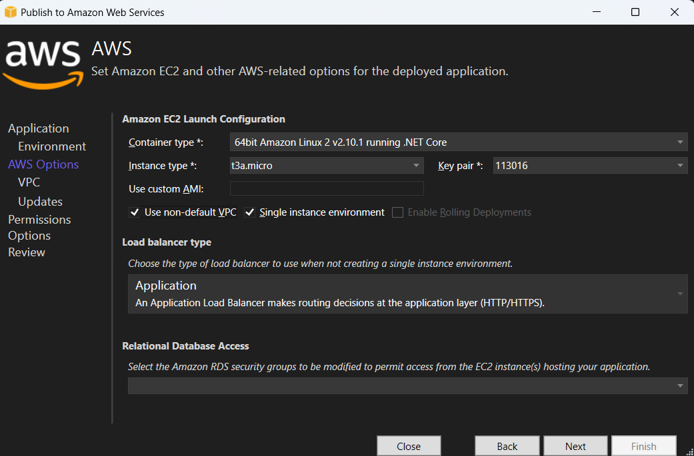

# Convert Excel document to PDF in AWS Elastic Beanstalk

Syncfusion&reg; XlsIO is a [.NET Core Excel library](https://www.syncfusion.com/document-processing/excel-framework/net-core) used to create, read, edit and **convert Excel documents** programmatically without **Microsoft Excel** or interop dependencies. Using this library, you can **convert a Excel document to PDF in AWS Elastic Beanstalk**.

## Steps to convert Excel document to PDF in AWS Elastic Beanstalk

Step 1: Create a new ASP.NET Core Web application (Model-View-Controller) project.

Step 2: Install the following **Nuget packages** in your application from [Nuget.org](https://www.nuget.org/).

* [Syncfusion.XlsIORenderer.Net.Core](https://www.nuget.org/packages/Syncfusion.XlsIORenderer.Net.Core) 
* [SkiaSharp.NativeAssets.Linux.NoDependencies v3.116.1](https://www.nuget.org/packages/SkiaSharp.NativeAssets.Linux.NoDependencies/3.116.1)

N> Starting with v16.2.0.x, if you reference Syncfusion&reg; assemblies from trial setup or from the NuGet feed, you also have to add "Syncfusion.Licensing" assembly reference and include a license key in your projects. Please refer to this [link](https://help.syncfusion.com/common/essential-studio/licensing/overview) to know about registering Syncfusion&reg; license key in your application to use our components.

Step 3: Include the following namespaces in the **HomeController.cs** file.




using Syncfusion.XlsIO;
using Syncfusion.XlsIORenderer;
using Syncfusion.Pdf;
using Syncfusion.XlsIO.Implementation;




Step 4: A default action method named Index will be present in HomeController.cs. Right click on Index method and select **Go To View** where you will be directed to its associated view page **Index.cshtml**.

Step 5: Add a new button in the **Index.cshtml** as shown below.




@{
    Html.BeginForm("ConvertExceltoPDF", "Home", FormMethod.Get);
    {
        

            <input type="submit" value="Convert ExceltoPDF" style="width:150px;height:27px" />
        

    }
    Html.EndForm();
}




Step 6: Include the below code snippet in the **Homecontroller.cs** file to **convert a Excel document to Pdf** and download it.




public IActionResult ConvertExceltoPDF()
{
    using (ExcelEngine excelEngine = new ExcelEngine())
    {
        IApplication application = excelEngine.Excel;
        application.DefaultVersion = ExcelVersion.Xlsx;

        //Initializes the SubstituteFont event to perform font substitution during Excel-to-PDF conversion
        application.SubstituteFont += new SubstituteFontEventHandler(SubstituteFont);

        FileStream excelStream = new FileStream(@"Data/InputTemplate.xlsx", FileMode.Open, FileAccess.Read);
        IWorkbook workbook = application.Workbooks.Open(excelStream);

        //Initialize XlsIO renderer.
        XlsIORenderer renderer = new XlsIORenderer();

        //Convert Excel document into PDF document 
        PdfDocument pdfDocument = renderer.ConvertToPDF(workbook);

        //Create the MemoryStream to save the converted PDF.      
        MemoryStream pdfStream = new MemoryStream();

        //Save the converted PDF document to MemoryStream.
        pdfDocument.Save(pdfStream);
        pdfStream.Position = 0;
        //Download PDF document in the browser
        return File(pdfStream, "application/pdf", "Sample.pdf");
    }
}

private static void SubstituteFont(object sender, SubstituteFontEventArgs args)
{
    string filePath = string.Empty;
    FileStream fileStream = null;

    if (args.OriginalFontName == "Calibri")
    {
        filePath = Path.GetFullPath(@"Data/calibri.ttf");
        fileStream = new FileStream(filePath, FileMode.Open, FileAccess.Read);
        args.AlternateFontStream = fileStream;
    }
}




## Steps to publish as AWS Elastic Beanstalk

Step 1: Right-click the project and select **Publish to AWS Elastic Beanstalk (Legacy)** option.

Step 2: Select the **Deployment Target** as **Create a new application environment** and click **Next** button.

Step 3: Choose the **Environment Name** in the dropdown list and the **URL** will be automatically assign and check the URL is available, if available click next otherwise change the **URL**. 

Step 4: Select the instance type in **t3a.micro** from the dropdown list and click next.

Step 5: Click the **Next** button to proceed further.

Step 6: Click the **Next** button.

Step 7: Click the **Deploy** button to deploy the sample on AWS Elastic Beanstalk.

Step 8: After changing the status from **Updating** to **Environment is healthy**, click the **URL**.

Step 9: After opening the provided **URL**, click **Convert ExceltoPDF** button to download the PDF document.

You can download a complete working sample from [this GitHub page](https://github.com/SyncfusionExamples/XlsIO-Examples/tree/master/Getting%20Started/AWS/AWS%20Elastic%20Beanstalk/ConvertExceltoPDF).

By executing the program, you will get the **PDF document** as follows.

Click [here](https://www.syncfusion.com/document-processing/excel-framework/net-core) to explore the rich set of Syncfusion&reg; Excel library (XlsIO) features.

An online sample link to [convert an Excel document to PDF](https://ej2.syncfusion.com/aspnetcore/Excel/ExcelToPDF#/material3) in ASP.NET Core.