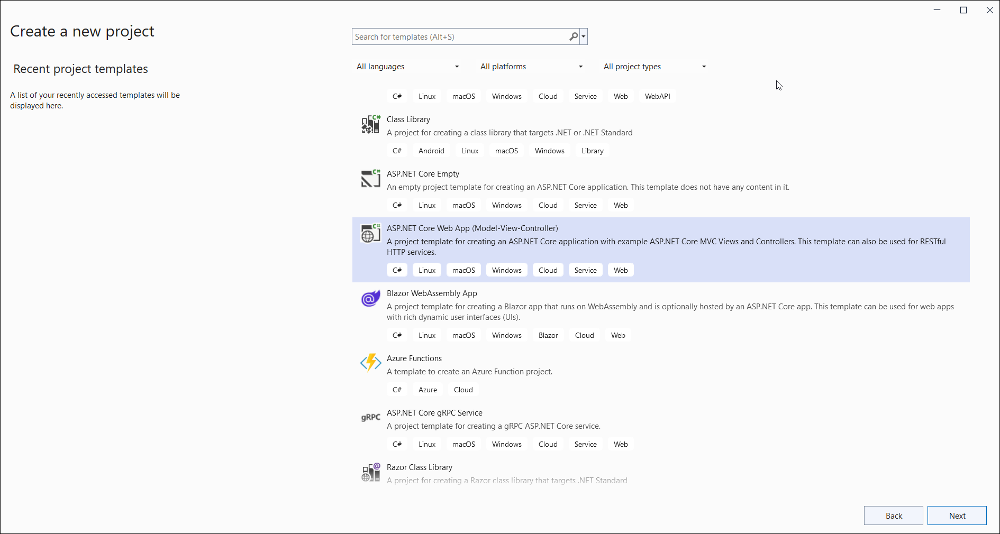
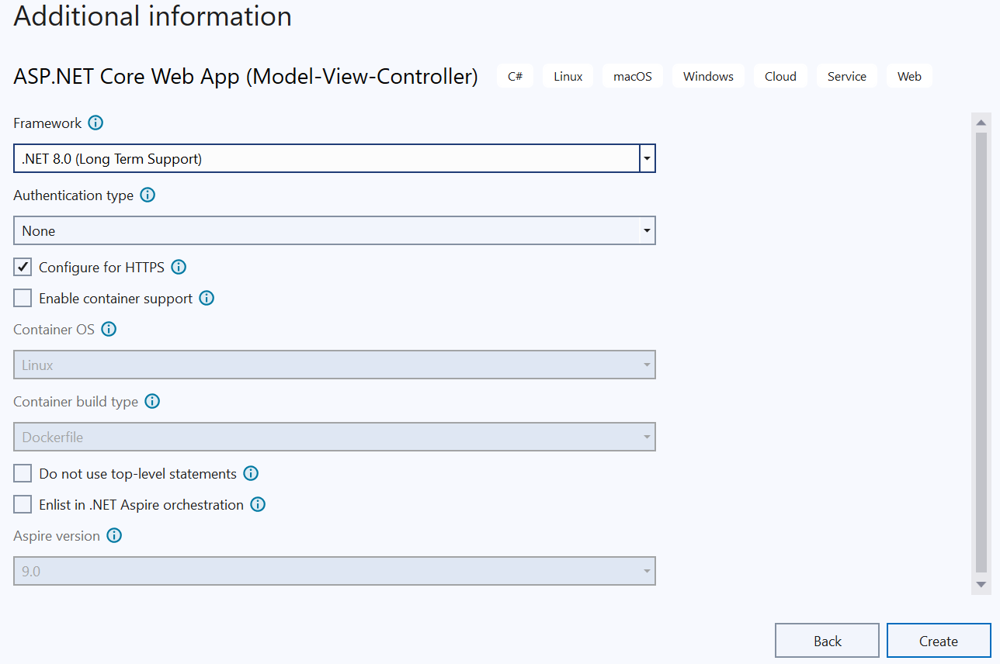
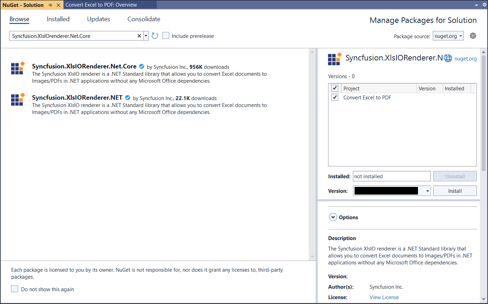
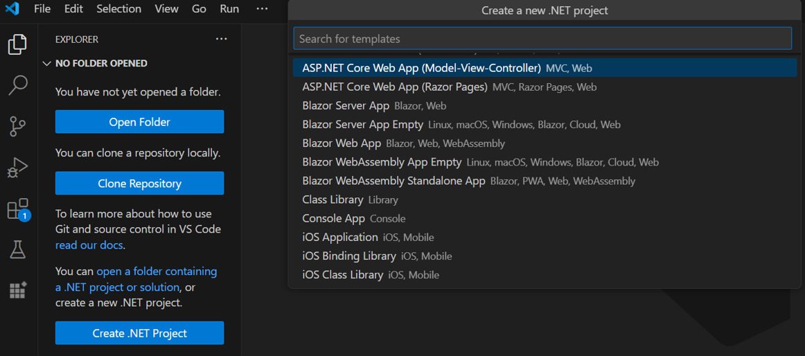
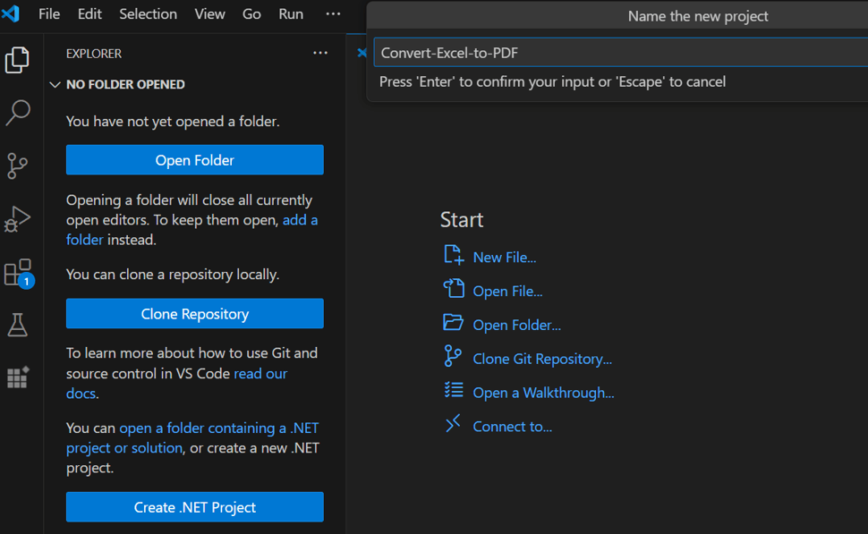
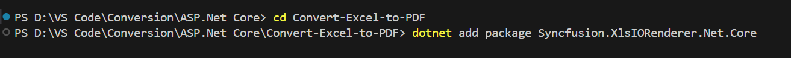

# Convert an Excel document to PDF in ASP.NET Core

Syncfusion<sup>&reg;</sup> XlsIO is a [.NET Core Excel library](https://www.syncfusion.com/document-processing/excel-framework/net-core/excel-library) used to create, read, edit, and convert Excel documents programmatically, without Microsoft Excel or interop dependencies.

To quickly get started on converting an Excel document to a PDF in ASP.NET Core, please check out this video:


## Steps to convert an Excel document to PDF in C#




Step 1: Create a new ASP.NET Core Web Application (Model-View-Controller).



Step 2: Name the project.


Step 3: Select **.NET Core** as the framework (or .NET 6+ on newer Visual Studio versions), choose **No Authentication** to keep the sample minimal, and click **Create**.



Step 4: Install the [Syncfusion.XlsIORenderer.Net.Core](https://www.nuget.org/packages/Syncfusion.XlsIORenderer.Net.Core) NuGet package as a reference to your project from [NuGet.org](https://www.nuget.org/). This package transitively pulls in the required `Syncfusion.XlsIO.Net.Core` and `Syncfusion.Pdf.Net.Core` packages.



N> Starting with v16.2.0.x, if you reference Syncfusion<sup>&reg;</sup> assemblies from the trial setup or from the NuGet feed, you must also add the `Syncfusion.Licensing` reference and register a license key in your project. Refer to this [link](https://help.syncfusion.com/common/essential-studio/licensing/overview) to learn how to register the Syncfusion<sup>&reg;</sup> license key in your applications. The simplest approach is to add a single call at application startup:
> ```csharp
> Syncfusion.Licensing.SyncfusionLicenseProvider.RegisterLicense("YOUR_LICENSE_KEY");
> ```

Step 5: Add a new button to **Index.cshtml** as shown below.
  

@{Html.BeginForm("ConvertExceltoPDF", "Home", FormMethod.Get);
    {
        <div>
            <input type="submit" value="Convert Excel to PDF" style="width:150px;height:27px" />
        </div>
    }
    Html.EndForm();
}



Step 6: Add the following namespaces in **HomeController.cs**.


using Syncfusion.XlsIO;
using Syncfusion.XlsIORenderer;
using Syncfusion.Pdf;



Step 7: Add the following code in **HomeController.cs** to convert an Excel document to PDF. Place a `Sample.xlsx` file in the project's `wwwroot` folder so the relative path resolves.


public IActionResult ConvertExceltoPDF()
{
  using (ExcelEngine excelEngine = new ExcelEngine())
  {
    IApplication application = excelEngine.Excel;
    application.DefaultVersion = ExcelVersion.Xlsx;

    //Open the existing Excel workbook from wwwroot
    IWorkbook workbook = application.Workbooks.Open(Path.Combine(_env.WebRootPath, "Sample.xlsx"));

    //Initialize the XlsIO renderer
    XlsIORenderer renderer = new XlsIORenderer();

    //Convert the Excel document to a PDF document
    PdfDocument pdfDocument = renderer.ConvertToPDF(workbook);

    //Create a MemoryStream to save the converted PDF
    MemoryStream pdfStream = new MemoryStream();

    //Save the converted PDF document to the MemoryStream
    pdfDocument.Save(pdfStream);
    pdfStream.Position = 0;

    //Close the workbook and the PDF document to release resources
    workbook.Close();
    pdfDocument.Close();

    //Return the PDF document for download in the browser
    return File(pdfStream, "application/pdf", "Sample.pdf");
  }
}



N> The `XlsIORenderer.ConvertToPDF(IWorkbook)` overload used above is suitable for the XlsIO renderer; for additional control over page size, orientation, and font embedding, pass an `ExcelToPdfConverterSettings` instance to the `ConvertToPDF` overload. See the [Excel-to-PDF conversion options](https://help.syncfusion.com/document-processing/excel/conversions/excel-to-pdf/net/convert-excel-to-pdf-in-asp-net-core#excel-to-pdf-conversion-options) section.





Step 1: Create a new ASP.NET Core Web Application (Model-View-Controller) using Create .NET Project option.



Step 2: Name the project and create the project.



Alternatively, create an ASP.NET Core Web application using the following command in the terminal (<kbd>Ctrl</kbd>+<kbd>`</kbd>).

```
dotnet new mvc -o Convert-Excel-to-PDF
```

Step 3: To convert an Excel document to PDF in ASP.NET Core, run the following command to install the [Syncfusion.XlsIORenderer.Net.Core](https://www.nuget.org/packages/Syncfusion.XlsIORenderer.Net.Core) package.


```
cd Convert-Excel-to-PDF
dotnet add package Syncfusion.XlsIORenderer.Net.Core
```

N> Starting with v16.2.0.x, if you reference Syncfusion<sup>&reg;</sup> assemblies from trial setup or from the NuGet feed, you also have to add "Syncfusion.Licensing" assembly reference and include a license key in your projects. Please refer to this [link](https://help.syncfusion.com/common/essential-studio/licensing/overview) to know about registering Syncfusion<sup>&reg;</sup> license key in your applications to use our components. 

Step 4: Add a new button to **Views/Home/Index.cshtml** as shown below.
  

@{Html.BeginForm("ConvertExceltoPDF", "Home", FormMethod.Get);
    {
        <div>
            <input type="submit" value="Convert Excel to PDF" style="width:150px;height:27px" />
        </div>
    }
    Html.EndForm();
}



Step 5: Add the following namespaces in **Controllers/HomeController.cs**.


using Syncfusion.XlsIO;
using Syncfusion.XlsIORenderer;
using Syncfusion.Pdf;



Step 6: Add the following code in **Controllers/HomeController.cs** to convert an Excel document to PDF. Place a `Sample.xlsx` file in the project's `wwwroot` folder so the relative path resolves.


public IActionResult ConvertExceltoPDF()
{
  using (ExcelEngine excelEngine = new ExcelEngine())
  {
    IApplication application = excelEngine.Excel;
    application.DefaultVersion = ExcelVersion.Xlsx;

    //Open the existing Excel workbook from wwwroot
    IWorkbook workbook = application.Workbooks.Open(Path.Combine(_env.WebRootPath, "Sample.xlsx"));

    //Initialize the XlsIO renderer
    XlsIORenderer renderer = new XlsIORenderer();

    //Convert the Excel document to a PDF document
    PdfDocument pdfDocument = renderer.ConvertToPDF(workbook);

    //Create a MemoryStream to save the converted PDF
    MemoryStream pdfStream = new MemoryStream();

    //Save the converted PDF document to the MemoryStream
    pdfDocument.Save(pdfStream);
    pdfStream.Position = 0;

    //Close the workbook and the PDF document to release resources
    workbook.Close();
    pdfDocument.Close();

    //Return the PDF document for download in the browser
    return File(pdfStream, "application/pdf", "Sample.pdf");
  }
}






A complete working example of how to convert an Excel document to PDF in ASP.NET Core is present on [this GitHub page](https://github.com/SyncfusionExamples/XlsIO-Examples/tree/master/Getting%20Started/ASP.NET%20Core/Convert%20Excel%20to%20PDF).

By executing the program, you will get the **PDF document** as shown below.


Click [here](https://www.syncfusion.com/document-processing/excel-framework/net-core) to explore the rich set of Syncfusion<sup>&reg;</sup> Excel library (XlsIO) features.

An online sample link to [convert an Excel document to PDF](https://ej2.syncfusion.com/aspnetcore/Excel/ExcelToPDF#/material3) in ASP.NET Core.
