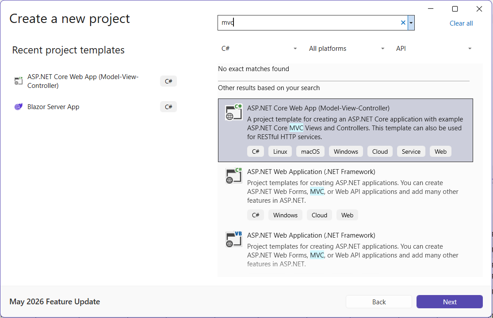
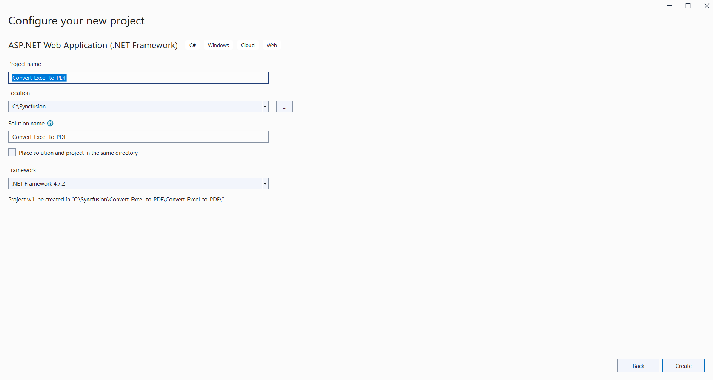
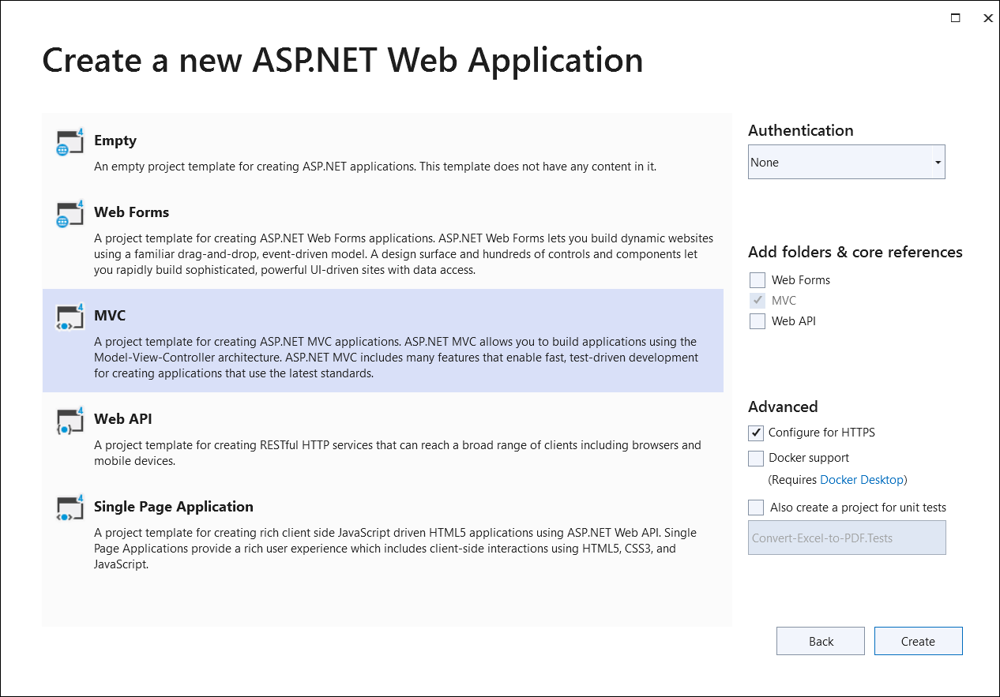
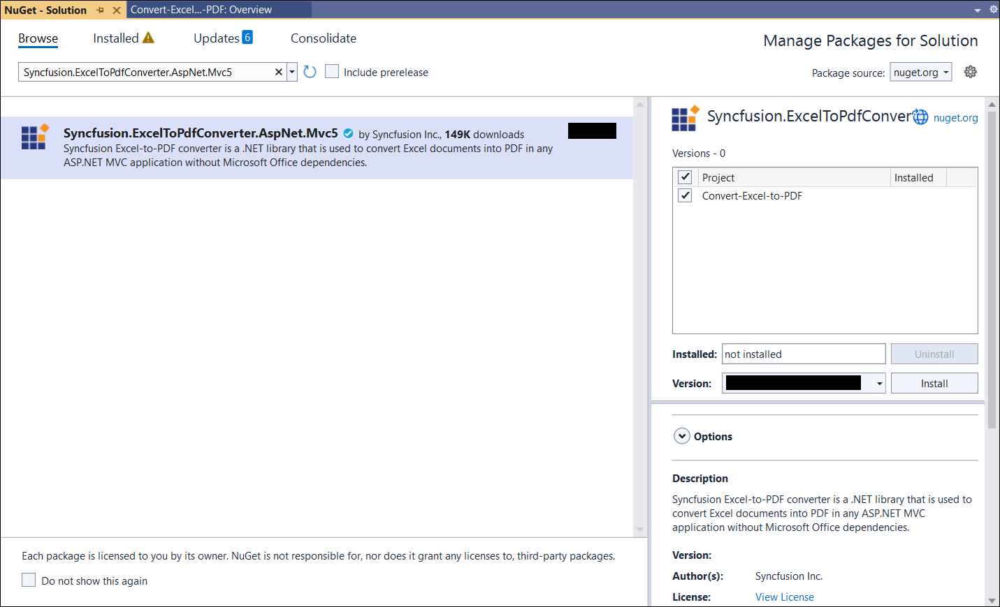

# Convert an Excel document to PDF in ASP.NET MVC

Syncfusion<sup>&reg;</sup> XlsIO is a [.NET Excel Library](https://www.syncfusion.com/document-processing/excel-framework/net/excel-library) used to create, read, edit, and convert Excel documents programmatically, without Microsoft Excel or interop dependencies.

## Steps to convert an Excel document to PDF in C#

Step 1: Create a new ASP.NET Web Application Project.



Step 2: Name the project, choose the framework, and click **Create**.



Step 3: Select the **MVC** template. Set **Authentication** to **No Authentication** to keep the sample minimal, and click **Create**.



Step 4: Install the [Syncfusion.ExcelToPdfConverter.AspNet.Mvc5](https://www.nuget.org/packages/Syncfusion.ExcelToPdfConverter.AspNet.Mvc5) NuGet package as a reference to your project from [NuGet.org](https://www.nuget.org/). This package transitively pulls in the required `Syncfusion.XlsIO.Base` and `Syncfusion.Pdf.Base` assemblies.



N> Starting with v16.2.0.x, if you reference Syncfusion<sup>&reg;</sup> assemblies from the trial setup or from the NuGet feed, you must also add the `Syncfusion.Licensing` reference and register a license key. Refer to this [link](https://help.syncfusion.com/common/essential-studio/licensing/overview) to learn how to register the Syncfusion<sup>&reg;</sup> license key. The simplest approach is to add the following call in `Global.asax` `Application_Start` (or `Startup`):
> ```csharp
> Syncfusion.Licensing.SyncfusionLicenseProvider.RegisterLicense("YOUR_LICENSE_KEY");
> ```

Step 5: Add a new button to **Index.cshtml** as shown below.
  

@{Html.BeginForm("ConvertExceltoPDF", "Home", FormMethod.Get);
    {
        <div>
            <input type="submit" value="Convert Excel to PDF" style="width:150px;height:27px" />
        </div>
    }
    Html.EndForm();
}



Step 6: Add the following namespaces in **HomeController.cs**.


using Syncfusion.XlsIO;
using Syncfusion.Pdf;
using Syncfusion.ExcelToPdfConverter;



Step 7: Add the following code in **HomeController.cs** to convert an Excel document to PDF. Place a `Sample.xlsx` file in the project root (or under `App_Data`) so the relative path resolves.


public ActionResult ConvertExceltoPDF()
{
  using (ExcelEngine excelEngine = new ExcelEngine())
  {
    IApplication application = excelEngine.Excel;
    application.DefaultVersion = ExcelVersion.Xlsx;

    //Open the existing Excel workbook. Adjust the path as required.
    IWorkbook workbook = application.Workbooks.Open(Server.MapPath("~/Sample.xlsx"));

    //Initialize the Excel-to-PDF converter
    ExcelToPdfConverter converter = new ExcelToPdfConverter(workbook);

    //Convert the Excel document to a PDF document
    PdfDocument pdfDocument = converter.Convert();

    //Create a MemoryStream to save the converted PDF
    MemoryStream pdfStream = new MemoryStream();

    //Save the converted PDF document to the MemoryStream
    pdfDocument.Save(pdfStream);
    pdfStream.Position = 0;

    //Close the workbook and the PDF document to release resources
    workbook.Close();
    pdfDocument.Close();

    //Return the PDF document for download in the browser
    return File(pdfStream, "application/pdf", "Sample.pdf");
  }
}



N> For additional control over page size, orientation, and font embedding, pass an `ExcelToPdfConverterSettings` instance when creating the `ExcelToPdfConverter` and call the `Convert(ExcelToPdfConverterSettings)` overload. See the [Excel-to-PDF conversion settings](https://help.syncfusion.com/document-processing/excel/conversions/excel-to-pdf/net/excel-to-pdf-converter-settings) for details.

A complete working example of how to convert an Excel document to PDF in ASP.NET MVC is present on [this GitHub page](https://github.com/SyncfusionExamples/XlsIO-Examples/tree/master/Getting%20Started/ASP.NET%20MVC/Convert%20Excel%20to%20PDF).

By executing the program, you will get the **PDF document** as shown below.


Click [here](https://www.syncfusion.com/document-processing/excel-framework/net) to explore the rich set of Syncfusion<sup>&reg;</sup> Excel library (XlsIO) features.

An online sample link to [convert an Excel document to PDF](https://document.syncfusion.com/demos/excel/exceltopdf#/tailwind) in ASP.NET MVC.