# Convert an Excel document to PDF in Blazor

Syncfusion<sup>&reg;</sup> XlsIO is a [Blazor Excel library](https://www.syncfusion.com/document-processing/excel-framework/blazor/excel-library) used to create, read, edit, and convert Excel documents programmatically, without Microsoft Excel or interop dependencies.

## Excel to PDF in Blazor Server App





Step 1: Create a new C# Blazor Server app project.

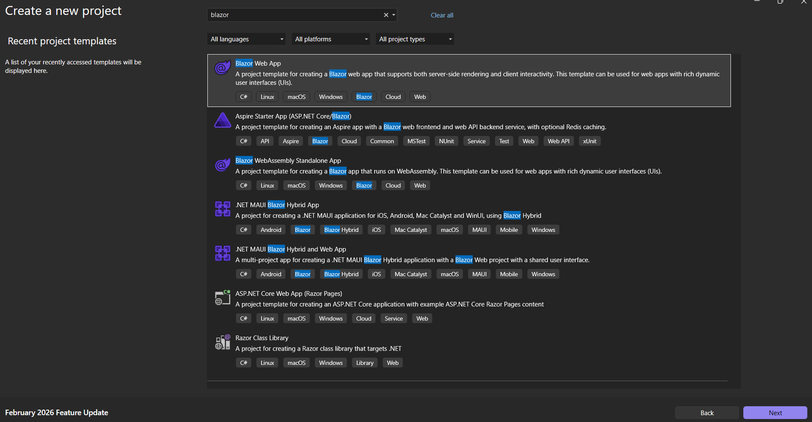

Step 2: Name the project.

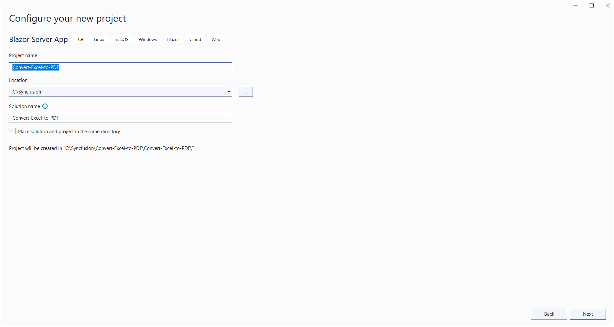

Step 3: Select the framework and click **Create**.

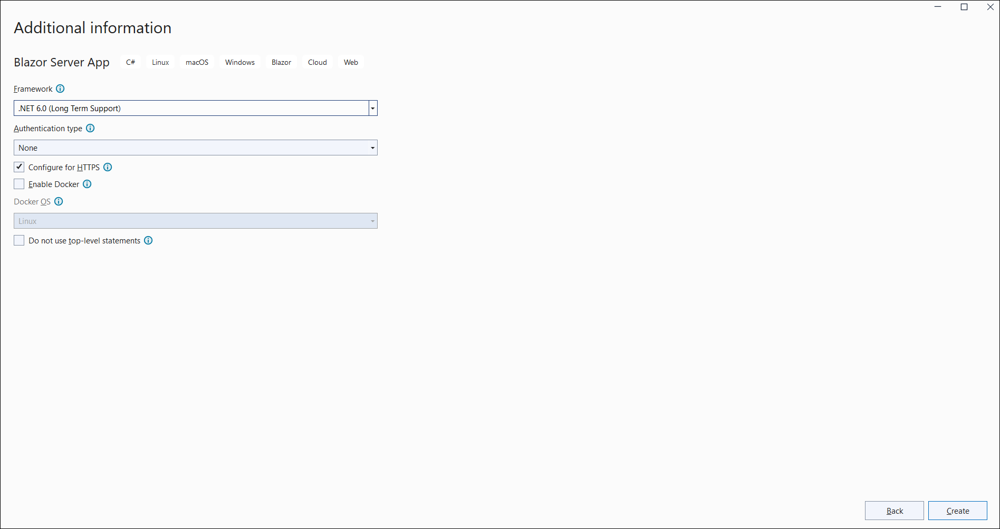

Step 4: Install the [Syncfusion.XlsIORenderer.Net.Core](https://www.nuget.org/packages/Syncfusion.XlsIORenderer.Net.Core) NuGet package as a reference to your project from [NuGet.org](https://www.nuget.org/). This package transitively pulls in the required `Syncfusion.XlsIO.Net.Core` and `Syncfusion.Pdf.Net.Core` assemblies.

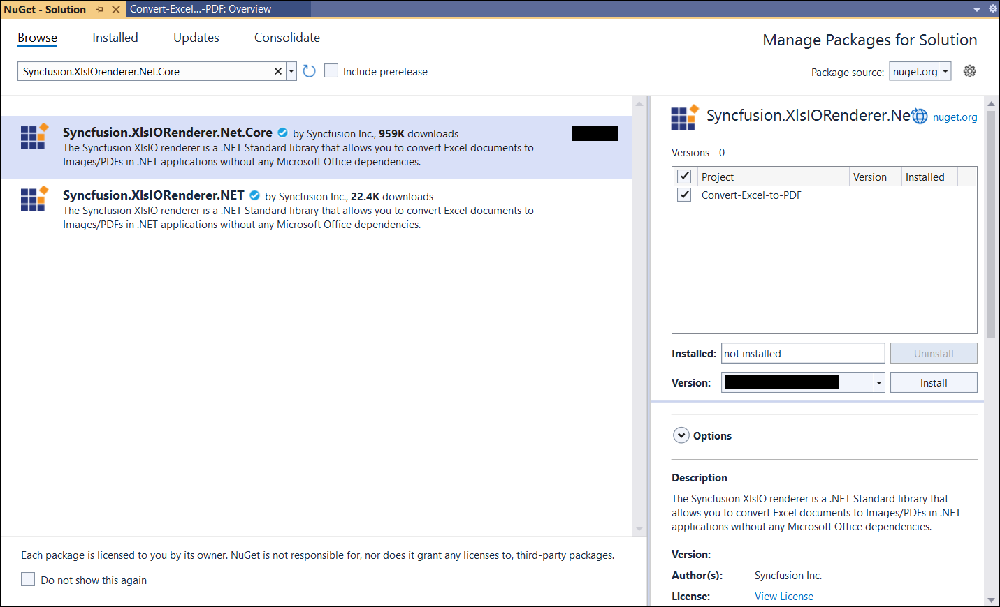

N> Starting with v16.2.0.x, if you reference Syncfusion<sup>&reg;</sup> assemblies from the trial setup or from the NuGet feed, you must also add the `Syncfusion.Licensing` reference and register a license key. Refer to this [link](https://help.syncfusion.com/common/essential-studio/licensing/overview) to learn how to register the Syncfusion<sup>&reg;</sup> license key. The simplest approach is to add the following call in `Program.cs` before `app.Run()`:
> ```csharp
> Syncfusion.Licensing.SyncfusionLicenseProvider.RegisterLicense("YOUR_LICENSE_KEY");
> ```

Step 5: Register the **ExcelService** in `Program.cs` so the Razor component can inject it:


builder.Services.AddSingleton<Convert_Excel_to_PDF.Data.ExcelService>();



Step 6: Create a Razor file named **XlsIO** in the **Pages** folder and add the following code.


@page "/xlsio"
@using Microsoft.JSInterop
@inject Convert_Excel_to_PDF.Data.ExcelService service
@inject IJSRuntime JS

<h2>Syncfusion XlsIO library</h2>
<p>Syncfusion Blazor XlsIO library is used to create, read, edit, and convert Excel files in your applications without Microsoft Office dependencies.</p>
<button class="btn btn-primary" @onclick="ConvertExceltoPDF">Convert Excel to PDF</button>

@code {
    private MemoryStream documentStream;

    /// <summary>
    /// Convert Excel to PDF and download the PDF document.
    /// </summary>
    private async Task ConvertExceltoPDF()
    {
        documentStream = service.ConvertExceltoPDF();
        await JS.SaveAs("Sample.pdf", documentStream.ToArray());
        documentStream.Dispose();
    }
}



Step 7: Create a new C# class file named **ExcelService** in the **Data** folder.


using Syncfusion.XlsIO;
using Syncfusion.Pdf;
using Syncfusion.XlsIORenderer;
using System.IO;

namespace Convert_Excel_to_PDF.Data
{
    public class ExcelService
    {
        public MemoryStream ConvertExceltoPDF()
        {
            using (ExcelEngine excelEngine = new ExcelEngine())
            {
                IApplication application = excelEngine.Excel;
                application.DefaultVersion = ExcelVersion.Xlsx;

                // Open the workbook. Place InputTemplate.xlsx in the project's wwwroot folder.
                IWorkbook workbook = application.Workbooks.Open(@"wwwroot/InputTemplate.xlsx");

                // Instantiate the Excel-to-PDF renderer.
                XlsIORenderer renderer = new XlsIORenderer();

                // Convert the Excel document to a PDF document.
                PdfDocument pdfDocument = renderer.ConvertToPDF(workbook);

                // Create a MemoryStream to save the converted PDF.
                MemoryStream pdfStream = new MemoryStream();

                // Save the converted PDF document to the MemoryStream.
                pdfDocument.Save(pdfStream);
                pdfStream.Position = 0;

                // Close the workbook and the PDF document to release resources.
                workbook.Close();
                pdfDocument.Close();

                return pdfStream;
            }
        }
    }
}



Step 8: Create a new C# class file named **FileUtils** and add the following code to invoke the JavaScript action that downloads the file in the browser.


using System;
using System.Threading.Tasks;
using Microsoft.JSInterop;

public static class FileUtils
{
    public static ValueTask<object> SaveAs(this IJSRuntime js, string filename, byte[] data)
        => js.InvokeAsync<object>(
            "saveAsFile",
            filename,
            Convert.ToBase64String(data));
}



Step 9: Add the following JavaScript function to **Pages/_Host.cshtml**.


<script type="text/javascript">
    function saveAsFile(filename, bytesBase64) {
        if (navigator.msSaveBlob) {
            //Download document in Edge browser
            var data = window.atob(bytesBase64);
            var bytes = new Uint8Array(data.length);
            for (var i = 0; i < data.length; i++) {
                bytes[i] = data.charCodeAt(i);
            }
            var blob = new Blob([bytes.buffer], { type: "application/octet-stream" });
            navigator.msSaveBlob(blob, filename);
        }
        else {
            var link = document.createElement('a');
            link.download = filename;
            link.href = "data:application/octet-stream;base64," + bytesBase64;
            document.body.appendChild(link); // Needed for Firefox
            link.click();
            document.body.removeChild(link);
        }
    }
</script>



Step 10: Add the following code snippet to **Shared/NavMenu.razor** to add a navigation link to the new page.


<li class="nav-item px-3">
    <NavLink class="nav-link" href="xlsio">
        <span class="oi oi-list-rich" aria-hidden="true"></span> Convert Excel to PDF
    </NavLink>
</li>







Step 1: Create a new C# Blazor Server app project using Create .NET Project option.

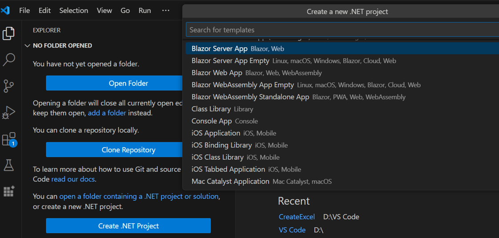

Step 2: Name the project and create the project.

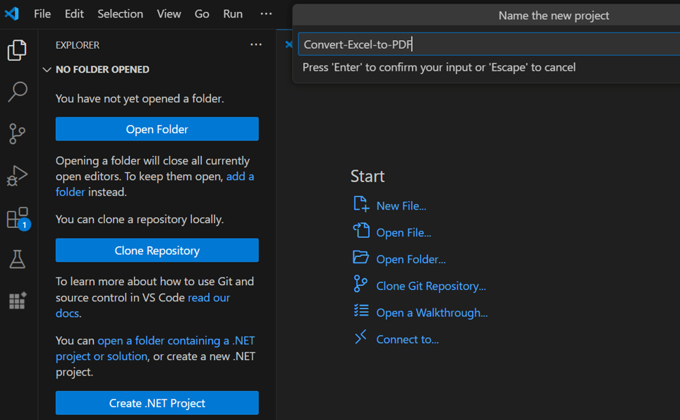

Alternatively, create a Blazor Server application using the following command in the terminal (<kbd>Ctrl</kbd>+<kbd>`</kbd>).

```
dotnet new blazorserver -o Convert-Excel-to-PDF
cd Convert-Excel-to-PDF
```

Step 3: To convert an Excel document to PDF in Blazor, run the following command to install the [Syncfusion.XlsIORenderer.Net.Core](https://www.nuget.org/packages/Syncfusion.XlsIORenderer.Net.Core) package.
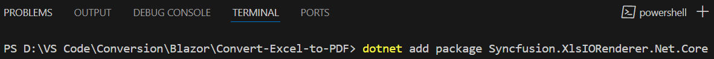

```
dotnet add package Syncfusion.XlsIORenderer.Net.Core
```

N> Starting with v16.2.0.x, if you reference Syncfusion<sup>&reg;</sup> assemblies from trial setup or from the NuGet feed, you also have to add "Syncfusion.Licensing" assembly reference and include a license key in your projects. Please refer to this [link](https://help.syncfusion.com/common/essential-studio/licensing/overview) to know about registering Syncfusion<sup>&reg;</sup> license key in your applications to use our components

Step 4: Create a razor file with name as **XlsIO** under **Pages** folder and include the following namespaces in the file.


@page "/xlsio"
@using Convert_Excel_to_PDF;
@inject Convert_Excel_to_PDF.Data.ExcelService service
@inject Microsoft.JSInterop.IJSRuntime JS



Step 5: Add the following code in **XlsIO.razor** file to create a new button.


<h2>Syncfusion XlsIO library </h2>
<p>Syncfusion Blazor XlsIO library is used to create, read, edit, and convert Excel files in your applications without Microsoft Office dependencies.</p>
<button class="btn btn-primary" @onclick="@ConvertExceltoPDF">Convert Excel to PDF</button>



Step 6: Add the following code in **XlsIO.razor** file to create and download the **PDF document**.


@code {
    MemoryStream documentStream;
    /// <summary>
    /// Convert Excel to PDF and download the PDF document
    /// </summary>
    protected async void ConvertExceltoPDF()
    {
        documentStream = service.ConvertExceltoPDF();
        await JS.SaveAs("Sample.pdf", documentStream.ToArray());
    }
}



Step 7: Create a new cs file with name as **ExcelService** under Data folder and include the following namespaces in the file.


using Syncfusion.XlsIO;
using Syncfusion.Pdf;
using Syncfusion.XlsIORenderer;



Step 8: Create a new MemoryStream method with name as **ConvertExceltoPDF** in **ExcelService** class and include the following code snippet to **convert an Excel document to Pdf** in Server app.


using (ExcelEngine excelEngine = new ExcelEngine())
{
    IApplication application = excelEngine.Excel;
    application.DefaultVersion = ExcelVersion.Xlsx;

    // Open the workbook.
    IWorkbook workbook = application.Workbooks.Open(@"wwwroot/InputTemplate.xlsx");

    // Instantiate the Excel to PDF renderer.
    XlsIORenderer renderer = new XlsIORenderer();

    //Convert Excel document into PDF document 
    PdfDocument pdfDocument = renderer.ConvertToPDF(workbook);

    //Create the MemoryStream to save the converted PDF.      
    MemoryStream pdfStream = new MemoryStream();

    //Save the converted PDF document to MemoryStream.
    pdfDocument.Save(pdfStream);
    pdfStream.Position = 0;
    return pdfStream;    
}



Step 9: Create a new class file in the project, with name as **FileUtils** and add the following code to invoke the JavaScript action to download the file in the browser.


public static class FileUtils
{
    public static ValueTask<object> SaveAs(this IJSRuntime js, string filename, byte[] data)
        => js.InvokeAsync<object>(
            "saveAsFile",
            filename,
            Convert.ToBase64String(data));
}



Step 10: Add the following JavaScript function in the **_Host.cshtml** in the Pages folder.


<script type="text/javascript">
    function saveAsFile(filename, bytesBase64) {
        if (navigator.msSaveBlob) {
            //Download document in Edge browser
            var data = window.atob(bytesBase64);
            var bytes = new Uint8Array(data.length);
            for (var i = 0; i < data.length; i++) {
                bytes[i] = data.charCodeAt(i);
            }
            var blob = new Blob([bytes.buffer], { type: "application/octet-stream" });
            navigator.msSaveBlob(blob, filename);
        }
        else {
            var link = document.createElement('a');
            link.download = filename;
            link.href = "data:application/octet-stream;base64," + bytesBase64;
            document.body.appendChild(link); // Needed for Firefox
            link.click();
            document.body.removeChild(link);
        }
    }
</script>



Step 11: Add the following code snippet in the **NavMenu.razor** in the Shared folder.


<li class="nav-item px-3">
    <NavLink class="nav-link" href="xlsio">
        <span class="oi oi-list-rich" aria-hidden="true"></span> Convert Excel to PDF
    </NavLink>
</li>







A complete working example of how to convert an Excel document to PDF in Blazor Server App is present on [this GitHub page](https://github.com/SyncfusionExamples/XlsIO-Examples/tree/master/Getting%20Started/Blazor/Server%20Side/Convert%20Excel%20to%20PDF).

By executing the program, you will get the **PDF document** as shown below.


Click [here](https://www.syncfusion.com/document-processing/excel-framework/blazor) to explore the rich set of Syncfusion<sup>&reg;</sup> Excel library (XlsIO) features.
 
An online sample link to <a href="https://blazor.syncfusion.com/demos/excel/excel-to-pdf?theme=fluent">convert an Excel document to PDF</a> in Blazor.

## Excel to PDF in Blazor WASM app




Step 1: Create a new C# Blazor WASM app project.

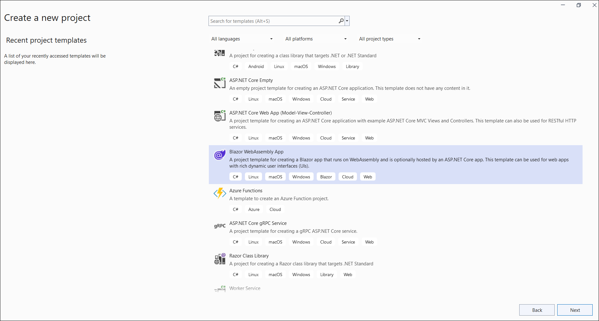

Step 2: Name the project.

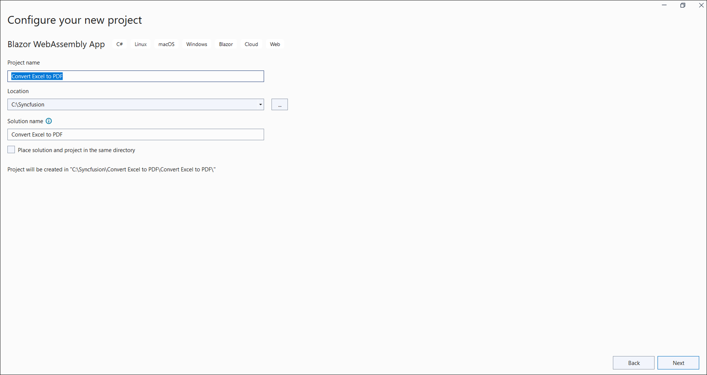

Step 3: Select the framework and click **Create**.

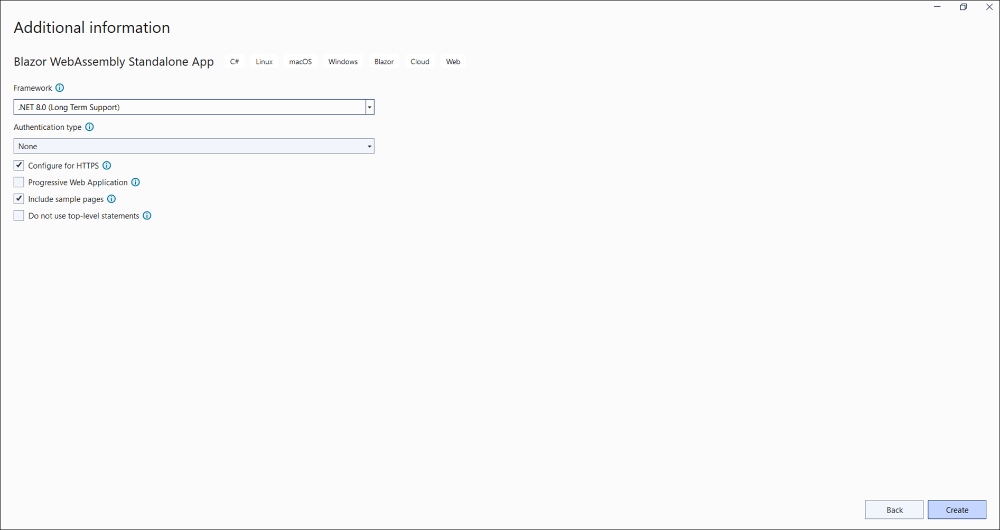

Step 4: Install the following **NuGet packages** in your application from [NuGet.org](https://www.nuget.org/).
* [Syncfusion.XlsIORenderer.Net.Core](https://www.nuget.org/packages/Syncfusion.XlsIORenderer.Net.Core)
* [SkiaSharp.Views.Blazor](https://www.nuget.org/packages/SkiaSharp.views.Blazor)

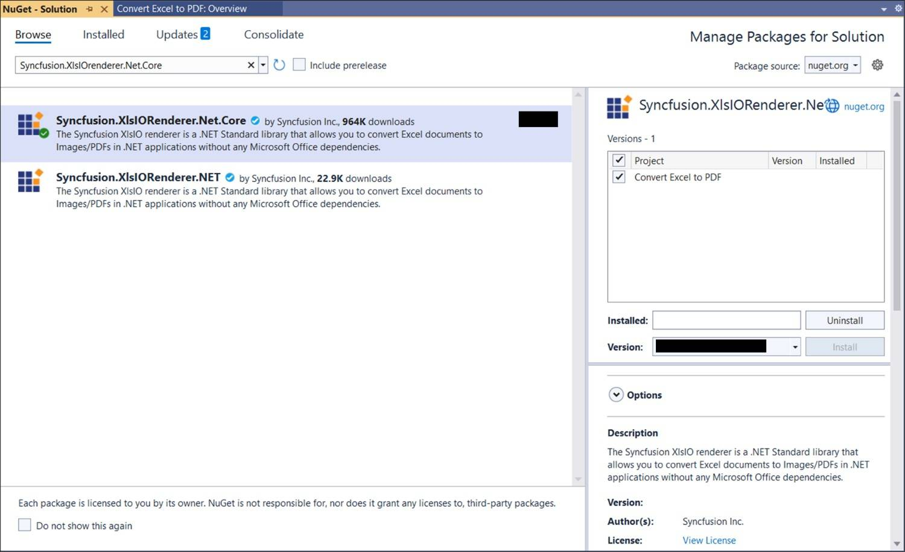
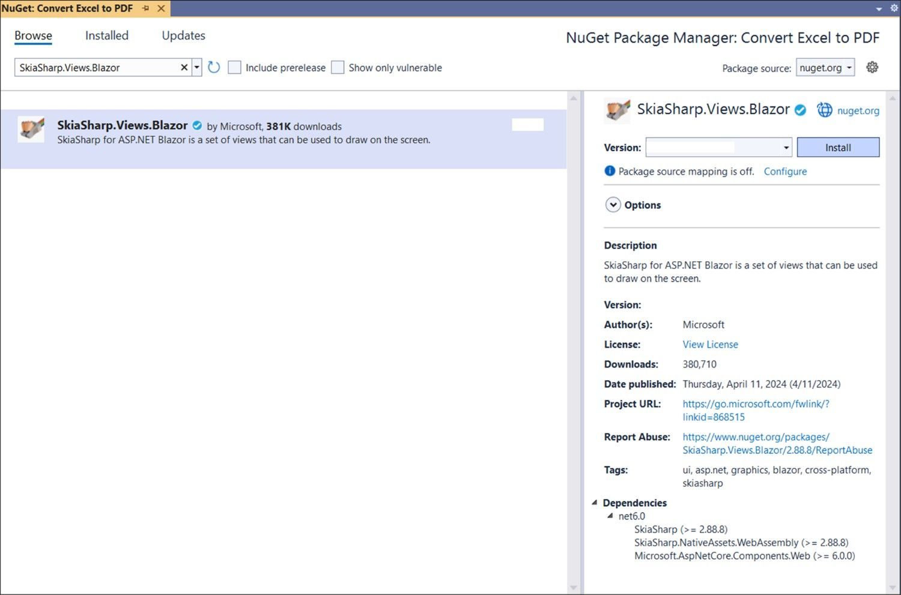

N> Starting with v16.2.0.x, if you reference Syncfusion<sup>&reg;</sup> assemblies from trial setup or from the NuGet feed, you also have to add "Syncfusion.Licensing" assembly reference and include a license key in your projects. Please refer to this [link](https://help.syncfusion.com/common/essential-studio/licensing/overview) to know about registering Syncfusion<sup>&reg;</sup> license key in your application to use our components.

Step 5: Add the following ItemGroup tag in the **Blazor WASM csproj** file.


<ItemGroup>
    <NativeFileReference Include="$(SkiaSharpStaticLibraryPath)\2.0.23\*.a" />
</ItemGroup>



N> If you face issues related to SkiaSharp during runtime, install the `wasm-tools` workload by running `dotnet workload install wasm-tools` in your command prompt.

Step 6: Enable the following property in the Blazor WASM csproj file.



<PropertyGroup>
    <WasmNativeStrip>true</WasmNativeStrip>
</PropertyGroup>



Step 7: Create a Razor file named **XlsIO** in the **Pages** folder and add the following code. The component fetches `Data/InputTemplate.xlsx` from the host's `wwwroot` folder; ensure the file is added to the **host** project's `wwwroot/Data/` path.


@page "/xlsio"
@using Microsoft.JSInterop
@using Syncfusion.XlsIO
@using Syncfusion.Pdf
@using Syncfusion.XlsIORenderer
@using System.IO
@inject IJSRuntime JS
@inject HttpClient client

<h2>Syncfusion XlsIO library</h2>
<p>Syncfusion Blazor XlsIO library used to create, read, edit, and convert Excel files in your applications without Microsoft Office dependencies.</p>
<button class="btn btn-primary" @onclick="ExcelToPDF">Convert Excel to PDF</button>

@code {
    private async Task ExcelToPDF()
    {
        using (ExcelEngine excelEngine = new ExcelEngine())
        {
            IApplication application = excelEngine.Excel;
            application.DefaultVersion = ExcelVersion.Xlsx;

            // Load an existing file from the host's wwwroot/Data folder.
            using (Stream inputStream = await client.GetStreamAsync("Data/InputTemplate.xlsx"))
            {
                // Open the workbook.
                IWorkbook workbook = application.Workbooks.Open(inputStream);

                // Instantiate the Excel-to-PDF renderer.
                XlsIORenderer renderer = new XlsIORenderer();

                // Convert the Excel document to a PDF document.
                PdfDocument pdfDocument = renderer.ConvertToPDF(workbook);

                // Create a MemoryStream to save the converted PDF.
                MemoryStream pdfStream = new MemoryStream();

                // Save the converted PDF document to the MemoryStream.
                pdfDocument.Save(pdfStream);
                pdfStream.Position = 0;

                // Close the workbook and the PDF document to release resources.
                workbook.Close();
                pdfDocument.Close();

                // Download the PDF document in the browser.
                await JS.SaveAs("Sample.pdf", pdfStream.ToArray());
            }
        }
    }
}



Step 8: Create a C# class file named **FileUtils** and add the following code to invoke the JavaScript action that downloads the file in the browser.


using System;
using System.Threading.Tasks;
using Microsoft.JSInterop;

public static class FileUtils
{
    public static ValueTask<object> SaveAs(this IJSRuntime js, string filename, byte[] data)
        => js.InvokeAsync<object>(
            "saveAsFile",
            filename,
            Convert.ToBase64String(data));
}



Step 9: Add the following JavaScript function to **wwwroot/Index.html**.


<script type="text/javascript">
    function saveAsFile(filename, bytesBase64) {
        if (navigator.msSaveBlob) {
            //Download document in Edge browser
            var data = window.atob(bytesBase64);
            var bytes = new Uint8Array(data.length);
            for (var i = 0; i < data.length; i++) {
                bytes[i] = data.charCodeAt(i);
            }
            var blob = new Blob([bytes.buffer], { type: "application/octet-stream" });
            navigator.msSaveBlob(blob, filename);
        }
        else {
            var link = document.createElement('a');
            link.download = filename;
            link.href = "data:application/octet-stream;base64," + bytesBase64;
            document.body.appendChild(link); // Needed for Firefox
            link.click();
            document.body.removeChild(link);
        }
    }
</script>



Step 10: Add the following code snippet to **Shared/NavMenu.razor** to add a navigation link to the new page.


<li class="nav-item px-3">
    <NavLink class="nav-link" href="xlsio">
        <span class="oi oi-list-rich" aria-hidden="true"></span> Convert Excel to PDF
    </NavLink>
</li>







Step 1: Create a new C# Blazor WASM app project.

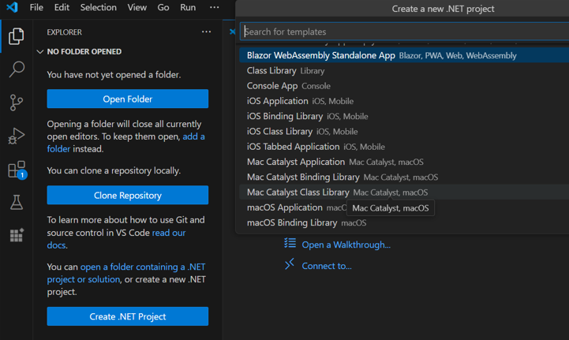

Step 2: Name the project and create the project.


Alternatively, create a Blazor WASM application using the following command in the terminal (<kbd>Ctrl</kbd>+<kbd>`</kbd>).

```
dotnet new blazorwasm -o Convert-Excel-to-PDF
cd Convert-Excel-to-PDF
```

Step 3: To convert an Excel document to PDF in Blazor, run the following commands to install [SkiaSharp.Views.Blazor](https://www.nuget.org/packages/SkiaSharp.Views.Blazor), [SkiaSharp.NativeAssets.WebAssembly](https://www.nuget.org/packages/SkiaSharp.NativeAssets.WebAssembly), and [Syncfusion.XlsIORenderer.Net.Core](https://www.nuget.org/packages/Syncfusion.XlsIORenderer.Net.Core).
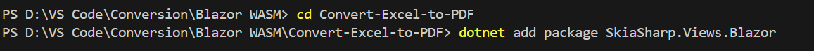


```
dotnet add package SkiaSharp.Views.Blazor
dotnet add package SkiaSharp.NativeAssets.WebAssembly
dotnet add package Syncfusion.XlsIORenderer.Net.Core
```

N> Starting with v16.2.0.x, if you reference Syncfusion<sup>&reg;</sup> assemblies from trial setup or from the NuGet feed, you also have to add "Syncfusion.Licensing" assembly reference and include a license key in your projects. Please refer to this [link](https://help.syncfusion.com/common/essential-studio/licensing/overview) to know about registering Syncfusion<sup>&reg;</sup> license key in your application to use our components.

Step 4: Add the following ItemGroup tag in the **Blazor WASM csproj** file.


<ItemGroup>
    <NativeFileReference Include="$(SkiaSharpStaticLibraryPath)\2.0.23\*.a" />
</ItemGroup>



N> If you face issues related to SkiaSharp during runtime, install the `wasm-tools` workload by running `dotnet workload install wasm-tools` in your command prompt.

Step 5: Enable the following property in the Blazor WASM csproj file.



<PropertyGroup>
    <WasmNativeStrip>true</WasmNativeStrip>
</PropertyGroup>



Step 6: Create a Razor file named **XlsIO** in the **Pages** folder and add the following code. The component fetches `Data/InputTemplate.xlsx` from the host's `wwwroot` folder; ensure the file is added to the **host** project's `wwwroot/Data/` path.


@page "/xlsio"
@using Syncfusion.XlsIO
@using Syncfusion.Pdf
@using Syncfusion.XlsIORenderer
@inject Microsoft.JSInterop.IJSRuntime JS
@inject HttpClient client

<h2>Syncfusion XlsIO library</h2>
<p>Syncfusion Blazor XlsIO library used to create, read, edit, and convert Excel files in your applications without Microsoft Office dependencies.</p>
<button class="btn btn-primary" @onclick="ExcelToPDF">Convert Excel to PDF</button>

@code {
    private async Task ExcelToPDF()
    {
        using (ExcelEngine excelEngine = new ExcelEngine())
        {
            IApplication application = excelEngine.Excel;
            application.DefaultVersion = ExcelVersion.Xlsx;

            // Load an existing file from the host's wwwroot/Data folder.
            using (Stream inputStream = await client.GetStreamAsync("Data/InputTemplate.xlsx"))
            {
                // Open the workbook.
                IWorkbook workbook = application.Workbooks.Open(inputStream);

                // Instantiate the Excel-to-PDF renderer.
                XlsIORenderer renderer = new XlsIORenderer();

                // Convert the Excel document to a PDF document.
                PdfDocument pdfDocument = renderer.ConvertToPDF(workbook);

                // Create a MemoryStream to save the converted PDF.
                MemoryStream pdfStream = new MemoryStream();

                // Save the converted PDF document to the MemoryStream.
                pdfDocument.Save(pdfStream);
                pdfStream.Position = 0;

                // Close the workbook and the PDF document to release resources.
                workbook.Close();
                pdfDocument.Close();

                // Download the PDF document in the browser.
                await JS.SaveAs("Sample.pdf", pdfStream.ToArray());
            }
        }
    }
}



Step 7: Create a C# class file named **FileUtils** and add the following code to invoke the JavaScript action that downloads the file in the browser.


using System;
using System.Threading.Tasks;
using Microsoft.JSInterop;

public static class FileUtils
{
    public static ValueTask<object> SaveAs(this IJSRuntime js, string filename, byte[] data)
        => js.InvokeAsync<object>(
            "saveAsFile",
            filename,
            Convert.ToBase64String(data));
}



Step 8: Add the following JavaScript function to **wwwroot/Index.html**.


<script type="text/javascript">
    function saveAsFile(filename, bytesBase64) {
        if (navigator.msSaveBlob) {
            //Download document in Edge browser
            var data = window.atob(bytesBase64);
            var bytes = new Uint8Array(data.length);
            for (var i = 0; i < data.length; i++) {
                bytes[i] = data.charCodeAt(i);
            }
            var blob = new Blob([bytes.buffer], { type: "application/octet-stream" });
            navigator.msSaveBlob(blob, filename);
        }
        else {
            var link = document.createElement('a');
            link.download = filename;
            link.href = "data:application/octet-stream;base64," + bytesBase64;
            document.body.appendChild(link); // Needed for Firefox
            link.click();
            document.body.removeChild(link);
        }
    }
</script>



Step 9: Add the following code snippet to **Shared/NavMenu.razor** to add a navigation link to the new page.


<li class="nav-item px-3">
    <NavLink class="nav-link" href="xlsio">
        <span class="oi oi-list-rich" aria-hidden="true"></span> Convert Excel to PDF
    </NavLink>
</li>







A complete working example of how to convert an Excel document to PDF in Blazor WASM App is present on [this GitHub page](https://github.com/SyncfusionExamples/XlsIO-Examples/tree/master/Getting%20Started/Blazor/Client%20Side/Convert%20Excel%20to%20PDF).

By executing the program, you will get the **PDF document** as shown below.


N> To convert Excel to PDF, it is necessary to access the font stream internally. This cannot be done automatically in a Blazor WASM application, so the **Blazor Server** model is the recommended approach. Excel-to-PDF conversion does work in a WASM app, but font handling requires extra configuration.

Click [here](https://www.syncfusion.com/document-processing/excel-framework/blazor) to explore the rich set of Syncfusion<sup>&reg;</sup> Excel library (XlsIO) features.

## Excel to PDF in .NET MAUI Blazor Hybrid App




Step 1: Create a new C# .NET MAUI Blazor Hybrid Application project.

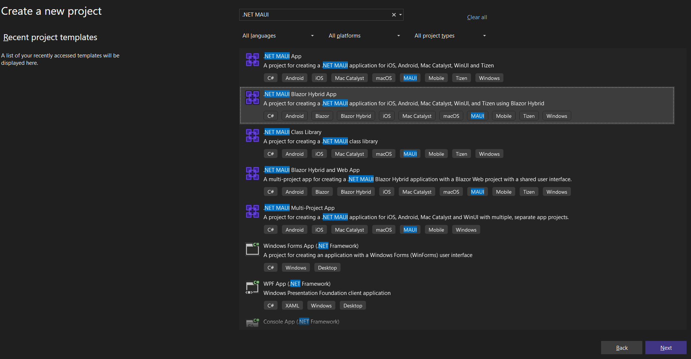

Step 2: Name the project.

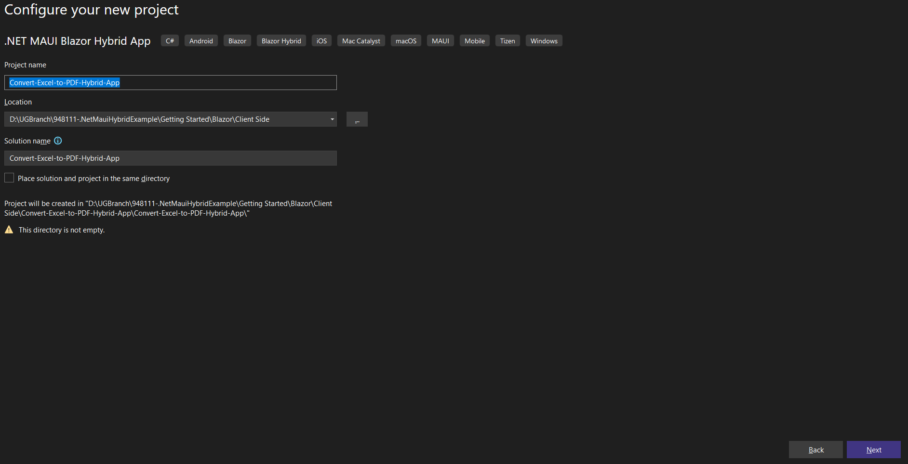

Step 3: Select the framework and click **Create**.

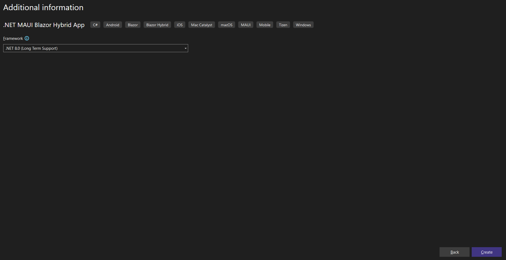

Step 4: Install the following **NuGet packages** in your application from [NuGet.org](https://www.nuget.org/).
* [Syncfusion.XlsIORenderer.Net.Core](https://www.nuget.org/packages/Syncfusion.XlsIORenderer.Net.Core)

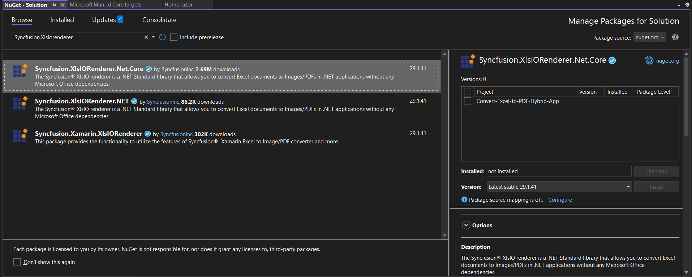

N> Starting with v16.2.0.x, if you reference Syncfusion<sup>&reg;</sup> assemblies from trial setup or from the NuGet feed, you also have to add "Syncfusion.Licensing" assembly reference and include a license key in your projects. Please refer to this [link](https://help.syncfusion.com/common/essential-studio/licensing/overview) to know about registering Syncfusion<sup>&reg;</sup> license key in your application to use our components.

Step 5: Add a new button to **Pages/Home.razor** along with the namespaces and the conversion logic.



@page "/"
@using Syncfusion.XlsIO
@using Syncfusion.XlsIORenderer
@using Syncfusion.Pdf
@using System.IO

<h3>Convert Excel to PDF</h3>

<button class="btn btn-primary" @onclick="ConvertExceltoPDF">Convert Excel to PDF</button>

@code {
    private async Task ConvertExceltoPDF()
    {
        using ExcelEngine excelEngine = new();
        IApplication application = excelEngine.Excel;
        application.DefaultVersion = ExcelVersion.Xlsx;

        string inputPath = Path.Combine(FileSystem.Current.AppDataDirectory, "InputTemplate.xlsx");

        // Copy the Excel file from wwwroot to local app storage if it doesn't exist
        if (!File.Exists(inputPath))
        {
            using Stream resourceStream = await FileSystem.OpenAppPackageFileAsync("wwwroot/data/InputTemplate.xlsx");
            using FileStream outputStream = File.Create(inputPath);
            await resourceStream.CopyToAsync(outputStream);
        }

        using FileStream excelStream = File.OpenRead(inputPath);
        IWorkbook workbook = application.Workbooks.Open(excelStream);

        XlsIORenderer renderer = new XlsIORenderer();
        PdfDocument pdf = renderer.ConvertToPDF(workbook);

        using MemoryStream stream = new();
        pdf.Save(stream);
        pdf.Close();
        workbook.Close();

        stream.Position = 0;

        // Save the generated PDF to local storage
        
        string outputDir = Path.Combine(FileSystem.Current.AppDataDirectory, "Output");

        // Create folder if it doesn't exist
        Directory.CreateDirectory(outputDir); 

        string outputPath = Path.Combine(outputDir, "Sample.pdf");

        using FileStream fileStream = new FileStream(outputPath, FileMode.Create, FileAccess.Write);
        stream.CopyTo(fileStream);
        await Application.Current.MainPage.DisplayAlert("Success", $"PDF saved to:\n{outputPath}", "OK");
    }
}



N> For additional control over page size, orientation, and font embedding, pass an `ExcelToPdfConverterSettings` instance to `XlsIORenderer.ConvertToPDF`. See the [Excel-to-PDF conversion settings](https://help.syncfusion.com/document-processing/excel/conversions/excel-to-pdf/net/excel-to-pdf-converter-settings) for details.





Step 1: Create a new C# .NET MAUI Blazor Hybrid Application project.

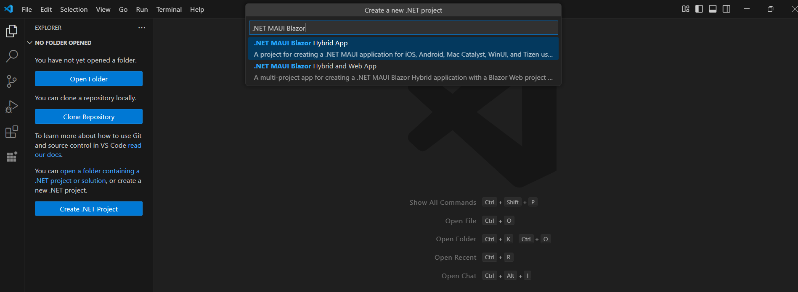

Step 2: Name the project and create the project.

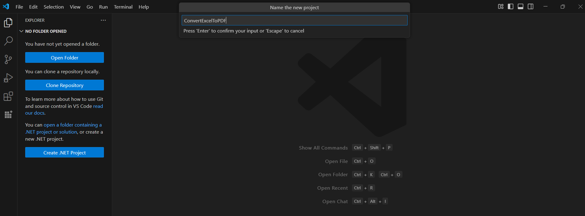

Alternatively, create a .NET MAUI Blazor Hybrid Application using the following command in the terminal (<kbd>Ctrl</kbd>+<kbd>`</kbd>).

```
dotnet new maui-blazor -n ConvertExcelToPdf
cd ConvertExcelToPdf
```

Step 3: To convert an Excel document to PDF in Blazor, run the following command to install the [Syncfusion.XlsIORenderer.Net.Core](https://www.nuget.org/packages/Syncfusion.XlsIORenderer.Net.Core) package.


```
dotnet add package Syncfusion.XlsIORenderer.Net.Core
```

N> Starting with v16.2.0.x, if you reference Syncfusion<sup>&reg;</sup> assemblies from trial setup or from the NuGet feed, you also have to add "Syncfusion.Licensing" assembly reference and include a license key in your projects. Please refer to this [link](https://help.syncfusion.com/common/essential-studio/licensing/overview) to know about registering Syncfusion<sup>&reg;</sup> license key in your application to use our components.

Step 4: Add a new button to **Pages/Home.razor** along with the namespaces and the conversion logic.



@page "/"
@using Syncfusion.XlsIO
@using Syncfusion.XlsIORenderer
@using Syncfusion.Pdf
@using System.IO

<h3>Convert Excel to PDF</h3>

<button class="btn btn-primary" @onclick="ConvertExceltoPDF">Convert Excel to PDF</button>

@code {
    private async Task ConvertExceltoPDF()
    {
        using ExcelEngine excelEngine = new();
        IApplication application = excelEngine.Excel;
        application.DefaultVersion = ExcelVersion.Xlsx;

        string inputPath = Path.Combine(FileSystem.Current.AppDataDirectory, "InputTemplate.xlsx");

        // Copy the Excel file from wwwroot to local app storage if it doesn't exist
        if (!File.Exists(inputPath))
        {
            using Stream resourceStream = await FileSystem.OpenAppPackageFileAsync("InputTemplate.xlsx");
            using FileStream outputStream = File.Create(inputPath);
            await resourceStream.CopyToAsync(outputStream);
        }

        using FileStream excelStream = File.OpenRead(inputPath);
        IWorkbook workbook = application.Workbooks.Open(excelStream);

        XlsIORenderer renderer = new XlsIORenderer();
        PdfDocument pdf = renderer.ConvertToPDF(workbook);

        using MemoryStream stream = new();
        pdf.Save(stream);
        pdf.Close();
        workbook.Close();

        stream.Position = 0;

        // Save the generated PDF to local storage
        string outputDir = Path.Combine(FileSystem.Current.AppDataDirectory, "Output");
        Directory.CreateDirectory(outputDir);

        string outputPath = Path.Combine(outputDir, "Sample.pdf");

        // Save the PDF to a file
        using (FileStream fileStream = new FileStream(outputPath, FileMode.Create, FileAccess.Write))
        {
            stream.CopyTo(fileStream);
        }

        // Display alert with the actual file path
        await Application.Current.MainPage.DisplayAlert("Success", $"PDF saved to:\n{outputPath}", "OK");
    }
}







A complete working example of how to convert an Excel document to PDF in .NET MAUI Blazor Hybrid App is present on [this GitHub page](https://github.com/SyncfusionExamples/XlsIO-Examples/tree/master/Getting%20Started/Blazor/MAUI/ExcelToPDF).

By executing the program, you will get the **PDF document** as shown below.


Click [here](https://www.syncfusion.com/document-processing/excel-framework/blazor) to explore the rich set of Syncfusion<sup>&reg;</sup> Excel library (XlsIO) features.

An online sample link to <a href="https://blazor.syncfusion.com/demos/excel/excel-to-pdf?theme=fluent">convert an Excel document to PDF</a> in Blazor.
