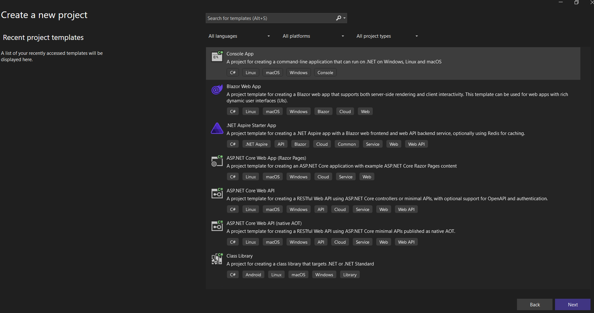
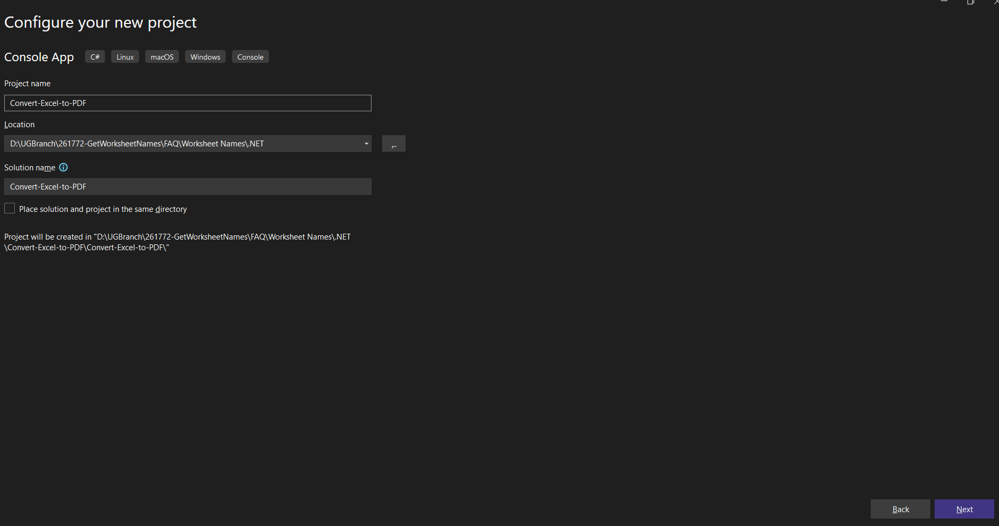
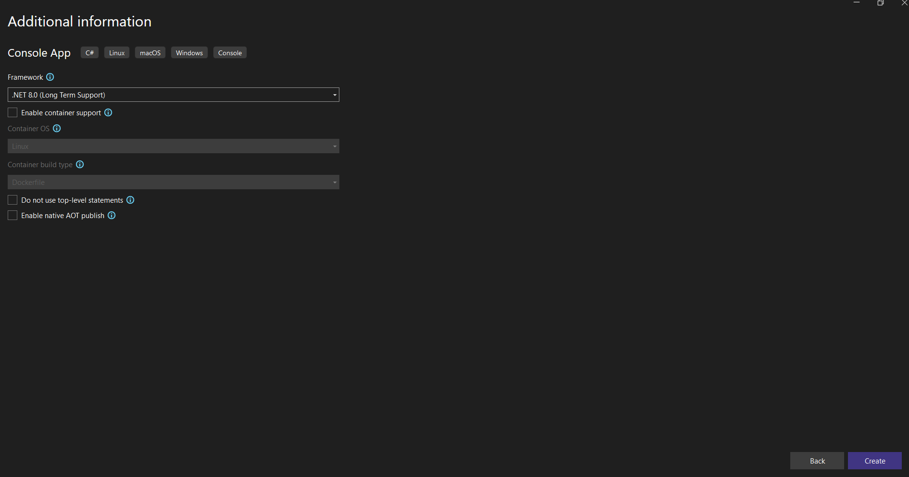
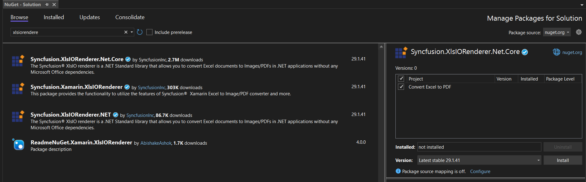
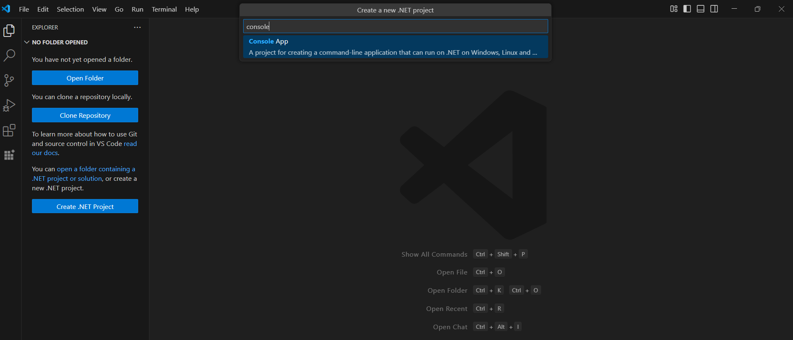
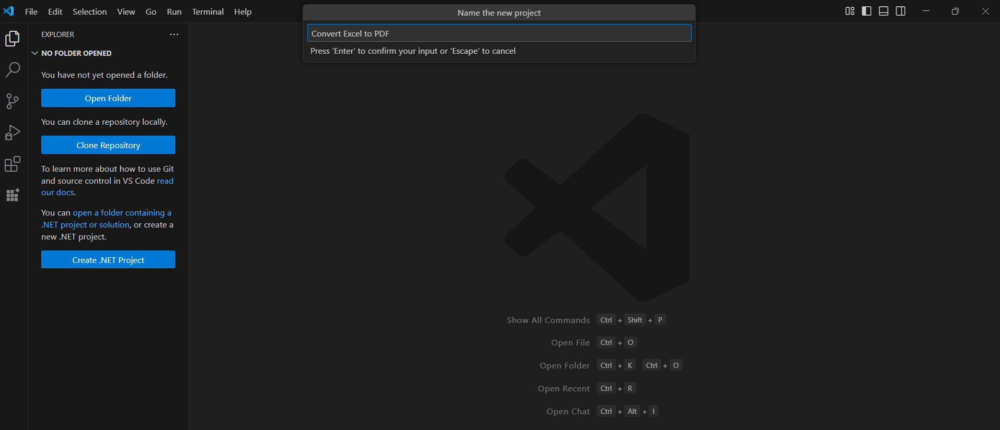
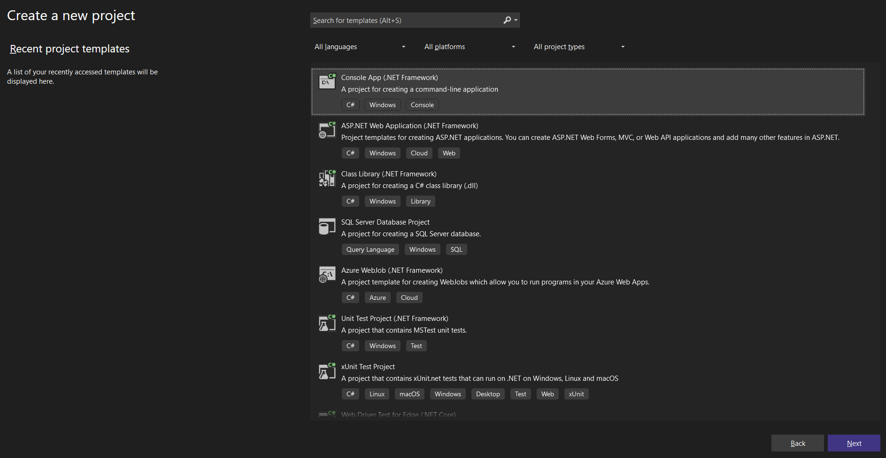
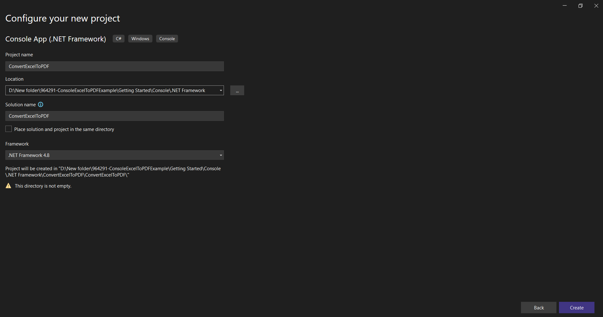
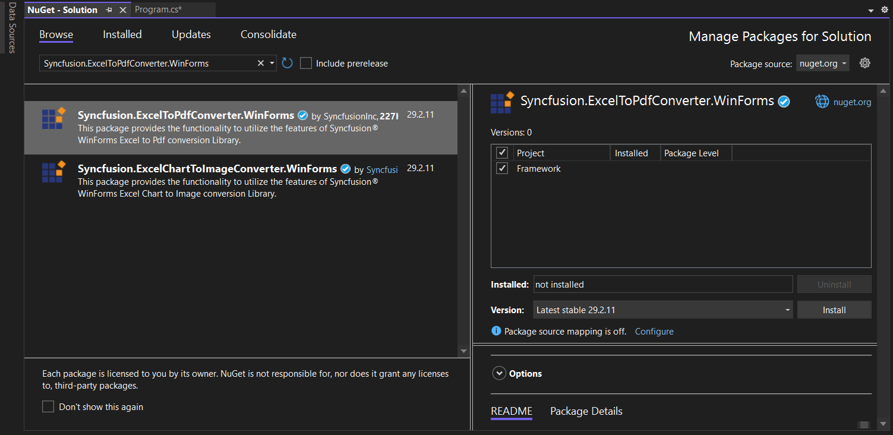

# Convert Excel to PDF in Console application

Syncfusion<sup>&reg;</sup> XlsIO is a [.NET Core Excel library](https://www.syncfusion.com/document-processing/excel-framework/net-core/excel-library) used to create, read, edit and **convert Excel documents** programmatically without **Microsoft Excel** or interop dependencies. Using this library, you can **convert an Excel document to PDF in Console application**.

## Convert Excel to PDF using .NET Core





Step 1: Create a new C# .NET Core console application.


Step 2: Name the project.



Step 3: Select the framework and click **Create** button.



Step 4: Install the [Syncfusion.XlsIORenderer.Net.Core](https://www.nuget.org/packages/Syncfusion.XlsIORenderer.Net.Core) NuGet package as a reference to your project from [NuGet.org](https://www.nuget.org/).



N> Starting with v16.2.0.x, if you reference Syncfusion<sup>&reg;</sup> assemblies from trial setup or from the NuGet feed, you also have to add "Syncfusion.Licensing" assembly reference and include a license key in your projects. Please refer to this [link](https://help.syncfusion.com/common/essential-studio/licensing/overview) to know about registering Syncfusion<sup>&reg;</sup> license key in your applications to use our components. 

Step 5: Include the following Namespaces in the Program.cs file.


using Syncfusion.XlsIO;
using Syncfusion.XlsIORenderer;
using Syncfusion.Pdf;



Step 6: Add the following code snippet in Program.cs file.


using (ExcelEngine excelEngine = new ExcelEngine())
{
    IApplication application = excelEngine.Excel;
    application.DefaultVersion = ExcelVersion.Xlsx;

    //Load existing Excel file
	IWorkbook workbook = application.Workbooks.Open(Path.GetFullPath(@"Data/Sample.xlsx"));

    //Convert to PDF
    XlsIORenderer renderer = new XlsIORenderer();
    PdfDocument pdfDocument = renderer.ConvertToPDF(workbook);

    #region Save
    //Saving the workbook
    pdfDocument.Save(Path.GetFullPath("Output/Sample.pdf"));
    #endregion
}







Step 1: Create a new C# .NET Core console application.


Step 2: Name the project and create the project.



Alternatively, create a ASP.NET Core console application using the following command in the terminal(<kbd>Ctrl</kbd>+<kbd>`</kbd>).

```
dotnet new console -o Convert-Excel-to-PDF
cd Convert-Excel-to-PDF
```

Step 3: To **Convert an Excel document to PDF in .NET Core app**, run the following command to  install [Syncfusion.XlsIORenderer.Net.Core](https://www.nuget.org/packages/Syncfusion.XlsIORenderer.Net.Core) package.


```
dotnet add package Syncfusion.XlsIORenderer.Net.Core
```

N> Starting with v16.2.0.x, if you reference Syncfusion<sup>&reg;</sup> assemblies from trial setup or from the NuGet feed, you also have to add "Syncfusion.Licensing" assembly reference and include a license key in your projects. Please refer to this [link](https://help.syncfusion.com/common/essential-studio/licensing/overview) to know about registering Syncfusion<sup>&reg;</sup> license key in your applications to use our components. 

Step 4: Include the following Namespaces in the Program.cs file.


using Syncfusion.XlsIO;
using Syncfusion.XlsIORenderer;
using Syncfusion.Pdf;



Step 5: Add the following code snippet in Program.cs file.


using (ExcelEngine excelEngine = new ExcelEngine())
{
    IApplication application = excelEngine.Excel;
    application.DefaultVersion = ExcelVersion.Xlsx;

    //Load existing Excel file
	IWorkbook workbook = application.Workbooks.Open(Path.GetFullPath(@"Data/Sample.xlsx"));

    //Convert to PDF
    XlsIORenderer renderer = new XlsIORenderer();
    PdfDocument pdfDocument = renderer.ConvertToPDF(workbook);

    #region Save
    //Saving the workbook
    pdfDocument.Save(Path.GetFullPath("Output/Sample.pdf"));
    #endregion
}





   

A complete working example of how to convert an Excel document to PDF using .NET Core is present on <a href="https://github.com/SyncfusionExamples/XlsIO-Examples/tree/master/Getting%20Started/Console/.NET/ConvertExcelToPDF">this GitHub page</a>.

By executing the program, you will get the **PDF document** as follows.


## Convert Excel to PDF using .NET Framework





Step 1: Create a new C# .NET Framework console application.


Step 2: Name the project.



Step 3: Install the [Syncfusion.ExcelToPdfConverter.WinForms](https://www.nuget.org/packages/Syncfusion.ExcelToPdfConverter.WinForms) NuGet package as a reference to your project from [NuGet.org](https://www.nuget.org/).



N> Starting with v16.2.0.x, if you reference Syncfusion<sup>&reg;</sup> assemblies from trial setup or from the NuGet feed, you also have to add "Syncfusion.Licensing" assembly reference and include a license key in your projects. Please refer to this [link](https://help.syncfusion.com/common/essential-studio/licensing/overview) to know about registering Syncfusion<sup>&reg;</sup> license key in your applications to use our components. 

Step 4: Include the following Namespaces in the Program.cs file.


using Syncfusion.XlsIO;
using Syncfusion.ExcelToPdfConverter;
using Syncfusion.Pdf;



Step 5: Add the following code snippet in Program.cs file.


using (ExcelEngine excelEngine = new ExcelEngine())
{
    IApplication application = excelEngine.Excel;
    application.DefaultVersion = ExcelVersion.Xlsx;
    IWorkbook workbook = application.Workbooks.Open("Sample.xlsx");

    //Initialize ExcelToPdfConverter
    ExcelToPdfConverter converter = new ExcelToPdfConverter(workbook);

    //Initialize PDF document
    PdfDocument pdfDocument = new PdfDocument();

    //Convert Excel document to PDF document
    pdfDocument = converter.Convert();

    //Save the converted PDF document
    pdfDocument.Save("Sample.pdf");
}





  

A complete working example of how to convert an Excel document to PDF using .NET Framework is present on <a href="https://github.com/SyncfusionExamples/XlsIO-Examples/tree/master/Getting%20Started/Console/.NET%20Framework/ConvertExcelToPDF">this GitHub page</a>.

By executing the program, you will get the **PDF document** as follows.


Click [here](https://www.syncfusion.com/document-processing/excel-framework/net-core) to explore the rich set of Syncfusion<sup>&reg;</sup> Excel library (XlsIO) features.

An online sample link to [convert an Excel document to PDF](https://ej2.syncfusion.com/aspnetcore/Excel/ExcelToPDF#/material3) in ASP.NET Core.