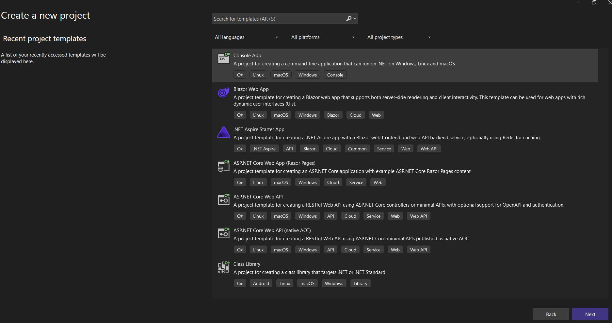
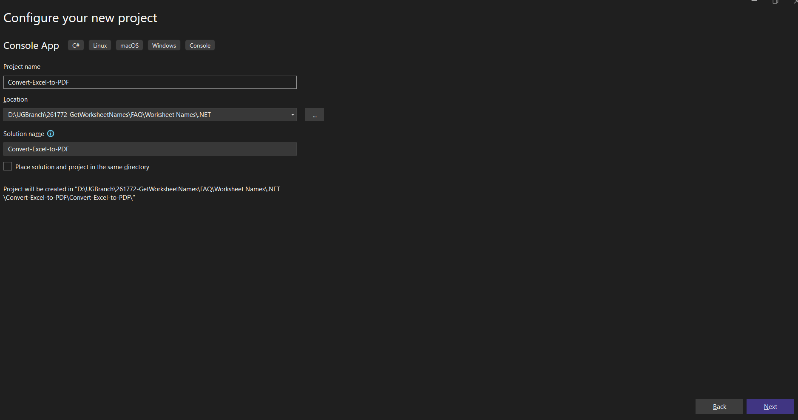
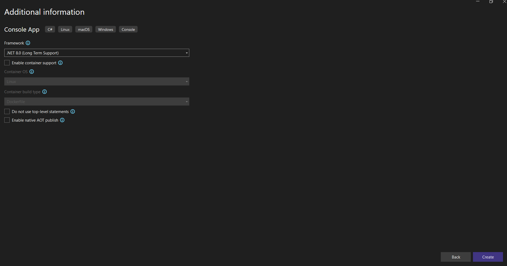
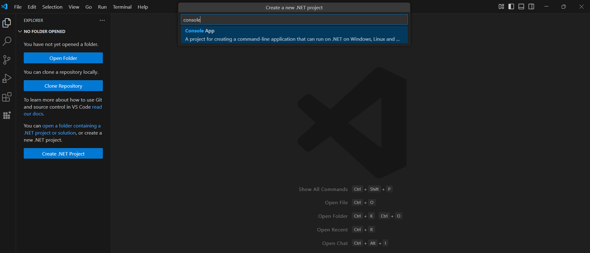
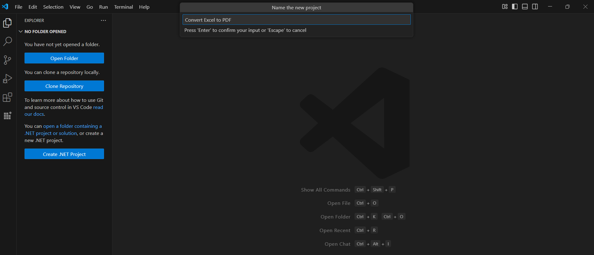

# Convert an Excel document to PDF on Linux

Syncfusion<sup>&reg;</sup> XlsIO is a [.NET Core Excel library](https://www.syncfusion.com/document-processing/excel-framework/net-core/excel-library) used to create, read, edit, and convert Excel documents programmatically, without Microsoft Excel or interop dependencies.

## Steps to convert an Excel document to PDF on Linux





Step 1: Create a new C# .NET Core console application.


Step 2: Name the project.



Step 3: Select the framework and click **Create**.



Step 4: Install the following NuGet packages in your application from [NuGet.org](https://www.nuget.org/) by running the following commands. The version numbers below are examples; use the latest stable versions in production.

* [Syncfusion.XlsIORenderer.Net.Core](https://www.nuget.org/packages/Syncfusion.XlsIORenderer.Net.Core)
* [SkiaSharp.NativeAssets.Linux](https://www.nuget.org/packages/SkiaSharp.NativeAssets.Linux/3.119.1)
* [HarfBuzzSharp.NativeAssets.Linux](https://www.nuget.org/packages/HarfBuzzSharp.NativeAssets.Linux/8.3.1.1)



dotnet add package Syncfusion.XlsIORenderer.Net.Core -v 29.1.41 -s https://www.nuget.org/
dotnet add package SkiaSharp.NativeAssets.Linux -v 3.119.1 -s https://www.nuget.org/
dotnet add package HarfBuzzSharp.NativeAssets.Linux -v 8.3.1.1 -s https://www.nuget.org/



N> Starting with v16.2.0.x, if you reference Syncfusion<sup>&reg;</sup> assemblies from the trial setup or from the NuGet feed, you must also add the `Syncfusion.Licensing` reference and register a license key. Refer to this [link](https://help.syncfusion.com/common/essential-studio/licensing/overview) to learn how to register the Syncfusion<sup>&reg;</sup> license key. The simplest approach is to add the following call at the top of **Program.cs** before constructing the `ExcelEngine`:
> ```csharp
> Syncfusion.Licensing.SyncfusionLicenseProvider.RegisterLicense("YOUR_LICENSE_KEY");
> ```

Step 5: Add the following namespaces in **Program.cs**.


using Syncfusion.XlsIO;
using Syncfusion.XlsIORenderer;
using Syncfusion.Pdf;



Step 6: Add the following code snippet in Program.cs file.


using (ExcelEngine excelEngine = new ExcelEngine())
{
    IApplication application = excelEngine.Excel;
    application.DefaultVersion = ExcelVersion.Xlsx;

    // Load the existing Excel file.
    IWorkbook workbook = application.Workbooks.Open(Path.GetFullPath("Data/Sample.xlsx"));

    // Convert the Excel document to a PDF document.
    XlsIORenderer renderer = new XlsIORenderer();
    PdfDocument pdfDocument = renderer.ConvertToPDF(workbook);

    #region Save
    //Saving the workbook
    pdfDocument.Save(Path.GetFullPath("Output/Sample.pdf"));
    #endregion
}







Step 1: Create a new **Console App** project.


Step 2: Name the project and create the project.



Alternatively, create a .NET console application using the following command in the terminal (<kbd>Ctrl</kbd>+<kbd>`</kbd>).

```
dotnet new console -o Convert-Excel-to-PDF
cd Convert-Excel-to-PDF
```

Step 3: Install the following NuGet packages in your application from [NuGet.org](https://www.nuget.org/) by running the following commands. The version numbers below are examples; use the latest stable versions in production.

* [Syncfusion.XlsIORenderer.Net.Core](https://www.nuget.org/packages/Syncfusion.XlsIORenderer.Net.Core)
* [SkiaSharp.NativeAssets.Linux](https://www.nuget.org/packages/SkiaSharp.NativeAssets.Linux/3.119.1)
* [HarfBuzzSharp.NativeAssets.Linux](https://www.nuget.org/packages/HarfBuzzSharp.NativeAssets.Linux/8.3.1.1)



dotnet add package Syncfusion.XlsIORenderer.Net.Core -v 29.1.41 -s https://www.nuget.org/
dotnet add package SkiaSharp.NativeAssets.Linux -v 3.119.1 -s https://www.nuget.org/
dotnet add package HarfBuzzSharp.NativeAssets.Linux -v 8.3.1.1 -s https://www.nuget.org/



N> Starting with v16.2.0.x, if you reference Syncfusion<sup>&reg;</sup> assemblies from the trial setup or from the NuGet feed, you must also add the `Syncfusion.Licensing` reference and register a license key. Refer to this [link](https://help.syncfusion.com/common/essential-studio/licensing/overview) to learn how to register the Syncfusion<sup>&reg;</sup> license key. The simplest approach is to add the following call at the top of **Program.cs** before constructing the `ExcelEngine`:
> ```csharp
> Syncfusion.Licensing.SyncfusionLicenseProvider.RegisterLicense("YOUR_LICENSE_KEY");
> ```

Step 4: Add the following namespaces in **Program.cs**.


using Syncfusion.XlsIO;
using Syncfusion.XlsIORenderer;
using Syncfusion.Pdf;



Step 5: Add the following code snippet in Program.cs file.


using (ExcelEngine excelEngine = new ExcelEngine())
{
    IApplication application = excelEngine.Excel;
    application.DefaultVersion = ExcelVersion.Xlsx;

    // Load the existing Excel file.
    IWorkbook workbook = application.Workbooks.Open(Path.GetFullPath("Data/Sample.xlsx"));

    // Convert the Excel document to a PDF document.
    XlsIORenderer renderer = new XlsIORenderer();
    PdfDocument pdfDocument = renderer.ConvertToPDF(workbook);

    #region Save
    //Saving the workbook
    pdfDocument.Save(Path.GetFullPath("Output/Sample.pdf"));
    #endregion
}






A complete working example of how to convert an Excel document to PDF on Linux is present on [this GitHub page](https://github.com/SyncfusionExamples/XlsIO-Examples/tree/master/Getting%20Started/Linux/Convert%20Excel%20to%20PDF).

By executing the program, you will get the **PDF document** as shown below.


Click [here](https://www.syncfusion.com/document-processing/excel-framework/net-core) to explore the rich set of Syncfusion<sup>&reg;</sup> Excel library (XlsIO) features.

An online sample link to [convert an Excel document to PDF](https://document.syncfusion.com/demos/excel/exceltopdf#/tailwind) in ASP.NET Core.