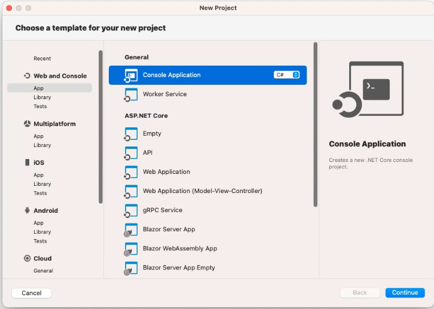
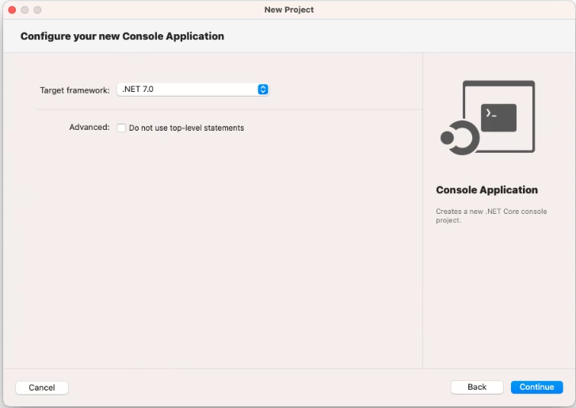
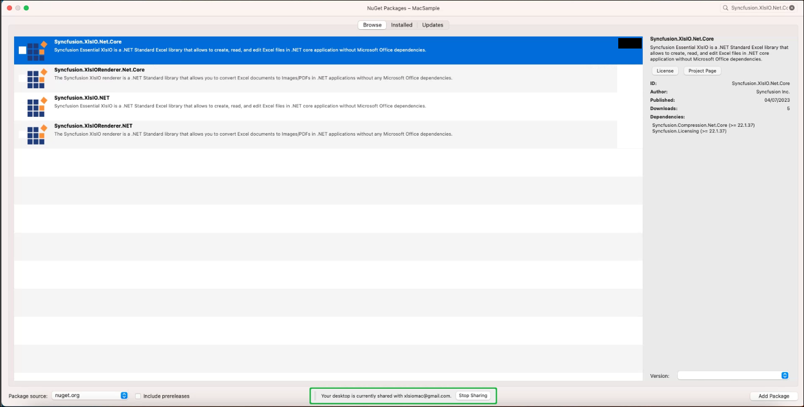
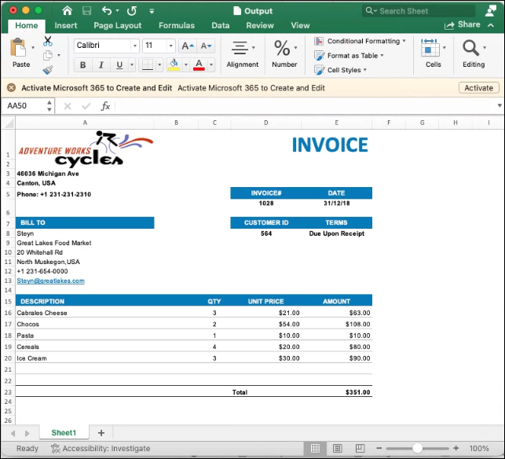

#Convert an Excel document to PDF in Mac

[Syncfusion Excel library for ASP.NET Core platform](https://www.syncfusion.com/document-processing/excel-framework/net-core/excel-library) can be used to create, read, edit Excel files. This also convert Excel files to PDF.

The below steps illustrates converting an Excel document to PDF in Mac





Step 1: Create a new C# .NET Core console application.


Step 2: Select the framework version.


Step 3: Name the application.


Step 4: Install the [Syncfusion.XlsIORenderer.Net.Core](https://www.nuget.org/packages/Syncfusion.XlsIORenderer.Net.Core/) NuGet package as reference to your application from [NuGet.org](https://www.nuget.org/).


N> Starting with v16.2.0.x, if you reference Syncfusion<sup>&reg;</sup> assemblies from trial setup or from the NuGet feed, you also have to add "Syncfusion.Licensing" assembly reference and include a license key in your projects. Please refer to this [link](https://help.syncfusion.com/common/essential-studio/licensing/overview) to know about registering Syncfusion<sup>&reg;</sup> license key in your applications to use our components. 

Step 5: Include the following Namespaces in the Program.cs file.


using Syncfusion.XlsIO;
using Syncfusion.XlsIORenderer;
using Syncfusion.Pdf;



Step 6: Add the following code snippet in Program.cs file.


//Create an instance of ExcelEngine.
using (ExcelEngine excelEngine = new ExcelEngine())
{
    IApplication application = excelEngine.Excel;
    application.DefaultVersion = ExcelVersion.Xlsx;

    // Load existing Excel file
    using FileStream inputStream = new FileStream("InputTemplate.xlsx", FileMode.Open, FileAccess.Read);
    IWorkbook workbook = application.Workbooks.Open(inputStream);

    // Convert to PDF
    XlsIORenderer renderer = new XlsIORenderer();
    PdfDocument pdfDocument = renderer.ConvertToPDF(workbook);

    // Save to file
    using FileStream pdfStream = new FileStream("Output.pdf", FileMode.Create, FileAccess.Write);
    pdfDocument.Save(pdfStream);
}







Step 1: Create a new C# .NET Core console application using Create .NET Project option.


Step 2: Name the application and create the project.


Alternatively, create a .NET Core console application using the following command in the terminal(<kbd>Ctrl</kbd>+<kbd>`</kbd>).

```
dotnet new console -o MacSample
cd MacSample
```

Step 3: To **Convert an Excel document to PDF in .NET Core app**,run the following command to  install [Syncfusion.XlsIORenderer.Net.Core](https://www.nuget.org/packages/Syncfusion.XlsIORenderer.Net.Core) package.

```
dotnet add package Syncfusion.XlsIORenderer.Net.Core
```


N> Starting with v16.2.0.x, if you reference Syncfusion<sup>&reg;</sup> assemblies from trial setup or from the NuGet feed, you also have to add "Syncfusion.Licensing" assembly reference and include a license key in your projects. Please refer to this [link](https://help.syncfusion.com/common/essential-studio/licensing/overview) to know about registering Syncfusion<sup>&reg;</sup> license key in your applications to use our components. 

Step 4: Include the following Namespaces in the Program.cs file.


using Syncfusion.XlsIO;
using System.Drawing;
using System.Reflection;



Step 5: Add the following code snippet in Program.cs file.


using (ExcelEngine excelEngine = new ExcelEngine())
{
    IApplication application = excelEngine.Excel;
    application.DefaultVersion = ExcelVersion.Xlsx;

    // Load existing Excel file
    using FileStream inputStream = new FileStream("InputTemplate.xlsx", FileMode.Open, FileAccess.Read);
    IWorkbook workbook = application.Workbooks.Open(inputStream);

    // Convert to PDF
    XlsIORenderer renderer = new XlsIORenderer();
    PdfDocument pdfDocument = renderer.ConvertToPDF(workbook);

    // Save to file
    using FileStream pdfStream = new FileStream("Output.pdf", FileMode.Create, FileAccess.Write);
    pdfDocument.Save(pdfStream);
}







By executing the program, you will get the output file as below.
