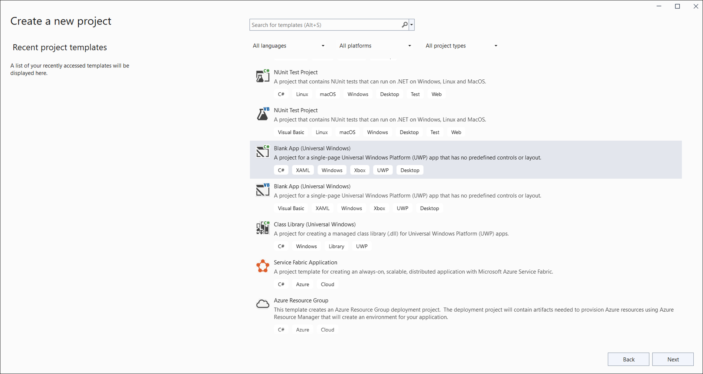
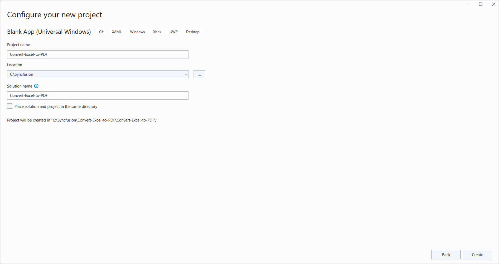
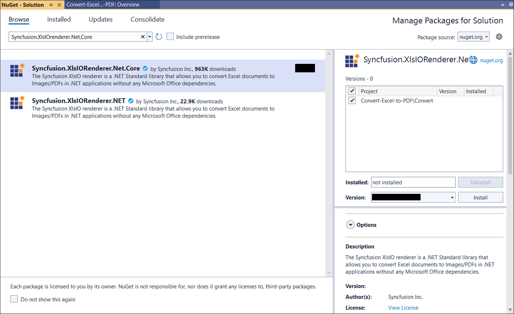

# Convert an Excel document to PDF in UWP

Syncfusion<sup>&reg;</sup> XlsIO is a [.NET Excel library](https://www.syncfusion.com/document-processing/excel-framework/net/excel-library) used to create, read, edit, and convert Excel documents programmatically, without Microsoft Excel or interop dependencies.

## Steps to convert an Excel document to PDF in UWP

Step 1: Create a new C# Blank App (Universal Windows) project.



Step 2: Name the project.



Step 3: Install the [Syncfusion.XlsIORenderer.Net.Core](https://www.nuget.org/packages/Syncfusion.XlsIORenderer.Net.Core) NuGet package as a reference to your project from [NuGet.org](https://www.nuget.org/). This package transitively pulls in the required `Syncfusion.XlsIO.Net.Core` and `Syncfusion.Pdf.Net.Core` assemblies.



N> Starting with v16.2.0.x, if you reference Syncfusion<sup>&reg;</sup> assemblies from the trial setup or from the NuGet feed, you must also add the `Syncfusion.Licensing` reference and register a license key. Refer to this [link](https://help.syncfusion.com/common/essential-studio/licensing/overview) to learn how to register the Syncfusion<sup>&reg;</sup> license key. The simplest approach is to add the following call in `App.xaml.cs` before constructing the `ExcelEngine`:
> ```csharp
> Syncfusion.Licensing.SyncfusionLicenseProvider.RegisterLicense("YOUR_LICENSE_KEY");
> ```

Step 4: Add a new button to **MainPage.xaml** as shown below.


<Page
    x:Class="Convert_Excel_to_PDF.MainPage"
    xmlns="http://schemas.microsoft.com/winfx/2006/xaml/presentation"
    xmlns:x="http://schemas.microsoft.com/winfx/2006/xaml"
    xmlns:local="using:Convert_Excel_to_PDF"
    xmlns:d="http://schemas.microsoft.com/expression/blend/2008"
    xmlns:mc="http://schemas.openxmlformats.org/markup-compatibility/2006"
    mc:Ignorable="d"
    Background="{ThemeResource ApplicationPageBackgroundThemeBrush}">

    <Grid>
        <Button x:Name="button" Content="Convert Excel to PDF" Click="OnButtonClicked" HorizontalAlignment="Center" VerticalAlignment="Center"/>
    </Grid>
</Page>



Step 5: Add an `InputTemplate.xlsx` file to the project. In **Solution Explorer**, right-click the project, choose **Add → Existing Item**, select `InputTemplate.xlsx`, and set its **Build Action** to **Embedded Resource** in the Properties window. The logical name passed to `GetManifestResourceStream` (below) must match the project's default namespace followed by the file name (e.g. `Convert_Excel_to_PDF.InputTemplate.xlsx`).

Step 6: Add the following namespaces in **MainPage.xaml.cs**.


using Syncfusion.XlsIO;
using Syncfusion.Pdf;
using Syncfusion.XlsIORenderer;



Step 7: Add the following code in the **OnButtonClicked** handler in **MainPage.xaml.cs** to convert an Excel document to PDF, save the PDF as a file, and open the file for viewing. The `OnButtonClicked` method must be declared with the UWP event-handler signature (`Windows.UI.Xaml.RoutedEventArgs`). Note: `async void` is acceptable in UWP event handlers; the `SavePDF` and `MessageDialog.ShowAsync` calls require the UI thread, which is the calling thread here.


private async void OnButtonClicked(object sender, Windows.UI.Xaml.RoutedEventArgs e)
{
    using (ExcelEngine excelEngine = new ExcelEngine())
    {
        IApplication application = excelEngine.Excel;
        application.DefaultVersion = ExcelVersion.Xlsx;

        // Load the embedded Excel workbook as a stream.
        Assembly assembly = typeof(App).GetTypeInfo().Assembly;
        IWorkbook workbook = application.Workbooks.Open(
            assembly.GetManifestResourceStream("Convert_Excel_to_PDF.InputTemplate.xlsx"));

        // Initialize the XlsIO renderer.
        XlsIORenderer renderer = new XlsIORenderer();

        // Convert the Excel document to a PDF document.
        PdfDocument pdfDocument = renderer.ConvertToPDF(workbook);

        // Create a MemoryStream to save the converted PDF.
        MemoryStream pdfStream = new MemoryStream();

        // Save the converted PDF document to the MemoryStream.
        pdfDocument.Save(pdfStream);
        pdfStream.Position = 0;

        // Close the workbook and the PDF document to release resources.
        workbook.Close();
        pdfDocument.Close();

        // Save the PDF file or perform any other action with the PDF.
        await SavePDF(pdfStream);
    }
}



## Save PDF document in UWP


//Saves the PDF document
private async void SavePDF(Stream outputStream)
{
    StorageFile stFile;
    if (!(Windows.Foundation.Metadata.ApiInformation.IsTypePresent("Windows.Phone.UI.Input.HardwareButtons")))
    {
        FileSavePicker savePicker = new FileSavePicker();
        savePicker.DefaultFileExtension = ".pdf";
        savePicker.SuggestedFileName = "Sample";
        savePicker.FileTypeChoices.Add("Adobe PDF Document", new List<string>() { ".pdf" });
        stFile = await savePicker.PickSaveFileAsync();
    }
    else
    {
        StorageFolder local = Windows.Storage.ApplicationData.Current.LocalFolder;
        stFile = await local.CreateFileAsync("Sample.pdf", CreationCollisionOption.ReplaceExisting);
    }
    if (stFile != null)
    {
        Windows.Storage.Streams.IRandomAccessStream fileStream = await stFile.OpenAsync(FileAccessMode.ReadWrite);
        Stream st = fileStream.AsStreamForWrite();
        st.SetLength(0);
        st.Write((outputStream as MemoryStream).ToArray(), 0, (int)outputStream.Length);
        st.Flush();
        st.Dispose();
        fileStream.Dispose();
        MessageDialog msgDialog = new MessageDialog("Do you want to view the Document?", "File created.");
        UICommand yesCmd = new UICommand("Yes");
        msgDialog.Commands.Add(yesCmd);
        UICommand noCmd = new UICommand("No");
        msgDialog.Commands.Add(noCmd);
        IUICommand cmd = await msgDialog.ShowAsync();
        if (cmd == yesCmd)
        {
            // Launch the retrieved file
            bool success = await Windows.System.Launcher.LaunchFileAsync(stFile);
        }
    }
}



N> For additional control over page size, orientation, and font embedding, pass an `ExcelToPdfConverterSettings` instance to `XlsIORenderer.ConvertToPDF`. See the [Excel-to-PDF conversion options](https://help.syncfusion.com/document-processing/excel/conversions/excel-to-pdf/net/convert-excel-to-pdf-in-uwp#excel-to-pdf-conversion-options) for details.

A complete working example of how to convert an Excel document to PDF in UWP is present on [this GitHub page](https://github.com/SyncfusionExamples/XlsIO-Examples/tree/master/Getting%20Started/UWP/Convert%20Excel%20to%20PDF).

By executing the program, you will get the **PDF document** as shown below.


N> As per [MSDN announcement](https://devblogs.microsoft.com/dotnet/announcing-uwp-support-for-net-standard-2-0/), the minimum version of UWP project must be Fall Creators Update (FCU).

Click [here](https://www.syncfusion.com/document-processing/excel-framework/uwp) to explore the rich set of Syncfusion<sup>&reg;</sup> Excel library (XlsIO) features.

An online sample link to [convert an Excel document to PDF](https://ej2.syncfusion.com/aspnetcore/Excel/ExcelToPDF#/material3) in ASP.NET Core.