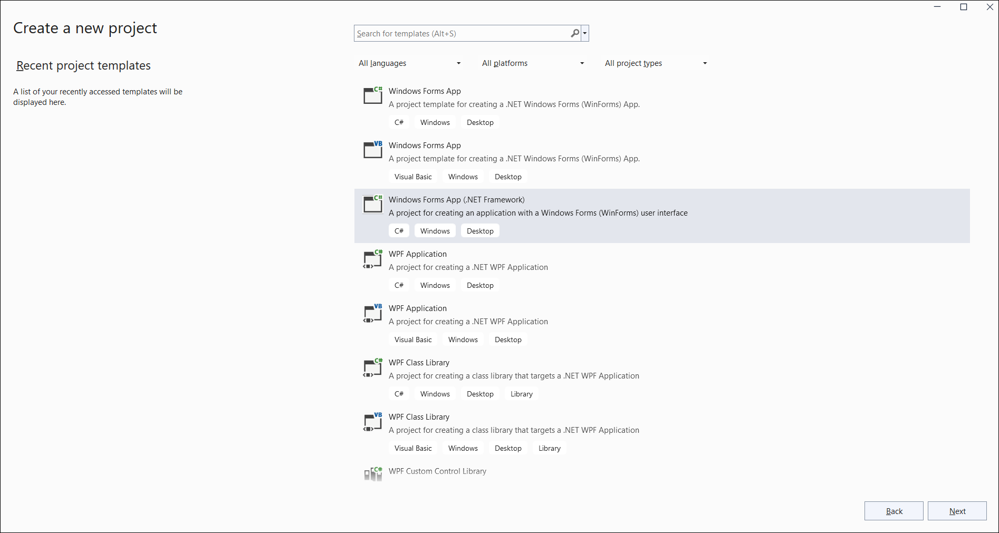
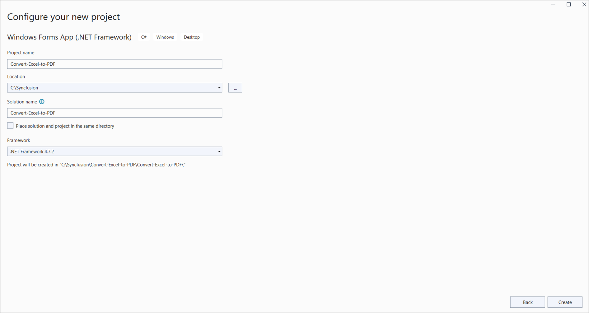
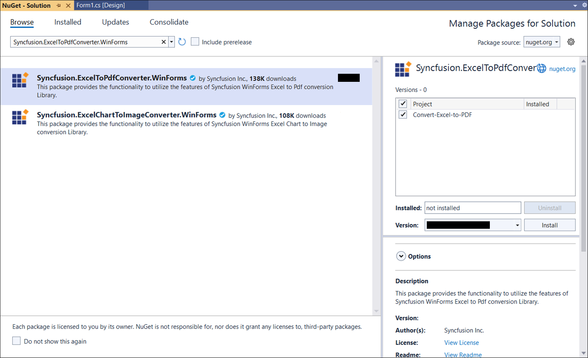
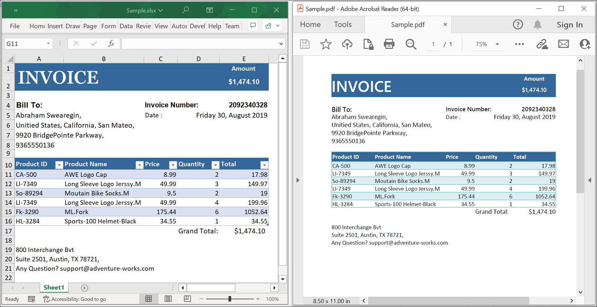

# Convert an Excel document to PDF in Windows Forms

Syncfusion<sup>&reg;</sup> XlsIO is a [.NET Excel Library](https://www.syncfusion.com/document-processing/excel-framework/net/excel-library) used to create, read, edit, and convert Excel documents programmatically, without Microsoft Excel or interop dependencies.

## Steps to convert an Excel document to PDF in Windows Forms

Step 1: Create a new Windows Forms application project.



Step 2: Name the project, choose the framework, and click **Create**.



Step 3: Install the [Syncfusion.ExcelToPdfConverter.WinForms](https://www.nuget.org/packages/Syncfusion.ExcelToPdfConverter.WinForms) NuGet package as a reference to your project from [NuGet.org](https://www.nuget.org/). This package transitively pulls in the required `Syncfusion.XlsIO.Base` and `Syncfusion.Pdf.Base` assemblies.



N> Starting with v16.2.0.x, if you reference Syncfusion<sup>&reg;</sup> assemblies from the trial setup or from the NuGet feed, you must also add the `Syncfusion.Licensing` reference and register a license key. Refer to this [link](https://help.syncfusion.com/common/essential-studio/licensing/overview) to learn how to register the Syncfusion<sup>&reg;</sup> license key. The simplest approach is to add the following call in the `Main` method (or in `Program.cs` for .NET 6+ WinForms) before constructing the `ExcelEngine`:
> ```csharp
> Syncfusion.Licensing.SyncfusionLicenseProvider.RegisterLicense("YOUR_LICENSE_KEY");
> ```

Step 4: Add a new button in the **Form1.Designer.cs** as shown below.
  

private Button btnCreate;
private Label label;

private void InitializeComponent()
{
  label = new Label();
  btnCreate = new Button();
  //Label
  label.Location = new System.Drawing.Point(0, 40);
  label.Size = new System.Drawing.Size(426, 35);
  label.Text = "Click the button to Convert Exel document to PDF generated by Essential<sup>&reg;</sup> XlsIO. Please note that Microsoft Excel Viewer or Microsoft Excel is required to view the resultant Excel document";
  label.TextAlign = System.Drawing.ContentAlignment.MiddleCenter;

  //Button
  btnCreate.Location = new System.Drawing.Point(180, 110);
  btnCreate.Size = new System.Drawing.Size(85, 36);
  btnCreate.Text = "Convert Excel document to PDF";
  btnCreate.Click += new EventHandler(btnConvert_Click);

  //Create Word
  ClientSize = new System.Drawing.Size(450, 150);
  Controls.Add(label);
  Controls.Add(btnCreate);
  Text = "Convert Excel document to PDF";          
}



Step 5: Add the following namespaces in **Form1.cs**.


using Syncfusion.XlsIO;
using Syncfusion.Pdf;
using Syncfusion.ExcelToPdfConverter;



Step 6: Add the following code in the **btnConvert_Click** handler in **Form1.cs** to convert an Excel document to PDF. Place a `Sample.xlsx` file in the project's `bin\Debug` folder (or set its **Copy to Output Directory** property to **Copy if newer**) so the relative path resolves.


private void btnConvert_Click(object sender, EventArgs e)
{
    using (ExcelEngine excelEngine = new ExcelEngine())
    {
        IApplication application = excelEngine.Excel;
        application.DefaultVersion = ExcelVersion.Xlsx;

        //Open the existing Excel workbook. Adjust the path as required.
        IWorkbook workbook = application.Workbooks.Open("Sample.xlsx");

        //Initialize the Excel-to-PDF converter
        ExcelToPdfConverter converter = new ExcelToPdfConverter(workbook);

        //Convert the Excel document to a PDF document
        PdfDocument pdfDocument = converter.Convert();

        //Save the converted PDF document to the application's working directory
        pdfDocument.Save("Sample.pdf");

        //Close the workbook and the PDF document to release resources
        workbook.Close();
        pdfDocument.Close();

        //Notify the user that the PDF was generated
        MessageBox.Show("Sample.pdf has been saved to " + Application.StartupPath);
    }
}



N> For additional control over page size, orientation, and font embedding, pass an `ExcelToPdfConverterSettings` instance when creating the `ExcelToPdfConverter` and call the `Convert(ExcelToPdfConverterSettings)` overload. See the [Excel-to-PDF conversion settings](https://help.syncfusion.com/document-processing/excel/conversions/excel-to-pdf/net/excel-to-pdf-converter-settings) for details.

A complete working example of how to convert an Excel document to PDF in Windows Forms is present on [this GitHub page](https://github.com/SyncfusionExamples/XlsIO-Examples/tree/master/Getting%20Started/Windows%20Forms/Convert%20Excel%20to%20PDF).

By executing the program, you will get the **PDF document** as shown below.



Click [here](https://www.syncfusion.com/document-processing/excel-framework/net) to explore the rich set of Syncfusion<sup>&reg;</sup> Excel library (XlsIO) features.

An online sample link to [convert an Excel document to PDF](https://ej2.syncfusion.com/aspnetcore/Excel/ExcelToPDF#/material3) in ASP.NET Core.